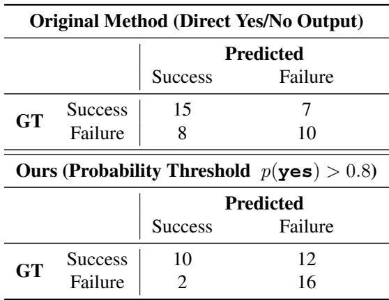

[← 返回 README](../README.md)

# Appendix

## 📌 预览

三个附录：A 把 binary-filtered BC 与 AWR / regularized RL 正式联系起来；B 给出 5 类任务的成功判断标准细节和完整成功率表；C 分析 reward model 的 threshold 策略及 confusion matrix。

---

## Appendix A: Relation to Regularized Reinforcement Learning

In this part, we relate the policy update in Eq. 4 to policy optimization under a regularized reinforcement learning (RL) framework with certain approximations. Our VLA policy is trained with a flow-matching objective and does not provide a tractable action log-likelihood, so standard KL-based derivations do not apply directly. Under the regularized RL setting, the optimal improved policy admits a closed-form solution given by:

$$\pi^*(a \mid o) \propto \pi_{\mathrm{ref}}(a \mid o) \exp\left(\frac{A^{\pi_{\mathrm{ref}}}(o,a)}{\beta}\right)$$

where $\pi_{\mathrm{ref}}$ denotes a reference policy, $A^{\pi_{\mathrm{ref}}}(o,a)$ is the corresponding advantage function, and $\beta$ is a temperature parameter controlling the strength of the regularization.

Since the target distribution $\pi^*$ is generally not representable within a finite parametric policy class, policy improvement is typically performed via a projection step, which fits a parametric policy $\pi_\theta$ to $\pi^*$ by minimizing a divergence $D$:

$$\theta^* = \arg\min_\theta \mathbb{E}_{o \sim \mathcal{D}} \left[ D(\pi^*(\cdot \mid o), \pi_\theta(\cdot \mid o)) \right]$$

**AWR for flow-matching policies.** In standard Advantage-Weighted Regression (AWR) (Peng et al., 2019), the divergence $D$ is chosen to be the KL divergence, which results in a weighted log-likelihood objective. However, because our VLA policy is trained using a flow-matching objective $\mathcal{L}_{\mathrm{FM}}(\theta; o, a)$ and does not provide explicit action likelihoods, this formulation is not directly applicable.

Instead, we define a projection operator that is compatible with flow matching by introducing the following surrogate divergence:

$$D_{\mathrm{FM}}(\pi^*(\cdot \mid o), \pi_\theta(\cdot \mid o)) \triangleq \mathbb{E}_{a \sim \pi^*(\cdot \mid o)} \left[ \mathcal{L}_{\mathrm{FM}}(\theta; o, a) \right]$$

which measures how well $\pi_\theta$ matches samples drawn from $\pi^*$ under the flow-matching loss.

Using this divergence, the projection step becomes:

$$\theta^* = \arg\min_\theta \mathbb{E}_{o \sim \mathcal{D}} \mathbb{E}_{a \sim \pi^*(\cdot \mid o)} \left[ \mathcal{L}_{\mathrm{FM}}(\theta; o, a) \right] \approx \arg\min_\theta \mathbb{E}_{(o,a) \sim \mathcal{D}} \left[ w(o,a) \mathcal{L}_{\mathrm{FM}}(\theta; o, a) \right]$$

where the approximation follows a standard offline RL practice that replaces sampling from $\pi^*$ with weighted samples from the dataset. The weights are proportional to the exponential advantage: $w(o,a) \propto \exp(A^{\pi_{\mathrm{ref}}}(o,a) / \beta)$.

Then, by setting the discount factor $\gamma \to 1$ and assigning a large negative reward to failure trajectories, Eq. 11 reduces to Eq. 4, which is the objective used in our policy update.

> 💡 **推导要点**：
> - **核心贡献**：定义了 flow-matching 兼容的 surrogate divergence $D_{\mathrm{FM}}$，解决了 flow-matching policy 没有显式 log-likelihood 的问题
> - **三个近似叠加使理论保证较弱**：
>   1. binary weight（0/1）≈ $\exp(A/\beta)$（粗糙近似）
>   2. $\gamma \to 1$（不 discount 未来奖励，对长视野可能不合适）
>   3. offline 数据 ≈ on-policy 采样（标准 offline RL 近似）
> - 定位是「事后理论解释」而非「从理论推导方法」——增强可读性和可信度，但不构成独立贡献

---

## Appendix B: Task Details

**Success Criteria.** We define task success using simple, outcome-based criteria that can be reliably judged from the final state (or a short post-action observation window):

- **Stacking**: Success if block A is stably placed on top of block B (with A supported by B, not the table) and the stack remains upright for a short holding period.
- **Open Book**: Success if the front cover is opened beyond a predefined angle (e.g., clearly separated from the pages and lying open) and remains open at the end of the episode.
- **Erase Marks**: Success if all visible marker strokes are removed from the whiteboard area (i.e., no clearly detectable marks remain) at the end of the episode.
- **Scooping**: Success if at least a minimum amount of the target object A is transferred into the bowl (with non-trivial contents remaining in the bowl at the end), while the majority of the transferred items are inside the bowl rather than spilled outside.
- **Drawing**: Success if the robot produces a single closed curve that forms a visually complete circle (i.e., endpoints meet with small gap tolerance) on the whiteboard within the designated drawing region.

> 💡 **成功标准评价**：都是 outcome-based（基于最终状态判断），贴近真实的人工判断方式，不需要实时 reward。但「至少一定量」、「容忍范围内」等描述偏定性——不同评估者可能有主观差异，理想情况下应给出量化阈值（如积木偏移角度 < 15°、圆的端点间距 < 5mm 等）。

**Detailed success rate improvement.** All task is evaluated 50 times since we collect 50 online rollouts in each iteration. DSRL baseline is evaluated with 10 times since it's too time-consuming to evaluate too many rollouts during online update.

*Table 2: Detailed Success rates across 5 manipulation tasks.*

> 💡 **DSRL 只评 10 次**：50 次评估的标准误差约 ±7%，10 次约 ±15%。DSRL 的结果在统计上不够可靠，对比价值有限——这是实验设计的瑕疵，作者应该至少说明 confidence interval。

---

## Appendix C: Reward Model Details

We use the Qwen3-VL-4B-Instruct model (Team, 2025a) as the vision–language reward model. Each trajectory is temporally downsampled into a 16-frame video before being fed to the model. We finetune the Qwen3-VL-4B-Instruct model for 200 steps with batch size 128.

We observe that directly prompting the reward model to output a binary yes/no decision can be overly optimistic, leading to a non-negligible number of false positives. To mitigate this issue, we instead examine the model-assigned probability of the 'yes' token and only label a trajectory as successful when this probability exceeds a threshold of 0.8, with this threshold, model is more conservative on generate success label.

We compare this threshold-based criterion with the naive approach of directly querying the model for a binary answer. Empirically, using a higher confidence threshold substantially reduces the number of false-positive trajectories, resulting in more reliable supervision for downstream policy learning.

*Table 3: Confusion matrices comparing the original reward model decision and our threshold-based criterion. We manually label a subset of 40 trajectories and compare the predictions of each method against human-annotated ground-truth labels. The false-positive number significantly dropped.*

> 💡 **Table 3 关键数据解读**：
>
> |  | Direct Yes/No | Threshold p(yes)>0.8 |
> |--|--|--|
> | **TP** (GT成功 & 预测成功) | 15 | 10 |
> | **FN** (GT成功 & 预测失败) | 7 | 12 |
> | **FP** (GT失败 & 预测成功) | **8** | **2** |
> | **TN** (GT失败 & 预测失败) | 10 | 16 |
>
> - **Threshold 的核心效果**：FP 从 8 降到 2（↓75%）——大幅减少「把失败轨迹误判为成功」的情况
> - **代价**：FN 从 7 升到 12——GT Success 共 22 个，threshold 后只保留 10 个（**召回率仅 45%**），超过一半的真实成功轨迹被丢弃
> - **Precision vs. Recall tradeoff**：0.8 可能不是最优阈值，论文未做 threshold 敏感性分析
> - **16 帧下采样的潜在风险**：原始轨迹可能有几百帧，压缩到 16 帧可能错过关键交互瞬间（接触发生在极短时间窗口），可能是 FN 偏高的原因之一

---

## 🔖 Appendix 总结

### 核心洞察
1. 理论联系（AWR → flow-matching weighted BC）给方法提供了 RL 框架下的解释，但三重近似使保证较弱
2. 成功标准 outcome-based 且贴近实际，但定量细节不足
3. Reward model 的 threshold 策略有效减少了 FP（-75%），但牺牲了 55% 的召回率——是 pipeline 效率的瓶颈
