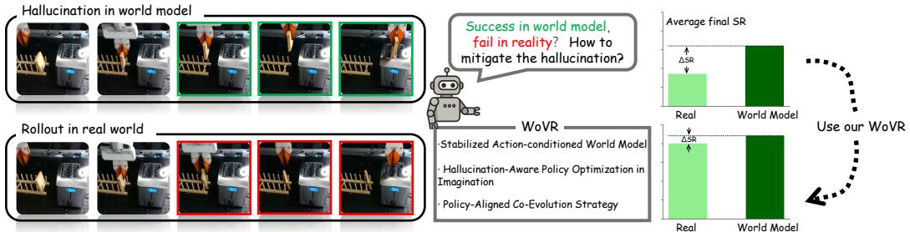

[← 返回 README](../README.md)

# 1. Introduction

## 📌 预览

Introduction 分三层递进：① VLA 用 RL 很有前途但真实交互成本高；② World Model 作为替代仿真器的思路有人做过，但 hallucination 是根本障碍；③ WoVR 从「reliability」视角出发，三层机制对抗 hallucination。贡献点在末尾列出。

---

Vision–Language–Action (VLA) models have been increasingly adopted for robotic manipulation, where actions are generated end-to-end by conditioning on language instructions and visual observations. Most existing VLA systems are trained via imitation learning. While effective in many downstream tasks, this paradigm fundamentally limits the performance ceiling of VLA policies, as it is tightly constrained by the quality and coverage of demonstration data.

> 💡 **背景铺垫**：imitation learning 的天花板问题是 VLA 领域的共识——policy 的上限受限于 demo 的质量和覆盖度，无法超越示教者。这给 RL post-training 提供了最基本的 motivation。

Recent studies have demonstrated that reinforcement learning for VLA can substantially improve policy performance and reduce reliance on imitation data. However, most approaches rely on standard on-policy optimization algorithms such as Proximal Policy Optimization (PPO) or Group Relative Policy Optimization (GRPO), which require large-scale environment parallelism to achieve stable and efficient training. This requirement is impractical for real-world robotic reinforcement learning, where physical robot interaction is expensive, slow, and often requires substantial human supervision. Although simulation-based alternatives have been explored, accurately aligning simulators with real-world dynamics remains highly challenging, particularly for contact-rich manipulation tasks. These constraints motivate replacing real-environment interaction with a learned world model that serves as a simulator for policy optimization.

> 💡 **On-policy RL 的两个障碍**：
> 1. **PPO/GRPO 需要大规模并行 rollout**：现实机器人做不到
> 2. **物理仿真和真实世界的 sim-to-real gap**：contact-rich 任务尤为严重
>
> 因此用 learned world model 替代仿真器是自然的想法——但这条路也有自己的问题（hallucination），下文展开。

*Figure 1: Hallucination in Closed-Loop World Model Rollouts. The world model imagines a successful grasp (green frames), but real-world execution fails (red frames). To address this critical mismatch, we propose three hallucination-aware mechanisms.*

> 💡 **Figure 1 批读**：这张图是全文最核心的 motivation 图。左侧 world model 预测机器人成功抓取（绿色），右侧真实执行失败（红色）。这就是 hallucination 的典型案例：world model 在视觉上生成了「成功」，但实际物理动力学是失败的。如果用这个 hallucinated success 来训练 policy，policy 会学到「做出某种看起来成功的动作就行」——而不是真正完成任务。

Recent advances in large-scale generative video models have made this direction increasingly feasible. Several works directly treat pretrained video generators as simulators and perform reinforcement learning entirely in imagination. However, learned world models are not faithful simulators. In this work, we define hallucination as a systematic mismatch between imagined and real outcomes in closed-loop interaction. The world model may produce visually plausible rollouts while predicting physically incorrect state transitions or even spurious success signals under the policy's actions (Fig. 1).

> 💡 **Hallucination 的精确定义**：「imagined 和 real outcomes 在 closed-loop 交互中的系统性不匹配」。关键词是"系统性"（systematic）——不是偶尔的预测误差，而是在特定条件下（policy 的 action distribution 下）持续出现的偏差。这个定义区分了 WoVR 和纯粹关注视频生成质量的工作。

Hallucination is not merely a generation artifact — it fundamentally undermines reinforcement learning. In closed-loop autoregressive rollouts, prediction errors compound with horizon length due to:

- **Autoregressive feedback**: the model conditions on its own generated frames, amplifying small early errors;
- **Distribution shift**: as the policy evolves, its action distribution drifts away from the data used to train the world model, increasing out-of-distribution prediction failures.

If hallucinated trajectories are directly used for policy optimization, reinforcement learning is incentivized to exploit systematic model errors rather than true task progress. This leads to a critical question:

> *If world models inevitably hallucinate, how can reinforcement learning remain reliable under imperfect imagined dynamics?*

> 💡 **Hallucination 的两个根源**：
> 1. **自回归反馈（Autoregressive feedback）**：world model 用自己生成的帧来预测下一帧，早期的小误差被放大
> 2. **分布漂移（Distribution shift）**：随着 policy 在 RL 中更新，其 action 分布偏离了训练 world model 时的数据，导致 OOD 预测失败
>
> 这两个根源是 WoVR 三个解决方案的直接对应：
> - 更稳定的 world model → 缓解 autoregressive feedback 问题
> - KIR → 缩短有效 horizon，减少误差积累机会
> - PACE → 解决 distribution shift 问题

We argue that using world models for RL is not primarily a modeling problem, but a reliability problem. To make world-model-based reinforcement learning viable, one must control hallucination at three interconnected levels: controllable simulator design, reliable interaction protocol, and policy–model alignment. To this end, we propose WoVR, a World-model-based framework for post-training Vision–Language–Action policies with Reinforcement Learning, built upon RLinf. Rather than assuming the learned world model to be a faithful simulator, WoVR explicitly regulates how reinforcement learning interacts with imperfect imagined dynamics.

> 别人的思路是"把 world model 做得更准"，WoVR 的思路是"world model 一定不完美，关键是设计让 RL 在不完美条件下也能可靠训练的框架"。
> 💡 **「Reliability problem」而非「Modeling problem」**：这是 WoVR 的核心论点，也是与 VLAW、WMPO 等工作最大的思路差异。其他工作主要努力让 world model 更准确（数据更多、架构更好），WoVR 则说：world model 必然不完美，关键是设计能与不完美 world model 配合的 RL 框架。这个视角转变很有价值。

We first strengthen the simulator itself by constructing a rollout-stable, action-controllable video world model with stabilized autoregressive context modeling, reducing long-horizon drift and structural collapse. However, improving the simulator alone is insufficient, as prediction errors inevitably accumulate over extended rollouts. We therefore reshape imagined interaction through Keyframe-Initialized Rollouts (KIR), which shorten the effective prediction depth by initializing trajectories near task-critical states, limiting the compounding of hallucination during learning. Finally, as policy optimization shifts the action distribution and induces distribution mismatch between the policy and the world model, we introduce PACE, a policy-aligned co-evolution strategy that restores alignment by iteratively refining the world model under the evolving policy distribution, without requiring continuous online supervision.

> 💡 **三层机制的逻辑递进**：
> 1. 先让 simulator 本身更稳定（first-frame anchoring + dual-channel action）
> 2. 但即使 simulator 更好，长 horizon 误差仍不可避免 → KIR 缩短有效 horizon
> 3. Policy 更新后 distribution shift → PACE 定期对齐
>
> 每一层都承认上一层的不足，然后用下一层来补。这是一种很扎实的防御性设计思路。

In summary, our contributions are as follows:

- We identify hallucination under closed-loop imagined interaction as a fundamental reliability challenge in world-model-based RL for VLA, showing that autoregressive error accumulation and policy-induced distribution shift can systematically corrupt optimization signals.
- We propose WoVR, a hallucination-aware RL framework that jointly regulates controllable simulator design, reliable imagined interaction, and a policy-aligned co-evolution strategy, enabling stable on-policy optimization entirely in imagination.
- Extensive experiments demonstrate that WoVR achieves state-of-the-art world-model quality while maintaining high rollout efficiency (23 FPS), improving average LIBERO success from $39.95\%$ to $69.2\%$ (+29.3 points) and real-robot success from $61.7\%$ to $91.7\%$ (+30.0 points).

> 💡 **23 FPS 的亮点**：Wan 5B 模型做 inference 能达到 23 FPS，而对比的 OpenSora（1.3B）只有 7 FPS——尽管模型更大，速度反而更快。原因：只用 5 步扩散 + 3D VAE 时空压缩（而不是 2D VAE）。速度是 RL 训练的关键瓶颈，23 FPS 意味着更多的 imagined rollout 采样，直接影响 policy 优化效率。

---

## 🔖 Section 总结

### 核心洞察
1. Hallucination = imagined 与 real outcomes 的系统性不匹配，来源是 autoregressive feedback + distribution shift
2. 这是「reliability problem」，而非「modeling problem」——不能靠让 world model 更准确来根本解决
3. 三层递进设计（simulator → interaction → alignment）各针对一个 hallucination 来源
4. 23 FPS 是工程亮点，对 RL 采样效率至关重要
