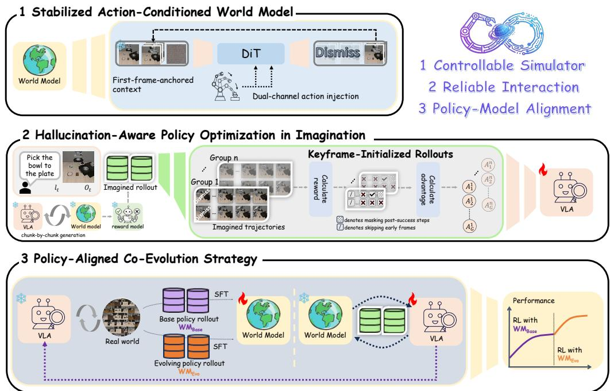

[← 返回 README](../README.md)

# 3. Preliminary

## 📌 预览

两个子节：3.1 定义 RL for VLA 的标准 MDP 框架（policy gradient 公式）；3.2 把真实环境 MDP 替换为 WM-MDP，用 world model 做 transition dynamics，定义 WoVR 的优化目标。

---

### 3.1 Reinforcement Learning for VLA Fine-tuning

Recent work has increasingly adopted reinforcement learning to post-train VLA policies beyond imitation learning. In this setting, policy optimization is commonly formulated as a Markov Decision Process (MDP), defined by the tuple $\mathcal{M} = (\mathcal{O}, \mathcal{A}, P, R, \gamma)$. At each time step $t$, given a visual observation $o_t \in \mathcal{O}$ and a language instruction $l_t$, the VLA policy outputs a chunked action $a_t \sim \pi_\theta(\cdot \mid o_t, l_t) \in \mathcal{A}$, which induces a state transition $o_{t+1} \sim P(\cdot \mid o_t, a_t)$ and yields a scalar reward $r_t = R(o_t, a_t)$. The goal of reinforcement learning is to maximize the expected discounted return:

$$J(\pi_\theta) = \mathbb{E}_{\tau \sim \pi_\theta} \left[ \sum_{t=1}^{T} \gamma^{t-1} r_t \right]$$

Following standard on-policy reinforcement learning, the policy is optimized via a policy gradient objective:

$$\nabla_\theta J(\pi_\theta) = \mathbb{E}_{\tau \sim \pi_\theta} \left[ \sum_{t=1}^{T} \nabla_\theta \log \pi_\theta(a_t \mid o_t, l_t) A(o_t, a_t) \right]$$

where $A(o_t, a_t)$ denotes the advantage function, defined as $A(o_t, a_t) = Q(o_t, a_t) - V(o_t)$.

> 💡 **标准 Policy Gradient 框架**：这里用的是完整的 policy gradient（带 advantage function），不像 VLAW 那样用 binary-filtered BC 近似。WoVR 用的是真正的 on-policy GRPO，需要显式的 log likelihood——这意味着 WoVR 的 base VLA model（OpenVLA-OFT）必须是 autoregressive 的（提供 log π(a|o)），而不是 flow-matching 的（如 π₀.₅）。这是 WoVR 和 VLAW 在 policy 架构选择上的根本区别。

---

### 3.2 Problem Formulation

While on-policy reinforcement learning provides a principled framework for fine-tuning VLA policies, applying it directly in real-world robotic environments is often impractical due to high interaction cost and limited environment parallelism. To address this limitation, our goal is to replace real-environment interaction with a learned world model that can serve as a simulator for policy optimization.

We reformulate the original MDP as a World Model-MDP (WM-MDP), defined as

$$\mathcal{M}_{\mathrm{WM}} = (\mathcal{O}, \mathcal{A}, \hat{P}_\phi, \hat{R}_\psi, \gamma)$$

*Figure 2: Overview of WoVR. WoVR builds a reliability-driven RL framework entirely around the learned world model: controllable simulator (rollout-stable + action-responsive) → Keyframe-Initialized Rollouts (KIR) + masked GRPO → PACE co-evolution.*

> 💡 **Figure 2 批读**：全文最重要的 overview 图，三层流程从左到右：
> 1. **Simulator**（左）：Wan backbone + dual-channel action injection + first-frame anchoring
> 2. **Interaction**（中）：KIR 从关键帧初始化 rollout，masked GRPO 只优化有效步骤
> 3. **Alignment**（右）：PACE 在 policy 更新后重新 fine-tune world model
>
> 注意图中 KIR 的直觉：不从 episode 开始 rollout，而是从任务关键状态附近开始，避免了 world model 在前期大量无关状态上的误差积累。

where the transition dynamics $\hat{P}_\phi(o_{t+1} \mid o_t, a_t)$ are approximated by a learned world model parameterized by $\phi$, and $\hat{R}_\psi(o_t, a_t)$ denotes a reward function parameterized by $\psi$.

In $\mathcal{M}_{\mathrm{WM}}$, trajectories are generated by interacting with the world model rather than the physical environment. Specifically, given an observation $o_t$ and an action $a_t$ sampled from the policy, the next observation and reward are obtained as

$$\tilde{o}_{t+1} \sim \hat{P}_\phi(\cdot \mid o_t, a_t), \quad \tilde{r}_t = \hat{R}_\psi(\tilde{o}_{t+1})$$

which allows the policy to perform closed-loop rollouts entirely in imagination. Under this formulation, the policy optimization objective remains unchanged in form:

$$J_{\mathrm{WM}}(\pi_\theta) = \mathbb{E}_{\tau \sim \pi_\theta, \hat{P}_\phi} \left[ \sum_{t=1}^{T} \gamma^{t-1} \hat{r}_t \right]$$

> 💡 **WM-MDP 的两个关键替换**：
> 1. $P \to \hat{P}_\phi$：真实 transition dynamics → world model 近似
> 2. $R \to \hat{R}_\psi$：真实奖励信号 → learned reward classifier（binary success/failure）
>
> **Reward 的设计**：用 learned reward classifier 而非 dense reward，输出二值 success/failure 信号。这贴近真实场景，但也意味着所有的学习信号都来自稀疏的成功判断，对 hallucination 的敏感度更高——一旦 world model 虚假生成「成功」，reward model 就会给出正信号，RL 就会往错误方向优化。这正是 WoVR 要解决的核心问题。

---

## 🔖 Section 总结

| 符号 | 含义 |
|------|------|
| $\pi_\theta$ | VLA policy（observation + language → 动作） |
| $\hat{P}_\phi$ | Learned world model（当前观测 + 动作 → 下一帧） |
| $\hat{R}_\psi$ | Reward classifier（观测 → binary success） |
| $\mathcal{M}_{\mathrm{WM}}$ | World Model-MDP，用 world model 替代真实环境 |

### 核心洞察
1. WoVR 用真正的 policy gradient（GRPO），需要 log π(a|o)，所以 base model 必须是 autoregressive 的（OpenVLA-OFT），而非 flow-matching（这是与 VLAW 的关键差异）
2. Reward = binary classifier（learned），稀疏信号对 hallucination 最敏感——world model 一旦给出虚假 success，RL 就往错误方向优化
3. WM-MDP 的形式化为三层 hallucination 控制提供了理论基础

---

## 🔍 延伸解读：Dual-Channel Action Injection

> 本节是对 Section 4.1 中核心组件的前置解读，配合 Figure 2 中"action-responsive simulator"理解。

### 问题背景

WM-MDP 成立的前提是 $\hat{P}_\phi(o_{t+1} \mid o_t, a_t)$ 真的对 $a_t$ **有响应且可控**。如果 world model 只是视频续帧（忽略动作输入），RL 采样到的轨迹就与 policy 脱钩，整个优化无意义。

Wan2.2-TI2V 原版是图文生成视频的模型，本身不接受 action 作为条件输入。WoVR 需要将其改造为 **action-conditioned generator**，而 Dual-Channel Action Injection 就是改造的核心设计。

---

### 两个 Channel 的具体机制

**Channel 1：AdaLN-Zero-style Modulation（局部调制）**

$$\text{action embedding} \xrightarrow{\text{fuse}} \text{diffusion timestep embedding} \xrightarrow{\text{AdaLN-Zero}} \text{每层 DiT block 的 scale/shift}$$

- Action embedding 与 diffusion timestep embedding **融合后**，通过 AdaLN-Zero 调制每层的特征分布
- 本质：用 action 来控制"去噪方向"——同一个噪声输入，不同的 action 会引导模型去噪到不同的下一帧
- **作用范围**：帧级（frame-level），精细局部控制

**Channel 2：Cross-Attention（全局上下文）**

$$\text{action embedding} \xrightarrow{\text{替换 text embedding}} \text{原有 cross-attention operator}$$

- 将 Wan 原来接受 text prompt 的 cross-attention 入口**替换**为 action embedding
- Action 信息通过 cross-attention 在所有层之间传播，形成全局感知
- **作用范围**：全局（global），跨层 action 感知

### 为何需要双通道？

| 单通道方案 | 问题 |
|-----------|------|
| 只用 AdaLN | 只影响局部特征分布，缺乏全局一致性；长 rollout 中 action 影响衰减 |
| 只用 cross-attention | 缺乏帧级精细控制；复杂动作（如机械臂多关节）的细节难以表达 |
| **双通道（AdaLN + cross-attention）** | 局部精细 + 全局一致，互补覆盖不同层级的 action 影响 |

> 💡 **类比语言模型**：AdaLN 类似 prefix tuning（调制 token 表示），cross-attention 类似 condition token（每层都关注）。两者叠加是将外部控制信号注入 transformer 的成熟范式，WoVR 在视频扩散模型上做了同样的事。

### 与 WM-MDP 的关联

在 3.2 节的 WM-MDP 公式中：

$$\tilde{o}_{t+1} \sim \hat{P}_\phi(\cdot \mid o_t, a_t)$$

Dual-Channel Injection 就是让这个条件概率**真正依赖** $a_t$ 的工程实现。没有它，$\hat{P}_\phi$ 实际上退化为 $\hat{P}_\phi(\cdot \mid o_t)$，RL 就成了在无动作控制的视频中优化——与 WM-MDP 的形式化脱节。

### 关键数字

- **Backbone**：Wan2.2-TI2V-5B（5B 参数，5步扩散）
- **生成速度**：23 FPS（对比 OpenSora 1.3B 的 7 FPS）——速度是 RL 采样效率的关键
- **参数改动最小**：保留原始 DiT 结构，只在每个 DiT block 中增加 action injection，避免破坏预训练的视觉先验
