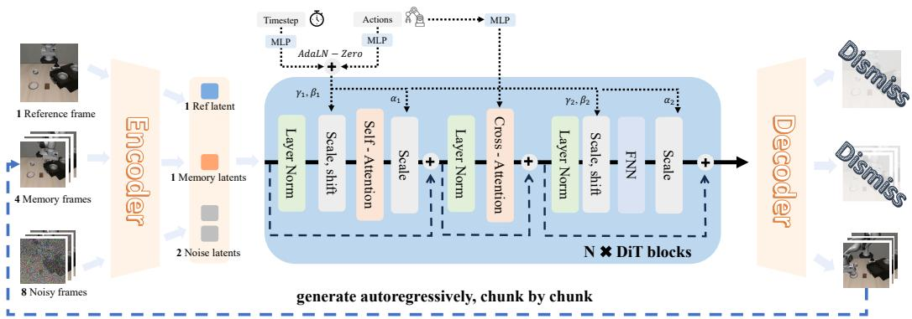
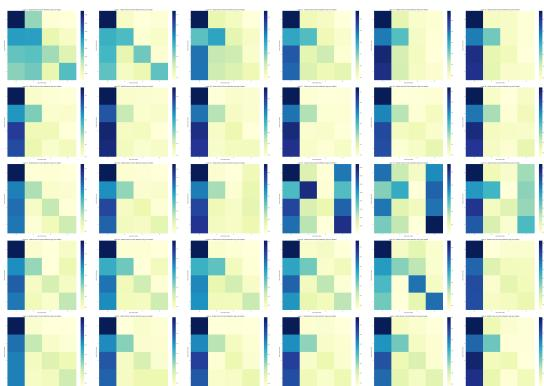
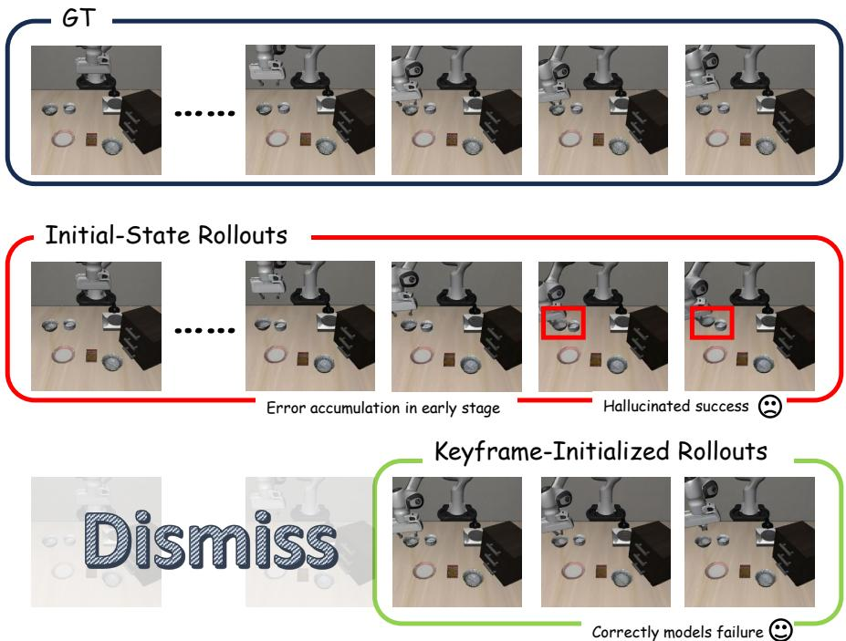

[← 返回 README](../README.md)

# 4. Methods

## 📌 预览

三个子部分：4.1 构建 rollout-stable 的 action-conditioned world model（Wan backbone + dual-channel action + first-frame anchoring + noisy context）；4.2 在 world model 里做 hallucination-aware policy optimization（KIR + masked GRPO）；4.3 PACE 策略-模型协同进化解决 distribution shift。

---

We propose WoVR, a reliability-driven world-model-based reinforcement learning framework for post-training Vision–Language–Action (VLA) policies without requiring parallel real-world interaction. WoVR treats the learned world model as a generative simulator and builds the entire reinforcement learning pipeline around controlling hallucination in closed-loop imagination.

Specifically, WoVR regulates reliability at three interconnected levels. (1) **Simulator-level control**: we construct an action-controllable, rollout-stable video world model with dual-channel action injection and first-frame anchoring to suppress long-horizon drift. (2) **Interaction-level reshaping**: we redesign imagined interaction through Keyframe-Initialized Rollouts (KIR) and masked GRPO to reduce effective error depth and prevent optimization on hallucinated success. (3) **Alignment-level regulation**: we introduce PACE, a policy–model co-evolution strategy that mitigates distribution shift by periodically aligning the world model with the evolving policy.

> 💡 **三层对应三个问题**：
> - Autoregressive error accumulation → Simulator-level（更稳定的模型）+ Interaction-level（更短的有效 horizon）
> - Distribution shift → Alignment-level（PACE 定期对齐）
>
> 注意"three interconnected levels"：三者不是独立的，稳定的 simulator 是 KIR 有效的前提，KIR 又是 PACE 对齐的辅助。

---

### 4.1 Stabilized Action-Conditioned World Model

WoVR relies on a learned video world model as a generative simulator for closed-loop imagined interaction. However, long-horizon rollouts are prone to hallucination, where global scene structure gradually drifts and the background collapses as the rollout length increases. We therefore design the world model to be both action-controllable and rollout-stable, so that the simulated dynamics remain consistent under iterative, policy-driven generation.

**Backbone and action conditioning.** Our world model is built upon the Wan2.2-TI2V-5B video diffusion backbone. Unlike conventional image-to-video generation, embodied simulation requires explicit action conditioning to ensure that predicted state transitions respond causally to the policy. To this end, we reformulate Wan2.2-TI2V into an action-conditioned generator via a dual-channel action injection design (Fig. 3), which preserves the original DiT structure while enabling frame-level controllability. Concretely, in each DiT block, action embeddings influence generation through two complementary pathways. First, action embeddings are fused with the diffusion timestep embeddings and applied via AdaLN-Zero-style modulation, directly shaping the denoising dynamics at the feature level. Second, we retain the original cross-attention operator but replace textual embeddings with action embeddings, allowing actions to condition the network globally across layers. Together, these two pathways provide both local modulation and global context for action-conditioned video generation.

*Figure 3: Architecture of the proposed action-conditioned world model. Built upon Wan2.2-TI2V-5B video diffusion backbone, with dual-channel action injection (AdaLN modulation + cross-attention) and first-frame–anchored autoregressive generation.*

> 💡 **Dual-channel action injection 的设计逻辑**：
> - **Channel 1（AdaLN modulation）**：Action embedding 与 diffusion timestep embedding 融合 → 局部调制，影响每层的 denoising 动态
> - **Channel 2（Cross-attention）**：将原来的 text cross-attention 替换为 action cross-attention → 全局上下文，让 action 信息跨所有层传播
>
> 两个 channel 互补：AdaLN 提供精细的帧级控制（局部），cross-attention 提供全局的 action 感知（全局）。这比单一的 AdaLN 或单一的 cross-attention 都更完整。
>
> **为何选 Wan 2.2-TI2V-5B？**：比 OpenSora（1.3B）大很多，但通过 5 步扩散 + 3D VAE 实现了 23 FPS（vs. OpenSora 的 7 FPS）。速度是 RL 采样的关键，23 FPS 意味着同样时间内能生成更多 imagined rollout。

**First-frame anchoring for rollout stability.** Even with strong action conditioning, chunk-by-chunk autoregressive generation can still accumulate errors, leading to spatial drift and gradual background collapse. To suppress such long-horizon degradation, we adopt a first-frame–anchored inference context. At each autoregressive step, the model conditions on $[o_0, o_{t'-c':t'}]$, which concatenates the episode's initial reference frame with the most recent memory frames from the previous chunk. This persistent reference constrains global appearance and scene layout, because many self-attention heads naturally attend to the first frame during denoising (Fig. 4), consistent with prior findings.

*Figure 4: Visualization of self-attention probability map. During the denoising process, many attention heads focus on the first frame of the sequence, providing natural support for first-frame anchoring.*

> 💡 **First-frame anchoring 的直觉**：每次预测下一个视频 chunk 时，不只给最近的几帧，还始终给第一帧（episode 初始状态）。由于 DiT 的 self-attention heads 天然倾向于关注第一帧（Figure 4 的 attention map 可视化），这个设计用最小的额外成本提供了强大的全局场景约束。
>
> **类比**：就像人做任务时始终记得任务开始时的场景（桌子布局、物体位置），不会因为中途的小错误而完全忘记全局结构。

With dual-channel action conditioning and first-frame anchoring, we obtain a rollout-stable world model. Starting from the first-frame–anchored context $[o_0, o_{t-c:t}]$, we encode it into latent representations $[z_0, z_{t-c:t}]$ using the Wan encoder. We then sample noise for the next chunk $z_{t+1:t+H}^{\mathrm{noise}} \sim \mathcal{N}(0, \mathbf{I})$, feed the concatenated latents $[z_0, z_{t-c:t}, z_{t+1:t+H}^{\mathrm{noise}}]$ to the model, which predicts future latents $\hat{z}_{t+1:t+H}$, decoded into frames $\widehat{O}_{t'+1:t'+H'}$.

We train the world model with the Rectified Flow objective. Let $x_1 = z_{t+1:t+H}$ denote the target future latents and $x_0 \sim \mathcal{N}(0, \mathbf{I})$ be noise of the same shape. Given a sampled time $t \in [0,1]$, the training loss is:

$$\mathcal{L} = \mathbb{E}_{x_0, x_1, c, t} \left[ \left\| u(x_t, c, t; \phi) - v_t \right\|^2 \right]$$

where the condition $c$ includes both the first-frame–anchored context and actions. To reduce the train–inference gap in closed-loop rollouts, we additionally apply **noisy context** by injecting diffusion noise into the non-reference context latents $z_{t-c:t}$ during training.

> 💡 **Noisy context 的作用（Train-Inference Gap）**：训练时 context 是真实帧，推理时 context 是 world model 自己生成的帧（含误差）。这个 train/inference gap 会让模型在推理时「不知所措」。加入噪声 = 模拟推理时 context 含误差的情况，提高鲁棒性。这与 Diffusion Forcing（Chen et al. 2024）的思路类似。

**Reward classifier.** Given the generated observation $\tilde{o}_{t+1}$ from the world model, the reward model $R_\psi$ predicts the probability of task success, and the sparse reward is:

$$r_{t+1} = \mathbb{I}\left(R_\psi(\tilde{o}_{t+1}) \geq 0.5\right)$$

> 💡 **Threshold = 0.5 vs. VLAW 的 0.8**：WoVR 用 0.5，VLAW 用 0.8。VLAW 更保守是因为它用 filtered BC，FP（假阳性）会直接变成 policy 的训练数据，危害更大。WoVR 用真正的 RL（GRPO），reward signal 是用来计算 advantage 的，少量 FP 的影响相对可以承受（被其他 rollout 的 advantage 相对化）。

---

### 4.2 Hallucination-Aware Policy Optimization in Imagination

WoVR optimizes the VLA policy by interacting with the learned world model. The key difficulty is that, in long-horizon rollouts starting from the initial state, world-model errors accumulate early and can eventually produce visually plausible but physically incorrect transitions and even spurious success signals.

*Figure 5: Illustration of KIR (Keyframe-Initialized Rollouts). Starting from initial state (long-horizon), errors accumulate and produce hallucinated success contradicting ground-truth failure. KIR initializes near critical states, enabling physically consistent predictions.*

> 💡 **Figure 5 批读**：上下两行对比。上行：从 episode 开始 rollout → 早期误差积累 → 到达关键交互状态时已经 hallucinate → 虚假 success。下行（KIR）：从关键状态附近初始化 → world model 只需预测短视野 → 误差积累少 → 正确预测 failure。
>
> 这个图很直观地说明了为什么「从哪里开始 rollout」对 hallucination 控制如此重要。

**Keyframe-Initialized Rollouts (KIR).** Instead of always initializing rollouts from the episode start $o_0$, we initialize a portion of rollouts from keyframes $o_k$ that lie near task-critical intermediate states, especially failure states encountered by the current policy. The motivation is that many decisive contacts and corrections happen locally around these states, whereas starting from $o_0$ forces the world model to predict a long prefix before reaching them, during which compounding errors can already derail the rollout.

> 💡 **KIR 的关键细节**：
> - 从「任务关键中间状态」（尤其是 failure states）附近初始化
> - 「近 failure states」：当前 policy 遇到困难的地方，正是需要学习的地方
> - 有效误差深度（effective error depth）= 从初始化点到任务完成的步数，KIR 大幅缩短这个距离
>
> **与 HER（Hindsight Experience Replay）的联系**：两者都关注 failure state 附近的学习信号，但实现方式不同——HER 重标签，KIR 从 failure state 附近重新开始 rollout。

**Masked GRPO.** We adopt Group Relative Policy Optimization (GRPO) to update the policy using imagined rollouts. Because hallucinations often dominate after success has been reached in imagination, we **mask post-success steps** and normalize each trajectory by its valid length.

Formally, given a group of imagined trajectories $\{\tau^{(i)}\}_{i=1}^G$, we compute return and group-relative advantage:

$$R(\tau^{(i)}) = \sum_{t=1}^{|\tau^{(i)}|} \gamma^{t-1} \hat{r}_t^{(i)}, \qquad \hat{A}^{(i)} = R(\tau^{(i)}) - \frac{1}{G} \sum_{j=1}^G R(\tau^{(j)})$$

Let $T_i^{\mathrm{valid}}$ be the number of valid timesteps up to (and including) the first success. The masked, trajectory-length–normalized GRPO objective is:

$$J_{\mathrm{GRPO}}(\theta) = \mathbb{E}\left[\frac{1}{G} \sum_{i=1}^G \frac{1}{T_i^{\mathrm{valid}}} \sum_{t=1}^{T_i^{\mathrm{valid}}} \min\left(\rho_t^{(i)}(\theta) \hat{A}^{(i)}, \mathrm{clip}\left(\rho_t^{(i)}(\theta), 1-\epsilon, 1+\epsilon\right) \hat{A}^{(i)}\right)\right]$$

> 💡 **两个关键修改**：
> 1. **Mask post-success steps**：成功后 world model 还继续生成的帧往往是 hallucination（任务已完成但模型继续乱生成），这些帧对 policy 优化有害，直接 mask 掉
> 2. **Trajectory-length normalization（除以 $T_i^{\mathrm{valid}}$）**：KIR 产生的短 rollout（从关键帧开始，steps 少）和长 rollout（从 episode 开始）共存。不 normalize 的话，短 rollout 的梯度贡献小，normalize 后短 rollout（通常质量更高）的每步贡献被放大，梯度主要由 task-critical segments 主导。
>
> **这两个修改协同工作**：KIR 产生短而精确的 rollout → length normalization 放大其梯度贡献 → RL 更多地从关键交互段学习。

---

### 4.3 PACE: Policy–Aligned Co-Evolution

While policy optimization proceeds entirely within the learned world model, the policy's action distribution continuously evolves and drifts away from the data used to train the initial world model. This inherent distribution shift leads to accumulating mismatch between the simulator and the improving policy, ultimately degrading the reliability of imagined rollouts.

To address this issue, we introduce PACE, a World Model–Policy co-evolution strategy. Instead of treating the world model as a fixed, static simulator throughout policy optimization, PACE allows the world model and VLA policy to evolve together throughout training.

Concretely, we realize this co-evolution through **low-frequency, policy-driven refinement**: we first train an initial world model $\mathrm{WM_{Base}}$ using trajectories collected from the base VLA policy. After the first stage of policy optimization within $\mathrm{WM_{Base}}$, we collect a limited set of additional rollouts under the evolved policy and use them to further refine the world model. The refined model is referred to as $\mathrm{WM_{Evo}}$.

Importantly, this refinement is performed **only once** (or at very low frequency), distinguishing PACE from classical model-based RL methods, which continuously update the dynamics model at high frequency during policy optimization.

> 💡 **PACE 的关键设计选择：低频更新**：
> - 经典 MBRL（如 PETS、DREAMER）每步都更新 world model，这在真实机器人上无法实现（需要持续收集真实数据）
> - PACE 只更新一次：第一阶段 policy 优化完 → 收集一批新 rollout → 更新 world model → 第二阶段 policy 优化
> - **代价**：只做一次对齐，如果 policy 继续大幅漂移，world model 可能再次失准。但实验表明一次足够（Table 5 的 ablation 证明 w/o PACE 性能显著下降）
>
> **与 VLAW 的 PACE 类比**：VLAW 同样做迭代（K_iter=2），每次用新 rollout fine-tune world model。两者思路相同，VLAW 只是没有单独命名这个机制。

This low-frequency refinement provides two key advantages. First, unlike real-world online RL, it does not require continuous human supervision or environment resets during policy training, significantly reducing operational overhead. Second, by aligning the world model with the evolving policy distribution, PACE mitigates compounding model errors and maintains simulator reliability without sacrificing training stability.

**System Implementation.** WoVR is built on top of RLinf to support efficient distributed imagined rollouts and training. The world model replaces RLinf's environment back-end, enabling scalable closed-loop rollouts without a ground-truth simulator. For GPU management, WoVR uses a **modified collocated strategy**: Generation（policy inference）和 Simulator（world model rollout）在 rollout phase 只在开始和结束时 offload/onload，避免了 closed-loop interaction 中频繁的参数切换（详见 Appendix A）。

> 💡 **System 设计的重要性**：World model 做仿真器最大的工程挑战是 GPU 内存管理——同时需要跑 policy inference 和 world model inference，还要做 policy training。RLinf 的 collocated 策略通过参数 offload/onload 解决这个问题，但原版对每次交互都 offload/onload，在 closed-loop rollout 里太慢。WoVR 修改为 phase-level offload/onload（一整个 rollout phase 结束才切换），显著减少了内存迁移开销。

---

## 🔖 Section 总结

### 关键设计速查

| 组件 | 功能 | 解决的问题 |
|------|------|----------|
| Dual-channel action injection | AdaLN + cross-attention 双路径 | Action controllability |
| First-frame anchoring | 始终保留 episode 初始帧 | Long-horizon spatial drift |
| Noisy context | 训练时对 context 加噪 | Train-inference gap |
| KIR | 从关键帧/failure state 初始化 rollout | 有效误差深度过长 |
| Masked GRPO | 屏蔽 post-success 步骤 + length normalization | Post-success hallucination |
| PACE | 低频 world model 对齐 | Policy-model distribution shift |

### 核心洞察
1. World model 的稳定性是通过 first-frame anchoring（结构约束）+ noisy context（鲁棒性训练）实现的，而不是更大的模型
2. KIR + length normalization 协同工作：短而精确的 rollout 的梯度贡献被放大，RL 主要从关键段学习
3. PACE 的低频更新是工程上的务实选择——足够有效，同时避免了连续监督的开销
4. 整个 pipeline 建立在 RLinf 系统基础上，工程设计与算法设计紧密耦合
