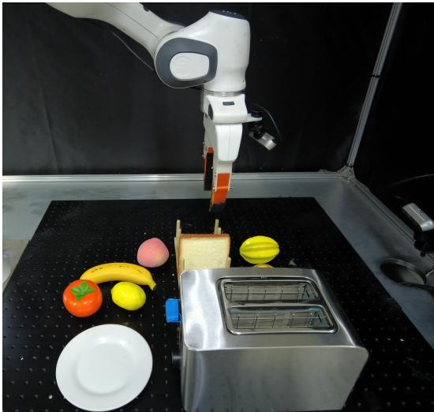

[← 返回 README](../README.md)

# 5. Experiments

## 📌 预览

三个问题：Q1 World model 是否稳定、可控、高效（LIBERO 上的视频质量对比）；Q2 WoVR 能否提升 VLA policy 性能（LIBERO 四个 suite 的成功率）；Q3 策略是否能迁移到真实世界（Franka Panda 两个任务）。

---

We conduct extensive experiments to evaluate the effectiveness of WoVR. Our experimental design aims to systematically answer the following three questions:

- **Q1**: Is the proposed world model stable, controllable, and efficient enough to serve as a simulator for closed-loop reinforcement learning?
- **Q2**: Can WoVR effectively improve VLA task performance compared to existing world-model-based reinforcement learning methods?
- **Q3**: Do the policies optimized with WoVR reliably transfer to real-world robotic manipulation tasks?

For world model evaluation, we adopt: LPIPS（帧级感知相似度）、FID（分布相似度）、FVD（视频级时序一致性）、FloLPIPS（光流对齐的感知相似度，强调动作条件下的时序连贯性）。For policy evaluation: task success rate (SR).

> 💡 **FloLPIPS 是新 metric**：相比 LPIPS（只看单帧），FloLPIPS 沿估计的光流轨迹计算感知相似度，能更好地捕捉运动一致性——对 action-conditioned world model 来说这个指标更有意义，因为关键不只是单帧好看，而是运动轨迹和动作的对应是否一致。

---

### 5.1 Q1: World Model 质量评估

**Experimental Setup.** LIBERO 环境，3,000 条 VLA rollout 轨迹（每条 512 帧）训练 world model，200 条 held-out 轨迹评估。Chunk-wise autoregressive generation：4 帧视觉 context + 8 步 action chunk → 预测 8 帧。对比：EVAC、Cosmos-Predict2、OpenSora（WMPO 采用的 backbone）。

| Method | Rollout | FPS↑ | LPIPS↓ | FID↓ | FVD↓ | FloLPIPS↓ |
|--------|---------|------|--------|------|------|-----------|
| EVAC | 512 | 2.7 | 0.146 | 46.528 | 345.818 | 0.205 |
| EVAC | 256 | 2.7 | 0.130 | 49.153 | 354.983 | 0.192 |
| EVAC | 128 | 2.7 | 0.106 | 44.337 | 423.132 | 0.166 |
| Cosmos-Predict2 | 512 | 3.50 | 0.315 | 165.862 | 275.737 | 0.265 |
| Cosmos-Predict2 | 256 | 3.50 | 0.226 | 106.324 | 203.853 | 0.306 |
| Cosmos-Predict2 | 128 | 3.50 | 0.164 | 77.555 | 304.456 | 0.281 |
| OpenSora | 512 | 7.00 | 0.105 | 38.478 | 89.391 | 0.156 |
| OpenSora | 256 | 7.00 | 0.082 | 33.577 | 94.998 | 0.122 |
| OpenSora | 128 | 7.00 | 0.069 | 33.413 | 111.643 | 0.113 |
| **WoVR (Ours)** | 512 | **23.0** | **0.091** | **34.252** | **68.011** | **0.154** |
| **WoVR (Ours)** | 256 | **23.0** | **0.063** | **24.378** | **50.041** | **0.102** |
| **WoVR (Ours)** | 128 | **23.0** | **0.047** | **18.553** | **39.047** | **0.079** |

> 💡 **Table 1 解读**：
> - **WoVR 全面领先**：所有 horizon（128/256/512）下的所有 metric 都最优
> - **最关键的对比是 WoVR vs. OpenSora**：OpenSora 是 WMPO 的 backbone（~1.3B 参数），WoVR 用 Wan（~5B 参数）。WoVR 不但质量更好，FPS 还是 OpenSora 的 3.3 倍（23 vs 7）——更大的模型反而更快，原因是 WoVR 只用 5 步扩散 + 3D VAE
> - **Long-horizon（512）对比最重要**：512 步 rollout 时 FVD 68.011 vs OpenSora 的 89.391，说明 WoVR 在长视野下误差积累更少，更适合 RL 训练
> - **Cosmos-Predict2 表现最差**：NVIDIA 的大模型在具身操作上表现不如专门适配的模型，印证了 2.2 节「通用世界模型不适合具身操作」的观点

As shown in the table, WoVR consistently outperforms EVAC, Cosmos-Predict2, and OpenSora across all evaluation metrics. These improvements become more pronounced as the rollout horizon increases, suggesting that WoVR is more robust to error accumulation in long-horizon autoregressive generation.

Despite adopting a larger backbone (Wan, ~5B) than OpenSora (~1.3B), WoVR achieves higher inference throughput by requiring only five diffusion steps and leveraging a 3D VAE for spatiotemporal latent encoding, whereas OpenSora typically relies on more sampling steps and a 2D VAE.

> 💡 **3D VAE vs 2D VAE 的效率差异**：2D VAE 对每一帧独立编解码；3D VAE 联合对时空进行编解码，可以用更少的 latent token 表示同样的视频，推理时 attention 计算量大幅减少。这是 Wan 能在大模型规模下实现高速推理的核心原因。

---

### 5.2 Q2: Policy 性能提升

**Experimental Setup.** LIBERO 四个 suite：Spatial、Object、Goal、Long。Base policy：OpenVLA-OFT（one-trajectory SFT 初始化）。真实环境 rollout budget = 2,500 轨迹/suite：WM-based 方法用于训练 world model，GRPO 直接用于 on-policy 交互。

具体分配：1,500 条（150/task）训练 $\mathrm{WM_{Base}}$ + 1,000 条（PACE 后）训练 $\mathrm{WM_{Evo}}$。

| Method | Spatial | Object | Goal | Long | Avg↑ |
|--------|---------|--------|------|------|------|
| OpenVLA-OFT-base | 61.5 | 36.3 | 48.2 | 13.7 | 39.9 |
| GRPO (Online) | 66.6 | 45.1 | 52.1 | 14.5 | 44.6 |
| WMPO | 67.8 | 48.0 | 54.6 | 13.7 | 46.2 |
| **WoVR (Ours)** | **81.5(+20.0)** | **82.0(+45.7)** | **77.5(+29.3)** | **35.8(+22.1)** | **69.2(+29.3)** |

> 💡 **Table 2 关键发现**：
> - **WoVR 大幅领先所有 baseline**：平均 69.2% vs WMPO 的 46.2%（+23 pp）、GRPO 的 44.6%（+24.6 pp）
> - **WMPO 在 LIBERO-Long 上没有提升**（46.2% 均值里 Long suite 还是 13.7%，和 base 一样）：长 horizon 任务对 world model 稳定性要求更高，WMPO 的 OpenSora backbone 在 Long suite 上完全失效。WoVR 在 Long suite 提升到 35.8%（+22.1 pp）
> - **Object suite 最亮眼**：+45.7 pp（36.3% → 82.0%），World Model 在物体操作类任务上提供了最多的有效学习信号
> - **GRPO (Online) 提升有限**：同样 2,500 条 rollout budget，GRPO 只到 44.6%，说明在有限 rollout 下 world model-based 方法更数据高效

WMPO does not achieve performance gains on the LIBERO-Long suite. In these tasks, rollout instability in later stages of autoregressive generation degrades policy optimization, resulting in no improvement over the base policy. In contrast, WoVR consistently achieves the highest success rates across all evaluated suites.

These results indicate that the improved stability and controllability of the proposed world model directly translate into more effective policy optimization. In particular, the strong performance on long-horizon tasks highlights that suppressing error accumulation in imagined rollouts is critical for reliable reinforcement learning with learned simulators.

---

### 5.3 Q3: 真实世界迁移

**Experimental Setup.** Franka Emika Panda，两个任务：
- **Pick Banana**：抓香蕉放到盘子上
- **Pick Bread**：抓面包放到指定位置

每个任务：10 条 teleoperated demo 训练 base policy + 150 条 rollout 训练 world model。评估：每任务 30 次独立试验。

*Figure 6: Real-world setup on a Franka Panda for Pick Banana and Pick Bread.*

| Method | Pick Banana | Pick Bread | Avg |
|--------|-------------|------------|-----|
| OpenVLA-OFT-base | 46.7% (14/30) | 76.7% (23/30) | 61.7% |
| **WoVR (Ours)** | **93.3% (28/30) (+46.6)** | **90.0% (27/30) (+13.3)** | **91.7% (+30.0)** |

> 💡 **Table 3 解读**：
> - **Pick Banana 提升最显著**：46.7% → 93.3%（+46.6 pp），base policy 成功率才不到一半，WoVR 几乎达到完美（28/30）
> - **Pick Bread 也有提升**：76.7% → 90.0%，base 已经不错，WoVR 继续提升到 90%
> - **30 次评估的统计意义**：30 次评估标准误差约 ±9%，两个任务的提升都远超 margin of error，结果可信
> - **Sim-to-real transfer 的成功**：Policy 完全在 world model 里用 imagined rollout 训练（没有额外真实交互），能在真实机器人上获得如此大提升，说明 WoVR 的 world model 捕捉了足够真实的物理动力学
>
> **与 VLAW 真实机器人实验对比**：VLAW 也在真实机器人（DROID）上做实验，5 类任务平均 46% → 87%（+41 pp）。WoVR 61.7% → 91.7%（+30 pp）。数字上看 VLAW 提升更大，但：① 两篇论文 base policy 起点不同；② 任务不同；③ WoVR 的 policy 只有 10 条 demo，比 VLAW 的 25 条少。不能直接比较。

These results demonstrate that WoVR delivers consistent real-world gains over imitation learning without requiring additional online interaction during policy optimization, indicating strong sim-to-real transfer of the optimized behaviors.

---

## 🔖 Section 总结

### 关键数字速查

| 指标 | 数值 |
|------|------|
| WoVR World Model FPS | **23 FPS**（vs OpenSora 7 FPS） |
| WoVR FVD（512 步） | **68.011**（vs WMPO backbone 89.391） |
| LIBERO 平均成功率 base→WoVR | 39.9% → **69.2%**（+29.3 pp） |
| WMPO 在 Long suite 提升 | 0 pp（WoVR +22.1 pp） |
| 真实机器人平均提升 | **+30.0 pp**（61.7% → 91.7%） |

### 核心洞察
1. World model 质量：WoVR 更大但更快（23 FPS），关键在 5 步扩散 + 3D VAE
2. Long-horizon 任务是试金石：WMPO 完全失败，WoVR +22.1 pp，差异来自 hallucination 控制
3. 真实世界 sim-to-real 成功，验证了 world model 捕捉物理动力学的有效性
