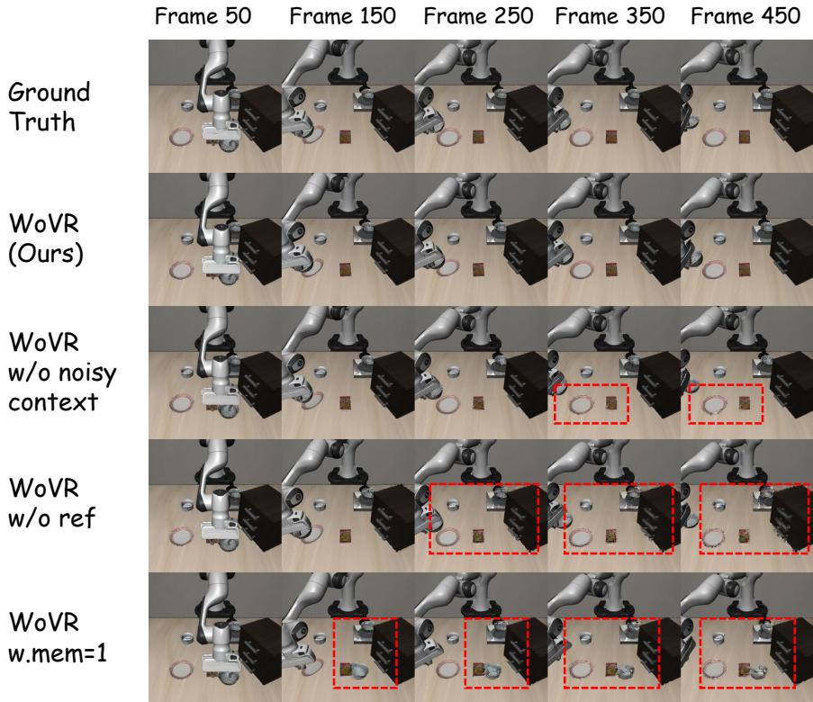

[← 返回 README](../README.md)

# 6. Ablation Study

## 📌 预览

两组消融：6.1 World Model 机制（reference frame、memory frames 数量、noisy context 各自的贡献）；6.2 Policy Optimization 机制（KIR 和 PACE 各自的贡献）。所有消融在 LIBERO-Spatial 上进行。

---

### 6.1 World Model 机制消融

**Experimental Variants:**
- **WoVR (full)**：完整模型
- **WoVR w/o ref**：去掉 fixed reference frame（first-frame anchoring）
- **WoVR w. mem=1**：只用单帧 context（去掉 multi-frame memory）
- **WoVR w/o noisy context**：训练时不对 context 加噪

**Table 4: World Model Ablation on LIBERO-Spatial**

| Method | Rollout | LPIPS↓ | FID↓ | FVD↓ | FloLPIPS↓ |
|--------|---------|--------|------|------|-----------|
| WoVR (Ours) | 512 | **0.091** | **36.687** | **73.493** | **0.154** |
| WoVR (Ours) | 256 | **0.069** | **27.238** | **63.948** | **0.110** |
| WoVR (Ours) | 128 | **0.051** | **20.780** | **49.017** | **0.081** |
| w/o ref | 512 | 0.133 | 73.942 | 123.502 | 0.168 |
| w/o ref | 256 | 0.089 | 49.406 | 86.000 | 0.116 |
| w/o ref | 128 | 0.064 | 35.559 | 86.146 | 0.090 |
| w. mem=1 | 512 | 0.120 | 64.501 | 86.042 | 0.165 |
| w. mem=1 | 256 | 0.086 | 46.790 | 81.742 | 0.117 |
| w. mem=1 | 128 | 0.065 | 36.047 | 79.605 | 0.095 |
| w/o noisy ctx | 512 | 0.099 | 44.712 | 77.284 | 0.160 |
| w/o noisy ctx | 256 | 0.074 | 31.691 | 61.660 | 0.115 |
| w/o noisy ctx | 128 | 0.054 | 23.444 | 58.836 | 0.085 |

> 💡 **Table 4 详细解读**：
> - **去掉 reference frame 影响最大**（w/o ref：FVD 512步 73.493 → 123.502，↑68%）：first-frame anchoring 是最重要的稳定性机制，没有它全局场景会发生严重漂移。而且漂移随 horizon 增长（128 步时差距相对小，512 步时差距最大），完全符合「误差积累」的预期。
> - **单帧 context 也很差**（w. mem=1：FVD 512步 86.042 vs full 73.493）：只有 first frame 没有最近几帧，world model 缺乏「刚刚发生了什么」的短期记忆，难以预测连续动作的效果。
> - **去掉 noisy context 影响相对小但仍显著**（w/o noisy ctx：FVD 512步 77.284 vs full 73.493，+5%）：影响随 horizon 增长更明显，说明 noisy context 主要帮助应对长期自回归的 train-inference gap。
>
> **重要结论**：三个机制都有贡献，但 first-frame anchoring > multi-frame memory > noisy context，优先级很清晰。

Removing the reference frame leads to a clear degradation in performance, especially under longer rollout horizons. This result suggests that anchoring the context with a fixed reference frame effectively suppresses error accumulation in the autoregressive feedback loop.

Furthermore, disabling noise injection on context frames also results in noticeable performance drops. While the degradation is moderate for short rollouts, the gap becomes more pronounced as the rollout length increases.

*Figure 7: Qualitative ablation results on LIBERO-Spatial. Ablated variants (w/o ref, w/o noisy context) exhibit error accumulation and visual drift under long-horizon rollouts, while the full WoVR model remains stable and consistent with the ground truth.*

> 💡 **Figure 7 批读**：定性对比，四行对应四种变体（Full / w/o ref / w. mem=1 / w/o noisy ctx）。最明显的失效模式：
> - **w/o ref**：背景在长 rollout 中逐渐崩塌/漂移，物体出现在错误位置
> - **w/o noisy ctx**：短期内看起来还好，但长期出现「视觉复制」（过度依赖 context 帧，变成了简单复制而不是预测）
> - **Full WoVR**：与 ground truth 保持一致，背景稳定，物体位置正确

---

### 6.2 Policy Optimization 机制消融

**Experimental Setup.** LIBERO-Spatial，其他设置与 5.2 相同。

**Variants:**
- **WoVR w/o KIR**：去掉 keyframe-based initialization，改从随机初始状态开始 rollout
- **WoVR w/o PACE**：禁用 world model 的 co-evolution，训练全程 world model 固定不变

**Table 5: Policy Optimization Ablation on LIBERO-Spatial**

| Method | Success Rate↑ |
|--------|--------------|
| **WoVR (Ours)** | **0.815** |
| WoVR w/o KIR | 0.782 |
| WoVR w/o PACE | 0.710 |

> 💡 **Table 5 详细解读**：
> - **去掉 KIR：-3.3 pp**（0.815 → 0.782）：KIR 去掉后从随机初始状态开始，world model 的长期误差积累降低了学习信号的质量。提升比 PACE 小，说明 KIR 帮助稳定早期学习，但在 world model 质量足够好时影响相对有限。
> - **去掉 PACE：-10.5 pp**（0.815 → 0.710）：PACE 的影响最大！World model 固定不变时，随着 policy 更新，distribution shift 越来越严重，world model 产生的 rollout 越来越不可靠，最终 RL 的优化信号被腐蚀。这验证了 PACE 对解决 distribution shift 的关键作用。
> - **PACE > KIR 的重要性**：两者都有贡献，但 PACE 更关键。从工程角度说，如果资源有限只能选一个，PACE 的 ROI 更高。
>
> **与 VLAW 的对比**：VLAW 的「PACE」等价物（迭代 fine-tune world model）没有单独做 ablation，WoVR 明确证明了这一步的重要性（-10.5 pp），是对 VLAW 方法有效性的间接验证。

The full WoVR framework achieves the highest performance, with an average success rate of 0.815. Removing keyframe-based initialization leads to a noticeable drop in performance, reducing the success rate to 0.782. Disabling the co-evolution of the world model further degrades performance to 0.710, suggesting that continuously refining the world model with updated policy rollouts is critical for maintaining simulator accuracy.

---

## 🔖 Section 总结

### 各组件贡献量化

| 组件 | 去掉后性能下降 | 结论 |
|------|-------------|------|
| First-frame anchoring | FVD +68%（512步） | 最重要的 WM 稳定机制 |
| Multi-frame memory | FVD +17%（512步） | 短期记忆不可或缺 |
| Noisy context | FVD +5%（512步） | 对 train-inference gap 的轻量修复 |
| PACE | SR -10.5 pp | 最重要的 policy optimization 机制 |
| KIR | SR -3.3 pp | 有效但贡献相对较小 |

### 核心洞察
1. World model 稳定性：first-frame anchoring 是核心，multi-frame memory 是补充，noisy context 是辅助
2. Policy optimization：PACE 的重要性远超 KIR，distribution shift 是比 error depth 更本质的问题
3. 所有消融结果都支持论文的设计选择，没有明显过度设计的成分
