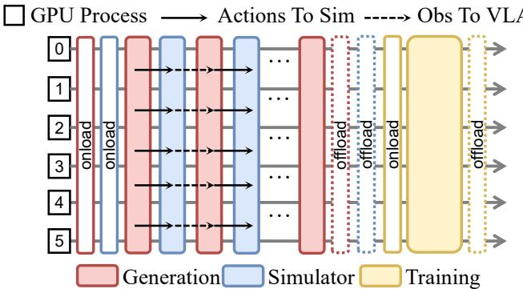

[← 返回 README](../README.md)

# 7. Conclusion & Appendix

## 📌 预览

Conclusion 重申「reliability problem 而非 modeling problem」的核心立场，总结三层贡献，承认局限性（仍有 hallucination、依赖 learned reward、有限真实数据）。Appendix A 介绍 GPU collocated 策略的工程实现。

---

## 7. Conclusion

In this work, we revisited world-model-based reinforcement learning for VLA policies through the lens of reliability. Rather than assuming a learned world model to be a faithful simulator, we identified hallucination under closed-loop imagined interaction as the central obstacle: autoregressive error accumulation and policy-induced distribution shift can systematically corrupt optimization signals, causing reinforcement learning to exploit model inaccuracies instead of genuine task progress.

To make RL in imagination viable under imperfect dynamics, we introduced WoVR, a hallucination-aware framework that controls hallucination at three interconnected levels. First, we strengthen the simulator itself by building a rollout-stable, action-controllable video world model, improving long-horizon consistency under policy-driven generation. Second, because residual prediction errors are unavoidable, we reshape the interaction protocol with Keyframe-Initialized Rollouts (KIR) to reduce the effective error depth and concentrate learning on task-critical segments where dynamics must be correct. Third, to prevent the evolving policy from drifting out of the simulator's training distribution, we maintain policy–simulator alignment via PACE, a policy-aligned co-evolution strategy that mitigates distribution mismatch without requiring continuous online supervision.

Extensive experiments on LIBERO and real-world manipulation tasks demonstrate that WoVR enables stable long-horizon imagined rollouts and effective on-policy optimization, yielding substantial gains over imitation learning and reliable transfer to physical robots. Overall, our results suggest that learned world models can serve as practical simulators for reinforcement learning when hallucination is explicitly regulated by design, interaction, and alignment.

Nevertheless, **WoVR reduces but does not fully eliminate hallucination**, particularly in extremely long-horizon or highly contact-sensitive settings, and it still relies on learned reward modeling and limited real-data refinement, leaving broader reliability guarantees as an open direction for future work.

> 💡 **作者自承的局限**：
> 1. **仍有 hallucination**：尤其在超长 horizon 和高度 contact-sensitive 场景
> 2. **依赖 learned reward model**：二值 success/failure 分类器本身也可能出错
> 3. **需要有限的真实数据**：1,500 + 1,000 = 2,500 条真实 rollout 用于 world model 训练，对某些场景来说仍然较多
>
> **未提到但值得关注的局限**：
> - 目前只在 LIBERO（仿真）+ 2 个简单的 pick-and-place 任务上验证，任务复杂度远不如 VLAW 的 5 类 contact-rich 任务（erase、draw 等）
> - PACE 只做一次对齐，如果 RL 训练轮次更多，policy 漂移会再次出现
> - Base model 是 OpenVLA-OFT（autoregressive），不能直接用于 flow-matching VLA（如 π₀.₅）

---

## Appendix A: GPU Allocation Strategy

The reinforcement-learning pipeline decomposes into three components: **Generation**（policy inference，产生 action）、**Simulator**（world model，产生下一帧）、**Training**（policy 更新）。

WoVR adopts a **collocated (shared) GPU allocation strategy**, where all three components co-exist on the same set of GPUs, with the Simulator implemented as the world-model rollout module. Unlike physical simulators that require dedicated device-side state, WoVR's simulator is a neural network; thus, offload/onload can be realized by swapping model parameters between GPU and host memory, without migrating any external simulator state.

**Modified collocated strategy**: In its original form, collocated execution required frequent GPU↔CPU offload/onload to keep only one component resident on GPUs at a time. However, in embodied settings, the simulator and generator must interact iteratively (closed-loop), making per-interaction offload/onload prohibitively expensive. Therefore, WoVR modifies this: **offload/onload for Generation and Simulator happens only at the beginning and end of the rollout phase**, avoiding repeated transfers during closed-loop imagined interaction.

*Figure 8: Collocated GPU Allocation Strategy. Generation and Simulator co-reside during rollout phase (only phase-boundary offload/onload), Training takes over GPU after rollout completes.*

> 💡 **工程设计的重要性**：WoVR 的系统实现细节直接影响整体 throughput。原版 RLinf 的 collocated 策略是为语言模型 RL 设计的，每次 policy inference 后就 offload/onload。但 world model rollout 需要多轮 policy-simulator 交互，频繁切换参数会导致 90% 的时间浪费在 GPU↔CPU 传输上。Phase-level offload/onload 把这个开销压缩到两次（一次在 rollout 开始，一次在 rollout 结束），是实现 23 FPS 高速推理的工程保障之一。

---

## 总体评价

### ✅ 优点

1. **核心 insight 独特**：从「reliability problem」视角重新框架 world model RL，而不是简单提升 world model 质量，视角有新意
2. **三层机制互补**：simulator / interaction / alignment 三层覆盖了 hallucination 的三个来源，设计系统且有理论依据
3. **实验全面**：world model 质量 + policy 性能 + real-world transfer + 详细消融，覆盖完整
4. **FloLPIPS metric 有价值**：比 LPIPS 更面向时序连贯性，适合评估 action-conditioned world model
5. **工程考虑到位**：GPU collocated 策略的 phase-level 优化是实现 23 FPS 的关键

### ❌ 不足

1. **真实机器人实验太简单**：只有 Pick Banana 和 Pick Bread 两个简单的 pick-and-place 任务，远不如 VLAW 的 5 类 contact-rich 任务（擦白板、画圆等），说服力有限
2. **Base policy 架构限制**：使用 OpenVLA-OFT（autoregressive），方法不能直接用于 flow-matching VLA（如 π₀.₅、π₀.₆*）——而这些是当前 SOTA 的 VLA
3. **PACE 只做一次**：如果 RL 训练轮次更多，policy 漂移会再次出现，scalability 未知
4. **与 VLAW 缺乏直接对比**：两篇同期论文解决的是相关问题，但实验平台不同，无法直接比较

### 与 VLAW 的系统性对比

| 维度 | VLAW | WoVR |
|------|------|------|
| **核心问题** | World model over-optimism（数据分布） | World model hallucination（推理可靠性） |
| **Policy 更新方式** | Binary-filtered BC（weighted SFT） | On-policy GRPO（真正的 RL） |
| **Base VLA** | π₀.₅（flow-matching） | OpenVLA-OFT（autoregressive） |
| **World Model** | Ctrl-World（fine-tune on rollout） | Wan 5B（dual-channel + anchoring） |
| **实验平台** | 真实机器人（DROID，5 类 contact-rich 任务） | LIBERO 仿真 + 2 个 pick-and-place |
| **数据量** | 50 real rollouts/task（少） | 2,500 rollouts/suite（多） |
| **Hallucination 控制** | 无专门机制（依赖 reward model threshold） | KIR + masked GRPO + PACE |
| **SOTA 程度** | 真实机器人更难的任务，说服力更强 | 仿真成绩更高，但任务更简单 |

> 💡 **综合判断**：VLAW 和 WoVR 是互补的工作，解决的是 world model-based VLA improvement 的不同子问题。VLAW 的方法更简洁（binary-filtered BC），真实机器人实验更有挑战性；WoVR 的 RL 框架更完整（真正的 on-policy GRPO），对 hallucination 的分析和控制更系统，但真实机器人任务太简单。理想的方法应该结合两者：WoVR 的 hallucination-aware RL 框架 + VLAW 的更难任务验证 + 支持 flow-matching VLA。
