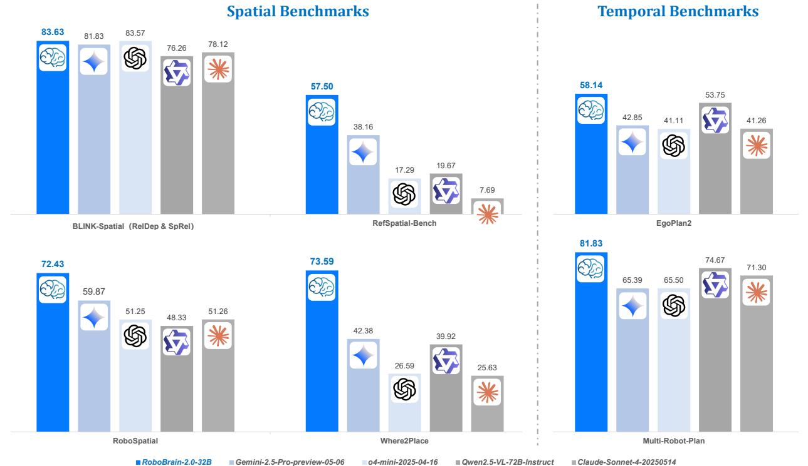

[← 返回 README](../README.md)

# Abstract

> 来源: RoboBrain 2.0 Technical Report (Arxiv 2507.02029)

---

## 📄 原文

We introduce RoboBrain 2.0, our latest generation of embodied vision-language foundation models, designed to unify perception, reasoning, and planning for complex embodied tasks in physical environments. It comes in two variants: a lightweight 7B model and a full-scale 32B model, featuring a heterogeneous architecture with a vision encoder and a language model. Despite its compact size, RoboBrain 2.0 achieves strong performance across a wide spectrum of embodied reasoning tasks. On both spatial and temporal benchmarks, the 32B variant achieves leading results, surpassing prior open-source and proprietary models. In particular, it supports key real-world embodied AI capabilities, including spatial understanding (e.g., affordance prediction, spatial referring, trajectory forecasting) and temporal decision-making (e.g., closed-loop interaction, multi-agent longhorizon planning, and scene graph updating). This report details the model architecture, data construction, multi-stage training strategies, infrastructure and practical applications. We hope RoboBrain 2.0 advances embodied AI research and serves as a practical step toward building generalist embodied agents. The code, checkpoint and benchmark are available at https://superrobobrain.github.io.

> 💡 **Abstract 解读**: RoboBrain 2.0 是 BAAI（北京智源研究院）推出的第二代具身视觉-语言基础模型。核心卖点：
> - **两个规模**: 7B（轻量）和 32B（完整），异构架构 = 视觉编码器 + 语言模型
> - **统一三大能力**: 感知（perception）、推理（reasoning）、规划（planning）
> - **空间能力**: affordance 预测、空间指代、轨迹预测
> - **时间能力**: 闭环交互、多机器人长程规划、场景图更新
> - **32B 在空间和时间 benchmark 上超过开源和闭源模型**
> - 通讯作者：仉尚航（Shanghang Zhang），北大计算机系教授


*Figure 1: Benchmark comparison across spatial and temporal reasoning. RoboBrain2.0-32B achieves best performance on both spatial and temporal reasoning benchmarks across BLINK-Spatial, RoboSpatial, RefSpatial-Bench, Where2Place, EgoPlan2 and Multi-Robot-Plan, outperforming prior open-source models and proprietary models.*

> 💡 **Figure 1 批读**: 雷达图对比，展示 RoboBrain 2.0-32B 在 6 个 benchmark 上的全面领先：
> ```
> 空间推理 benchmarks:
> ├── BLINK-Spatial: 深度感知 + 空间关系
> ├── RoboSpatial: 机器人环境空间推理
> ├── RefSpatial-Bench: 空间指代表达（点预测）
> └── Where2Place: 物体放置预测
>
> 时间推理 benchmarks:
> ├── EgoPlan2: 第一人称视角活动规划
> └── Multi-Robot-Plan: 多机器人协作规划
> ```
> 关键：32B 版本在所有 6 个 benchmark 都是最优，超过 GPT-4o、Gemini、Claude 等闭源模型。

---

## 💡 Section 总结

### 核心信息速查
| 指标 | 值 |
|------|-----|
| 模型名称 | RoboBrain 2.0 |
| 团队 | BAAI RoboBrain Team |
| 规模 | 7B / 32B |
| 架构 | 视觉编码器 + 语言模型（异构） |
| 核心能力 | 空间理解 + 时间决策 |
| 开源 | 代码 + checkpoint + benchmark |

### 核心洞察
1. 定位是"具身 AI 的基础模型"，不只是 VLM，强调在物理世界中的应用
2. 两个规模版本说明在考虑部署场景（边缘 vs 服务器）
3. 同时做空间和时间推理是区别于一般 VLM 的关键
