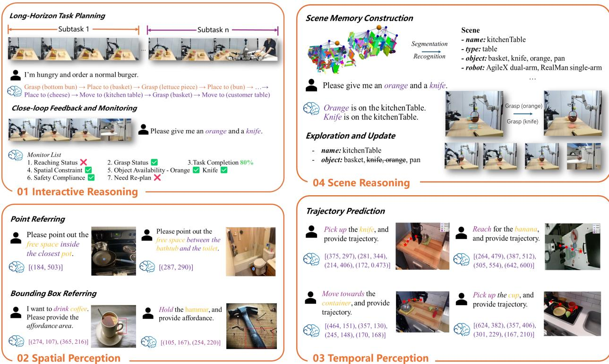

[← 返回 README](../README.md)

# 1. Introduction

> 来源: RoboBrain 2.0 Technical Report (Arxiv 2507.02029)

---

## 📄 原文

> 💡 **Section 概览**: Introduction 分四部分：① LLM/VLM 在数字世界的成功；② 从数字到物理的三个瓶颈；③ RoboBrain 2.0 的方案（数据 + 架构 + 训练）；④ 报告结构路线图。

In recent years, large language models (LLMs) and vision-language models (VLMs) have emerged as key driving forces in the advancement of general artificial intelligence (AGI). Within digital environments, these models have demonstrated remarkable capabilities in perception [5, 16, 83], understanding [22, 73], and reasoning [2, 17, 18, 45, 65], and have been widely applied in tasks such as multimodal question answering [35, 60], image generation and editing [24, 57], GUI control [37, 71], and video understanding [7, 63, 72]. They have also seen early adoption in practical domains such as education, healthcare, search, and intelligent assistants [11, 21, 82].

> 💡 **背景铺垫**: 标准开场——LLM/VLM 在数字世界已经很强了。引用了 Qwen2.5-VL [5]、GPT-4o [22]、Qwen3 [73]、Claude [2]、DeepSeek-R1 [17] 等代表性工作。

However, bridging the gap between "digital intelligence" and "physical intelligence"—enabling models to perceive their surroundings, understand embodied tasks, and interact with the real world—remains a critical challenge on the path toward AGI. Embodied foundation models [4, 64, 74] represent a promising research direction toward physical intelligence. Several recent efforts have extended the capabilities of LLMs and VLMs to embodied scenarios, advancing multimodal fusion, perception, and action execution. While these models have achieved encouraging progress, they still face three fundamental capability bottlenecks when deployed in complex and open-ended real-world environments: (1) Limited spatial understanding: Current models struggle to accurately model relative and absolute spatial relationships and identify affordances in physical environments, which hinders real-world applicability; (2) Weak temporal modeling: The lack of understanding of multi-stage, cross-agent temporal dependencies and feedback mechanisms limits long-horizon planning and closed-loop control; (3) Insufficient reasoning chains: Existing models are often incapable of extracting causal logic from complex human instructions and aligning it with dynamic environmental states, restricting their generalization to open-ended embodied tasks.

> 💡 **三个核心瓶颈**（论文的问题定义）:
> ```
> 瓶颈 1: 空间理解不足
> ├── 相对/绝对空间关系建模差
> └── 无法识别 affordance（物体可操作性）
>
> 瓶颈 2: 时间建模薄弱
> ├── 多阶段、跨智能体的时间依赖
> └── 缺乏反馈机制 → 长程规划和闭环控制受限
>
> 瓶颈 3: 推理链不足
> ├── 无法从复杂指令中提取因果逻辑
> └── 无法与动态环境状态对齐
> ```
> 这三个瓶颈直接对应了 RoboBrain 2.0 的三个解决方向。

To address these challenges, we present RoboBrain 2.0, our latest generation of embodied vision-language foundation models, tailored to bridge perception, reasoning, and planning in physically environments. RoboBrain 2.0 processes visual observations and language instructions in a unified architecture, enabling holistic understanding of the environment, goal-directed reasoning, and long-horizon planning. We release two variants of the model: the lightweight RoboBrain 2.0–7B and the full-scale RoboBrain 2.0–32B, designed to meet different deployment needs under varying resource constraints. On both spatial reasoning and temporal reasoning benchmarks, the 32B variant mostly achieves state-of-the-art performance, outperforming prior open-source and proprietary models, as shown in Figure 1. Model capabilities are summarized in Figure 2.

> 💡 **RoboBrain 2.0 定位**: 不是通用 VLM，而是 "embodied vision-language foundation model"。两个变体（7B/32B）考虑了不同部署场景。

This report provides a systematic overview of the design principles, core components and key innovations. In particular, we highlight the extensive data contributions that support spatial understanding, temporal reasoning, and causal inference, which form the foundation of RoboBrain 2.0's capabilities. To address the scarcity of spatial data, we develop a spatial data synthesis pipeline that constructs large-scale, high-quality datasets spanning tasks such as pointing, affordance prediction, and trajectory generation. To improve temporal reasoning and feedback modeling, we design multi-robot coordination templates across common scenarios via RoboOS [61], generate cross-agent long-horizon planning trajectories using external models [31], and simulate randomized failure events to collect closed-loop feedback data that enhances model robustness. To further enrich reasoning data, we extract step-by-step thought traces from powerful reasoning VLMs [22], conditioned on spatiotemporal task contexts. These traces serve as supervision signals for learning causal chains across vision, language, and action.

> 💡 **数据贡献是重点**（三条线）:
> ```
> 数据线 1: 空间数据合成
> ├── pointing、affordance、trajectory
> └── 自动化 pipeline 构建大规模数据
>
> 数据线 2: 时间数据构建
> ├── 多机器人协调模板（RoboOS）
> ├── 跨智能体长程规划（DeepSeek-V3 生成）
> └── 随机化失败事件 → 闭环反馈数据
>
> 数据线 3: 推理数据
> ├── 从强推理 VLM（GPT-4o）提取思维链
> └── 基于时空任务上下文的 step-by-step traces
> ```

RoboBrain 2.0 adopts a high-efficiency heterogeneous architecture and a progressive multi-stage training strategy to support spatial understanding, temporal modeling, and long-chain causal reasoning in embodied settings. The model comprises a lightweight vision encoder with approximately 689M parameters and a decoder-only language model with 7B/32B parameters. It is trained using a three-stage curriculum—covering foundational spatiotemporal learning, embodied spatiotemporal enhancement, and chain-of-thought reasoning—on large-scale multimodal and embodied datasets. Training is conducted using our open-source framework FlagScale, which integrates hybrid parallelism, pre-allocated memory optimization, high-throughput I/O pipelines, and robust fault tolerance. These infrastructure innovations significantly reduce training and deployment costs while ensuring scalability for large-scale multimodal models. We evaluate RoboBrain 2.0 on over 12 public benchmarks covering spatial understanding, temporal modeling and multimodal reasoning, achieving state-of-the-art results on 6 of them despite its compact size. We release code, checkpoints, and benchmarks as open-source resources to benefit the research community. These materials facilitate reproducible research, accelerate embodied AI development, and enable practical deployment in robotic systems.

> 💡 **架构和训练概要**:
> - 视觉编码器 ~689M 参数 + LLM 7B/32B 参数
> - 三阶段训练: 基础时空学习 → 具身增强 → CoT 推理
> - 训练框架: FlagScale（开源），混合并行 + 内存优化 + 容错
> - 12+ benchmarks 评测，6 个 SOTA


*Figure 2: The overview of RoboBrain 2.0's Capabilities. RoboBrain 2.0 supports interactive reasoning with long-horizon planning and closed-loop feedback, spatial perception for precise point and bounding box prediction from complex instructions, temporal perception for future trajectory estimation, and scene reasoning through real-time scene graph construction and updating.*

> 💡 **Figure 2 批读**: 能力全景图，展示四大核心能力：
> ```
> 1. Interactive Reasoning（交互推理）
>    ├── 长程规划（long-horizon planning）
>    └── 闭环反馈（closed-loop feedback）
>
> 2. Spatial Perception（空间感知）
>    ├── 点预测（point prediction）
>    └── 边界框预测（bounding box prediction）
>
> 3. Temporal Perception（时间感知）
>    └── 未来轨迹估计（trajectory estimation）
>
> 4. Scene Reasoning（场景推理）
>    ├── 实时场景图构建
>    └── 场景图更新
> ```
> 关键：这些能力直接对应了具身 AI 中机器人需要的核心功能。

To provide a comprehensive view of RoboBrain 2.0's architecture, training methodology, and capabilities, this report is organized as follows: Section 2 introduces the overall model design, including the coordination between the vision encoder and language model, as well as image and video input strategies. Section 3 describes the data curation and construction process, covering three major categories: general multimodal understanding, spatial reasoning, and temporal modeling. Section 4 presents our multi-stage training strategies, including foundational spatiotemporal learning, embodied enhancement, and chain-of-thought reasoning. Section 5 outlines the infrastructure stack supporting scalable training and inference, including hybrid parallelization, memory optimization, data loading, and failure recovery. Section 6 reports extensive evaluation results on public benchmarks, highlights RoboBrain 2.0's capabilities in spatial reasoning, temporal feedback, and embodied planning. Finally, Section 7 discusses current limitations, and outlines future research directions.

> 💡 **报告路线图**: Section 2（架构）→ 3（数据）→ 4（训练策略）→ 5（基础设施）→ 6（评测）→ 7（总结与展望）。标准 technical report 结构。

---

## 💡 Section 总结

### 关键数字速查
| 指标 | 数值 |
|------|------|
| 视觉编码器参数 | ~689M |
| LLM 参数 | 7B / 32B |
| 训练阶段 | 3 个 |
| 评测 benchmark 数 | 12+ |
| SOTA benchmark 数 | 6 |
| 训练框架 | FlagScale（开源）|

### 核心洞察
1. **问题驱动**: 三个瓶颈（空间、时间、推理）定义了整个工作的方向
2. **数据是关键**: 大量篇幅描述数据构建，说明数据贡献是本文最重要的部分之一
3. **从 Qwen2.5-VL 初始化**: 基座模型是 Qwen2.5-VL [5]，这意味着不是从头训练
4. **实用导向**: 强调开源、部署、基础设施，不只是学术创新
