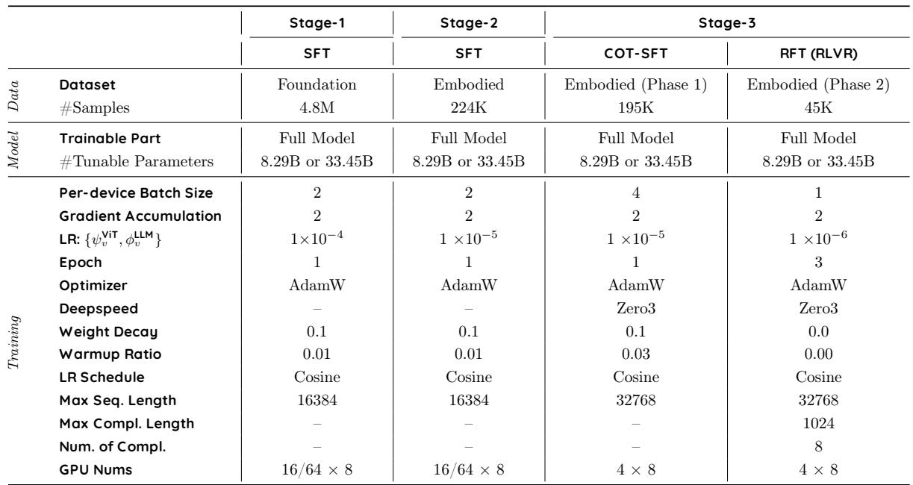

# 4. Training Strategy

> 来源: RoboBrain 2.0 Technical Report (Arxiv 2507.02029)

---

## 📄 原文

> 💡 **Section 概览**: 三阶段渐进训练策略：Stage 1（基础时空学习，4.8M 数据）→ Stage 2（具身增强，224K 数据）→ Stage 3（CoT 推理，195K SFT + 45K RFT）。从通用到具身，从感知到推理。

RoboBrain 2.0 achieves embodied capabilities (spatial understanding, temporal modeling, and chain-of-thought reasoning) through a progressive three-phase training strategy, as shown in Table 1. Starting from a robust vision-language foundation, we introduce escalating complexity in embodied supervision, enabling the model to evolve from static perception to dynamic reasoning and actionable planning in real-world environments.


*Table 1: Detailed configuration for each training stage of the RoboBrain 2.0.*

> 💡 **Table 1 批读**:
> ```
> 训练配置对比:
>                    Stage-1 SFT    Stage-2 SFT    Stage-3 CoT-SFT    Stage-3 RFT
> 数据集             Foundation     Embodied       Embodied (Ph1)     Embodied (Ph2)
> 样本数             4.8M           224K           195K               45K
> 可训练参数         Full Model     Full Model     Full Model         Full Model
>                    8.29B/33.45B   8.29B/33.45B   8.29B/33.45B       8.29B/33.45B
> 每卡 batch size    2              2              4                  1
> 梯度累积           2              2              2                  2
> 学习率             1×10⁻⁴         1×10⁻⁵         1×10⁻⁵             1×10⁻⁶
> Epoch              1              1              1                  3
> 优化器             AdamW          AdamW          AdamW              AdamW
> DeepSpeed          −              −              Zero3              Zero3
> Weight Decay       0.1            0.1            0.1                0.0
> Warmup             0.01           0.01           0.03               0.00
> 最大序列长度       16384          16384          32768              32768
> GPU 数             16/64 × 8      16/64 × 8      4 × 8              4 × 8
> ```
> **关键观察**:
> - Stage 1 学习率最高（1e-4），数据最多（4.8M），是大规模基础训练
> - Stage 2 学习率降10x（1e-5），数据减少20x（224K），精细调整具身能力
> - Stage 3 序列长度翻倍到 32768（CoT 需要更长上下文）
> - RFT 阶段训练 3 个 epoch（RL 需要多次迭代），学习率最低（1e-6）
> - 7B 用 16×8=128 GPU，32B 用 64×8=512 GPU

---

### 4.1 Stage 1: Foundational Spatiotemporal Learning

> 💡 **4.1 要点预览**: 第一阶段在大规模多模态数据上微调，建立空间感知和时间理解的基础能力。

The first stage focuses on building general capabilities in spatial perception and temporal understanding. We fine-tune the model on large-scale multimodal datasets covering dense captioning, object localization, interleaved image-text documents, and basic video QA, along with referring expression comprehension. These datasets span common physical scenes and interaction patterns, helping the model develop fundamental grounding for objects, spatial relations, and motion events. This stage lays the groundwork for understanding egocentric video streams and spatially anchored instructions.

> 💡 **4.1 小结**:
> - 数据: 4.8M Foundation 数据
> - 任务: dense captioning + 目标定位 + 图文交错 + 视频QA + 指代表达
> - 目标: 建立基础的空间和时间理解能力
> - 全参数微调，学习率 1e-4

---

### 4.2 Stage 2: Embodied Spatiotemporal Enhancement

> 💡 **4.2 要点预览**: 第二阶段引入具身专用数据，增强多视角、长序列、多智能体场景的理解。

To better align the model with embodied tasks, we introduce a carefully curated collection of high-resolution, multi-view, and egocentric video datasets, along with instruction-augmented navigation and interaction data. Tasks include viewpoint-aware referring expressions, 3D affordance estimation, and object-centric scene graph construction. This stage of training emphasizes the modeling of long-horizon temporal dependencies, enabling the model to reason over extended sequences of actions and observations. Additionally, it incorporates multi-agent coordination scenarios, where the model learns to interpret and predict the behaviors of other agents in shared environments. To support these capabilities, we employ extended sequence lengths and multi-camera input encoding, allowing the model to process and fuse visual information from multiple viewpoints simultaneously. Through this training stage, the model can integrate historical visual cues with current instructions, fostering more coherent long-horizon planning, robust scene understanding, and adaptive decision-making in dynamic, interactive settings.

> 💡 **4.2 小结**:
> - 数据: 224K Embodied 专用数据
> - 新增能力: 视角感知指代、3D affordance、场景图构建
> - 关键变化: 长序列时间依赖 + 多智能体协调 + 多相机输入
> - 学习率降到 1e-5，更精细的调整

---

### 4.3 Stage 3: Chain-of-Thought Reasoning in Embodied Contexts

> 💡 **4.3 要点预览**: 第三阶段分两个 phase：CoT-SFT（监督微调 + 思维链标注）和 RFT（强化微调 + GRPO）。

In the third stage, we augment the model's high-level reasoning capabilities using Chain-of-Thought (CoT) methodology, following the two-phase framework of Reason-RFT [62]: CoT-based Supervised Fine-Tuning (CoT-SFT) and Reinforcement Fine-Tuning (RFT). We leverage multi-turn reasoning examples from both synthetic and real-world embodied scenarios, encompassing long-horizon task planning, manipulation prediction, closed-loop interaction, spatiotemporal understanding, and multi-robot collaboration, sourced from Section 3. Specifically, (1) CoT-SFT Phase: We annotate 10% of the constructed training data with CoT rationales annotated by GPT-4o [22] with custom prompts, then perform supervised fine-tuning for initial model from Stage 2. (2) RFT Phase: An additional 10% of the constructed training data is sampled to collect model's responses, with incorrect answers curated into a reformatted training set (e.g., multiple-choice questions or LaTeX/numerical answers). Optimization employs Group Relative Policy Optimization (GRPO) [17], guided by a composite reward function evaluating both answer accuracy and format correctness.

> 💡 **Stage 3 两阶段详解**:
> ```
> Phase 1: CoT-SFT（监督微调）
> ├── 取 10% 训练数据
> ├── GPT-4o 标注 CoT rationales（思维链推理过程）
> ├── 195K 样本
> └── 对 Stage 2 模型做 SFT
>
> Phase 2: RFT（强化微调）
> ├── 另取 10% 训练数据
> ├── 收集模型回答，筛选错误答案
> ├── 45K 样本，训练 3 epochs
> ├── 用 GRPO [17] (DeepSeek-R1 的方法) 优化
> └── 奖励函数 = 答案准确性 + 格式正确性
> ```
> **关键**: Reason-RFT [62] 是同一团队的工作（仉尚航组），先 SFT 再 RL 是标准的 post-training 范式。GRPO 来自 DeepSeek-R1 [17]。

---

## 💡 Section 总结

### 训练策略全景
```
Stage 1: Foundation (4.8M)     Stage 2: Embodied (224K)     Stage 3: CoT (195K+45K)
┌──────────────────┐           ┌──────────────────┐          ┌──────────────────┐
│ 通用多模态理解   │    →      │ 具身任务对齐     │    →     │ 推理能力增强     │
│ 空间/时间基础    │           │ 多视角/长序列    │          │ CoT-SFT + RFT    │
│ LR: 1e-4         │           │ LR: 1e-5         │          │ LR: 1e-5/1e-6    │
│ 128/512 GPU      │           │ 128/512 GPU      │          │ 32 GPU           │
└──────────────────┘           └──────────────────┘          └──────────────────┘
```

### 核心洞察
1. **渐进式训练**: 数据从大到小（4.8M → 224K → 240K），学习率从高到低
2. **Stage 3 是关键差异化**: CoT + RL 是当前 post-training 的主流方向
3. **只用 10% 数据做 CoT 标注**: 说明 CoT 数据标注成本高（GPT-4o），需要高效利用
4. **全参数微调**: 三个阶段都是 full model tuning，没有用 LoRA 等轻量方法
