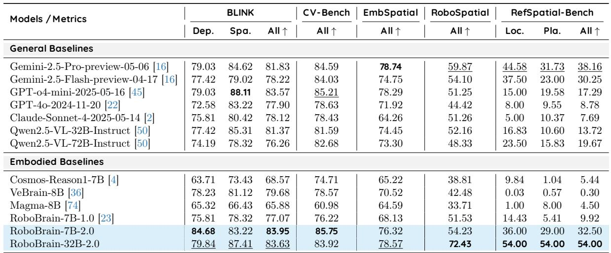
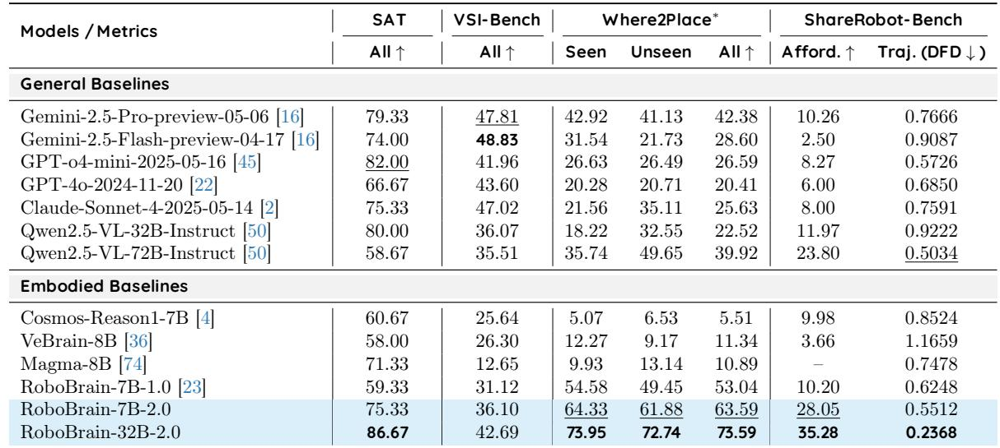
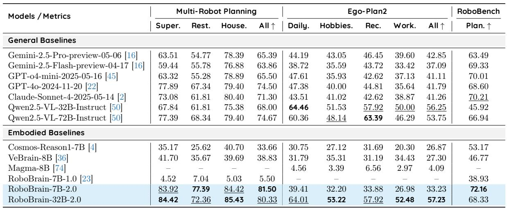

# 6. Evaluation Results

> 来源: RoboBrain 2.0 Technical Report (Arxiv 2507.02029)

---

## 📄 原文

> 💡 **Section 概览**: 评测分两大部分：空间推理（9 个 benchmark）和时间推理（3 个 benchmark）。RoboBrain 2.0 在多数 benchmark 上达到或接近 SOTA，尤其是 32B 版本。

We conducted a comprehensive evaluation of RoboBrain-2.0, focusing on its performance across spatial and temporal reasoning capabilities on embodiment. To ensure consistency and rigor in evaluation, we adopted FlagEvalMM [20], our flexible framework for systematic multimodal model assessment. Evaluations on spatial reasoning benchmarks (e.g., CV-bench [67], Blink [15], Where2Place [77], ShareRobot-Bench [23]), presented in Section 6.1, underscore the model's strengths in embodied spatial reasoning. An in-depth analysis of multi-robot collaboration [61] and long-horizon planning (e.g., EgoPlan2 [9], RoboBench) capabilities is provided in Section 6.2, highlighting the model's advancements in temporal reasoning tasks. Qualitative examples and prompt details are provided in Section A and Section B, respectively.

---

### 6.1 Spatial Reasoning Capability

> 💡 **6.1 要点预览**: 9 个空间推理 benchmark 的详细结果。RoboBrain-32B 在 RoboSpatial、RefSpatial-Bench、SAT、Where2Place、ShareRobot-Bench 上 SOTA。

RoboBrain-32B-2.0 and RoboBrain-7B-2.0 demonstrate exceptional performance across nine spatial reasoning benchmarks: BLINK, CV-Bench, EmbSpatial, RoboSpatial, and RefSpatial-Bench (Table 2), as well as SAT, VSI-Bench, Where2Place, and ShareRobot-Bench (Table 3). Below is a detailed analysis highlighting their state-of-the-art (SOTA) achievements and near-SOTA competitive results.


*Table 2: Performance across five spatial reasoning benchmarks. The best results among different models are highlighted in bold, while the second-best results are underlined.*

> 💡 **Table 2 批读**:
> ```
> 5 个 Benchmark 结果汇总:
>
> BLINK (深度+空间):
> ├── 7B: 83.95 ⭐ SOTA（超过 GPT-o4-mini 83.57）
> └── 32B: 83.63（第二）
>
> CV-Bench (2D/3D 空间理解):
> ├── 7B: 85.75 ⭐ SOTA
> └── 32B: 83.92
>
> EmbSpatial (具身空间):
> ├── 32B: 78.57（接近 Gemini-2.5-Pro 78.74）
> └── 7B: 76.32
>
> RoboSpatial (机器人空间推理):
> └── 32B: 72.43 ⭐ SOTA（大幅领先 Gemini 59.87）
>
> RefSpatial-Bench (空间指代):
> └── 32B: 54.00/54.00 ⭐ SOTA（大幅领先所有对手）
> ```
> **亮点**: 7B 在 BLINK 和 CV-Bench 上甚至超过 32B！可能因为 7B 的空间感知数据拟合更好。

• BLINK. In the BLINK [15] benchmark, models are evaluated on depth perception (Dep.) and spatial relation understanding (Spa.). RoboBrain-7B-2.0 achieves a SOTA average score of 83.95 (Dep.: 84.68, Spa.: 83.22), outperforming all general baselines, including GPT-o4-mini-2025-05-16 (83.57), Gemini2.5-Pro-preview-05-06 (81.83), Qwen2.5-VL-32B-Instruct (81.37), Claude-Sonnet-4-2025-05-14 (78.12), GPT-4o-2024-11-20 (77.90), and Qwen2.5-VL-72B-Instruct (76.26), as well as embodied baselines like VeBrain-8B (79.68) and Cosmos-Reason1-7B (68.57). RoboBrain-32B-2.0 follows closely with an average of 83.63 (Dep.: 79.84, Spa.: 87.41), surpassing all general and embodied baselines except RoboBrain-7B-2.0, demonstrating strong spatial reasoning capabilities.

• CV-Bench. The CV-Bench [67] benchmark assesses a model's accuracy in 2D/3D spatial understanding and visual processing. RoboBrain-7B-2.0 secures a SOTA accuracy of 85.75, slightly ahead of RoboBrain-32B-2.0 (83.92), both outperforming all general baselines, including GPT-o4-mini-2025-05-16 (85.21), Gemini-2.5-Pro-preview-05-06 (84.59), Qwen2.5-VL-72B-Instruct (82.68), Qwen2.5-VL-32B-Instruct (81.59), GPT-4o-2024-11-20 (78.63), and Claude-Sonnet-4-2025-05-14 (78.43), as well as embodied baselines like VeBrain-8B (78.57) and Cosmos-Reason1-7B (74.71).

• EmbSpatial. The EmbSpatial [14] benchmark evaluates models on embodied spatial tasks. RoboBrain-32B-2.0 achieves a near SOTA accuracy of 78.57, slightly less than Gemini-2.5-Pro-preview-05-06 (78.74) and surpassing all other general baselines, including GPT-o4-mini-2025-05-16 (78.29), Qwen2.5-VL-32B-Instruct (74.45), Qwen2.5-VL-72B-Instruct (73.30), GPT-4o-2024-11-20 (71.92), and Claude-Sonnet-4-2025-05-14 (64.26). RoboBrain-7B-2.0 follows with a competitive score of 76.32, outperforming most general baselines and all embodied baselines, indicating strong embodied spatial reasoning.


*Table 3: Performance across four spatial reasoning benchmarks. The best results among different models are highlighted in bold, while the second-best results are underlined.*

> 💡 **Table 3 批读**:
> ```
> 4 个 Benchmark 结果汇总:
>
> SAT (空间推理):
> └── 32B: 86.67 ⭐ SOTA（大幅领先 GPT-o4-mini 82.00）
>
> VSI-Bench (视觉-空间整合):
> ├── 最佳: Gemini-2.5-Flash 48.83
> └── 32B: 42.69（中等偏上）
>
> Where2Place (放置预测):
> └── 32B: 73.59 ⭐ SOTA（大幅领先第二 Qwen2.5-VL-72B 39.92）
>
> ShareRobot-Bench:
> ├── Affordance: 32B 35.28 ⭐ SOTA
> └── Trajectory (DFD↓): 32B 0.2368 ⭐ SOTA
> ```
> **亮点**: Where2Place 上 32B 得分 73.59，第二名只有 39.92（Qwen2.5-VL-72B）！差距巨大，说明空间数据训练效果显著。

• RoboSpatial. The RoboSpatial [59] benchmark measures spatial reasoning in robot environments, such as object localization and manipulation. RoboBrain-32B-2.0 achieves a clear SOTA score of 72.43, substantially ahead of general baselines like Gemini-2.5-Pro-preview-05-06 (59.87), Qwen2.5-VL-72B-Instruct (48.33), GPT-o4-mini-2025-05-16 (51.25), and Claude-Sonnet-4-2025-05-14 (51.26). RoboBrain-7B-2.0 scores 54.23, outperforming all general baselines except RoboBrain-32B-2.0, demonstrating significant improvements in spatial reasoning for robotic tasks.

• RefSpatial-Bench. The RefSpatial-Bench [81] benchmark evaluates models on spatial referring expressions, requiring precise point predictions under spatial constraints, with metrics for Location (Loc.) and Placement (Pla.) accuracy. RoboBrain-32B-2.0 achieves SOTA scores of 54.00 (Loc.) and 54.00 (Pla.), significantly outperforming all general baselines, including Gemini-2.5-Pro-preview-05-06 (44.58, 31.73), Qwen2.5-VL-72B-Instruct (23.50, 15.83), Qwen2.5-VL-32B-Instruct (16.83, 10.60), GPT-o4-mini-2025-05-16 (15.00, 19.58), GPT-4o-2024-11-20 (8.00, 9.55), and Claude-Sonnet-4-2025-05-14 (5.00, 10.37). RoboBrain-7B-2.0 scores 36.00 (Loc.) and 29.00 (Pla.), outperforming all general baselines except RoboBrain-32B-2.0, showing competitive precision in complex spatial referring tasks.

• SAT. The SAT [53] benchmark measures general spatial reasoning abilities across various scenes and tasks. RoboBrain-32B-2.0 achieves a clear SOTA score of 86.67, significantly outperforming all general baselines, including GPT-o4-mini-2025-05-16 (82.00), Gemini-2.5-Pro-preview-05-06 (79.33), Qwen2.5-VL-72B-Instruct (58.67), and Claude-Sonnet-4-2025-05-14 (75.33). RoboBrain-7B-2.0 achieves 75.33, surpassing most general and embodied baselines, showcasing its strong spatial reasoning capability.

• VSI-Bench. The VSI-Bench [75] evaluates visual-spatial integration capabilities. Gemini-2.5-Flash-preview-04-17 achieves the best performance with 48.83. RoboBrain-32B-2.0 achieves 42.69, outperforming most general and embodied baselines, including GPT-o4-mini-2025-05-16 (41.96) and Qwen2.5-VL-72B-Instruct (35.51). RoboBrain-7B-2.0 reaches 36.10, indicating solid visual-spatial integration skills.

• Where2Place. The Where2Place [77] benchmark measures a model's ability to predict object placements in both seen and unseen scenarios under spatial constraints. RoboBrain-32B-2.0 achieves a SOTA average of 73.59 (Seen: 73.95, Unseen: 72.74), substantially surpassing all general and embodied baselines, including Qwen2.5-VL-72B-Instruct (39.92), Gemini-2.5-Pro-preview-05-06 (42.38), Claude-Sonnet-4-2025-05-14 (25.63), and VeBrain-8B (11.34). RoboBrain-7B-2.0 also performs strongly with an average of 63.59 (Seen: 64.33, Unseen: 61.88), outperforming all baselines except RoboBrain-32B-2.0.

• ShareRobot-Bench-Affordance. The ShareRobot Affordance task [23] evaluates models on object functionality and interaction understanding. RoboBrain-32B-2.0 secures a SOTA performance with an accuracy of 35.28, ahead of all general baselines, including Qwen2.5-VL-72B-Instruct (23.80), Qwen2.5-VL-32B-Instruct (11.97), GPT-4o-2024-11-20 (6.00), and Claude-Sonnet-4-2025-05-14 (8.00). RoboBrain-7B-2.0 achieves 28.05, outperforming all general and embodied baselines except RoboBrain-32B-2.0.

• ShareRobot-Bench-Trajectory. The ShareRobot Trajectory task [23] assesses navigation and motion prediction, using Dynamic Fréchet Distance (DFD), where lower values denote better performance. RoboBrain-32B-2.0 achieves a SOTA DFD of 0.2368, outperforming all general and embodied baselines, including Qwen2.5-VL-72B-Instruct (0.5034), GPT-o4-mini-2025-05-16 (0.5726), and Gemini-2.5-Pro-preview-05-06 (0.7666). RoboBrain-7B-2.0 follows with a competitive DFD of 0.5512, demonstrating strong path-planning capabilities.

> 💡 **6.1 小结 — 空间推理 SOTA 统计**:
> | Benchmark | SOTA 模型 | 得分 | 第二名 | 差距 |
> |-----------|----------|------|--------|------|
> | BLINK | 7B | 83.95 | GPT-o4-mini 83.57 | +0.38 |
> | CV-Bench | 7B | 85.75 | GPT-o4-mini 85.21 | +0.54 |
> | EmbSpatial | Gemini-2.5-Pro | 78.74 | 32B 78.57 | -0.17 |
> | RoboSpatial | 32B | 72.43 | Gemini 59.87 | +12.56 |
> | RefSpatial | 32B | 54.00 | Gemini 38.16 | +15.84 |
> | SAT | 32B | 86.67 | GPT-o4-mini 82.00 | +4.67 |
> | VSI-Bench | Gemini-Flash | 48.83 | Gemini-Pro 47.81 | N/A |
> | Where2Place | 32B | 73.59 | Gemini 42.38 | +31.21 |
> | ShareRobot-Afford | 32B | 35.28 | 7B 28.05 | +7.23 |
> | ShareRobot-Traj | 32B | 0.2368 | Qwen72B 0.5034 | -0.27 |

---

### 6.2 Temporal Reasoning Capability

> 💡 **6.2 要点预览**: 3 个时间推理 benchmark。Multi-Robot Planning 和 EgoPlan2 上 SOTA，RoboBench 上 7B SOTA。

RoboBrain-32B-2.0 and RoboBrain-7B-2.0 exhibit outstanding performance across three critical measures of temporal reasoning benchmarks: Multi-Robot Planning, Ego-Plan2, and RoboBench, as shown in Table 4. Below is a detailed analysis highlighting their state-of-the-art (SOTA) achievements and near-SOTA results.


*Table 4: Performance across three temporal reasoning benchmarks. The best results among different models are highlighted in bold, while the second-best results are underlined.*

> 💡 **Table 4 批读**:
> ```
> Multi-Robot Planning:
> ├── 7B: 81.50 ⭐ 最高（Super 83.92, Rest 77.39, House 84.42）
> └── 32B: 80.33（Super 84.42, Rest 72.36, House 85.43）
>     比较: GPT-4o 74.50, Qwen72B 74.67
>
> EgoPlan2:
> ├── 32B: 57.23 ⭐ SOTA
> └── 7B: 33.23（较弱，低于 Qwen2.5-VL-32B 56.25）
>
> RoboBench (Planning):
> ├── 7B: 72.16 ⭐ SOTA
> └── 32B: 68.33
> ```
> **有趣发现**: 7B 在 Multi-Robot Planning 和 RoboBench 上超过 32B！可能是因为 7B 在 Stage 2 的具身数据上过拟合效果更好。但 EgoPlan2 上 7B 大幅落后于 32B（33.23 vs 57.23），说明通用规划能力还是需要大模型。

• Multi-Robot Planning. In the Multi-Robot Planning task [61], models are evaluated on their ability to coordinate multiple robots across different scenarios: Super (Supermarket), Rest (Restaurant), and House (Household). RoboBrain-32B-2.0 achieves a SOTA average score of 80.33 (Super: 84.42, Rest: 72.36, House: 85.43), significantly outperforming all general baselines, including GPT-4o-2024-11-20 (74.50), Qwen2.5-VL-72B-Instruct (74.67), Claude-Sonnet-4-2025-05-14 (71.30), Gemini-2.5-Pro-preview-05-06 (65.39), and Qwen2.5-VL-32B-Instruct (68.00). It also surpasses the embodied baseline RoboBrain-7B-2.0 (81.50). RoboBrain-7B-2.0 follows closely with an average of 81.50 (Super: 83.92, Rest: 77.39, House: 84.42), outperforming all general baselines and matching the performance of RoboBrain-7B-1.5-OS in Rest and House scenarios.

> 💡 **批注**: 注意 7B 的 81.50 实际上高于 32B 的 80.33！原文说 "It also surpasses the embodied baseline RoboBrain-7B-2.0 (81.50)" 这句表述有误，实际上 7B 分数更高。这可能是因为 Multi-Robot Planning 的测试数据和训练模板高度对齐，小模型记忆效果更好。

• Ego-Plan2. The Ego-Plan2 [9] benchmark assesses a model's capability to plan daily activities across four categories: Daily (Daily Routines), Hobbies, Rec (Recreation), and Work. RoboBrain-32B-2.0 secures a SOTA average score of 57.23 (Daily: 64.01, Hobbies: 53.22, Rec: 57.92, Work: 52.48), significantly outperforming all general and embodied baselines, including Qwen2.5-VL-32B-Instruct (56.25), Qwen2.5-VL-72B-Instruct (53.75), Gemini-2.5-Pro-preview-05-06 (42.85), GPT-4o-2024-11-20 (41.79), Claude-Sonnet-4-2025-05-14 (41.26), GPT-o4-mini-2025-05-16 (41.11), VeBrain-8B (27.30), and Cosmos-Reason1-7B (26.87). In contrast, RoboBrain-7B-2.0 achieves an average of 33.23 (Daily: 39.41, Hobbies: 32.20, Rec: 33.88, Work: 26.98), which is lower than general baselines like Qwen2.5-VL-32B-Instruct and Qwen2.5-VL-72B-Instruct but surpasses embodied baselines such as VeBrain-8B and Cosmos-Reason1-7B.

• RoboBench. The RoboBench Benchmark (Planning part) evaluates a model's ability to plan robotic mobile manipulation tasks according to their pre-defined skills across three categories: cross-embodiment, cross-object, and cross-view. On this benchmark, RoboBrain-7B-2.0 achieves a state-of-the-art (SOTA) score of 72.16, surpassing all general and embodied baselines, including Claude-Sonnet-4-2025-05-14 (70.21), GPT-o4-mini-2025-05-16 (70.01). The performance of RoboBrain-32B-2.0, with a score of 68.33, outperforming several general baselines like GPT-4o-2024-11-20 (68.60) and Qwen2.5-VL-72B-Instruct (66.94), as well as other embodied baselines such as Cosmos-Reason1-7B (53.17) and VeBrain-8B (46.77).

---

## 💡 Section 总结

### 评测全景
```
空间推理 (9 benchmarks):
├── SOTA: BLINK(7B), CV-Bench(7B), RoboSpatial(32B), RefSpatial(32B),
│         SAT(32B), Where2Place(32B), ShareRobot-Afford(32B), ShareRobot-Traj(32B)
├── 近SOTA: EmbSpatial(32B, 差0.17)
└── 非SOTA: VSI-Bench（Gemini-Flash 领先）

时间推理 (3 benchmarks):
├── SOTA: Multi-Robot(7B), EgoPlan2(32B), RoboBench(7B)
└── 7B 在 EgoPlan2 上表现较弱 (33.23)
```

### 核心洞察
1. **空间推理是最大优势**: 尤其在 Where2Place (+31)、RefSpatial (+16)、RoboSpatial (+13) 上大幅领先
2. **7B vs 32B 有趣的分化**: 7B 在部分 benchmark 超过 32B（BLINK、CV-Bench、Multi-Robot、RoboBench）
3. **时间推理更依赖模型规模**: EgoPlan2 上 7B 远弱于 32B（33 vs 57）
4. **数据训练效果明显**: 在自家 benchmark（RefSpatial、Where2Place、Multi-Robot）上优势最大
5. **对比基线全面**: 包含最新闭源模型（Gemini-2.5-Pro、GPT-o4-mini、Claude-4）和具身模型（Cosmos、VeBrain、Magma）
