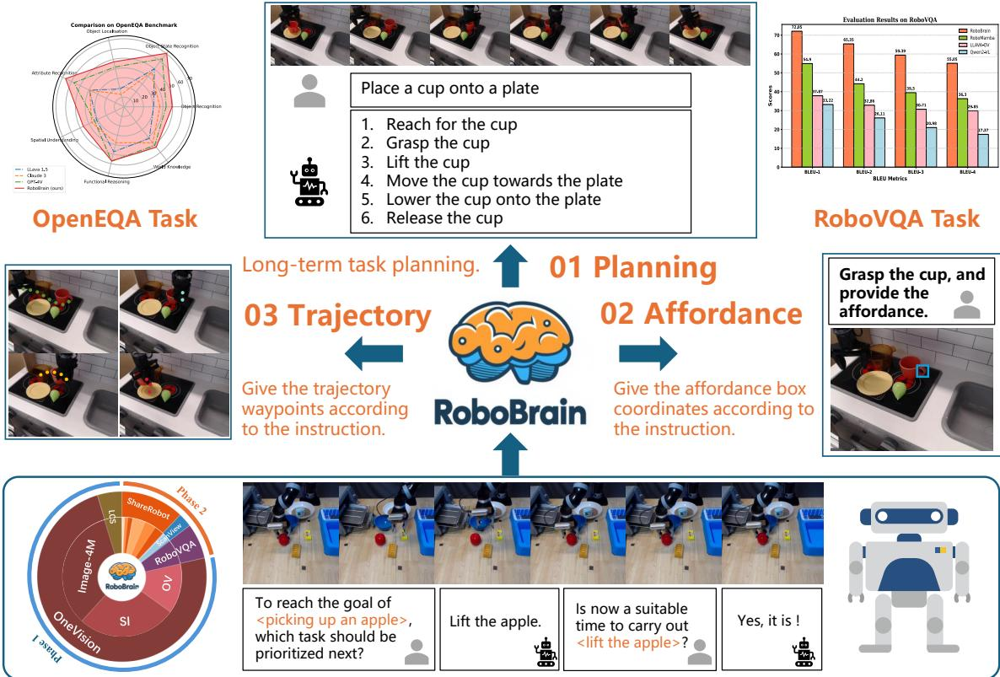

# Abstract

> 来源: RoboBrain: A Unified Brain Model for Robotic Manipulation from Abstract to Concrete (CVPR 2025)

---

## 📄 原文

Recent advancements in Multimodal Large Language Models (MLLMs) have shown remarkable capabilities across various multimodal contexts. However, their application in robotic scenarios, particularly for long-horizon manipulation tasks, reveals significant limitations. These limitations arise from the current MLLMs lacking three essential robotic brain capabilities: **Planning Capability**, which involves decomposing complex manipulation instructions into manageable sub-tasks; **Affordance Perception**, the ability to recognize and interpret the affordances of interactive objects; and **Trajectory Prediction**, the foresight to anticipate the complete manipulation trajectory necessary for successful execution.

> 💡 **问题定义**: 现有 MLLM 用于机器人时缺三个核心能力：
> 1. **Planning** — 把复杂指令拆成子任务（抽象→具体）
> 2. **Affordance** — 识别物体的可操作区域（哪里能抓？）
> 3. **Trajectory** — 预测末端执行器的运动轨迹（怎么动？）
>
> 这三个能力形成了"从抽象到具体"的完整链路：指令 → 子任务 → 抓哪里 → 怎么走

To enhance the robotic brain's core capabilities from abstract to concrete, we introduce **ShareRobot**, a high-quality heterogeneous dataset that labels multi-dimensional information such as task planning, object affordance, and end-effector trajectory. ShareRobot's diversity and accuracy have been meticulously refined by three human annotators. Building on this dataset, we developed **RoboBrain**, an MLLM-based model that combines robotic and general multi-modal data, utilizes a multi-stage training strategy, and incorporates long videos and high-resolution images to improve its robotic manipulation capabilities.

> 💡 **解决方案**: 两个贡献：
> 1. **ShareRobot 数据集** — 标注了 planning + affordance + trajectory 三维信息，102 场景、12 种机器人、107 种原子任务、100 万+ QA pairs
> 2. **RoboBrain 模型** — 基于 LLaVA 架构，多阶段训练（先通用 OV 再机器人微调），支持长视频 + 高分辨率图像

Extensive experiments demonstrate that RoboBrain achieves state-of-the-art performance across various robotic tasks, highlighting its potential to advance robotic brain capabilities.

> 💡 **关键结果**:
> - RoboVQA BLEU-4: **55.05**（第二名 36.3，领先 18.75）
> - OpenEQA: 超越 GPT-4V
> - Affordance AP: **27.1%**（Qwen2-VL 仅 12.5%）
> - Trajectory: DFD 降低 42.9%，HD 降低 94.2%

---


*Figure 1: RoboBrain 概览 — 三大能力（Planning, Affordance, Trajectory）+ 训练数据构成*

> 💡 **Figure 1 批读**:
> ```
> RoboBrain 核心架构:
> ├── Planning: "倒茶" → "拿茶壶" → "移到杯子上方" → "倾倒"
> ├── Affordance: 标注茶壶的可抓区域（bounding box）
> └── Trajectory: 从起点到抓取点的 2D 轨迹
> 
> 训练数据来源:
> ├── ShareRobot (自建): planning QA + affordance + trajectory
> ├── RoboVQA-800K: 长视程机器人 VQA
> ├── ScanView-318K: 3D 场景理解
> └── LLaVA-OneVision 通用数据: 防止灾难性遗忘
> ```

---

## 💡 Section 总结

### 一句话总结
RoboBrain 通过构建 ShareRobot 数据集（标注 planning/affordance/trajectory 三维信息）+ 多阶段训练策略，让 MLLM 具备从抽象指令到具体操作的完整机器人能力。

### 核心卖点
1. **"Abstract to Concrete" 的统一框架** — 不是分别做三个任务，而是一个模型完成 planning → affordance → trajectory 的级联
2. **ShareRobot 数据集** — 目前最大的开源机器人规划数据集（100 万+ QA pairs）
3. **多阶段训练** — Phase 1 通用视觉理解 → Phase 2 机器人专项，避免遗忘

### 与其他工作的关系
- **vs RT-2/RT-H**: 这些只输出动作，不做 affordance 和 trajectory 的显式预测
- **vs PaLM-E**: PaLM-E 侧重 language grounding，不做轨迹预测
- **vs 我们读过的 token pruning 方向**: 完全不同的方向，RoboBrain 关注的是机器人能力增强，不是推理加速
