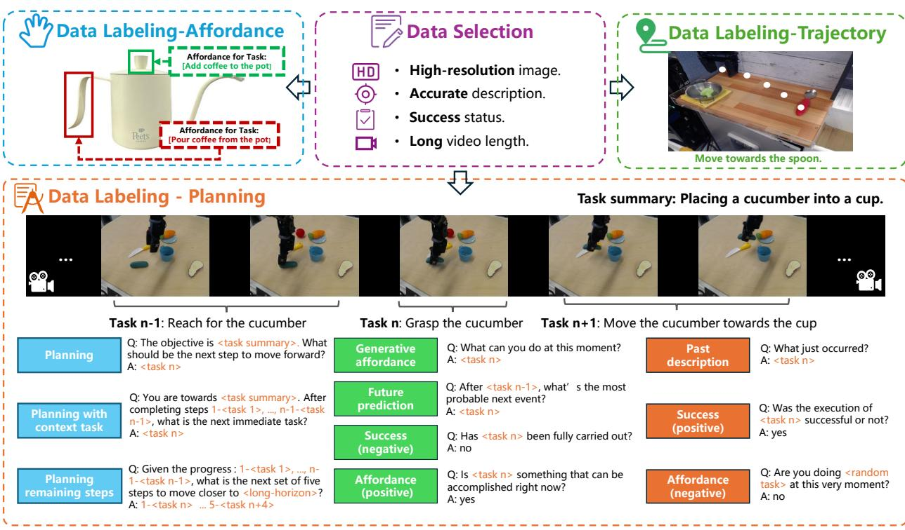

# 02 - Related Work

## 📌 预览
Related Work 分为两个子话题：(1) MLLM 用于机器人操作规划；(2) 操作规划数据集。前者指出现有方法缺乏 affordance 和 trajectory 能力，后者梳理了从早期手-物交互数据集到 Open X-Embodiment 的发展脉络。

---

# 2. Related Work

## 2.1 MLLM for Robotic Manipulation Planning

MLLM for Robotic Manipulation Planning Existing studies mostly utilize MLLMs primarily focus on understanding natural language and visual observation tasks $[ 6 -$

  
Figure 2. The generation procession of our ShareRobot dataset. Our dataset labels multi-dimensional information, including task planning, object affordance, and end-effector trajectories. The task planning is first annotated by atomic tasks and then augmented by constructing question-answer pairs. The affordance and trajectory are labeled on the images according to the specific instructions.

> 💡 **Figure 2 解读**: ShareRobot 数据生成流程图。三条并行标注流水线：
> - **Task Planning**: 先标注原子任务（atomic tasks），再通过模板构造 QA 对 → 实现数据放大（51K instances → 1M QA pairs）
> - **Affordance**: 在图像上标注物体可交互区域（bounding box）
> - **Trajectory**: 在图像上标注末端执行器运动轨迹（至少 3 个坐标点）
> 
> 注意 Figure 2 虽出现在 Related Work 中（因排版原因），但内容属于 Section 3 的数据集介绍。

8, 37, 43, 96], with fewer addressing the decomposition of high-level task instructions into actionable steps. PaLME [20] generates multimodal inputs by mapping real-world observations into the language embedding space. RT-H [6] and RoboMamba [50] generate reasoning results along with robot actions obtained from an additional policy head. However, while these models generate planning texts and actions, they still lack adequate mechanisms for executing complex atomic tasks, highlighting the need for enhanced affordance perception and trajectory prediction.

> 💡 **现有方法的不足**: PaLM-E 将观测映射到语言空间，RT-H 和 RoboMamba 用额外的 policy head 生成动作。但这些方法只停留在规划文本和动作层面，缺乏 affordance perception 和 trajectory prediction 的机制。这正是 RoboBrain 要填补的 gap。

## 2.2 Datasets for Manipulation Planning

Datasets for Manipulation Planning Early datasets for Manipulation [12, 26, 38, 54, 76] mainly comprise annotated images and videos that highlight fundamental handobject interactions, including grasping and pushing. Recent advancements [19, 27, 73, 77] in robotic manipulation emphasize multi-modal and cross-embodiment datasets for enhanced generalization. Datasets such as RH20T [22], BridgeDataV2 [84], and DROID [35] enhance scene diversity, broadening the range of manipulation scenarios. Notably, RT-X [67] compiles data from 60 datasets across 22 embodiments into the Open X-Embodiment (OXE) repository. In this work, we extract high-quality data from OXE, decompose high-level descriptions into low-level planning instructions, and adapt these into a question-answer format to enhance model training.

> 💡 **数据集发展脉络**:
> - **早期**: 手-物交互标注（DexYCB、HO3D 等）→ 基础抓取/推动
> - **近期**: 多模态跨具身数据集（RH20T、BridgeDataV2、DROID）→ 场景多样性
> - **集大成**: RT-X / Open X-Embodiment → 60 个数据集、22 种具身形态
> - **本文**: 从 OXE 中筛选高质量数据，分解为低层规划指令 + QA 格式
> 
> ShareRobot 的定位是在 OXE 基础上做精细化标注（planning + affordance + trajectory），而非从头采集。

---

## 🔖 Section 总结
Related Work 精炼地梳理了两条线：(1) MLLM 用于机器人操作 — 现有方法停留在 planning text 层面，缺乏 affordance 和 trajectory；(2) 操作数据集 — 从早期手-物交互到 OXE 的演进。RoboBrain 的定位是在 OXE 高质量子集上构建多维度标注，填补现有 MLLM 在具体执行能力上的空白。
