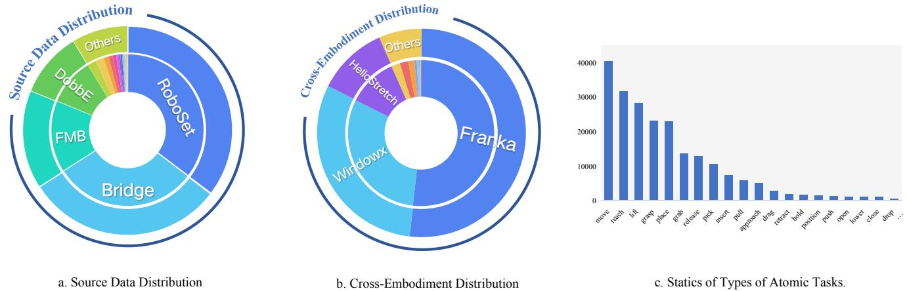

# 03 - ShareRobot Dataset

## 📌 预览
Section 3 详细介绍 ShareRobot 数据集的构建过程，包括概述、数据筛选、数据标注和统计信息。ShareRobot 从 OXE 中筛选 51,403 个实例，最终生成 1,027,990 个 QA 对用于 planning，以及 6,522 张 affordance 标注图像和 6,870 张 trajectory 标注图像。

---

# 3. ShareRobot Dataset

To enhance the RoboBrain's capability of planning, affordance perception, and trajectory prediction, we develop a dataset called ShareRobot–a large-scale, fine-grained dataset specifically designed for robotic manipulation tasks. The generation procession of our dataset is shown as Fig. 2. The details are described in the following sections.

## 3.1. Overview

### 预览
概述 ShareRobot 的六大特点：细粒度、多维度、高质量、大规模、多样性、易扩展。

---

ShareRobot is a comprehensive dataset, facilitates more efficient task execution by transforming abstract concepts into concrete actions. The main features of the ShareRobot dataset include:

• Fine-grained Unlike the Open X-Embodiment dataset [66], which provides generalized high-level task descriptions, each data point in ShareRobot includes detailed low-level planning instructions linked to individual frames. This specificity enhances the model's accuracy in executing tasks at the right moment. • Multi-dimensional To enhance RoboBrain's capabilities from abstract to concrete, we label task planning, object affordances, and end-effector trajectories, allowing for greater flexibility and precision in task processing. • High quality We establish rigorous criteria for selecting data from the Open-X-Embodiment dataset [66], focusing on high resolution, accurate descriptions, successful task execution, visible affordance, and clear motion trajectories. Based on these criteria, we validate 51,403 instances to ensure high quality, forming the foundation for RoboBrain's core capabilities.

> 💡 **数据集核心特点（上）**:
> - **Fine-grained**: 相比 OXE 的高层描述，ShareRobot 为每帧提供低层规划指令 — 这是实现精确任务执行的关键
> - **Multi-dimensional**: 同时标注 planning + affordance + trajectory 三个维度
> - **High quality**: 从 OXE 严格筛选 51,403 个实例，强调分辨率、描述准确性、任务成功状态等

  
Figure 3. The diversity of our ShareRobot dataset. Our dataset involves (a) 23 original datasets, (b) 12 embodiments and (c) 107 types of atomic tasks. The distribution of the top 20 most frequent atomic actions within our ShareRobot dataset is presented in (c).

> 💡 **Figure 3 解读**: ShareRobot 的多样性统计：
> - (a) 来源于 23 个原始数据集（从 OXE 中筛选）
> - (b) 覆盖 12 种不同机器人具身形态
> - (c) 包含 107 种原子任务类型，最频繁的是 pick、move、reach、lift、place
> 
> 数据分布合理，高频任务与真实机器人操作场景一致。

• Large scale With 1,027,990 question-answer pairs, ShareRobot is the largest open-source dataset for task planning, affordance perception, and trajectory prediction, enabling deeper understanding of complex relationships from abstract to concrete.

• Rich diversity In contrast to the RoboVQA [73] dataset's limited scenes, ShareRobot features 102 scenes across 12 embodiments and 107 types of atomic tasks, as shown in Fig. 3. This diversity allows MLLMs to learn from varied real-world contexts, enhancing robustness in complex, multi-step planning.

• Easy scalability Our data generation pipeline is designed for high scalability, facilitating expansion as new robotic embodiments, task types, and environments develop. This adaptability ensures the ShareRobot dataset can support increasingly complex manipulation tasks.

> 💡 **数据集核心特点（下）**:
> - **Large scale**: 超 100 万 QA 对，是同类最大的开源数据集
> - **Rich diversity**: 102 场景 × 12 具身形态 × 107 原子任务，远超 RoboVQA 的场景多样性
> - **Easy scalability**: 流水线式数据生成，便于随新具身/任务/环境扩展

### 小结
ShareRobot 定位为 "最大规模、最细粒度、最多维度" 的机器人操作数据集，从 OXE 精选高质量数据后进行多维度标注。

---

## 3.2. Data Selection

### 预览
详述从 OXE 中筛选 51,403 个实例的六条筛选准则。

---

Based on the Open X-embodiment dataset [66], we carefully selected 51,403 instances, mainly focusing on image quality, description accuracy and success status. Our data collection process adheres to the following principles:

• High-resolution image We eliminate videos lacking images or those with low resolution. Any video with a resolution below 128 pixels is removed. • Accurate description Videos without descriptions or with vague descriptions are filtered out to avoid affecting the planning capability of the model. • Success status We discard videos of failed tasks, as unsuccessful demonstrations hinder the model's learning.

• Long video length Videos with fewer than 30 frames are excluded, as they contain limited atomic tasks. • Object not covered We remove any videos where the target object or end-effector is covered by other objects, as our model has to accurately identify the positions of endeffectors and the object's affordance. • Clear Trajectories We exclude the demonstrations with unclear or incomplete trajectories, as trajectory prediction is one of our RoboBrain's capabilities.

> 💡 **筛选标准解析**: 六条准则反映了三大能力的数据需求：
> - 分辨率 ≥ 128px、长度 ≥ 30 帧 → **基础质量保证**
> - 描述准确 + 任务成功 → **Planning 数据质量**
> - 物体未被遮挡 → **Affordance 标注可行性**
> - 轨迹清晰完整 → **Trajectory 标注可行性**
> 
> 128px 的分辨率门槛相当低，说明 OXE 中有大量极低质量数据。30 帧门槛确保每个视频包含足够多的原子任务。

### 小结
筛选过程严格但合理，从 OXE 海量数据中筛出 51K 高质量实例，为后续三维度标注奠定基础。

---

## 3.3. Data Labeling

### 预览
三种标注方式：Planning 用 Gemini 生成 + 人工审核，Affordance 用 bounding box 标注，Trajectory 用至少 3 个坐标点标注。

---

Planning Labeling We extract 30 frames from each robotic operation demonstration and use these frames along with their high-level descriptions to decompose them into lowlevel planning instructions using Gemini [78]. Three annotators then review and refine these instructions to ensure the precision of labeling. Subsequently, we design 5 different templates for each of the 10 question types in RoboVQA [73]. In the process of data generation, we randomly select 2 templates of each question type to generate question-answer pairs for every instance. This process transforms 51,403 instances into 1,027,990 questionanswer pairs, with annotators monitoring data generation to maintain the dataset's integrity.

> 💡 **Planning 标注流程**:
> 1. 每个 demo 抽取 30 帧 → 用 Gemini 分解为低层规划指令
> 2. 3 名标注员审核和修正
> 3. 10 种问题类型 × 5 模板 → 每个 instance 随机选 2 模板/类型 → 生成 QA 对
> 4. 51,403 instances × ~20 QA/instance ≈ 1,027,990 QA pairs
> 
> 巧妙之处在于用 Gemini 做初始标注 + 人工精修的半自动化方案，大幅降低标注成本。模板化 QA 生成则实现了数据放大。

Affordance Labeling We filter 6,522 images and annotate each with affordance areas as $\{ l ^ { ( x ) } , l ^ { ( y ) } , \bar { r } ^ { ( x ) } , r ^ { ( y ) } \}$ according to its high-level description, where $\{ l ^ { ( x ) } , l ^ { ( y ) } \}$ are the top left coordinates and $\{ r ^ { ( x ) } , r ^ { ( y ) } \}$ are the bottom right corner coordinates. Subsequently, we conduct a rigorous manual review and refinement of each instruction to ensure its precise alignment with the associated affordance areas.

> 💡 **Affordance 标注**: 6,522 张图像，用 bounding box 格式 $(l^{(x)}, l^{(y)}, r^{(x)}, r^{(y)})$ 标注可交互区域。全量人工审核确保标注与指令的对齐精度。数据量相对较小（约为 planning 数据的 1/8），说明 affordance 标注成本更高。

Trajectory Labeling We filter 6,870 images and annotate each with the gripper's trajectory using at least three $\{ x , y \}$ coordinates according to its low-level instruction. Subsequently, we conduct a rigorous manual review and refinement of each instruction to ensure its precise alignment

> 💡 **Trajectory 标注**: 6,870 张图像，每张至少 3 个 2D 坐标点描述末端执行器轨迹。注意这里是 2D visual trace（而非 3D 空间轨迹），遵循 RT-Trajectory 的定义。

with the associated trajectory.

### 小结
三种标注方式反映了不同的成本-规模权衡：Planning 通过 Gemini + 模板实现百万级 QA 放大；Affordance 和 Trajectory 依赖人工标注，规模约 6-7K。

---

## 3.4. Data Statistics

### 预览
最终数据统计：23 个来源数据集、102 场景、12 具身形态、132 种原子动作，以及 train/test 划分。

---

We select 23 original datasets from the Open Xembodiment dataset [66]. The distribution of the source data is shown in the Fig. 3. The data involves 102 various scenes (e.g. bedroom, laboratory, kitchen, office), and covers 12 different robot bodies. According to statistics, there are 132 types of atomic actions in this dataset, tasks with higher word frequency are shown in Fig. 3 (c). The 5 most frequent atomic tasks are "pick", "move", "reach", "lift", and "place", which are frequent task types in real robotic operation scenarios. This suggests that the distribution of our dataset is reasonable. Finally, we get 1,027,990 question-answer (QA) pairs for planning. For the planning QA pairs dataset, we split 1 million QA pairs as the training set and 2,050 QA pairs as the test set. For the affordance dataset, we split 6,000 images as the training set and 522 images as the test set. For the trajectory dataset, we split 6000 images for training and 870 images for testing.

> 💡 **数据划分统计**:
> | 数据类型 | 训练集 | 测试集 | 总量 |
> |---------|--------|--------|------|
> | Planning QA | 1,000,000 | 2,050 | 1,027,990 |
> | Affordance | 6,000 | 522 | 6,522 |
> | Trajectory | 6,000 | 870 | 6,870 |
> 
> Planning 数据量远超 affordance/trajectory，但后两者的标注更精细（像素级）。测试集比例较小（~0.2% / ~8% / ~13%），planning 测试集尤其小。
> 
> 注意文中提到 132 种原子动作（vs. 概述中的 107 种），可能是统计口径略有差异。

### 小结
ShareRobot 覆盖了多样的场景、具身形态和任务类型，数据分布与真实操作场景一致。百万级 QA 对为 planning 能力提供了充足训练数据。

---

## 🔖 Section 总结
ShareRobot 数据集是本文的核心贡献之一。其构建采用 "从 OXE 筛选 → 多维度标注 → QA 模板放大" 的流水线：
- **规模**: 51K 实例 → 1M QA pairs（planning）+ 6.5K affordance + 6.9K trajectory
- **质量保证**: 6 条筛选准则 + Gemini 辅助标注 + 3 人审核
- **设计亮点**: 半自动化标注降低成本，模板化 QA 生成实现数据放大
- **局限**: Affordance 和 trajectory 数据量较小（各约 6-7K），可能限制模型在这两个任务上的泛化能力
