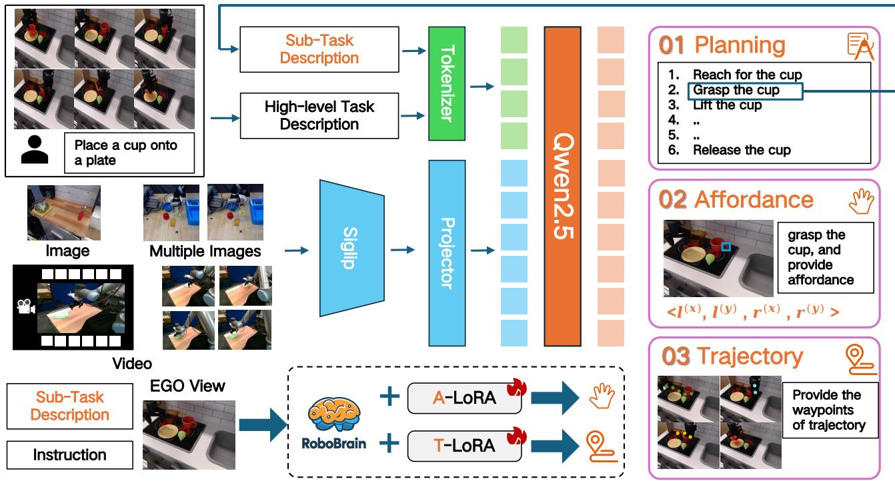
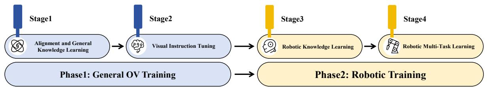
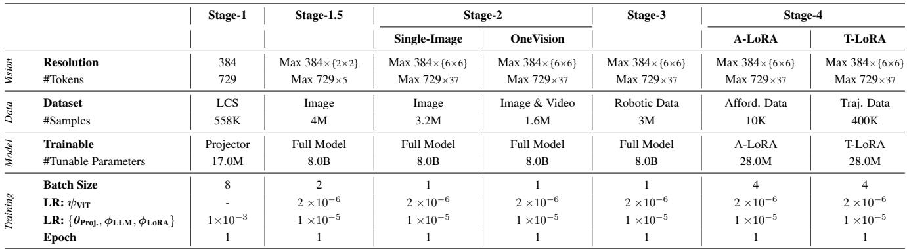

# 04 - RoboBrain Model

## 📌 预览
Section 4 介绍 RoboBrain 的模型架构和训练策略。架构基于 LLaVA，包括基础模型（SigLIP + MLP + Qwen2.5-7B）用于 planning，A-LoRA 用于 affordance，T-LoRA 用于 trajectory。训练分两个 Phase（通用 OV 训练 + 机器人训练），共 4 个 Stage。

---

# 4. RoboBrain Model

In this section, we provide an overview of RoboBrain. Our goal is to enable the Multi-modal Large Language Model (MLLM) to understand abstract instructions and explicitly output object affordance regions and potential operational trajectories, facilitating a transition from abstract to concrete. We employ a multi-stage training strategy: Phase 1 focuses on general OneVision (OV) training to develop a foundational MLLM with strong understanding and instruction-following abilities. Phase 2, the robotic training phase, aims to empower the core capabilities of RoboBrain from abstract to concrete.

> 💡 **整体设计思路**: 两阶段训练——先通用后专用。Phase 1 借鉴 LLaVA-OneVision 的训练策略构建通用多模态基座，Phase 2 在此基础上注入机器人能力。这种 "先通用再专精" 的范式在 VLM/VLA 领域已成为标准做法。

## 4.1. Model Architecture

### 预览
三个模块：基础 Planning 模型（LLaVA 架构）、A-LoRA（affordance）、T-LoRA（trajectory）。

---

RoboBrain consists of three modules: the foundational model for planning, the A-LoRA model for affordance perception, and the T-LoRA model for trajectory prediction. In practical applications, the model first generates detailed plans, and then splits it into sub-task descriptions to execute affordance perception and trajectory prediction. The pipeline of our RoboBrain is shown to Fig. 4.

  
Figure 4. The pipeline of our RoboBrain. The images, multiple images, and videos are sent into our model to pre-train a foundation robotic brain. Besides, we fine-tune the RoboBrain via A-LoRA and T-LoRA to develop affordance and trajectory skills. In practical applications, the model first generates detailed plans, and then splits it into sub-task descriptions to execute specific robotic tasks.

> 💡 **Figure 4 解读**: RoboBrain 的完整流水线：
> - **输入**: 图像/多图/视频 → SigLIP 编码 → MLP 投影 → Qwen2.5-7B 生成
> - **输出分支**: Planning（基础模型直接输出）、Affordance（A-LoRA 分支）、Trajectory（T-LoRA 分支）
> - **推理流程**: 先生成 plan → 拆分子任务 → 对每个子任务执行 affordance/trajectory 预测
> 
> 关键设计：affordance 和 trajectory 用独立 LoRA 模块，而非共享全部参数。这样避免了任务间的干扰，同时大幅降低 fine-tuning 成本（28M vs 8B 参数）。

**Foundational Model for Planning** We utilize LLaVA as the foundational model for RoboBrain, which consists of three main modules: the Vision Encoder (ViT) $g ( \cdot )$ , the Projectior $h ( \cdot )$ , and the Large Language Model (LLM) $f ( \cdot )$ . Specifically, we employ SigLIP [92], a 2-layer MLP [47], and Qwen2.5-7B-Instruct [80]. Given an image or video $X _ { v }$ as visual input, ViT encodes it into visual features $Z _ { v } = g ( X _ { v } )$ , which are then mapped to the semantic space of the LLM through Projector, resulting in a sequence of visual tokens $H _ { v } = h ( Z _ { v } )$ . Finally, the LLM generates a textual response in an autoregressive manner based on the human language instruction $X _ { t }$ and $H _ { v }$ .

> 💡 **基础模型组件**:
> - **Vision Encoder**: SigLIP (siglip-so400m-patch14-384)，27 层，14×14 patch → 729 tokens/image
> - **Projector**: 2 层 MLP（17M 参数），将视觉 token 映射到 LLM 语义空间
> - **LLM**: Qwen2.5-7B-Instruct，28 层，支持 128K token 上下文
> 
> 这就是标准的 LLaVA 架构。选择 Qwen2.5 而非 LLaMA 是因为其更强的多语言能力和长上下文支持。

Table 1. Detailed configuration for each training stage of the RoboBrain.   

> 💡 **Table 1 解读**: 训练配置一览：
> - **Stage 1**: 仅训练 Projector（17M），384 分辨率，LCS-558K 数据
> - **Stage 1.5**: 全模型训练（8B），最大 384×4 分辨率，4M 图文数据
> - **Stage 2**: 全模型，384×36 分辨率，3.2M 单图 + 1.6M 图视频
> - **Stage 3**: 全模型，机器人数据 3M（含 ShareRobot-200K）
> - **Stage 4**: 仅 LoRA（28M），分别训练 A-LoRA 和 T-LoRA
> 
> 关键发现：Stage 1-2 是标准 LLaVA-OV 训练，Stage 3-4 是本文新增的机器人训练阶段。LoRA rank=64，仅占全模型参数的 0.35%。

**A-LoRA Module for Affordance Perception** The term affordance in our work refers to the area where the human hand makes contact with objects. During interactions, humans instinctively engage with various objects within specific regions. We utilize bounding boxes to represent affordances. Formally, consider an image $I$ consisting of multiple objects with their affordances: $O _ { i } = \{ A _ { i } ^ { 0 } , A _ { i } ^ { 1 } , . . . , A _ { i } ^ { N } \}$ where the ith object owns $N$ affordances. The format of affordance is defined as $\{ l ^ { ( x ) } , l ^ { ( y ) } , r ^ { ( x ) } , r ^ { ( y ) } \}$ , and $\{ l ^ { ( x ) } , l ^ { ( y ) } \}$ represents the top left corner coordinates of affordance, while $\{ r ^ { ( x ) } , r ^ { ( y ) } \}$ is the bottom right corner coordinates.

> 💡 **Affordance 定义**: 这里的 affordance 简化为 2D bounding box，不同于 Gibson 原始定义中的功能可能性。每个物体可有多个 affordance 区域（如茶壶的把手和壶盖）。用 bbox 而非 segmentation mask 降低了标注和预测的复杂度。

**T-LoRA Module for Trajectory Prediction** The term trajectory in our work refers to the concept of $2 D$ visual traces, as presented in [25]. We define trajectory waypoints as a series of 2D coordinates representing the movement of the end-effector or hand throughout the process. Formally, at time step $t$ , the trajectory waypoints can be represented as $P _ { t : N } = \{ ( x _ { i } , y _ { i } ) \mid i = t , t + 1 , \ldots , N \}$ , where $( x _ { i } , y _ { i } )$ denotes the $i$ -th coordinate in the visual trace, and $N$ represents the total number of time steps in the episode.

> 💡 **Trajectory 定义**: 采用 RT-Trajectory 的 2D visual trace 定义，而非 3D 空间轨迹。坐标归一化到 [0, 1000)（参考 Qwen2-VL）。2D 轨迹的优势是可以直接从图像观察中标注和预测，无需 3D 重建。但局限是缺乏深度信息，需要额外机制转换为 3D 执行轨迹。

### 小结
模型架构是标准 LLaVA + 双 LoRA 分支的设计。核心创新不在架构本身，而在于将 planning、affordance、trajectory 三种能力统一到一个模型框架中，通过 LoRA 实现任务专精化。

---

## 4.2. Training

### 预览
Phase 1（Stage 1-2）：通用 OV 训练，照搬 LLaVA-OneVision。Phase 2（Stage 3-4）：机器人专用训练，Stage 3 全模型训练混合机器人+通用数据，Stage 4 用 LoRA 训练 affordance/trajectory。

---

**Phase 1: General OV Training** In Phase 1, we drew on the state-of-the-art training data and strategies from LLaVAOneVision [41] to construct a foundational model with general multi-modal understanding and visual instruction following capabilities. This lays the groundwork for enhancing the model's robotic manipulation planning abilities in

Phase 2. Detailed information is provided in Tab. 1.

In Stage 1, we utilize the image-text data from the LCS558K dataset [11, 72] to train Projector, facilitating the alignment of visual features $Z _ { v }$ with the LLM semantic features $H _ { v }$ . In Stage 1.5, we train the entire model using 4M high-quality image-text data to enhance the model's multimodal general knowledge understanding capabilities. In Stage 2, we further train the entire model with 3.2M singleimage data and 1.6M image and video data from LLaVAOneVision-Data [41], aiming to enhance the instructionfollowing abilities of RoboBrain and improve understanding of high-resolution image and video.

> 💡 **Phase 1 详解**:
> - **Stage 1**: Projector 对齐（558K），只训练 17M 参数 → 视觉-语言对齐
> - **Stage 1.5**: 全模型预训练（4M），增强多模态通用知识
> - **Stage 2**: 指令微调（4.8M），引入高分辨率图像和视频理解
> 
> 完全复用 LLaVA-OneVision 的训练方案，这是一个务实的选择 — 站在巨人的肩膀上，专注于机器人能力的增量创新。

**Phase 2: Robotic Training** In Phase 2, we build upon the robust multi-modal foundational model developed in Phase 1 to create a more powerful model for robotic manipulation planning. Specifically, we aim for RoboBrain to understand complex, abstract instructions, support the perception of historical frame information and high-resolution images, and output object affordance regions while predicting potential manipulation trajectories. This will facilitate the transition from abstract to concrete in manipulation planning tasks. Detailed information is provided in Tab. 1.

In Stage 3, we collected a dataset of 1.3M robotic data to improve the model's manipulation planning capabilities. Specifically, this data is sourced from RoboVQA800K [73], ScanView-318K including MMScan-224K [30, 59], 3RScan-43K [30, 83], ScanQA-25K [4, 30], SQA3d26K [30, 60], and a subset of ShareRobot-200K introduced in this paper. These datasets contain substantial scenescanning image data, long video data, and high-resolution data to support the model's ability to perceive diverse environments. Additionally, the fine-grained, high-quality planning data in the ShareRobot dataset enhances the manipulation planning capabilities of RoboBrain. To mitigate the issue of catastrophic forgetting [93], we selected a highquality subset of approximately 1.7M image-text data from Phase 1 to mix with the robotic data collected in Stage 3 for training, tuning the entire model accordingly. In Stage 4, we enhanced the model's ability to perceive object affordances and predict manipulation trajectories from instructions, utilizing affordance and trajectory data from the ShareRobot dataset and other open-source sources [58, 65]. This was achieved by incorporating LoRA modules during training for concrete manipulation capabilities.

> 💡 **Phase 2 详解**:
> - **Stage 3** 数据组成（共 3M）：
>   - RoboVQA 800K（长序操作 VQA）
>   - ScanView 318K（3D 场景理解）
>   - ShareRobot 200K（本文数据）
>   - 通用数据 1.7M（防遗忘）
>   - 机器人:通用 ≈ 4:6
> - **Stage 4**: A-LoRA + T-LoRA 分别训练
>   - Affordance: ShareRobot + AGD20K [58]
>   - Trajectory: ShareRobot + LLaRVA [65]
>   - 仅训练 28M LoRA 参数，冻结其余
> 
> **关键设计决策**:
> 1. 混合 1.7M 通用数据防止灾难性遗忘 — 实验证明 4:6 比例最优
> 2. Affordance/Trajectory 用独立 LoRA 而非继续全模型训练 — 数据量小（各 ~10K），全模型训练会过拟合
> 3. Stage 4 的两个 LoRA 是独立训练的，推理时按需加载

### 小结
训练策略的核心创新在于 Stage 3-4：Stage 3 用大规模混合数据训练 planning 能力，Stage 4 用小规模精标注数据通过 LoRA 训练 affordance/trajectory 能力。数据配比和防遗忘策略是保持通用能力的关键。

---

## 🔖 Section 总结
RoboBrain 的技术方案可总结为 "LLaVA-OV 基座 + 机器人专用训练 + 双 LoRA 分支"：
- **架构**: 标准 LLaVA（SigLIP + MLP + Qwen2.5-7B）+ A-LoRA + T-LoRA
- **训练**: 4-Stage 渐进式训练，Phase 1 复用 LLaVA-OV，Phase 2 新增机器人能力
- **设计亮点**: 独立 LoRA 避免任务干扰、混合数据防遗忘、分阶段渐进训练
- **局限**: affordance 和 trajectory 仍是 2D 表示（bbox + 2D waypoints），转换为 3D 执行动作需要额外步骤
