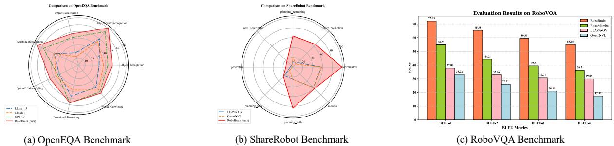
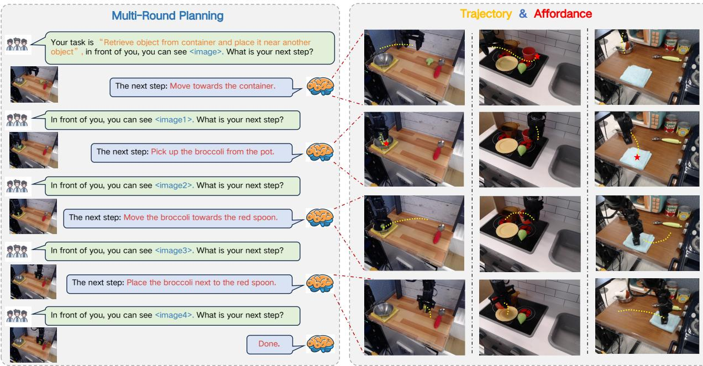

# 5. Experiment

> 来源: RoboBrain (CVPR 2025)

---

## 📄 原文

> 💡 **Section 概览**: 三个维度的评测：Planning (RoboVQA/OpenEQA/ShareRobot), Affordance (AP), Trajectory (DFD/HD/RMSE)。

---

### 5.1 Implementation Details

- 分布式训练: DeepSpeed Zero3
- 硬件: 8×A800 GPU 集群
- 各阶段超参见 Table 1

---

### 5.2 Evaluation Metrics

> 💡 **评测体系**:
> ```
> Planning:
> ├── RoboVQA → BLEU-1~4 (跟 RoboMamba 一致)
> ├── OpenEQA → GPT-4o 评分 (LLM-as-Judge)
> └── ShareRobot → GPT-4o 评分
> 
> Affordance:
> └── AP (Average Precision, 多 IoU 阈值)
> 
> Trajectory:
> ├── DFD (Discrete Fréchet Distance) ← 形状+时序对齐
> ├── HD (Hausdorff Distance) ← 最大偏差
> └── RMSE ← 平均逐点误差
> ```

---

### 5.3 Evaluation on Robot Brain Task

**Planning Results**:


*Figure 5: RoboBrain 在 OpenEQA、ShareRobot、RoboVQA 上的表现*

> 💡 **Figure 5 批读**:
> ```
> Planning 排行:
> ├── RoboVQA (BLEU-4):
> │   ├── RoboBrain: 55.05 ⭐
> │   ├── RoboMamba: 36.30
> │   └── GPT-4V: 23.94
> │
> ├── OpenEQA:
> │   └── RoboBrain > GPT-4V > LLaVA-OV
> │
> └── ShareRobot:
>     └── RoboBrain 大幅领先（这是自家测试集，参考意义有限）
> ```
> **关键发现**: RoboVQA BLEU-4 领先第二名 18.75 分，这是个很大的提升。
> 但注意 ShareRobot 测试集的结果参考价值较低（模型是在 ShareRobot 训练集上训练的）。

**Affordance Results**:

**Table 2: Affordance 预测对比**

| Model | AP↑ |
|-------|-----|
| LLaVA-NeXT-7B | 9.8% |
| Qwen2-VL-7B | 12.5% |
| **RoboBrain** | **27.1%** (+14.6↑) |

> 💡 **Table 2 批读**:
> - RoboBrain AP 27.1%，是 Qwen2-VL 的 2 倍多
> - 但绝对数值仍然不高（27.1%），说明 affordance 预测还是个很难的任务
> - 对比不够公平：RoboBrain 用了专门的 A-LoRA 在 affordance 数据上微调，其他模型是 zero-shot

**Trajectory Results**:

**Table 3: 轨迹预测消融**

| Method | DFD ↓ | HD ↓ | RMSE ↓ |
|--------|-------|------|--------|
| Base | 0.191 | 0.171 | 0.133 |
| + Start_Points | 0.176 | 0.157 | 0.117 |
| + Max_Points | 0.185 | 0.163 | 0.125 |
| + Spec_Token | **0.109** (↓42.9%) | **0.010** (↓94.2%) | **0.091** (↓31.6%) |

> 💡 **Table 3 批读**:
> ```
> 消融实验:
> ├── Base: 基础 T-LoRA
> ├── + Start Points: 告诉模型起始坐标 → 修正平移偏差
> ├── + Max Points: 限制 waypoints ≤ 10 → 避免过长序列
> └── + Spec Token: 加特殊标记强调起点/终点 → HD 降 94.2%! 
> 
> 最有效的改进: Spec Token（特殊标记）
> ```
> **HD 从 0.171 降到 0.010 (↓94.2%)** 这个数字很惊人。说明添加 start/end 坐标和特殊标记
> 极大地帮助了模型理解轨迹的起止位置。

---

### 5.4 Visualization


*Figure 6: RoboBrain 可视化 — 多轮交互：理解指令 → 生成计划 → 预测轨迹 → 识别 affordance*

> 💡 **Figure 6 批读**:
> 展示了 RoboBrain 的级联能力：
> 1. 给定指令 + 图片 → 输出多步 plan
> 2. 每一步 → 预测 trajectory（绿色曲线）
> 3. 每一步 → 标注 affordance（红色 bbox）
>
> 这个可视化很好地展示了 "abstract to concrete" 的理念。

---

## 💡 Section 总结

### 关键数字速查
| Benchmark | Metric | RoboBrain | 第二名 | 提升 |
|-----------|--------|-----------|--------|------|
| RoboVQA | BLEU-4 | 55.05 | 36.30 (RoboMamba) | +18.75 |
| OpenEQA | LLM-Score | 55.83 avg | ~49.8 (GPT-4V) | +6 |
| Affordance | AP | 27.1% | 12.5% (Qwen2-VL) | +14.6 |
| Trajectory | HD | 0.010 | 0.171 (base) | -94.2% |

### 核心洞察
1. **Planning 大幅领先** — RoboVQA 上领先 18.75 BLEU-4，得益于 ShareRobot 的高质量数据
2. **Affordance 绝对值不高** — 27.1% AP 说明还有很大提升空间
3. **Trajectory 的 Spec Token 是关键** — 简单的工程手段（加特殊标记）带来巨大改进
4. **通用 benchmark 不掉分** — 在 MME、MMMU 等通用 benchmark 上和 LLaVA-OV 持平（Table 5, Appendix）
