# Chapter-Llama: Efficient Chaptering in Hour-Long Videos with LLMs

Lucas Ventura1,2 Antoine Yang3 Cordelia Schmid2 Gul Varol ¨ 1

1LIGM, Ecole des Ponts, IP Paris, Univ Gustave Eiffel, CNRS ´ 2Inria, Ecole normale sup ´ erieure, CNRS, PSL Research University ´ 3Google DeepMind https://imagine.enpc.fr/˜lucas.ventura/chapter-llama/

# Abstract

We address the task of video chaptering, i.e., partitioning a long video timeline into semantic units and generating corresponding chapter titles. While relatively underexplored, automatic chaptering has the potential to enable efficient navigation and content retrieval in long-form videos. In this paper, we achieve strong chaptering performance on hour-long videos by efficiently addressing the problem in the text domain with our ‘Chapter-Llama’ framework. Specifically, we leverage a pretrained large language model (LLM) with large context window, and feed as input (i) speech transcripts and (ii) captions describing video frames, along with their respective timestamps. Given the inefficiency of exhaustively captioning all frames, we propose a lightweight speech-guided frame selection strategy based on speech transcript content, and experimentally demonstrate remarkable advantages. We train the LLM to output timestamps for the chapter boundaries, as well as free-form chapter titles. This simple yet powerful approach scales to processing one-hour long videos in a single forward pass. Our results demonstrate substantial improvements (e.g., 45.3 vs 26.7 F1 score) over the state of the art on the recent VidChapters-7M benchmark. To promote further research, we release our code and models at our project page.

# 1. Introduction

According to a study by [47], the video durations uploaded to the popular online video sharing platform YouTube have increased steadily over the years. Videos have become longer since the first video upload in 2005 [20, 48]. In 2020, $2 5 \%$ of videos were estimated to be longer than 15 minutes, $5 \%$ more than 3 hours [47]. Long-form videos such as news, sports, educational, and vlog streams can often span extensive durations and cover multiple topics [100]. Finding specific content within increased video duration and volume makes efficient content navigation more important than ever.

However, much of the traditional video analysis research has focused on processing short videos of a few seconds [4, 16, 35, 57, 65, 70, 77, 81, 88, 90, 101, 113]. At the same time, the definition of long videos has changed within the past decade. Early works claimed processing 100 frames (i.e., a few seconds) to be long [63, 96] as opposed to ingesting up to 16 frames [86, 95]. With the introduction of datasets containing 1-5 minute videos [30, 38, 45, 58, 85, 129], several minutes were considered very long. Studying hour-long videos has only recently seen an interest in the context of movie description [32], video captioning [41], or grounding [33, 87]. Very recently, the work of [112] collected the VidChapters-7M dataset with videos spanning from minutes to hours, along with their userdefined video chapters, and proposed the video chapter generation task, automatically dividing a video into thematic sections (i.e., chapters) with descriptive concise chapter titles. Video chaptering, if achieved successfully, can offer a compelling solution to long content indexing, bypassing the current need for time-consuming manual annotation by video owners [112].

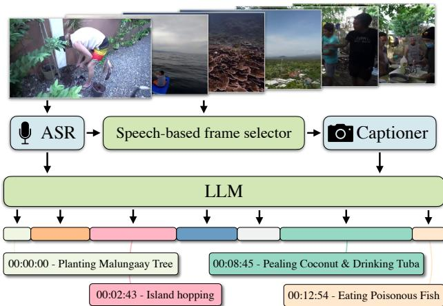  
Figure 1. Chapter-Llama: Our method generates automatic video chapters for hour-long videos by training a large language model (LLM) to predict chapter boundaries and titles. The LLM processes transcribed speech (ASR) and descriptive captions of key frames, which are sampled based on ASR content. This text-based approach, equipped with speech-based frame selection, enables efficient processing of long-form content.

In this paper, we address the challenge of automatic video chaptering with a simple yet effective framework designed to handle hour-long videos. Existing work for chaptering [112] relies on a dense video captioning model Vid2Seq [113], which combines multimodal inputs from video frames and ASR-based speech transcriptions. However, Vid2Seq operates on a fixed number of equally sampled frames (i.e., 100 frames), potentially missing important visual information. Furthermore, their approach based on transformer architecture uses video frame features directly, which requires learning a mapping from the visual modality to the textual modality. In contrast, our method is designed to address these limitations by (i) dynamically sampling keyframes from the video based on the speech content, and (ii) designing a purely text-based model leveraging image captioning to convert RGB frames into text.

Our approach leverages a pretrained LLM, which we finetune specifically for the video chaptering task to predict jointly the chapter boundary timestamps and chapter titles, both in text form. The appeal of our model lies in processing only textual data as input, allowing us effectively leverage the long-context understanding capabilities of the LLM to scale to long videos. In particular, we incorporate speech transcriptions from automatic speech recognition (ASR) and automatic frame captions. Captioning has been used for video understanding as an intermediate representation in recent works, but in the context of retrieval or question answering (QA) for shorter videos (maximum 3 minutes) [60, 98, 119, 124]. In longer videos, since captioning every frame is computationally prohibitive, we employ a speech-based frame selection strategy that scales efficiently while preserving important content. Similar in spirit to [44], we primarily use audio to determine keyframes, specifically bootstrapping with an LLM trained only with the speech inputs. However, even when transforming a video into text, LLMs have a limited context window, allowing a maximum number of tokens as input in a single forward pass. To mitigate context window limitations for very long video inputs, we simply perform an iterative prediction, sequentially processing the video, where each iteration typically operates on a window length of about an hour duration. We evaluate our approach on ‘short’ $( 0 { - } 1 5 \operatorname * { m i n } )$ , ‘medium’ ( $1 5 { - } 3 0 \mathrm { m i n } )$ , and ‘long’ (30-60 min) videos from the VidChapters-7M dataset [112], demonstrating significant improvements over the state of the art across multiple metrics, including temporal boundary accuracy and semantic relevance of chapter titles. Our experiments show that finetuning the LLM, our speech-based frame selection strategy, and the integration of modalities from both speech and captions are crucial for achieving high-quality video chaptering results.

Our contributions are the following: (i) We introduce Chapter-Llama: our framework leverages a pretrained LLM and finetunes for the underexplored task of video chaptering by transforming the video input into text form through ASR and captioning. (ii) We scale efficiently to hour-long videos by incorporating a speech-based frame sampling strategy, captioning only a subset of the video frames. (iii) Our simple and effective approach outperforms the state of the art on the recent VidChapters-7M benchmark by a large margin (e.g., 45.3 vs 26.7 F1 score). These results are complemented by a comprehensive set of experiments analyzing our components.

# 2. Related Work

We provide an overview of video tasks related to video chaptering, such as temporal segmentation and captioning, along with a discussion on works focusing on long-form and LLM-based video understanding.

Temporal video segmentation. While video chaptering is a new task [112], there is a rich literature on methods focused on temporally segmenting a video in various forms. One task is shot detection [75, 79, 84], where any visual changes (e.g., shifting between two cameras) would require a temporal boundary, not necessarily modeling semantic shifts. Video scene segmentation, often studied on movies [39], is primarily focusing on grouping scenes with similar content [14, 15, 39, 40, 61, 68, 69, 74, 78, 80, 105, 114]. Another line of work considers boundary detection for temporal action segmentation [8, 24, 27, 49, 116], or localization [19, 56, 121, 123]. Unlike chaptering with free-form text, action segmentation assigns a label from a predefined set of categories, and typically defines short atomic actions as the unit. In contrast to these tasks, chapter boundaries can take various different forms depending on the type and the granularity of the video (e.g., each exercise within sports video, each slide within a lecture, each step in instructional video, each topic in a podcast video). Shot, scene, or action boundaries therefore may or may not correspond to complex chapter boundary definitions. Moreover, these tasks are mostly tackled with vision-only inputs [84, 116, 123], without leveraging speech. While text and audio segmentation have also been tackled separately [29, 76], video chaptering is based on both audio and vision inputs [112].

Video captioning. Generating chapter titles [112] is relevant to the task of captioning that seeks to describe the video content with text. There is a large literature on single video captioning [17, 52, 81, 83], often focusing on short video clips. Typical datasets for training such as MSR-VTT [110], WebVid [5], HowTo100M [59], Video-CC [62] include captions of videos spanning a few seconds (5-15sec on average). In generic event boundary captioning [103], event intervals are similarly short, in the order of 2 seconds. On the other hand, video summarization methods operate on longer videos; however, their goal is to reduce the entire video into a single summary description [1, 2, 34, 41, 53, 120, 126, 127], not necessarily with a temporal segmentation component. Dense video captioning [38, 45, 102, 113, 130, 131] is the closest to video chaptering in terms of problem formulation, aiming to both temporally localize and caption different events. Indeed, prior work on video chaptering trains the dense captioning method of Vid2Seq [113] on the VidChapters-7M dataset [112], but relies on a fixed number of equally sampled frames. In this paper, we leverage some of the annotations of this dataset to train an LLM-based chaptering model substantially outperforming previous methods [112, 113].

Long-form video understanding. The definition of long videos has evolved with the release of various datasets spanning seconds [109, 111], a few minutes [23, 30, 58, 89], 10-30 minutes [2, 128], or one hour [25, 41, 87, 107, 112]. MLVU [128] introduces a benchmark for evaluating multiple long video understanding tasks such as summarization and QA; however, the data is not suitable for chaptering due to lack of annotations. Video-MME [25] also contains hour-long videos for QA. MAD [32, 87] provides audio description for long movies, but each description spans a few seconds and the sparse coverage over the video is different from contiguous chapters. Recently, Ego4D-HCap [41] was proposed for hierarchical video summarization. However, this dataset involves dense captioning with visual inputs only, while we focus on video chaptering with visual and speech inputs. To the best of our knowledge, VidChapters7M [112] is the only open-sourced dataset for training and evaluating chapter generation, which we employ in this paper. Nonpublic related datasets include NewsNet [107] which includes hierarchical temporal segmentation annotations, the TV news chaptering dataset used in [31], and the ChapterGen dataset [11].

Increased video lengths led to a range of works focusing on efficient temporal modeling strategies. A common technique to deal with longer videos is to use pre-extracted visual features [32, 87, 118]. For end-to-end learning with transformers, several works explored factorized spatio-temporal attention [3, 5, 9]. Others have looked at various ways to incorporate memory mechanisms [43, 106], blockwise attention [54, 55], or captioning frames to exploit LLMs [104, 124]. Given the redundancy in consecutive video frames, frame selection methods were explored in the context of short video captioning and action recognition [18, 108], as well as ‘long’ video QA in 3-minute durations [66, 91, 117]. Most common approach with current large video models is to perform sparse sampling with equal spacing [13, 46, 113]. SCSampler [44] exploits the low-dimensional audio modality to efficiently select salient video clips for action recognition. In our method, we also leverage audio, but in the form of ASR, and run the costly frame captioning step only on keyframes on locations predicted by a speech-based frame selection module.

LLM use in video understanding. LLMs such as GPT [10, 71], Llama [21, 93, 94], and Gemini [28, 92], have been leveraged in different ways for improving video understanding. A popular approach is to train ‘bridge’ modules between pretrained visual backbones [72] and LLMs to build vision-language models (VLMs) that can ingest videos (e.g., Video-Llama [125], Video-LLaVa [50]). Other works have employed LLMs for automatic construction of video datasets [2, 41, 83, 99], tool use [60], storing memory in video QA [43], and temporal localization [37]. Similar to us, VideoTree [104] and VideoAgent [22] caption keyframes before passing them to an LLM together with a question for answer generation, addressing the limitations of [124] which performs a similar methodology without keyframe selection on shorter videos. In this study, we find that captioning alone is not sufficient, and needs to be complemented with ASR for competitive chaptering performance. Close to us, [2] exploits ASR on long videos and summarizes them with LLMs to generate pseudo-labels for video summarization training. In our work, we leverage LLMs, specifically finetuning a Llama model [21] for chaptering by prompting with speech transcription and frame captions. We show that finetuning is essential for adapting to the task so that the LLM picks up relevant content within the large context input [82].

# 3. Chapter-Llama: LLM-based Video Chaptering

We provide an overview of our video chaptering framework, referred to as Chapter-Llama, in Fig. 2. Given video frames and speech transcripts, we aim at predicting relevant chapter boundaries and titles. For this, we first select video frames to process with a speech-based frame selection module. Then we use an off-the-shelf visual captioner to map the selected frames in the text space. We feed the resulting captions, along with speech transcripts, to the LLM which outputs the chapter boundaries and titles jointly as a single sequence of tokens. Finally, we devise an iterative prediction procedure in case the input text sequence is too long to handle for the LLM. We next describe in more detail each component.

Task formulation. Video chaptering [112] aims at segmenting a video into semantically meaningful chapters, and generating a title for each segment. The chapters are contiguous, with no gaps between them, and together span the entire video duration from start to end. Formally, given video frames $V = ( v _ { 1 } , v _ { 2 } , . . . , v _ { N } )$ and temporally-aligned speech transcripts $\boldsymbol { S } = ( s _ { 1 } , s _ { 2 } , . . . , s _ { M } )$ , where each speech transcript contains an utterance and its associated start and end timestamps, the task is to output a sequence of chapters $C = ( c _ { 1 } , c _ { 2 } , . . . , c _ { L } )$ , where each chapter $c _ { i }$ is a tuple $\left( \boldsymbol { b } _ { i } , t _ { i } \right)$ containing a start timestamp $b _ { i }$ and a descriptive title $t _ { i }$ . The end time of chapter $i$ is implicitly defined by the start time of the subsequent chapter $b _ { i + 1 }$ , or total video duration if $i = L$ .

Speech-based frame selection. Video chaptering involves processing hour-long videos. Therefore, densely sampling frames is computationally intractable due to numerous inference passes through a vision model (e.g., a visual captioner) and exceeding standard LLM context lengths. Upon inspection of our data, we found that while the speech transcription has 257 tokens per minute on average, a caption is 66 tokens long on average hence captions would take 3,960 tokens per minute when sampling a video at 1 FPS. To address these challenges, we employ a frame selection strategy.

Specifically, we use speech transcripts to guide which video frames to process for the vision model. This is done by first training a speech-only variant of our LLM to predict a sequence of chapter boundaries $\{ \hat { b } _ { 1 } , \hat { b } _ { 2 } , . . . , \hat { b } _ { K } \}$ from speech transcripts $S$ only. For each predicted boundary $\hat { b } _ { i }$ , we sample a frame $v _ { i }$ from the video at that timestamp. Note that this variant is cheaper compared to the full model as it only needs ASR transcription from the audio stream, without requiring any processing of the RGB stream (i.e., captioning). We then process the video frames only at the time locations predicted by this model. The visual information thus complements the previous ‘blind’ predictions from the narrations, and allows us to refine the predictions. This results in a video representation $V _ { s a m p l e d } = ( v _ { 1 } , v _ { 2 } , . . . , v _ { K } )$ where $K < < N$ . For the videos that lack speech entirely (e.g., about $3 \%$ of the videos in [112]), we sample frames at 10-second intervals, with an upper bound of 100 frames to maintain computational practicality.

  
Figure 2. Method overview: Our Chapter-Llama framework first selects video frames to process using speech information. Then we use a visual captioner to map the selected frames in the text space. We feed the resulting captions, along with speech transcripts, to the LLM which outputs the chapter boundaries and titles jointly as a single sequence of tokens.

Mapping video to text with timestamps. To leverage the knowledge of a pretrained LLM, we map all our inputs to text. This includes: (1) speech transcriptions $\boldsymbol { S } = ( s _ { 1 } , s _ { 2 } , \dots , s _ { M } )$ from the audio modality, and (2) caption descriptions $V _ { c a p t i o n s } = ( d _ { 1 } , d _ { 2 } , . . . , d _ { K } )$ from the visual modality. In detail, for speech transcriptions, we use ASR outputs provided by [112], obtained using the Whisper-Large-V2 [73] model through the WhisperX [6] implementation. For captioning, we employ MiniCPM-V [115] as an image captioner, applied independently on the selected video frames, i.e., $d _ { i } { = } C a p t i o n e r ( v _ { i } )$ .

As we aim at predicting relevant chapter boundaries, we provide temporal information to the LLM. For both modalities, we prepend the timestamp information formatted as “HH:MM:SS” to encode the location at which the speech or caption is obtained.

Captions naturally come from a single point in time. Speech segments cover intervals, but their duration is typically very short (3-4 seconds). We therefore simply use the start time of each transcribed speech interval. We interleave the speech and caption inputs based on their timestamps in a sorted order. We add a modality-specific prefix to each timestamp to denote which modality the information is extracted from (i.e., ASR for speech transcripts, Caption for captions).

We prepend the text combining speech transcripts and captions with a fixed prompt that provides task instructions (see sup. mat. for the exact wording). This prompt occupies approximately 90 tokens and is independent of video length.

Language model. We derive our framework by making use of a powerful pretrained LLM. Specifically, we employ the recent Llama-3.1-8B-Instruct [21] model and further finetune on chapter annotations using the LoRA technique [36]. Given the input structure previously described, the LLM is trained to output chapters, where each chapter consists of a timestamp in HH:MM:SS format followed by a free-form chapter title. We treat both the timestamps and titles simply as text tokens and apply the standard cross-entropy loss over the original vocabulary of the pretrained LLM. We apply teacher forcing during training and decode tokens autoregressively at inference. Note that the final model (taking both speech and captions as input) is trained independently from the speech-only version of our model used for frame selection, but these two models share the same backbone, and only differ in their LoRA parameters (13MB each). Across all experiments, we finetune models for a single epoch and use the same hyperparameters. We provide these hyperparameters, along with implementation details in Appendix A, and provide experiments with several Llama variants in Appendix C.

Iterative prediction for long videos. The inputs may exceed the context window limitation of the LLM, especially in the case of long videos. For example, on an A6000 GPU, the Llama-3.1- 8B-Instruct [21] model can process videos up to around $1 5 \mathrm { k }$ tokens during training, which corresponds to 50 minutes of video content on average, and $2 5 \mathrm { k }$ tokens during inference, which corresponds to 80 minutes of video content on average. To address this issue, during training, we select videos that have less than 15k tokens. Since there are videos up to 1 hour long in the training set that satisfy this constraint, and since we do not need the entire training dataset to achieve good performance, this token limitation does not hinder our training. During evaluation, we predict chapters for each chunk sequentially, such that the start of a chunk is the end of the previous chunk. Finally, we merge the predictions from all chunks to obtain chapter boundaries for the complete video. We provide more details in Appendix A.4.

# 4. Experiments

In this section, we start by describing the data and evaluation metrics used in our experiments (Sec. 4.1). Next, we compare our results with the state of the art (Sec. 4.2), and then provide a series of ablations in our framework (Sec. 4.3). Finally, we investigate the impact of testing with very long videos exceeding our context window limitations (Sec. 4.4).

# 4.1. Data and evaluation

Data. We train and evaluate on the recently released VidChapters-7M [112] dataset that includes user-annotated chaptered videos sourced from YouTube. Speech transcripts are obtained using Whisper [73] as the ASR method. In the original release, there is a total of 817k videos, spanning 8M chapters, with 2.4 minutes per chapter and 5.4 words per chapter title, totaling to 23 minutes and 8.3 chapters per video on average. Data is split into 801k training, 8.2k validation, and $8 . 2 \mathrm { k }$ test videos. To measure performance at different video lengths, we define three categories depending on video duration: ‘short’ (0-15min), ‘medium’ (15-30min), and ‘long’ (30-60min) videos. In this work, we use a subset of the training data as we observe increasing the training set brings diminishing returns at the cost of extended training times (see Fig. 4). Specifically, we use about $2 0 \mathrm { k }$ training videos (10k short videos used for the speech-based frame selection model and another 10k videos evenly split across short, medium and long durations for the final model). For stateof-the-art comparisons (Sec. 4.2), we employ the full official test set, which also contains videos without any speech $2 . 5 \%$ of the videos), and videos longer than 60 minutes (e.g., there are few videos that last about 12 hours). In ablations (Sec. 4.3), both for faster experimentation, and to limit the use of the test set during experimentation, we train on a randomly sampled subset of 1k videos (evenly split between short, medium, and long) and report results on a randomly sampled subset of 300 validation videos (100 from each duration) that have at least one speech utterance.

Evaluation metrics. We primarily monitor temporal segmentation metrics to evaluate our chapter boundary detections. In particular, we employ tIoU and F1 scores. For tIoU (temporal Intersection over Union), we first compute the optimal matching between predicted and ground truth segments by greedily selecting pairs with highest IoU scores. The tIoU score is then calculated as the mean IoU across all matched pairs, multiplied by 100 to obtain a percentage. For F1 score, we first compute precision and recall at different IoU thresholds (ranging from 0.5 to 0.95 with a step of 0.05). At each threshold, a prediction is considered correct if it has IoU above the threshold with a ground truth segment. The precision is the ratio of correct predictions to total predictions, while recall is the ratio of matched ground truth segments to total ground truth segments. The F1 score is then computed as the harmonic mean of precision and recall. The final F1 metric is the average across all thresholds, multiplied by 100 to obtain a percentage. Note that [112] uses recall and precision metrics in two ways: (1)

by considering timestamps within 3 or 5 second thresholds as matches, and (2) by considering segments with IoU above 0.5 or 0.7 as matches. While these metrics provide point estimates at specific thresholds, we find that tIoU and F1 scores offer several advantages: they evaluate performance continuously across multiple thresholds, are more interpretable, and provide a more comprehensive evaluation of the model. For completeness, we also report the metrics used in [112] in Appendix C.

For chapter title evaluation, we follow [112] and report SODA (S) [26] and CIDEr (C) [97], which measure the quality of the titles for the predicted segments that match to the ground segments (see [112] for details).

# 4.2. Comparison with the state of the art

In Tab. 1, we report the performance of our model on the full VidChapters-7M test set [112] (‘All’ columns), and compare to the state of the art reported in [112], which uses Vid2Seq [113]. Moreover, we evaluate four proprietary models using our speechbased frame selection and captioning in a zero-shot manner.

We observe that our finetuned Chapter-Llama achieves substantial performance improvements across all metrics and video duration categories. (e.g., 45.3 vs 26.7 F1 and 19.3 vs 11.6 SODA compared to Vid2Seq). Notably, our improvement over Vid2Seq is more important for medium and long videos compared to short videos. Note that our final approach was trained using the subset of data detailed in the previous section, specifically $2 0 \mathrm { k }$ videos, which constitutes only $2 . 5 \%$ of the total available training data. In contrast, the baseline Vid2Seq model [113] was trained on a considerably larger dataset, utilizing both HowTo100M [59] and the entire VidChapters-7M training set.

Additionally, we report performances of our model without training on any chapter annotations (i.e., both the speech-based frame selector and the LLM are not finetuned, and run with the same prompt as in the finetuned setting). We see that our zero-shot method also achieves competitive performance (e.g., 29.5 F1), whereas Vid2Seq only trained on HowTo100M does not generalize (3.0 F1).

Finally, when zero-shot evaluating the proprietary models, GPT4-o [64] and Gemini variants [28], with our speech-based frame selection and captioning inputs, we observe competitive performances (e.g., $4 2 . 2 \ \mathrm { F } 1$ with Gemini- $1 . 5 – \mathrm { P r o } _ { , }$ ); however, our Chapter-Llama still surpasses on all metrics. Note that, due to API costs of the proprietary models, we performed their evaluation on a random $10 \%$ subset of the test set; however, we verified that the scores are similar between $10 \%$ and $100 \%$ of the test set when evaluating with Chapter-Llama.

Qualitative comparison. In Fig. 3, we provide qualitative examples comparing our method against Vid2Seq [112, 113] and our zero-shot baseline. Our predictions align well with the ground truth chapters, accurately capturing both the temporal boundaries and generating relevant titles. In contrast, Vid2Seq segments tend to be less accurate, and we also observe that it often produces repetitive titles (bottom example). The zero-shot Chapter-Llama baseline tends to generate relatively longer and

<table><tr><td>Backbone</td><td rowspan="2">Frame selection</td><td rowspan="2">Ft.</td><td colspan="4">Short</td><td colspan="4">Medium</td><td colspan="4"></td><td colspan="4">All</td></tr><tr><td></td><td>F1</td><td></td><td>tIoU</td><td>C</td><td></td><td>F1</td><td>tIoU</td><td>S</td><td>C</td><td>F1</td><td>Long tIoU</td><td>S</td><td>C</td><td>F1</td><td>tIoU S</td><td>C</td></tr><tr><td>GPT-4o-mini [64]†</td><td>Ours</td><td>X</td><td>32.1</td><td>64.5</td><td>7.2</td><td>42.4</td><td>30.5</td><td>62.3</td><td>6.1</td><td>30.6</td><td>28.0</td><td>61.0</td><td>6.0</td><td>27.3</td><td>31.2</td><td>63.6</td><td>6.8</td><td>37.8</td></tr><tr><td>GPT-4o [64]t</td><td>Ours</td><td>X</td><td>37.7</td><td>68.0</td><td>8.4</td><td>53.8</td><td>38.1</td><td>68.8</td><td>8.1</td><td>51.4</td><td>36.5</td><td>66.2</td><td></td><td>6.6 34.8</td><td>37.6</td><td>68.0</td><td>8.1</td><td>51.0</td></tr><tr><td>Gemini-2.0-Flash [28]†</td><td>Ours</td><td>X</td><td>39.9</td><td>69.2</td><td>12.0</td><td>72.8</td><td>43.8</td><td>71.4</td><td>11.2</td><td>70.3</td><td>34.9</td><td>66.2</td><td></td><td>9.0 51.6</td><td>40.2</td><td>69.3</td><td>11.4</td><td>69.7</td></tr><tr><td>Gemini-1.5-Pro [28]†</td><td>Ours</td><td>×</td><td>41.7</td><td>70.6</td><td>11.7</td><td>65.3</td><td>43.8</td><td>71.8</td><td>11.2</td><td>61.4</td><td>41.3</td><td>70.6</td><td>10.1</td><td>55.3</td><td>42.2</td><td>70.9</td><td>11.4</td><td>63.2</td></tr><tr><td>Vid2Seq [112, 113]</td><td>Equidistant</td><td>X</td><td>2.5</td><td>28.6</td><td>0.3</td><td>0.3</td><td></td><td>3.2 29.7</td><td>0.3</td><td>0.4</td><td></td><td>4.6 32.0</td><td>0.3</td><td>0.5</td><td>3.0</td><td>29.3</td><td>0.3</td><td>0.4</td></tr><tr><td>Llama 3.1-8B</td><td>Ours</td><td>X</td><td>29.9</td><td>63.4</td><td>7.1</td><td>34.5</td><td>30.6</td><td>62.7</td><td></td><td>5.4 28.1</td><td></td><td>26.6 59.3</td><td></td><td>3.6 18.9</td><td>29.5</td><td>62.5</td><td>6.2</td><td>30.7</td></tr><tr><td>Vid2Seq [112, 113]</td><td>Equidistant</td><td>✓</td><td></td><td>|33.4 63.7</td><td>15.2</td><td>74.9</td><td>19.0</td><td>53.3</td><td>7.5 31.9 |</td><td></td><td>16.7</td><td>50.8</td><td></td><td>5.9 28.4 |</td><td>| 26.7</td><td>58.6</td><td>11.6</td><td>55.8</td></tr><tr><td>Llama 3.1-8B (Chapter-Llama)</td><td>Ours</td><td>✓</td><td></td><td>45.5 72.2</td><td>20.2</td><td>103.5</td><td>46.7</td><td>72.3</td><td>18.8 98.7</td><td></td><td></td><td>41.3 69.2</td><td>15.8 91.2</td><td></td><td>45.3</td><td>71.8</td><td>19.3</td><td>100.9</td></tr></table>

Table 1. Comparison to the state of the art on VidChapters-7M test set: We split the table into (bottom) the comparison between Chapter-Llama and the state-of-the-art method Vid2Seq [113], and (top) the evaluation of proprietary models. Chapter-Llama significantly outperforms Vid2Seq trained and reported by [112] (45.3 vs 26.7 F1). Our method also achieves strong performance in zero-shot mode – without finetuning (Ft.) on any chapter annotation (29.5 F1). Furthermore, we report performance of proprietary models in such zero-shot setting, using our speech-based frame selection and captioning, and observe inferior results than Chapter-Llama (42.2 F1 with Gemini-1.5-Pro). Note that we use the full official $8 . 1 \mathrm { k }$ test set videos (‘All’), unlike in the remaining experiments that report on the validation subset. We also report the performance breakdown into short (4891), medium (1736), and long (892) test videos. Our model was trained on 10k videos balanced across short, medium and long durations. $^ \dagger$ denotes evaluation on a random $10 \%$ subset of the test set due to API costs of proprietary models.

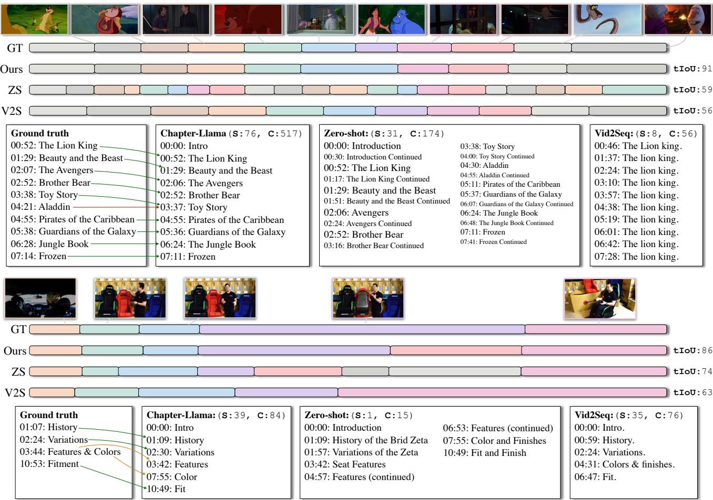  
Figure 3. Qualitative results: We display two examples and compare our Chapter-Llama results against the ground truth (GT), as well as the zero-shot (ZS) and Vid2Seq (VS) baselines. For each example, we show the corresponding SODA (S) and CIDEr (C) scores. Our method overall shows the highest similarity with the GT, while Vid2Seq can suffer from repeated chapter titles, and zero-shot generations tend to over-segment.

Table 2. Contribution of different modalities and finetuning: Finetuning the LLM with 1k videos largely improves chaptering performance on 300 validation videos, see bottom block vs top block. In the finetuned setting, we further demonstrate the advantages of combining both modalities, i.e., transcribed speech from ASR and automatic captions extracted from video frames.   

<table><tr><td colspan="2">Modalities</td><td colspan="2">Segmentation</td><td colspan="2">Titles</td></tr><tr><td colspan="2">Speech</td><td>Captions</td><td>F1</td><td>tIoU</td><td>S C</td></tr><tr><td rowspan="3">ee-oz</td><td>X</td><td>✓</td><td>12.6</td><td>48.6 1.9 57.3</td><td>6.4</td></tr><tr><td>✓</td><td>×</td><td>22.7</td><td>4.4 6.9</td><td>19.7</td></tr><tr><td>✓</td><td>✓</td><td>29.9</td><td>63.0</td><td>33.7 20.2</td></tr><tr><td rowspan="2">Riumd</td><td>X</td><td>✓</td><td>39.1</td><td>67.7</td><td>5.9</td></tr><tr><td>✓</td><td>×</td><td>38.5</td><td>68.1 13.9</td><td>67.3</td></tr><tr><td></td><td>✓</td><td>✓</td><td>42.6</td><td>70.6</td><td>16.4 82.4</td></tr></table>

verbose chapter titles and often generates chapters that appear to be continuations of previous chapters rather than distinct segments, while also exhibiting over-segmentation issues. We provide more examples in Appendix D.

# 4.3. Ablation studies

In the following, we experiment with (i) the contribution of speech and caption modalities, along with the effect of LLM finetuning, (ii) the effect of our frame selection method for captioning, (iii) the amount of training data, and (iv) the use of frame embeddings instead of captions. As mentioned above, we use 1k training and 300 validation videos for these ablations.

Modalities and LLM finetuning. In Tab. 2, we ablate the impact of finetuning the LLM and the contribution of each of the speech and caption modalities. In the top block, we run our baselines in zero-shot setting as introduced in the previous section. The speech-only baseline outperforms the captions-only baseline by a large margin in the zero-shot setting. This suggests that speech contains more relevant information for chaptering, as was previously observed by [112].

As shown in the bottom block of Tab. 2, we observe large performance improvements when finetuning the LLM, as opposed to zero-shot. We hypothesize that zero-shot prompting with a long multi-modal text, potentially containing redundant and irrelevant information, may overwhelm the LLM [82, 104]. We obtain our best model by combining the two modalities, which performs better than the individual speech-only or caption-only models. This demonstrates the multi-modal capabilities of our model.

Speech-based frame selection. In Tab. 3, we examine a number of strategies to sample frames at which we extract captions. In addition to previously described metrics, for each of the frame sampling approaches, we report the average number of captions per video and the average number of text tokens per minute. For reference, we also report an off-the-shelf shot detection [12] and Vid2Seq [112, 113].

We compare our speech-based frame selection strategy to various baselines. We experiment with sampling (i) uniformly

<table><tr><td colspan="2">Method</td><td>Frame selection average for captions</td><td>#frames</td><td>#tokens per min.</td><td colspan="2">|Segmentation F1 tIoU</td><td colspan="2">Titles s</td></tr><tr><td colspan="9">BasELInES</td></tr><tr><td colspan="2">Shot detection [12] n/a</td><td></td><td>49.4 100.0</td><td>n/a 128.6</td><td>6.2 25.4</td><td>37.6 57.8</td><td>-</td><td>- 11.2 55.0</td></tr><tr><td colspan="9">Vid2Seq [112, 113] 100 equidistant Chapter-Llama Variants</td></tr><tr><td colspan="2">Speech Caption X</td><td>n/a</td><td>n/a</td><td>248.6</td><td>38.5</td><td>68.1</td><td></td><td>13.9 67.3</td></tr><tr><td colspan="9">✓</td></tr><tr><td rowspan="5">X</td><td rowspan="5">✓</td><td>100 equidistant</td><td>100.0</td><td>449.1</td><td>| 21.0</td><td>53.8</td><td>8.4</td><td>36.0</td></tr><tr><td>Every 10 sec.</td><td>83.1</td><td>280.3</td><td>12.8</td><td>45.9</td><td></td><td>4.3 13.0</td></tr><tr><td>Shot boundaries</td><td>49.4</td><td>193.2</td><td>16.2</td><td>50.7</td><td>3.9</td><td>12.4</td></tr><tr><td>10 equidistant</td><td>10.0</td><td>41.8</td><td>11.0</td><td>46.4</td><td>3.6</td><td>9.0</td></tr><tr><td>Speech-based</td><td>10.3</td><td>36.2</td><td>39.1</td><td>67.7</td><td></td><td>5.9 20.2</td></tr><tr><td rowspan="5">✓</td><td rowspan="5">✓</td><td>100 equidistant</td><td>100.0</td><td>746.2</td><td>| 39.2</td><td>67.4</td><td>16.1</td><td>83.8</td></tr><tr><td>Every 10 sec.</td><td>83.1</td><td>570.1</td><td>41.0</td><td>69.3</td><td></td><td>15.4 77.3</td></tr><tr><td>Shot boundaries</td><td>40.4</td><td>481.7</td><td>40.6</td><td>69.1</td><td></td><td>15.8 79.3</td></tr><tr><td>10 equidistant</td><td>10.0</td><td>326.1</td><td>40.1</td><td>67.9</td><td></td><td>15.8 77.5</td></tr><tr><td>Speech-based</td><td>10.3</td><td>320.4</td><td>42.6</td><td>70.6</td><td>16.4</td><td>82.4</td></tr></table>

Table 3. Frame selection strategies for captioning: We evaluate different approaches for selecting frames to extract captions from, comparing our speech-based selection method against baselines. The table shows results for models trained on 1k videos and evaluated on 300 validation videos. We experiment with using speech only, captions only, and both modalities (bottom section). For caption extraction, we compare our speech-based approach to other alternatives such as equidistant sampling (100 or 10 frames), uniformly sampling every 10 seconds, or sampling at shot boundaries using [12]. Our speech-based frame selection achieves the best overall performance (F1: 42.6, tIoU: 70.6) while requiring significantly fewer number of frames on average (10.3) compared to other sampling approaches. The tokens-per-minute statistic shows the total input length including both speech transcriptions and captions, excluding the fixed prompt template.

100 frames as in Vid2Seq, (ii) every 10 seconds, (iii) at shot boundaries detected by an off-the-shelf shot detector [12], (iv) 10 equidistant frames to be similar to our speech-based locations (i.e., 10.0 vs 10.3 number of frames on average), and (v) sampling at frames predicted as chapter boundaries by our LLM that inputs only speech. In all cases, we limit the maximum number of frames to 100 as in [112, 113] to handle extreme durations.

In both caption-only and caption+speech settings, our speechbased frame selection approach achieves better segmentation results than the more frame-expensive baselines ‘100 equidistant’, ‘every $1 0 \mathrm { s e c } ^ { \prime }$ , and ‘shot boundaries’, while using much less frames, and also improves over the ‘10 equidistant’ baseline which uses a similar number of frames. This demonstrates the effectiveness of our speech-based frame selection strategy.

For reference, we also report positive comparison against shot detection and Vid2Seq [112, 113]. Note Vid2Seq has less #tokens per min. compared to our 100 equidistant variants, because Vid2Seq uses a different timestamp tokenizer in the input.

Amount of training data. Given the large-scale nature of the VidChapters-7M training set, we investigate how much chapter data is needed for LoRA finetuning the LLM. We plot the performance against the number of training videos in Fig. 4. We start by the zero-shot baseline as the first data point, and report our method with 1k, 5k, 7k, and 10k videos, split evenly between three durations. We see that after increasing above several thousand training videos starts to bring diminishing returns. We therefore keep 10k training videos for our final LLM, which makes our approach highly efficient to train (40min on 4 H100 GPUs). Note that here we focus on the chaptering LLM and always use frame sampling locations from a speech-based module trained on 10k separate videos.

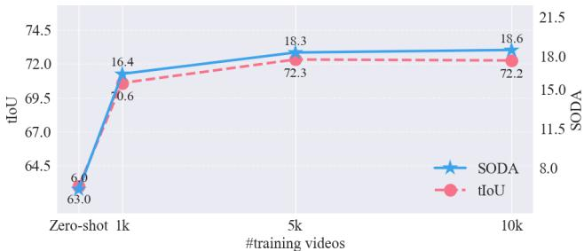  
Figure 4. Amount of training data: Our experiments show a substantial improvement when moving from zero-shot to training with 1k videos. Beyond 1k videos, performance continues to improve but at a much slower rate, motivating our choice of using only 10k training videos for our final LLM.

Frame embeddings vs captions. In Tab. 4, we investigate whether raw visual embeddings could serve as an alternative to textual captions. To this end, we experiment with replacing the captions with frame embeddings. Specifically, for each frame, we extract the 1152-dimensional output embedding corresponding to the [CLS] token from a frozen SigLIP model [122], and feed through a 2-layer MLP mapping network. We initialize the MLP weights from MANTIS [42] and train jointly with the LLM during finetuning. The results with ‘Speech+Embeddings’ are better than ‘Speech’ alone (38.5 vs 40.4 F1), but worse than ‘Speech+Captions’ (42.6 vs 40.4 F1). The performance gap between ‘Speech+Embeddings’ and ‘Speech+Captions’ may be due to the richer information provided by captions, which use multiple tokens per frame, directly in text form, compared to the single [CLS] token frame embedding, requiring a mapping network to be ingested by an LLM. Finally, while combining all modalities achieves the best performance (44.4 F1), we exclude frame embeddings from our final model due to practical considerations, e.g., they add complexity, increase processing time by $2 . 5 \mathrm { x }$ , and require $3 0 0 0 \mathrm { x }$ more storage space.

# 4.4. Iterative prediction on longer videos

In our ablation studies, our experimental setting considered training and evaluating with videos that fit within the LLM context window. In Tab. 5, we evaluate the benefit of our iterative prediction procedure for handling videos that exceed the LLM context window. For this, we identify videos in the validation set whose inputs exceed the LLM inference context window $\mathrm { \Omega } > 3 5 k \mathrm { \Omega }$ tokens), resulting in 110 videos. On this challenging subset, we find that our iterative prediction procedure improves chaptering results compared to the baseline that only runs the LLM once by cropping the input to the first input window, across various context windows (10k, 15k, and 20k). We refer to Appendix $\mathrm { B }$ for details on the video lengths and statistics of videos that exceed the LLM context window.

Table 4. Frame embeddings vs captions: We compare using frame captions versus visual features from a frozen SigLIP model projected through a learned 2-layer MLP mapping network (‘Embeddings’). While the ‘Speech+Embeddings’ combination performs better than speech alone (40.4 vs 38.5 F1), it underperforms compared to the ‘Speech $^ +$ Captions’ combination (42.6 vs 40.4 F1). All models are trained with 1k videos and evaluated on 300 videos.   

<table><tr><td colspan="2">Modalities</td><td colspan="2">Segmentation</td><td colspan="2">Titles</td></tr><tr><td></td><td>Speech Embeddings</td><td>Captions</td><td>F1</td><td>tIoU S</td><td>C</td></tr><tr><td>✓ -</td><td>;</td><td>- -</td><td>38.5 38.4</td><td>68.1 66.5</td><td>13.9 67.3 3.4 7.3</td></tr><tr><td>-</td><td></td><td>✓</td><td>39.1</td><td>67.7</td><td>5.9 20.2</td></tr><tr><td>✓ ✓</td><td>✓</td><td>-</td><td>40.4</td><td>68.2</td><td>15.3 74.9</td></tr><tr><td>✓</td><td>-</td><td></td><td>42.6</td><td>70.6</td><td>16.4 82.4</td></tr><tr><td></td><td>J</td><td>√</td><td>44.4</td><td>71.5</td><td>16.3 84.2</td></tr></table>

Table 5. Iterative prediction: Our iterative prediction procedure improves chaptering results on the subset of 110 videos which exceed 35k tokens compared to the baseline that only runs the LLM once (by only taking the first window, and discarding the rest of the input sequence), across various context windows. As we increase the context window in the iterative prediction, the performance gradually improves and the average number of iterations decreases. The model is trained with 1k videos.   

<table><tr><td>Window</td><td># tok.</td><td>avg # iter.</td><td colspan="3">Subset exceeding 35k tokens F1 tIoU S</td></tr><tr><td rowspan="3">First</td><td>10k</td><td>1</td><td>13.1</td><td>50.5 4.0</td><td>31.2</td></tr><tr><td>15k</td><td>1</td><td>16.6</td><td>54.9 5.4</td><td>43.3</td></tr><tr><td>20k</td><td>1</td><td>18.7</td><td>56.7 6.6</td><td>47.5</td></tr><tr><td rowspan="3">Iterative</td><td>10k</td><td>8.5</td><td>18.5</td><td>57.1</td><td>6.9 25.1</td></tr><tr><td>15k</td><td>5.4</td><td>23.6</td><td>60.1</td><td>8.7 35.2</td></tr><tr><td>20k</td><td>4.1</td><td>25.3</td><td>61.4</td><td>10.3 44.0</td></tr></table>

# 5. Conclusions

We presented Chapter-Llama, an approach that leverages LLMs for hour-long video chaptering by mapping video to text using speech transcripts and efficiently captioning video frames sampled with a speech-based frame selector. Our results on VidChapters-7M consequently improved the state of the art by a large margin. We experimentally demonstrated the benefits of our components through an extensive ablation study. One limitation of our approach is that it relies on the accuracy of the ASR and the visual captioner. Future work can explore hierarchical chaptering with several granularities and consider the audio modality beyond speech. We also note that the LLM, the visual captioner, and speech transcription models are trained on large Web datasets, which can contain biases that can lead to inaccurate chaptering, especially for videos depicting underrepresented topics.

Acknowledgements. This work was granted access to the HPC resources of IDRIS under the allocation 2024- AD011014696 made by GENCI. This work was funded in part by the ANR project CorVis ANR-21-CE23-0003-01, a research gift from Google, the French government under management of Agence Nationale de la Recherche as part of the “France 2030” program, reference ANR-23-IACL-0008 (PR[AI]RIE-PSAI projet), and the ANR project VideoPredict ANR-21-FAI1-0002- 01. Cordelia Schmid would like to acknowledge the support by the Korber European Science Prize. The authors would also ¨ like to thank Guillaume Astruc, Nikos Athanasiou, Hyolim Kang, and Nicolas Dufour for their feedback.

# References

[1] Soheyla Amirian, Khaled Rasheed, Thiab R Taha, and Hamid R Arabnia. Automatic generation of descriptive titles for video clips using deep learning. In Advances in Artificial Intelligence and Applied Cognitive Computing: Proceedings from ICAI’20 and ACC’20, 2021. 2   
[2] D. Argaw, S. Yoon, F. Heilbron, H. Deilamsalehy, T. Bui, Z. Wang, F. Dernoncourt, and J. Chung. Scaling up video summarization pretraining with large language models. In CVPR, 2024. 2, 3   
[3] Anurag Arnab, Mostafa Dehghani, Georg Heigold, Chen Sun, Mario Luciˇ c, and Cordelia Schmid. ViViT: A video vision ´ transformer. In ICCV, 2021. 3   
[4] Dzmitry Bahdanau, Kyunghyun Cho, and Yoshua Bengio. Neural machine translation by jointly learning to align and translate. ICLR, 2015. 1   
[5] Max Bain, Arsha Nagrani, Gul Varol, and Andrew Zisserman.¨ Frozen in time: A joint video and image encoder for end-to-end retrieval. In ICCV, 2021. 2, 3   
[6] Max Bain, Jaesung Huh, Tengda Han, and Andrew Zisserman. WhisperX: Time-accurate speech transcription of long-form audio. In Interspeech, 2023. 4, 15   
[7] Satanjeev Banerjee and Alon Lavie. METEOR: An automatic metric for mt evaluation with improved correlation with human judgments. In Proceedings of the ACL Workshop on Intrinsic and Extrinsic Evaluation Measures for Machine Translation and/or Summarization, 2005. 18, 19   
[8] Nadine Behrmann, S Alireza Golestaneh, Zico Kolter, Jurgen ¨ Gall, and Mehdi Noroozi. Unified fully and timestamp supervised temporal action segmentation via sequence to sequence translation. In ECCV, 2022. 2   
[9] Gedas Bertasius, Heng Wang, and Lorenzo Torresani. Is space-time attention all you need for video understanding? In ICML, 2021. 3   
[10] Tom Brown et al. Language models are few-shot learners. In NeurIPS, 2020. 3   
[11] Xiao Cao, Zitan Chen, Canyu Le, and Lei Meng. Multi-modal video chapter generation. In BMVC, 2022. 3   
[12] Brandon Castellano. Pyscenedetect: Intelligent scene cut detection and video splitting tool. https://pyscenedetect. readthedocs.io/en/latest/, 2018. 7, 15, 16   
[13] Houlun Chen, Xin Wang, Hong Chen, Zihan Song, Jia Jia, and Wenwu Zhu. Grounding-prompter: Prompting llm with multimodal information for temporal sentence grounding in long videos. arXiv:2312.17117, 2023. 3   
[14] Shixing Chen, Xiaohan Nie, David Fan, Dongqing Zhang, Vimal Bhat, and Raffay Hamid. Shot contrastive self-supervised learning for scene boundary detection. In CVPR, 2021. 2   
[15] Shixing Chen, Chun-Hao Liu, Xiang Hao, Xiaohan Nie, Maxim Arap, and Raffay Hamid. Movies2Scenes: Using movie metadata to learn scene representation. In CVPR, 2023. 2   
[16] Sihan Chen, Xingjian He, Longteng Guo, Xinxin Zhu, Weining Wang, Jinhui Tang, and Jing Liu. VALOR: Vision-audiolanguage omni-perception pretraining model and dataset. TPAMI, 2024. 1   
[17] Sihan Chen, Handong Li, Qunbo Wang, Zijia Zhao, Mingzhen Sun, Xinxin Zhu, and Jing Liu. VAST: A vision-audio-subtitletext omni-modality foundation model and dataset. NeurIPS, 2024. 2   
[18] Yangyu Chen, Shuhui Wang, Weigang Zhang, and Qingming Huang. Less is more: Picking informative frames for video captioning. In ECCV, 2018. 3   
[19] Feng Cheng and Gedas Bertasius. TALLformer: Temporal action localization with long-memory transformer. In ECCV, 2022. 2   
[20] Xu Cheng, Cameron Dale, and Jiangchuan Liu. Statistics and social network of youtube videos. In 16th Interntional Workshop on Quality of Service, 2008. 1   
[21] Abhimanyu Dubey, Abhinav Jauhri, Abhinav Pandey, Abhishek Kadian, Ahmad Al-Dahle, Aiesha Letman, Akhil Mathur, Alan Schelten, Amy Yang, Angela Fan, et al. The Llama 3 herd of models. arXiv:2407.21783, 2024. 3, 4, 13   
[22] Yue Fan, Xiaojian Ma, Rujie Wu, Yuntao Du, Jiaqi Li, Zhi Gao, and Qing Li. VideoAgent: A memory-augmented multimodal agent for video understanding. In ECCV, 2024. 3   
[23] Xinyu Fang, Kangrui Mao, Haodong Duan, Xiangyu Zhao, Yining Li, Dahua Lin, and Kai Chen. MMBench-video: A longform multi-shot benchmark for holistic video understanding. In NeurIPS Datasets and Benchmarks, 2024. 3   
[24] Yazan Abu Farha and Jurgen Gall. MS-TCN: Multi-stage temporal convolutional network for action segmentation. In CVPR, 2019. 2   
[25] Chaoyou Fu, Yuhan Dai, Yondong Luo, Lei Li, Shuhuai Ren, Renrui Zhang, Zihan Wang, Chenyu Zhou, Yunhang Shen, Mengdan Zhang, et al. Video-MME: The first-ever comprehensive evaluation benchmark of multi-modal LLMs in video analysis. arXiv:2405.21075, 2024. 3   
[26] Soichiro Fujita, Tsutomu Hirao, Hidetaka Kamigaito, Manabu Okumura, and Masaaki Nagata. SODA: Story oriented dense video captioning evaluation framework. In ECCV, 2020. 5, 18, 19   
[27] Shang-Hua Gao, Qi Han, Zhong-Yu Li, Pai Peng, Liang Wang, and Ming-Ming Cheng. Global2Local: Efficient structure search for video action segmentation. In CVPR, 2021. 2   
[28] Gemini Team et al. Gemini: A family of highly capable multimodal models. arXiv:2312.11805, 2024. 3, 5, 6   
[29] Azin Ghazimatin, Ekaterina Garmash, Gustavo Penha, Kristen Sheets, Martin Achenbach, Oguz Semerci, Remi Galvez, Marcus Tannenberg, Sahitya Mantravadi, Divya Narayanan, Ofeliya Kalaydzhyan, Douglas Cole, Ben Carterette, Ann Clifton, Paul N. Bennett, Claudia Hauff, and Mounia Lalmas. PODTILE: Facilitating podcast episode browsing with auto-generated chapters. In Proceedings of the 33rd ACM International Conference on Information and Knowledge Management, 2024. 2 hours of egocentric video. In CVPR, 2022. 1, 3   
[31] Khalil Guetari, Yannis Tevissen, and Fred´ eric Petitpont. ´ Multimodal chaptering for long-form TV newscast video. arXiv:2406.17590, 2024. 3   
[32] Tengda Han, Max Bain, Arsha Nagrani, Gul Varol, Weidi Xie, ¨ and Andrew Zisserman. AutoAD: Movie description in context. In CVPR, 2023. 1, 3   
[33] Tanveer Hannan, Md Mohaiminul Islam, Thomas Seidl, and Gedas Bertasius. RGNet: A unified retrieval and grounding network for long videos. In ECCV, 2023. 1   
[34] Bo He, Jun Wang, Jielin Qiu, Trung Bui, Abhinav Shrivastava, and Zhaowen Wang. Align and attend: Multimodal summarization with dual contrastive losses. In CVPR, 2023. 2   
[35] Chiori Hori, Takaaki Hori, Teng-Yok Lee, Ziming Zhang, Bret Harsham, John R Hershey, Tim K Marks, and Kazuhiko Sumi. Attention-based multimodal fusion for video description. In ICCV, 2017. 1   
[36] Edward J Hu, yelong shen, Phillip Wallis, Zeyuan Allen-Zhu, Yuanzhi Li, Shean Wang, Lu Wang, and Weizhu Chen. LoRA: Low-rank adaptation of large language models. In ICLR, 2022. 4, 13   
[37] De-An Huang, Shijia Liao, Subhashree Radhakrishnan, Hongxu Yin, Pavlo Molchanov, Zhiding Yu, and Jan Kautz. Lita: Language instructed temporal-localization assistant. In ECCV, 2024. 3   
[38] Gabriel Huang, Bo Pang, Zhenhai Zhu, Clara Rivera, and Radu Soricut. Multimodal pretraining for dense video captioning. In AACL-IJCNLP, 2020. 1, 2   
[39] Qingqiu Huang, Yu Xiong, Anyi Rao, Jiaze Wang, and Dahua Lin. Movienet: A holistic dataset for movie understanding. In ECCV, 2020. 2   
[40] Md Mohaiminul Islam, Mahmudul Hasan, Kishan Shamsundar Athrey, Tony Braskich, and Gedas Bertasius. Efficient movie scene detection using state-space transformers. In CVPR, 2023. 2   
[41] Md Mohaiminul Islam, Ngan Ho, Xitong Yang, Tushar Nagarajan, Lorenzo Torresani, and Gedas Bertasius. Video ReCap: Recursive captioning of hour-long videos. CVPR, 2024. 1, 2, 3   
[42] Dongfu Jiang, Xuan He, Huaye Zeng, Cong Wei, Max Ku, Qian Liu, and Wenhu Chen. Mantis: Interleaved multi-image instruction tuning. TMLR, 2024. 8   
[43] Kumara Kahatapitiya, Kanchana Ranasinghe, Jongwoo Park, and Michael S Ryoo. Language repository for long video understanding. arXiv:2403.14622, 2024. 3   
[44] Bruno Korbar, Du Tran, and Lorenzo Torresani. SCSampler: Sampling salient clips from video for efficient action recognition. In ICCV, 2019. 2, 3   
[45] Ranjay Krishna, Kenji Hata, Frederic Ren, Li Fei-Fei, and Juan Carlos Niebles. Dense-captioning events in videos. In ICCV, 2017. 1, 2   
[46] Jie Lei, Linjie Li, Luowei Zhou, Zhe Gan, Tamara L Berg, Mohit Bansal, and Jingjing Liu. Less is more: ClipBERT for videoand-language learning via sparse sampling. In CVPR, 2021. 3   
[47] Feng Li, Jae Won Chung, and Mark Claypool. Three-year trends in YouTube video content and encoding. Proceedings of the 18th International Conference on Signal Processing and Multimedia Applications (SIGMAP), 2021. 1   
[48] Mingzhe Li, Mark Claypool, Robert Kinicki, and James Nichols. Characteristics of streaming media stored on the web. ACM Trans. Internet Technol., 2005. 1   
[49] Zhe Li, Yazan Abu Farha, and Jurgen Gall. Temporal action segmentation from timestamp supervision. In CVPR, 2021. 2   
[50] Bin Lin, Bin Zhu, Yang Ye, Munan Ning, Peng Jin, and Li Yuan. Video-LLaVA: Learning united visual representation by alignment before projection. arXiv:2311.10122, 2023. 3   
[51] Chin-Yew Lin. Rouge: a package for automatic evaluation of summaries. In Proceedings of the Workshop on Text Summarization Branches Out (WAS), 2004. 18, 19   
[52] Kevin Lin, Linjie Li, Chung-Ching Lin, Faisal Ahmed, Zhe Gan, Zicheng Liu, Yumao Lu, and Lijuan Wang. SwinBERT: End-to-end transformers with sparse attention for video captioning. In CVPR, 2022. 2   
[53] Kevin Qinghong Lin, Pengchuan Zhang, Joya Chen, Shraman Pramanick, Difei Gao, Alex Jinpeng Wang, Rui Yan, and Mike Zheng Shou. UniVTG: Towards unified video-language temporal grounding. In ICCV, 2023. 2   
[54] Hao Liu, Matei Zaharia, and Pieter Abbeel. Ring attention with blockwise transformers for near-infinite context. arXiv:2310.01889, 2023. 3   
[55] Hao Liu, Wilson Yan, Matei Zaharia, and Pieter Abbeel. World model on million-length video and language with blockwise ringattention. arXiv:2402.08268, 2024. 3   
[56] Xiaolong Liu, Qimeng Wang, Yao Hu, Xu Tang, Shiwei Zhang, Song Bai, and Xiang Bai. End-to-end temporal action detection with transformer. In IEEE Transactions on Image Processing, 2022. 2   
[57] Huaishao Luo, Lei Ji, Botian Shi, Haoyang Huang, Nan Duan, Tianrui Li, Jason Li, Taroon Bharti, and Ming Zhou. UniVL: A unified video and language pre-training model for multimodal understanding and generation. arXiv:2002.06353, 2020. 1   
[58] Karttikeya Mangalam, Raiymbek Akshulakov, and Jitendra Malik. EgoSchema: A diagnostic benchmark for very long-form video language understanding. In NeurIPS Track on Datasets and Benchmarks, 2023. 1, 3   
[59] Antoine Miech, Dimitri Zhukov, Jean-Baptiste Alayrac, Makarand Tapaswi, Ivan Laptev, and Josef Sivic. HowTo100M: Learning a text-video embedding by watching hundred million narrated video clips. In ICCV, 2019. 2, 5   
[60] Juhong Min, Shyamal Buch, Arsha Nagrani, Minsu Cho, and Cordelia Schmid. MoReVQA: Exploring modular reasoning models for video question answering. In CVPR, 2024. 2, 3   
[61] Jonghwan Mun, Minchul Shin, Gunsoo Han, Sangho Lee, Seongsu Ha, Joonseok Lee, and Eun-Sol Kim. BaSSL: Boundary-aware self-supervised learning for video scene segmentation. In ACCV, 2022. 2   
[62] Arsha Nagrani, Paul Hongsuck Seo, Bryan Seybold, Anja Hauth, Santiago Manen, Chen Sun, and Cordelia Schmid. Learning audio-video modalities from image captions. In ECCV, 2022. 2   
[63] Joe Yue-Hei Ng, Matthew Hausknecht, Sudheendra Vijayanarasimhan, Oriol Vinyals, Rajat Monga, and George Toderici. Beyond short snippets: Deep networks for video classification. In CVPR, 2015. 1   
[64] OpenAI. Gpt-4o system card. arXiv:2410.21276, 2024. 5, 6   
[65] Yingwei Pan, Ting Yao, Houqiang Li, and Tao Mei. Video captioning with transferred semantic attributes. In CVPR, 2017. 1   
[66] Pinelopi Papalampidi, Skanda Koppula, Shreya Pathak, Justin Chiu, Joe Heyward, Viorica Patraucean, Jiajun Shen, Antoine Miech, Andrew Zisserman, and Aida Nematzdeh. A simple recipe for contrastively pre-training video-first encoders beyond 16 frames. In CVPR, 2024. 3   
[67] Kishore Papineni, Salim Roukos, Todd Ward, and Wei-Jing Zhu. BLEU: a method for automatic evaluation of machine translation. In ACL, 2002. 18, 19   
[68] Alejandro Pardo, Fabian Caba Heilbron, Juan Leon Alc ´ azar, ´ Ali Thabet, and Bernard Ghanem. Moviecuts: A new dataset and benchmark for cut type recognition. In ECCV, 2022. 2   
[69] Jinwoo Park, Jungeun Kim, Jaegwang Seok, Sukhyun Lee, and Junyeong Kim. Contrasting multi-modal similarity framework for video scene segmentation. IEEE Access, 2024. 2   
[70] Wenjie Pei, Jiyuan Zhang, Xiangrong Wang, Lei Ke, Xiaoyong Shen, and Yu-Wing Tai. Memory-attended recurrent network for video captioning. In CVPR, 2019. 1   
[71] Alec Radford, Karthik Narasimhan, Tim Salimans, and Ilya Sutskever. Improving language understanding by generative pre-training. Preprint, 2018. 3   
[72] Alec Radford, Jong Wook Kim, Chris Hallacy, Aditya Ramesh, Gabriel Goh, Sandhini Agarwal, Girish Sastry, Amanda Askell, Pamela Mishkin, Jack Clark, et al. Learning transferable visual models from natural language supervision. In ICML, 2021. 3   
[73] Alec Radford, Jong Wook Kim, Tao Xu, Greg Brockman, Christine McLeavey, and Ilya Sutskever. Robust speech recognition via large-scale weak supervision. In ICML, 2023. 4, 5   
[74] Anyi Rao, Linning Xu, Yu Xiong, Guodong Xu, Qingqiu Huang, Bolei Zhou, and Dahua Lin. A local-to-global approach to multi-modal movie scene segmentation. In CVPR, 2020. 2   
[75] Zeeshan Rasheed and Mubarak Shah. Scene detection in hollywood movies and tv shows. In CVPR, 2003. 2   
[76] Fabian Retkowski and Alexander Waibel. From text segmentation to smart chaptering: A novel benchmark for structuring video transcriptions. arXiv:2402.17633, 2024. 2   
[77] Marcus Rohrbach, Wei Qiu, Ivan Titov, Stefan Thater, Manfred Pinkal, and Bernt Schiele. Translating video content to natural language descriptions. In ICCV, 2013. 1   
[78] Daniel Rotman, Dror Porat, and Gal Ashour. Robust video scene detection using multimodal fusion of optimally grouped features. IEEE 19th International Workshop on Multimedia Signal Processing (MMSP), 2017. 2   
[79] Yong Rui, Thomas S Huang, and Sharad Mehrotra. Exploring video structure beyond the shots. In IEEE International Conference on Multimedia Computing and Systems, 1998. 2   
[80] Najmeh Sadoughi, Xinyu Li, Avijit Vajpayee, David Fan, Bing Shuai, Hector Santos-Villalobos, Vimal Bhat, and Rohith MV. MEGA: Multimodal alignment aggregation and distillation for cinematic video segmentation. In ICCV, 2023. 2   
[81] Paul Hongsuck Seo, Arsha Nagrani, Anurag Arnab, and Cordelia Schmid. End-to-end generative pretraining for multimodal video captioning. In CVPR, 2022. 1, 2   
[82] Freda Shi, Xinyun Chen, Kanishka Misra, Nathan Scales, David Dohan, Ed H. Chi, Nathanael Scharli, and Denny Zhou. Large ¨ language models can be easily distracted by irrelevant context. In ICML, 2023. 3, 7   
[83] Nina Shvetsova, Anna Kukleva, Xudong Hong, Christian Rupprecht, Bernt Schiele, and Hilde Kuehne. HowToCaption: Prompting llms to transform video annotations at scale. In ECCV, 2024. 2, 3   
[84] Panagiotis Sidiropoulos, Vasileios Mezaris, Ioannis Kompatsiaris, Hugo Meinedo, Miguel Bugalho, and Isabel Trancoso. Temporal video segmentation to scenes using high-level audiovisual features. IEEE TCSVT, 2011. 2   
[85] Gunnar A. Sigurdsson, Gul Varol, Xiaolong Wang, Ivan ¨ Laptev, Ali Farhadi, and Abhinav Gupta. Hollywood in homes: Crowdsourcing data collection for activity understanding. In ECCV, 2016. 1   
[86] Karen Simonyan and Andrew Zisserman. Two-stream convolutional networks for action recognition in videos. In ICLR, 2014. 1   
[87] Mattia Soldan, Alejandro Pardo, Juan Leon Alc ´ azar, Fabian ´ Caba, Chen Zhao, Silvio Giancola, and Bernard Ghanem. MAD: A scalable dataset for language grounding in videos from movie audio descriptions. In CVPR, 2022. 1, 3   
[88] Chen Sun, Austin Myers, Carl Vondrick, Kevin Murphy, and Cordelia Schmid. VideoBERT: A joint model for video and language representation learning. In ICCV, 2019. 1   
[89] Yuchong Sun, Hongwei Xue, Ruihua Song, Bei Liu, Huan Yang, and Jianlong Fu. Long-form video-language pre-training with multimodal temporal contrastive learning. In NeurIPS, 2022. 3   
[90] Ilya Sutskever, Oriol Vinyals, and Quoc V Le. Sequence to sequence learning with neural networks. NeurIPS, 2014. 1   
[91] Reuben Tan, Ximeng Sun, Ping Hu, Jui hsien Wang, Hanieh Deilamsalehy, Bryan A. Plummer, Bryan Russell, and Kate Saenko. Koala: Key frame-conditioned long video-LLM. In CVPR, 2024. 3   
[92] Gemini Team, Petko Georgiev, Ving Ian Lei, Ryan Burnell, Libin Bai, Anmol Gulati, Garrett Tanzer, Damien Vincent, Zhufeng Pan, Shibo Wang, et al. Gemini 1.5: Unlocking multimodal understanding across millions of tokens of context. arXiv:2403.05530, 2024. 3   
[93] Hugo Touvron, Thibaut Lavril, Gautier Izacard, Xavier Martinet, Marie-Anne Lachaux, Timothee Lacroix, Baptiste Rozi ´ ere, \` Naman Goyal, Eric Hambro, Faisal Azhar, et al. LLaMA: Open and efficient foundation language models. arXiv:2302.13971, 2023. 3   
[94] Hugo Touvron et al. LLaMA 2: Open foundation and fine-tuned chat models. arXiv:2307.09288, 2023. 3   
[95] Du Tran, Lubomir Bourdev, Rob Fergus, Lorenzo Torresani, and Manohar Paluri. Learning spatiotemporal features with 3d convolutional networks. In ICCV, 2015. 1   
[96] Gul Varol, Ivan Laptev, and Cordelia Schmid. Long-term ¨ temporal convolutions for action recognition. TPAMI, 2018. 1   
[97] Ramakrishna Vedantam, C Lawrence Zitnick, and Devi Parikh. CIDEr: Consensus-based image description evaluation. In CVPR, 2015. 5, 18, 19   
[98] Lucas Ventura, Cordelia Schmid, and Gul Varol. Learning ¨ text-to-video retrieval from image captioning. IJCV, 2024. 2   
[99] Lucas Ventura, Antoine Yang, Cordelia Schmid, and Gul Varol.¨ CoVR-2: Automatic data construction for composed video retrieval. TPAMI, 2024. 3   
[100] Caroline Violot, Tugrulcan Elmas, Igor Bilogrevic, and Mathias ˘ Humbert. Shorts vs. regular videos on YouTube: A comparative analysis of user engagement and content creation trends. In Proceedings of the 16th ACM Web Science Conference. Association for Computing Machinery, 2024. 1   
[101] Junke Wang, Dongdong Chen, Zuxuan Wu, Chong Luo, Luowei Zhou, Yucheng Zhao, Yujia Xie, Ce Liu, Yu-Gang Jiang, and Lu Yuan. Omnivl: One foundation model for image-language and video-language tasks. NeurIPS, 2022. 1   
[102] Teng Wang, Ruimao Zhang, Zhichao Lu, Feng Zheng, Ran Cheng, and Ping Luo. End-to-end dense video captioning with parallel decoding. In ICCV, 2021. 2   
[103] Yuxuan Wang, Difei Gao, Licheng Yu, Weixian Lei, Matt Feiszli, and Mike Zheng Shou. $\mathrm { G E B + }$ : A benchmark for generic event boundary captioning, grounding and retrieval. In ECCV, 2022. 2   
[104] Ziyang Wang, Shoubin Yu, Elias Stengel-Eskin, Jaehong Yoon, Feng Cheng, Gedas Bertasius, and Mohit Bansal. VideoTree: Adaptive tree-based video representation for LLM reasoning on long videos. arXiv:2405.19209, 2024. 3, 7   
[105] Xi Wei, Zhangxiang Shi, Tianzhu Zhang, Xiaoyuan Yu, and Lei Xiao. Multimodal high-order relation transformer for scene boundary detection. In ICCV, 2023. 2   
[106] Chao-Yuan Wu, Yanghao Li, Karttikeya Mangalam, Haoqi Fan, Bo Xiong, Jitendra Malik, and Christoph Feichtenhofer. MeMViT: Memory-augmented multiscale vision transformer for efficient long-term video recognition. In CVPR, 2022. 3   
[107] Haoqian Wu, Keyu Chen, Haozhe Liu, Mingchen Zhuge, Bing Li, Ruizhi Qiao, Xiujun Shu, Bei Gan, Liangsheng Xu, Bo Ren, Mengmeng Xu, Wentian Zhang, Raghavendra Ramachandra, Chia-Wen Lin, and Bernard Ghanem. NewsNet: A novel dataset for hierarchical temporal segmentation. In CVPR, 2023. 3   
[108] Zuxuan Wu, Caiming Xiong, Chih-Yao Ma, Richard Socher, and Larry S. Davis. AdaFrame: Adaptive frame selection for fast video recognition. In CVPR, 2019. 3   
[109] Junbin Xiao, Xindi Shang, Angela Yao, and Tat-Seng Chua. NExT-QA: Next phase of question-answering to explaining temporal actions. In CVPR, 2021. 3   
[110] Jun Xu, Tao Mei, Ting Yao, and Yong Rui. MSR-VTT: A large video description dataset for bridging video and language. In CVPR, 2016. 2   
[111] Hongwei Xue, Tiankai Hang, Yanhong Zeng, Yuchong Sun, Bei Liu, Huan Yang, Jianlong Fu, and Baining Guo. Advancing high-resolution video-language representation with large-scale video transcriptions. In CVPR, 2022. 3   
[112] Antoine Yang, Arsha Nagrani, Ivan Laptev, Josef Sivic, and Cordelia Schmid. VidChapters-7M: Video chapters at scale. In NeurIPS Track on Datasets and Benchmarks, 2023. 1, 2, 3, 4, 5, 6, 7, 14, 17, 18, 19   
[113] Antoine Yang, Arsha Nagrani, Paul Hongsuck Seo, Antoine Miech, Jordi Pont-Tuset, Ivan Laptev, Josef Sivic, and Cordelia Schmid. Vid2Seq: Large-scale pretraining of a visual language model for dense video captioning. In CVPR, 2023. 1, 2, 3, 5, 6, 7, 17, 18, 19   
[114] Yang Yang, Yurui Huang, Weili Guo, Baohua Xu, and Dingyin Xia. Towards global video scene segmentation with context-aware transformer. AAAI, 2023. 2   
[115] Yuan Yao, Tianyu Yu, Ao Zhang, Chongyi Wang, Junbo Cui, Hongji Zhu, Tianchi Cai, Haoyu Li, Weilin Zhao, Zhihui He, Qianyu Chen, Huarong Zhou, Zhensheng Zou, Haoye Zhang, Shengding Hu, Zhi Zheng, Jie Zhou, Jie Cai, Xu Han, Guoyang Zeng, Dahai Li, Zhiyuan Liu, and Maosong Sun. MiniCPM-V: A GPT-4V level MLLM on your phone. arXiv:2408.01800, 2024. 4   
[116] Fangqiu Yi, Hongyu Wen, and Tingting Jiang. ASFormer: Transformer for action segmentation. In BMVC, 2021. 2   
[117] Shoubin Yu, Jaemin Cho, Prateek Yadav, and Mohit Bansal. Self-chained image-language model for video localization and question answering. In NeurIPS, 2023. 3   
[118] Rowan Zellers, Ximing Lu, Jack Hessel, Youngjae Yu, Jae Sung Park, Jize Cao, Ali Farhadi, and Yejin Choi. MERLOT: Multimodal neural script knowledge models. In NeurIPS, 2021. 3   
[119] Andy Zeng, Maria Attarian, Brian Ichter, Krzysztof Choromanski, Adrian Wong, Stefan Welker, Federico Tombari, Aveek Purohit, Michael Ryoo, Vikas Sindhwani, et al. Socratic models: Composing zero-shot multimodal reasoning with language. In ICLR, 2023. 2   
[120] Kuo-Hao Zeng, Tseng-Hung Chen, Juan Carlos Niebles, and Min Sun. Title generation for user generated videos. In ECCV, 2016. 2   
[121] Runhao Zeng, Wenbing Huang, Mingkui Tan, Yu Rong, Peilin Zhao, Junzhou Huang, and Chuang Gan. Graph convolutional networks for temporal action localization. In CVPR, 2019. 2   
[122] Xiaohua Zhai, Basil Mustafa, Alexander Kolesnikov, and Lucas Beyer. Sigmoid loss for language image pre-training. ICCV, 2023. 8   
[123] Chenlin Zhang, Jianxin Wu, and Yin Li. ActionFormer: Localizing moments of actions with transformers. In ECCV, 2022. 2   
[124] Ce Zhang, Taixi Lu, Md Mohaiminul Islam, Ziyang Wang, Shoubin Yu, Mohit Bansal, and Gedas Bertasius. A simple LLM framework for long-range video question-answering. In EMNLP, 2024. 2, 3   
[125] Hang Zhang, Xin Li, and Lidong Bing. Video-LLaMA: An instruction-tuned audio-visual language model for video understanding. In EMNLP Demo, 2023. 3   
[126] Shengyu Zhang, Ziqi Tan, Zhou Zhao, Jin Yu, Kun Kuang, Tan Jiang, Jingren Zhou, Hongxia Yang, and Fei Wu. Comprehensive information integration modeling framework for video titling. In ACM SIGKDD International Conference on Knowledge Discovery & Data Mining, 2020. 2   
[127] Cairong Zhao, Chutian Wang, Zifan Song, Guosheng Hu, Haonan Chen, and Xiaofan Zhai. Cap2Sum: Learning to summarize videos by generating captions. arXiv:2408.12800, 2024. 2   
[128] Junjie Zhou, Yan Shu, Bo Zhao, Boya Wu, Shitao Xiao, Xi Yang, Yongping Xiong, Bo Zhang, Tiejun Huang, and Zheng Liu. MLVU: A comprehensive benchmark for multi-task long video understanding. arXiv:2406.04264, 2024. 3   
[129] Luowei Zhou, Xu Chenliang, and Jason J. Corso. Towards automatic learning of procedures from web instructional videos. In AAAI, 2018. 1   
[130] Luowei Zhou, Yingbo Zhou, Jason J Corso, Richard Socher, and Caiming Xiong. End-to-end dense video captioning with masked transformer. In CVPR, 2018. 2   
[131] Xingyi Zhou, Anurag Arnab, Shyamal Buch, Shen Yan, Austin Myers, Xuehan Xiong, Arsha Nagrani, and Cordelia Schmid. Streaming dense video captioning. In CVPR, 2024. 2

# APPENDIX

# A. Implementation Details 13

A.1. Finetuning the LLM 13   
A.2. Prompt details 13   
A.3. Training data format 14   
A.4. Iterative prediction details 14

# B. Data Analysis and Statistics 14

B.1. Video duration distribution 14   
B.2. Video category distribution 14   
B.3. Videos within 15k window token limit . . 14

# C. Additional Quantitative Results

# 14

C.1. Predicting timestamps without chapter titles . . 14   
C.2. ASR timestamp representation 15   
C.3. Modality prefixes . 15   
C.4. Alternative frame selection strategies 15   
C.5. Training data size on the frame selection model 16   
C.6. Separate training data for frame selector and   
Chapter-Llama 16   
C.7. LLM variants 16   
C.8. LoRA rank . . . 17   
C.9. Training on videos of various durations 17   
C.10. Oracle experiments with partial ground truth input 17   
C.11. Performance on videos that have no speech . . 17   
C.12. Full set of metrics 17   
C.13. Repetition analysis . 18   
C.14. Accuracy of number of chapter predictions . . 18

# D. Additional Qualitative Analyses 18

D.1. Evaluation metrics 18   
D.2. Visualizing captions 19   
D.3. Chapter-Llama prediction examples 19

This appendix provides implementation details (Section A), data analysis (Section B), additional quantitative (Section C) and qualitative results (Section D). We further refer to our project page for a supplementary video visualizing the results.

# A. Implementation Details

This section provides additional implementation details for LLM finetuning (Appendix A.1), prompt structure (Appendix A.2), training data format (Appendix A.3), and the iterative prediction (Appendix A.4).

# A.1. Finetuning the LLM

As mentioned in Sec. 3, for all experiments, we finetune Llama-3.1-8B-Instruct model [21] using LoRA [36] with rank $r = 8$ and target modules $\mathrm { Q }$ and $\mathrm { v }$ projections. LoRA [36] hyperparameters are set to $\alpha { = } 3 2$ and dropout $= 0 . 0 4$ . We use a batch size of 1 and a learning rate of $1 0 ^ { - 4 }$ , and train for 1 epoch using the AdamW optimizer. The training process takes

40 minutes using 4 NVIDIA H100 GPUs, and inference on 100 short videos takes 30 minutes using the same hardware.

# A.2. Prompt details

The base prompt contains the instructions as follows:

Given the complete transcript of a video of duration {duration}, {task}. Identify the approximate start time of each chapter in the format   
‘hh:mm:ss - Title’.   
Ensure each chapter entry is on a new line.   
Focus on significant topic changes that would merit a new chapter in a video, but do not provide summaries of the chapters.   
{transcript}

where duration represents the length of the video in HH:MM:SS format (e.g., $0 0 : 0 9 : 5 2 )$ , while task and transcript are specific to the input modalities used.

For example, when utilizing both ASR and captions as input modalities, the task is defined as follows:

use the provided captions and ASR transcript to identify distinct chapters based on content shifts.

For the transcript, when training Chapter-Llama with both modalities, we prepend the modality names and interleave the outputs as illustrated below:

ASR $0 0 : 0 0 : 0 0$ : This place has blown our minds.   
Caption $0 0 : 0 0 : 0 1$ : The image features two individuals, a man and a woman, standing outdoors in a natural setting with rocky terrain and sparse vegetation in the background.   
ASR $0 0 : 0 0 : 0 4$ : Look at this.   
ASR 00:00:05: In this episode, we’re exploring Buckhorn Wash, Utah.

When training with only ASR (e.g., frame selector module), we simplify the input format by omitting the modality prefix, as there is only one source of information in the transcript.

We refer to Tab. A.4 for an experiment with/without these prefixes, where we observe slight gains by specifying the modalities. When using a single modality as input (e.g., ASR), there is no need to prepend the modality name to the transcript:

$0 0 : 0 0 : 0 0$ : This place has blown our minds. 00:00:04: Look at this. 00:00:05: In this episode, we’re exploring Buckhorn Wash, Utah.

# A.3. Training data format

For training our model, we use chapter data in the following structure. Each line contains the start timestamp of the chapter in HH:MM:SS format followed by the chapter title:

00:00:00 - We’re at Buckhorn Wash, Utah   
00:00:51 - Morrison Knudson (MK) Tunnels   
00:01:25 - In Buckhorn Wash, Like a Little Zion   
00:02:15 - Buckhorn Wash Pictograph Panel   
00:03:25 - Camping in the Wash, Driving Through the Canyon   
00:04:47 - Swinging Bridge Campground & San Rafael Bridge   
00:06:08 - Buckhorn Draw Visitor Center, Well, & Spanish Trail   
00:08:37 - Boondocking at Utah Lake   
00:08:57 - Scenes from the Next Episode - Nevada: Lemoille Canyon   
00:09:14 - Bloopers

# A.4. Iterative prediction details

As mentioned in Sec. 3 and demonstrated through experiments in Sec. 4.4 of the main paper, to handle videos with transcripts exceeding the LLM context window, we implement an iterative prediction procedure using a sliding window approach. For each video, we segment the transcript into windows of fixed token length (e.g., 20k tokens) and process them sequentially. Starting from the first window, we generate chapters for the current segment, merge them with previously generated chapters, and advance the window to the next unprocessed portion of the transcript. This process continues until the entire video is covered.

# B. Data Analysis and Statistics

Here, we provide a brief analysis of the portion from the VidChapters dataset [112] that we used in our experiments.

# B.1. Video duration distribution

Figure A.1 shows the distribution of video durations in our training set. The majority of videos $( 5 8 . 4 \% )$ are short videos less than 15 minutes long, while $2 1 . 9 \%$ are medium-length (15-30 minutes), $1 1 . 4 \%$ are long (30-60 minutes), and $8 . 3 \%$ exceed one hour. Interestingly, we observe that the average number of chapters per video increases with video duration up to about 60 minutes, where it plateaus at approximately 13 chapters. This plateau suggests a practical limit to manual chapter annotation, as annotators may be reluctant to segment videos into more than 13 chapters regardless of duration. The median video duration is 12:46 minutes.

<table><tr><td>Category</td><td>&lt;15k tokens</td></tr><tr><td>Short</td><td>466k 100 %</td></tr><tr><td>Medium</td><td>175k 100 %</td></tr><tr><td>Long</td><td>71k 79 %</td></tr></table>

Table A.1. Videos in each category with fewer than 15k tokens: We show the number of videos and proportion of short, medium, and long videos in the training set that do not exceed the 15k token limit of our training context window, from among 817k original training set videos of VidChapters. For videos without extracted captions, the caption token length are estimated by multiplying the average number of tokens per caption by the number of ground truth chapters.

# B.2. Video category distribution

For our final model, we use a subset of 20k training videos from VidChapters-7M. Figure A.2 compares the distribution of video categories between our training subset and the full VidChapters7M dataset (Fig. 3 (d) [112]). As we subsample uniformly from the original training set, the two distributions closely match.

# B.3. Videos within 15k window token limit

Our models are trained with a context window of $1 5 \mathrm { k }$ tokens. In Table A.1, we analyze the breakdown of videos across categories that fall within this limit. All short and medium videos fall within this limit, while $79 \%$ of long videos also comply. Notably, for each category, the number of videos below the $1 5 \mathrm { k }$ token threshold exceeds the quantity required for model training before performance plateaus (see Fig. 4 of the main paper). This suggests that our current context window size is sufficient for effective training across all video duration categories. Note we make this analysis with the full training set of the original VidChapters dataset, as our $2 0 \mathrm { k }$ subset considers videos that $100 \%$ fall within the $1 5 \mathrm { k }$ limit.

# C. Additional Quantitative Results

We report additional results with a range of experiments, such as the impact of input and output structure (Appendix C.1, C.2, C.3), ablations with our frame selection, (Appendix C.4, C.5, C.6), the LLM training, (Appendix C.7, C.8, C.9), and further quantitative analyzes (Appendix C.10, C.11, C.12, C.13, C.14).

# C.1. Predicting timestamps without chapter titles

In our experiments, the Chapter-Llama model was trained to predict both chapter times and titles together. An alternative approach could involve training the model to predict chapter times exclusively, subsequently using another model to derive chapter titles from these times. However, as depicted in Tab. A.2, this approach underperforms compared to our current method. Therefore, we choose to continue training the Chapter-Llama model to predict both elements together, as the inclusion of chapter titles appears to enhance the accuracy of chapter time predictions.

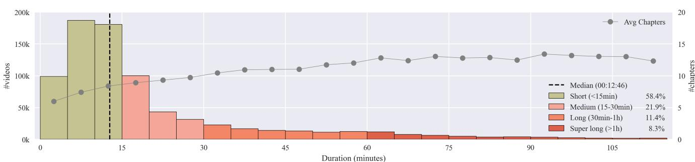  
Figure A.1. Video duration distribution: Distribution of video durations in our training set (bars, left axis) and average number of chapters per duration bin (gray line, right axis). Most videos are less than 15 minutes long, with progressively fewer videos at longer durations. The average number of chapters increases with video duration but plateaus around 13 chapters for videos longer than one hour.

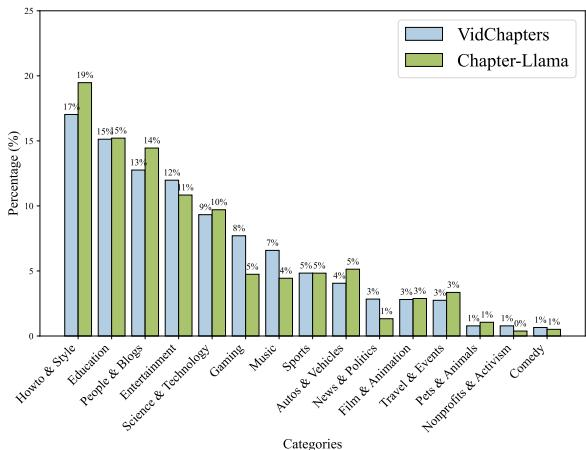  
Figure A.2. Video category distribution: We compare the distribution of video categories between the training set of the full VidChapters-7M dataset and our 20k training subset. We observe similar distributions given our uniform sampling from the original training set.

Table A.2. Effect of chapter titles on timestamp prediction: We evaluate training Chapter-Llama with only timestamps or with timestamps and chapter titles, and observe that adding chapter titles slightly improves the segmentation metrics (F1: $+ 0 . 6$ , tIoU: $+ 0 . 2 )$ .   

<table><tr><td>Ground Truth Format</td><td>F1</td><td>tIoU</td><td>S</td><td>C</td></tr><tr><td>HH:MM:SS</td><td>42.0</td><td>70.4</td><td>-</td><td>-</td></tr><tr><td>HH:MM:SS - Title</td><td>42.6</td><td>70.6</td><td>16.4</td><td>82.4</td></tr></table>

# C.2. ASR timestamp representation

As mentioned in Sec. 3, we use ASR outputs obtained with WhisperX [6], which contain start and end timestamps of each ASR segment. For our experiments, we only use the start timestamps, as opposed to using start and end timestamps of each ASR segment. In Tab. A.3, we analyze the impact of including end timestamps from ASR segments in addition to start timestamps. When using only speech inputs, including end timestamps improves performance (e.g., 41.4 vs 38.5 F1). However, when training with speech and captions, using only start timestamps performs better, particularly for title generation metrics (e.g., 82.4 vs 19.9 CIDEr). We hypothesize this is because captions only have single timestamps, so having ASR segments with both start and end times creates an inconsistency between modalities that degrades performance. Therefore, in our final model we use only start timestamps for ASR segments.

Table A.3. Adding end timestamps to ASR input: Adding end timestamps to ASR transcripts improves performance when using only speech $\left( + 2 . 9 \mathrm { F } 1 \right)$ ). However, when combining speech with captions, including end timestamps decreases performance significantly, especially on title metrics (e.g., 19.9 vs 82.4 CIDEr). We hypothesize this may be due to the inconsistency between modalities, where captions have single timestamps while speech segments have start and end times.   

<table><tr><td colspan="2">Modalities</td><td>ASR</td><td colspan="2">Segmentation</td><td colspan="2">Titles</td></tr><tr><td>Speech</td><td>Capt.</td><td>timestamp</td><td>F1</td><td>tIoU</td><td>S</td><td>C</td></tr><tr><td>√</td><td>-</td><td>start end start</td><td>41.4 38.5</td><td>69.7 68.1</td><td>15.8 13.9</td><td>77.9 67.3</td></tr><tr><td>✓</td><td>L</td><td>start end start</td><td>39.1 42.6</td><td>67.6 70.6</td><td>6.0 16.4</td><td>19.9 82.4</td></tr></table>

# C.3. Modality prefixes

In Tab. A.4, we analyze the impact of adding modality prefixes (“ASR:” and “Caption:”) before each text segment in the interleaved input sequence. Without prefixes, the model must infer the modality type implicitly - for captions this may be easier since they often start with “The image shows”, while ASR segments have varied structure. Results show that explicitly marking modalities with prefixes improves performance across all metrics (e.g., 42.6 vs 41.9 F1), suggesting that helping the model distinguish between modalities is beneficial.

# C.4. Alternative frame selection strategies

In the main paper, given a detected chapter boundary from our speech-only model, we select frames at the boundary location itself. In Tab. A.5, we explore alternative frame sampling strategies, including: (1) shot boundaries or midpoints detected with PySceneDetect [12], $( 2 ) \pm 1$ sec before and after speech-based chapter boundary predictions, (3) speechbased Chapter-Llama (CL) predicted boundary locations and midpoints between these locations. See the caption for comments.

Table A.4. Effect of modality prefixes: Adding prefixes to the ASR and captions modalities improves performance.   

<table><tr><td>Has prefix?</td><td>F1</td><td>tIoU</td><td>S</td><td>C</td></tr><tr><td></td><td>41.9</td><td>69.6</td><td>16.0</td><td>78.5</td></tr><tr><td>✗</td><td>42.6</td><td>70.6</td><td>16.4</td><td>82.4</td></tr></table>

Table A.5. Alternative frame selection strategies: We evaluate alternative frame sampling strategies including: (1) shot boundaries and midpoints detected with PySceneDetect [12], (2) frames sampled $\pm 1$ second around chapter boundaries predicted by our speech-based Chapter-Llama (CL) model, (3) frames at CL predicted boundaries and midpoints between them. Results show that sampling at CL boundaries achieves competitive performance across all metrics while requiring significantly fewer frames (10.3 vs 20.6-49.4 frames per video).   

<table><tr><td>Frame selection for captions</td><td>#frames ↓</td><td>F1</td><td>tIoU</td><td>S</td><td>C</td></tr><tr><td>Shot midpoints</td><td>49.4</td><td>40.8</td><td>69.1</td><td>15.6</td><td>77.0</td></tr><tr><td>Shot boundaries</td><td>49.4</td><td>40.6</td><td>69.1</td><td>15.8</td><td>79.3</td></tr><tr><td>Speech-based CL ±1 sec</td><td>20.6</td><td>42.7</td><td>69.5</td><td>16.5</td><td>83.2</td></tr><tr><td>Speech-based CL midpoints</td><td>10.3</td><td>41.2</td><td>69.0</td><td>15.6</td><td>73.7</td></tr><tr><td>Speech-based CL boundaries</td><td>10.3</td><td>42.6</td><td>70.6</td><td>16.4</td><td>82.4</td></tr></table>

Table A.6. Effect of training data size on speech-based frame selector: We analyze how the amount of training data used for the speechonly frame selector (first column) affects downstream performance of our Chapter-Llama (CL) model. The frame selector is trained on either 1k or 10k videos to predict frame locations where captions should be extracted, while the CL is trained on either 1k or 10k different videos for chapter generation. Comparing rows 1 vs 3 and 2 vs 4, we observe that increasing frame selector training data from 1k to 10k videos has minimal impact on segmentation metrics, but slightly improves title generation. In contrast, increasing CL training data from 1k to 10k videos (rows 1 vs 2 and 3 vs 4) improves both segmentation and title metrics.   

<table><tr><td colspan="2"># videos F. selector</td><td colspan="2">Segmentation</td><td colspan="2">Titles</td></tr><tr><td rowspan="2">1k</td><td>CL 1k</td><td>F1 42.7</td><td>tIoU</td><td>S</td><td>C</td></tr><tr><td>10k</td><td>46.9</td><td>70.8 72.9</td><td>15.6 17.5</td><td>78.1 86.8</td></tr><tr><td rowspan="2">10k</td><td>1k</td><td>42.6</td><td>70.6</td><td>16.4</td><td>82.4</td></tr><tr><td>10k</td><td>46.7</td><td>72.2</td><td>18.6</td><td>96.4</td></tr></table>

Throughout our experiments, we train the speech-only model using 10k videos to obtain frame locations for caption extraction (and 1k videos in most of our experiments to train our Chapter-Llama model). In Tab. A.6, we analyze how the amount of training data in the speech-only model affects downstream performance on our Chapter-Llama model using both speech and captions.

# C.5. Training data size on the frame selection model

The second to last row (42.6 F1) represents our main result reported in our ablations, and the last row (46.7 F1) shows results when using 10k videos for speech-only model training and 10k videos for Chapter-Llama (CL) model training, corresponding to the final point in the number of training videos vs performance plot in Fig. 4 of the main paper. The first two rows show new results using only 1k videos to train the speech-only model. We observe that increasing training data for the speech-only frame selector model from 1k to 10k videos has minimal impact on segmentation metrics but improves title generation performance in both cases – from 17.5 to 18.6 SODA when using 10k videos for Chapter-Llama training, and from 15.6 to 16.4 SODA when using 1k videos for Chapter-Llama training. Increasing the training data from 1k to 10k videos for our Chapter-Llama model improves performance on both segmentation and title benchmarks, with F1 scores improving from 42.7 to 46.9 and from 42.6 to 46.7, respectively.

Table A.7. Frame selector and Chapter-Llama training data overlap: Given the set of videos used to train the speech-based frame selector model $( V _ { F . S . } )$ and and the Chapter-Llama model $( V _ { C , L . } ) _ { \mathrm { { \Omega } } }$ we compare the performance of Chapter-Llama when using different subsets of videos $( V _ { F . S . } \neq V _ { C . L . } )$ , and when using the same, already seen, videos $( V _ { F . S . } = V _ { C . L . } )$ . We see that using the same 1k set of videos for both models decreases performance.   

<table><tr><td>Training data</td><td>F1</td><td>tIoU</td><td>S</td><td>C</td></tr><tr><td>VF.S.=VC.L.</td><td>41.4</td><td>70.1</td><td>15.1</td><td>77.5</td></tr><tr><td>VF.S.6=VC.L.</td><td>42.7</td><td>70.8</td><td>15.6</td><td>78.1</td></tr></table>

# C.6. Separate training data for frame selector and Chapter-Llama

In all our experiments, we use a different subset of videos to train the frame selector model and the Chapter-Llama model. In Tab. A.7, we analyze the performance of Chapter-Llama when using the same set of 1k videos for both models or when using a different set of 1k videos for the Chapter-Llama model. We see that using the same set of videos for both models decreases performance. We hypothesize that this performance drop occurs due to overfitting in the training pipeline: When both models are trained on the same videos, the outputs of the frame selector align very closely with the ground truth locations for those specific videos. This creates an artificial correlation between frame locations and content that the Chapter-Llama model learns to exploit during training. As a result, Chapter-Llama develops an over-reliance on the precise temporal positions of frames rather than learning to refine the location information.

# C.7. LLM variants

We conduct experiments with different variants of the Llama model family. All our previous results use Llama-3.1-8BInstruct, and we now compare it against the more recent

Table A.8. Llama variants: Model size has a significant impact on performance on Llama3.2 family. Llama-3.1-8B remains our choice due to its competitive performance with manageable computational complexity.   

<table><tr><td>Llama</td><td>Speech</td><td>Captions</td><td>F1</td><td>tIoU</td><td>S</td><td>C</td></tr><tr><td rowspan="2">Llama-3.2-1B</td><td>;</td><td>-</td><td>23.5</td><td>58.3</td><td>6.9</td><td>23.9</td></tr><tr><td></td><td>✓</td><td>24.6</td><td>58.6</td><td>7.4</td><td>28.0</td></tr><tr><td rowspan="2">Llama-3.2-3B</td><td>;</td><td>;</td><td>35.2</td><td>66.7</td><td>10.5</td><td>52.5</td></tr><tr><td></td><td></td><td>34.7</td><td>65.2</td><td>12.5</td><td>63.6</td></tr><tr><td rowspan="2">Llama-3.2-11B</td><td>\</td><td>;</td><td>39.8</td><td>67.9</td><td>14.8</td><td>71.1</td></tr><tr><td></td><td></td><td>n/a</td><td>n/a</td><td>n/a</td><td>n/a</td></tr><tr><td rowspan="2">Llama-3.1-8B</td><td>;</td><td></td><td>38.5</td><td>68.1</td><td>13.9</td><td>67.3</td></tr><tr><td></td><td>;</td><td>42.6</td><td>70.6</td><td>16.4</td><td>82.4</td></tr></table>

Llama-3.2 model in three sizes: 1B, 3B, and 11B parameters.

As shown in Tab. A.8, model size has a significant effect on chaptering quality. Using speech only, the F1 score improves substantially from 23.5 to 35.2 to 38.5 as we scale from 1B to 3B to 8B parameters, with only a minor additional gain to 39.8 when scaling to 11B parameters. This trend holds across all metrics. Llama-3.1-8B performs similar to Llama-3.2-11B, which we use in our final model due to reduced computational complexity. Note that we were unable to run Llama-3.2-11B on our final model combining speech and captions due to hardware constraints.

# C.8. LoRA rank

In Tab. A.9, we conduct experiments comparing LoRA ranks $r = 8$ and $r = 1 6$ across different training data sizes. With 1k training videos, the lower rank $r = 8$ performs notably better (42.6 vs $3 9 . 9 \mathrm { F } 1$ score). As we increase to 5k videos, $r = 1 6$ shows a slight advantage (46.5 vs 45.6 F1), while at 10k videos both ranks achieve comparable performance (46.7 vs 46.6 F1). This suggests that with limited training data, a lower rank helps prevent overfitting, while with more data the model capacity becomes less critical. Based on these findings and considering efficiency, we use $r { = } 8$ as our default LoRA rank throughout all experiments in the paper.

# C.9. Training on videos of various durations

In most of our experiments, we have trained our model on 1k videos balanced across duration categories, i.e., 333 short videos $( < 1 5 \ \mathrm { m i n } )$ ), 333 medium-length videos $( 1 5 { - } 3 0 \mathrm { m i n } )$ , and 334 long videos $( 3 0 \mathrm { - } 6 0 \mathrm { m i n } )$ ). In Tab. A.10, we show the benefit of such training on videos of various durations. For this experiment, we train new models only on 1k short videos, on 1k medium videos, and on 1k long videos. For evaluation, we use the same 300 validation videos as before, with 100 videos sampled from each duration category. As expected, training on short videos performs best on short videos (49.7 F1), while training on long videos performs best on long videos (40.4 F1). Training with a balanced mix of all three durations achieves the best overall performance across all categories (42.6 F1).

Table A.9. LoRA rank: Comparing LoRA ranks $\mathrm { r } { = } 8$ and $_ { \mathrm { r = 1 6 } }$ , we find that with 1k training videos, the lower rank performs better. With $^ { 5 \mathrm { k } }$ videos, $_ { \mathrm { r = 1 6 } }$ slightly outperforms $\mathrm { r } { = } 8$ . At 10k videos, both ranks achieve similar results, suggesting that with sufficient training data, model capacity becomes less important.   

<table><tr><td>#videos</td><td>rank</td><td>F1</td><td>tIoU</td><td>S</td><td>C</td></tr><tr><td>1k</td><td>8 16</td><td>42.6 39.9</td><td>70.6 68.5</td><td>16.4 15.6</td><td>82.4 78.4</td></tr><tr><td>5k</td><td>8 16</td><td>45.6 46.5</td><td>72.3 72.8</td><td>18.3 18.5</td><td>90.0 92.8</td></tr><tr><td>10k</td><td>8 16</td><td>46.7 46.6</td><td>72.2 72.4</td><td>18.6 18.6</td><td>96.4 92.5</td></tr></table>

# C.10. Oracle experiments with partial ground truth input

To evaluate the Chapter-Llama model’s capability in predicting chapters when provided with ground-truth chapter boundaries or titles, we conduct experiments with two scenarios: (i) incorporating ground truth timestamps into the input, and (ii) including ground truth chapter titles. In the first scenario, the task represents an upper bound limit of title metrics for our model, as it predicts chapters based on known timestamps. In the second scenario, the model predicts chapters using known titles, serving as a form of video chapter grounding. As demonstrated in Tab. A.11, these experiments establish the upper bounds of our model’s performance.

# C.11. Performance on videos that have no speech

As mentioned in Sec. 4, most of the videos $( > 9 7 \% )$ in the dataset have speech content. For the videos that have no ASR detections, we use every 10s sampling. We now investigate the performance of our approach when there is no ASR available. In Tab. A.12, we select all videos in the validation set without ASR, totaling 190 videos, and compare the performance to Vid2Seq [113]. We observe that the performance of both models is worse than when ASR is available, suggesting that both models mainly benefit from speech input. However, our approach still outperforms Vid2Seq in this challenging setting. By visually inspecting some of these videos, we noticed failure cases with music videos, with very similar backgrounds across frames, which makes it difficult for the model to detect chapter boundaries without any audio information. This is left to future work, as stated in the conclusions of the main paper. We also notice success cases often depict frames with text, which are captured by the captioner (see first and last examples in Fig. A.7).

# C.12. Full set of metrics

In Sec. 4.1 of the main paper, we adopted the evaluation metrics (F1, tIoU, SODA, and CIDEr), which we consider more suitable for assessing video chapter generation. For completeness and direct comparison with VidChapters [112], we also report results using their full set of metrics in Tabs. A.13 and A.14. The segmentation metrics include precision and recall at 3-second and 5-second thresholds, as well as at 0.5 and 0.7 IoU thresholds. The full metrics (referred to as ‘global metrics’ by [112]) comprise SODA (S) [26], BLEU (B1-B4) [67], CIDEr (C) [97], METEOR (M) [7], and ROUGE-L (RL) [51]. Our model consistently outperforms Vid2Seq [113] across all metrics.

Table A.10. Including long videos at training improves results: Training with 1k videos balanced across short, medium, and long durations (last row, ‘All’) improves performance compared to training with just 1k short videos (first row). The improvement is most pronounced for long videos $( + 2 . 5 \mathrm { F } 1 )$ ). When averaging across short/medium/long validation splits, training with all videos improves all metrics: F1 $_ { ( + 0 . 6 ) }$ , tIoU $( + 0 . 8 )$ , S $_ { ( + 0 . 6 ) }$ , and C $( + 3 . 2 )$ .   

<table><tr><td rowspan="2">Training videos</td><td colspan="4">Short (val)</td><td colspan="4">Medium (val)</td><td colspan="4">Long (val)</td><td colspan="4">All (val)</td></tr><tr><td>F1</td><td>tIoU</td><td>s</td><td>C</td><td>F1</td><td>tIoU</td><td>S</td><td>C</td><td>F1</td><td>tIoU</td><td>S</td><td>C</td><td>F1</td><td>tIoU</td><td>S</td><td>C</td></tr><tr><td>Short</td><td>49.7</td><td>75.0</td><td>21.4</td><td>112.9</td><td>38.3</td><td>67.6</td><td>13.2</td><td>61.4</td><td>37.9</td><td>66.7</td><td>12.8</td><td>63.3</td><td>42.0</td><td>69.8</td><td>15.8</td><td>79.2</td></tr><tr><td>Medium</td><td>47.5</td><td>74.6</td><td>21.3</td><td>109.8</td><td>37.9</td><td>67.5</td><td>13.2</td><td>55.6</td><td>38.3</td><td>67.0</td><td>13.3</td><td>63.5</td><td>41.2</td><td>69.7</td><td>15.9</td><td>76.3</td></tr><tr><td>Long</td><td>46.6</td><td>74.0</td><td>19.5</td><td>104.9</td><td>39.3</td><td>68.1</td><td>13.4</td><td>62.0</td><td>38.1</td><td>66.9</td><td>14.3</td><td>75.1</td><td>41.3</td><td>69.7</td><td>15.8</td><td>80.8</td></tr><tr><td>All</td><td>48.4</td><td>74.4</td><td>21.2</td><td>110.8</td><td>38.9</td><td>68.0</td><td>13.1</td><td>57.3</td><td>40.4</td><td>69.3</td><td>14.9</td><td>79.1</td><td>42.6</td><td>70.6</td><td>16.4</td><td>82.4</td></tr></table>

Table A.11. Oracle experiment with partial ground truth input: We evaluate the capability of Chapter-Llama in predicting chapters when provided with ground truth chapter boundaries or titles. The first scenario represents an oracle experiment for title metrics, as it predicts chapters based on known timestamps (second row). The second scenario serves as a form of video chapter grounding, i.e., given known titles to segment the boundaries (last row). The model was trained with 1k videos and evaluated with 300 videos.   

<table><tr><td>Boundaries</td><td>Titles</td><td>F1</td><td>tIoU</td><td>S</td><td>C</td></tr><tr><td>X</td><td>X</td><td>42.6</td><td>70.6</td><td>16.4</td><td>82.4</td></tr><tr><td>✓</td><td>X</td><td>99.1</td><td>99.7</td><td>23.8</td><td>121.4</td></tr><tr><td>X</td><td>✓</td><td>64.0</td><td>80.1</td><td>71.5</td><td>506.3</td></tr></table>

Table A.12. Performance on validation videos without ASR: We evaluate the performance of our best performing model in videos without ASR predictions (190 videos in validation). We observe that the Chapter-Llama outperforms Vid2Seq in all metrics, but the performance of both models is worse than when ASR is available.   

<table><tr><td>Method</td><td>F1</td><td>tIoU</td><td>S</td><td>C</td></tr><tr><td>Vid2Seq [113]</td><td>12.6</td><td>45.5</td><td>5.5</td><td>18.0</td></tr><tr><td>Chapter-Llama (ours)</td><td>15.5</td><td>49.6</td><td>5.0</td><td>26.3</td></tr></table>

# C.13. Repetition analysis

We have noticed that Vid2Seq tends to repeat chapter titles (see Fig. 3 of the main paper). To quantify this, we calculate the ratio of unique chapter titles to the total number of chapter titles predicted for each video and then average this ratio across all videos in the test set. For the ground truth, this average ratio is $9 9 . 6 \%$ , i.e., almost all chapter titles are unique. For our finetuned model, this average ratio is $9 6 . 3 \%$ . In contrast, Vid2Seq has a much lower average ratio of $6 3 . 5 \%$ , indicating that it indeed repeats chapter titles frequently.

# C.14. Accuracy of number of chapter predictions

While our main evaluation focused on the quality of chapter segment predictions, it is also important to assess the accuracy in predicting the number of chapters. Our primary metrics (F1, tIoU, SODA, and CIDEr) do not directly indicate whether the predicted chapter count is correct or if the method tends to overor under-segment. To evaluate this, we analyze the distribution of differences between predicted and ground truth chapter counts for Chapter-Llama, Zero-shot, and Vid2Seq models, as illustrated in Fig. A.3.

The results reveal that Chapter-Llama exhibits the most concentrated distribution centered around zero, indicating superior accuracy in predicting chapter counts. In contrast, both Zero-shot and Vid2Seq models over-segments the video with a high number of chapters. The tight interquartile range and symmetrical density shape of Chapter-Llama suggest a more reliable chapter count prediction. However, it is important to note that accurately predicting the number of chapters does not necessarily guarantee correct chapter segmentation.

# D. Additional Qualitative Analyses

We present several qualitative analyses: (i) evaluation metric calculation examples (Appendix D.1), (ii) caption visualizations (Appendix D.2), and (iii) predictions from our model (Appendix D.3).

# D.1. Evaluation metrics

In Sec. 4.1, we introduced our primary evaluation metrics for video chaptering: tIoU and F1 scores. Here, we illustrate how these metrics are calculated using concrete examples, as shown in Fig. A.4.

For tIoU (temporal Intersection over Union), we first match predicted and ground truth segments by greedily selecting pairs with the highest IoU scores. In the top example of Fig. A.4, we have 5 ground truth chapters and 4 predicted chapters. The matching process starts with chapters having the most overlap, and each chapter can only be used once. The tIoU score (84.7) is then calculated as the mean IoU across all matched pairs (97.6, 53.6, 89.3, 98.3). Similarly, for the bottom example, the tIoU score of 49.4 is the mean of 60.7, 47.14, and 40.3.

Table A.13. Video chapter generation (segmentation metrics) on VidChapters [112] test set: Comparison of segmentation metrics between Vid2Seq and our best model from Tab. 1. Metrics include precision and recall at 3-second and 5-second thresholds, as well as at 0.5 and $0 . 7 \mathrm { I o U }$ thresholds. Our method consistently outperforms Vid2Seq across all metrics.   

<table><tr><td>Method</td><td>P@5s</td><td>R@5s</td><td>P@3s</td><td>R@3s</td><td>P@0.5</td><td>R@0.5</td><td>P@0.7</td><td>R@0.7</td></tr><tr><td>Vid2Seq [113]</td><td>30.6</td><td>36.4</td><td>24.4</td><td>28.7</td><td>46.3</td><td>51.1</td><td>28.7</td><td>30.6</td></tr><tr><td>Chapter-Llama</td><td>52.0</td><td>51.7</td><td>45.1</td><td>44.7</td><td>66.3</td><td>63.4</td><td>49.9</td><td>47.8</td></tr></table>

Table A.14. Full metrics used by VidChapters [112]: We report the full metrics (referred to as ‘global metrics’ in [112]) on the test set of VidChapters. We compare Vid2Seq and our best model from Tab. 1. Metrics include SODA [26] (S), BLEU [67] (B1-B4), CIDEr [97] (C), METEOR [7] (M), and ROUGE-L [51] (RL). Our method consistently outperforms Vid2Seq across all metrics.   

<table><tr><td>Method</td><td>S</td><td>B1</td><td>B2</td><td>B3</td><td>B4</td><td>C</td><td>M</td><td>RL</td></tr><tr><td>Vid2Seq [113]</td><td>11.6</td><td>11.1</td><td>7.7</td><td>4.5</td><td>3.1</td><td>55.8</td><td>9.6</td><td>12.8</td></tr><tr><td>Chapter-Llama</td><td>19.3</td><td>19.5</td><td>14.3</td><td>8.7</td><td>5.6</td><td>100.9</td><td>15.4</td><td>22.2</td></tr></table>

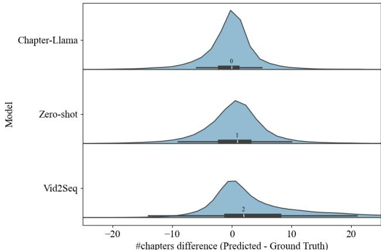  
Figure A.3. Accuracy of number of chapter predictions: The violin plot shows the distribution of differences between the predicted and ground truth number of chapters for three video chaptering models: Chapter-Llama, Zero-shot, and Vid2Seq. The Chapter-Llama model exhibits the most concentrated distribution centered around 0, indicating accurate number of chapter prediction. The Zero-shot model tends to slightly overpredict the number of chapters, while the Vid2Seq model often significantly overpredicts the number of chapters. The median differences are 0, 1, and 2 for Chapter-Llama, Zero-shot, and Vid2Seq, respectively, with mean number of chapter differences of -0.2, 0.5, and 4.5 (not shown).

For the F1 score, we compute precision and recall at different IoU thresholds (from 0.5 to 0.95 with a step of 0.05). In the top example, at a threshold of 0.5, all predicted chapters have a ground truth match with an overlap higher than $50 \%$ , resulting in a precision of $100 \%$ . However, one ground truth chapter out of 5 is left without a prediction, leading to a recall of $80 \%$ . The F1 score is then computed as the harmonic mean of precision and recall. This process is repeated for all thresholds, and the final F1 metric is the average across these thresholds.

# D.2. Visualizing captions

In Fig. A.5, we provide an example, where we also visualize some of the intermediate captions that are fed to our chapter generation LLM. We then show the chapter predictions from the speech-based frame selection model, the corresponding captions selected based on this model, and the refined predictions with Chapter-Llama.

# D.3. Chapter-Llama prediction examples

Similar to Fig. 3 of the main paper, in Fig. A.6, we present two additional examples comparing our method against Vid2Seq and our zero-shot baseline.

In Fig. A.7, we show three examples of our Chapter-Llama predictions compared to the ground truth (GT) for videos without speech $3 \%$ of the data). We observe that many of the completely ‘speechless’ videos contain OCR-readable text to help the viewer follow the video (top and bottom examples), in which cases the captioners tend to perform OCR, leading to satisfactory chaptering results. Otherwise, in case of no onscreen text and no speech (e.g., only music), the result is inferior, though still acceptable (middle example). As also evaluated in Tab. A.12, our model still achieves reasonable quantitative performance, even if speech indeed tends to be more informative for chaptering than visual modality [112].

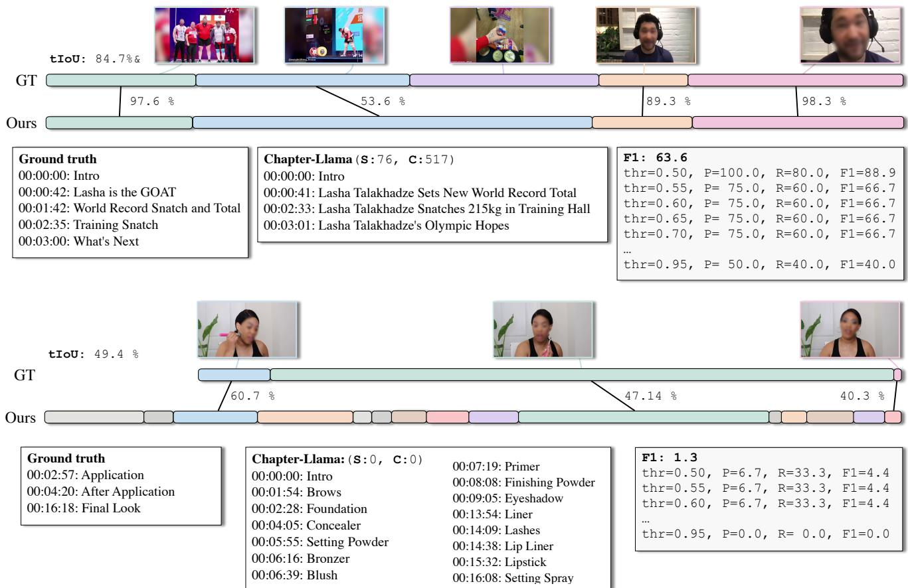  
Figure A.4. Segmentation metrics visualization: We illustrate with examples how tIoU and F1 scores are calculated for video chaptering. The top example shows a high-quality prediction with good overlap, while the bottom example demonstrates a lower-quality prediction with more misalignments. We additionally show the corresponding SODA (S) and CIDEr (C) scores.

# Ground truth

00:00: Day 12, begin   
01:38: Homepage   
09:14: Project pages   
11:40: Contact page   
12:28: Recap

# Frame selector(S: 49, C: 187)

00:00: Introduction   
01:38: Backup   
02:00: Home Page   
08:14: Project Pages   
11:40: Contact Page   
12:28: Recap

# Chapter-Llama(S: 54, C: 225)

00:00: Introduction   
01:38: Light Mode   
08:14: Project Pages   
11:40: Contact Page   
12:28: Recap

# Captions

- 00:00: The image features the word "webflow" written in white text against a black background.

01:38: The image depicts a man standing in front of a desk with a large bookshelf behind him. The bookshelf is filled with numerous books, suggesting that the setting might be a library or a study area. The man appears to be engaged in a conversation or giving a presentation, as he is gesturing with his hands. There are also some potted plants and a clock visible in the background, adding to the ambiance of the room.

02:00: The image depicts a man sitting at a desk in a room filled with bookshelves. He appears to be in a library or a study area. The man is wearing a dark-colored shirt and is engaged in a conversation, possibly giving a presentation or discussing something with someone. The room is well-lit, and there are various items around the man, including a clock, a potted plant, and a few books on the shelves.

- 08:14: The image shows a screenshot of a webpage or application interface, likely a project management or portfolio platform, where a user can view and manage their selected projects.

11:40: The image depicts a man standing in front of a desk in a room filled with bookshelves. The man appears to be in a library or a study area, as there are numerous bookshelves surrounding him. He is wearing a dark-colored sweater and is engaged in a conversation, possibly giving a presentation or discussing a topic. The room also features a clock on the wall, adding to the academic or intellectual ambiance of the setting.

12:28: The image shows a screenshot of a webpage with a purple and white color scheme. The main text on the page is in a large, bold font and reads "I'd love to hear from you! Let's work together!" The page also includes a form with a purple background and a purple button that says "Let's work together!" The user interface suggests that the webpage is likely a form for contacting or working with someone, possibly a business or service provider.

Figure A.5. Visualizing captions: We provide an example with chapter predictions using the speech-based frame selection model, the corresponding captions sampled, and the refined predictions produced by Chapter-Llama. We additionally show the corresponding SODA (S) and CIDEr (C) scores. We see that the initially predicted chapter at timestamp 02:00 is suppressed by Chapter-Llama.

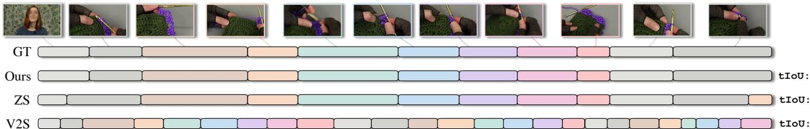

# Ground truth

00:01:46: Double Crochet Criss Cross Border   
00:03:35: Granny Square Border   
00:07:13: V Stitch (Basic   
00:08:56: V Stitch (Variation   
00:12:23: Front Post Back Post Border   
00:14:29: Treble & Chain   
00:16:29: Basic Shell   
00:18:32: Open Lattice Shell   
00:19:39: Single Crochet Ruffle   
00:21:49: Standing Ruffles

# Chapter-Llama(S:38, C:296)

00:00:00: Intro   
00:01:46: Double Crochet Crisscross Border   
00:03:34: Granny Square Border   
00:07:13: Basic V-Stitch Border   
00:08:56: V-Stitch Variation Border   
00:12:23: Front Post Back Post Double Crochet Border   
00:14:29: Treble and Chain Border   
00:16:29: Basic Shell Border   
00:18:32: Open Lattice Shell Border   
00:19:39: Single Crochet Border   
00:21:49: Standing Ruffle Border   
Zero-shot:(S:4, C:6)   
00:00:00: Introduction to the video and the topic of crochet borders   
00:01:00: Introduction to the materials and the first pattern, the double crochet crisscross border   
00:03:33: Working the double crochet crisscross border around corners   
00:07:13: Working the granny square border around corners   
00:08:55: Working the basic V-stitch border around corners   
00:12:22: Working the V-stitch variation border around corners   
00:14:28: Working the front post back post double crochet border around corners   
00:16:28: Working the treble and chain border around corners   
00:18:31: Working the basic shell border around corners   
00:19:38: Working the open lattice shell border around corners   
00:21:48: Working the single crochet border around corners   
00:24:24: Working the standing ruffle border around corners and conclusion   
Vid2Seq:(S:2, C:8)   
00:00:00: Intro.   
00:00:45: Materials.   
00:01:31: Double crochet crisscross border.   
00:03:18: Double crochet swoop border.   
00:04:19: Double crochet swoop border.   
00:05:36: Double crochet swoop border.   
00:06:52: Double crochet swoop border.   
00:24:11: Outro.

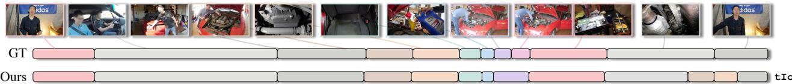

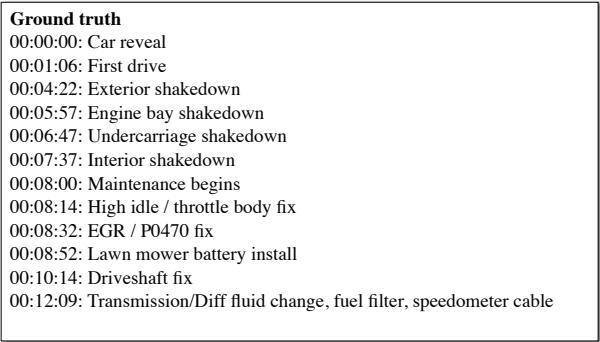  
Figure A.6. Additional qualitative examples: We show two more examples of our Chapter-Llama predictions compared to the ground truth (GT). Our method generates accurate temporal boundaries and relevant chapter titles that align well with the video content. For each example, we display the corresponding SODA (S) and CIDEr (C) scores.

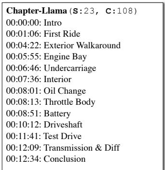

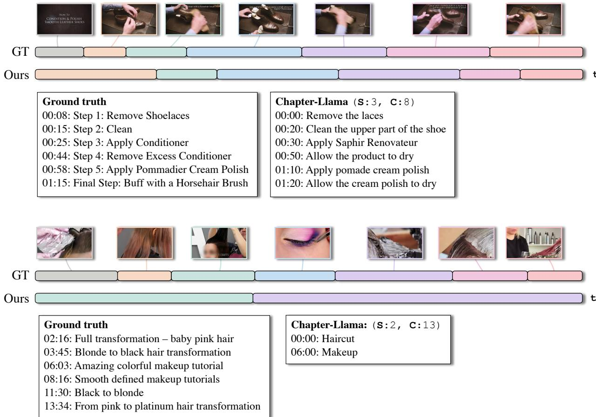

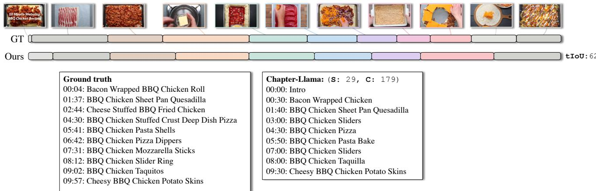  
Figure A.7. Additional qualitative examples without ASR: We show three examples of videos without speech, comparing our Chapter-Llama predictions to ground truth (GT). Despite lacking ASR, our method still produces reasonable chapters by leveraging visual cues and on-screen text when available (top and bottom examples). For each example, we display the corresponding SODA (S) and CIDEr (C) scores.