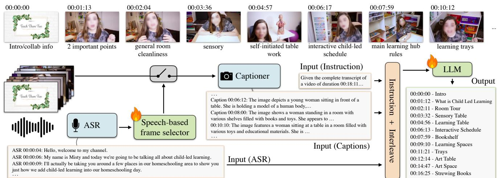

[← 返回 README](../README.md)

# 3. Chapter-Llama: LLM-based Video Chaptering

## 📌 预览
方法包含四个组件：(1) 任务定义，(2) Speech-based frame selection，(3) 视频到文本的映射，(4) LLM 预测 + 迭代推理。

---

We provide an overview of our video chaptering framework, referred to as Chapter-Llama, in Fig. 2. Given video frames and speech transcripts, we aim at predicting relevant chapter boundaries and titles. For this, we first select video frames to process with a speech-based frame selection module. Then we use an off-the-shelf visual captioner to map the selected frames in the text space. We feed the resulting captions, along with speech transcripts, to the LLM which outputs the chapter boundaries and titles jointly as a single sequence of tokens. Finally, we devise an iterative prediction procedure in case the input text sequence is too long to handle for the LLM. We next describe in more detail each component.

> 💡 **方法概览**（四步流水线）:
> 1. Speech-based frame selection → 选关键帧
> 2. Visual captioner → 帧转文本
> 3. ASR + Caption 交错排列 → 输入 LLM
> 4. LLM → 输出章节时间戳 + 标题

---

### Task formulation

Video chaptering [112] aims at segmenting a video into semantically meaningful chapters, and generating a title for each segment. The chapters are contiguous, with no gaps between them, and together span the entire video duration from start to end. Formally, given video frames $V = ( v _ { 1 } , v _ { 2 } , . . . , v _ { N } )$ and temporally-aligned speech transcripts $\boldsymbol { S } = ( s _ { 1 } , s _ { 2 } , . . . , s _ { M } )$ , where each speech transcript contains an utterance and its associated start and end timestamps, the task is to output a sequence of chapters $C = ( c _ { 1 } , c _ { 2 } , . . . , c _ { L } )$ , where each chapter $c _ { i }$ is a tuple $\left( \boldsymbol { b } _ { i } , t _ { i } \right)$ containing a start timestamp $b _ { i }$ and a descriptive title $t _ { i }$ . The end time of chapter $i$ is implicitly defined by the start time of the subsequent chapter $b _ { i + 1 }$ , or total video duration if $i = L$ .

> 💡 **任务定义要点**:
> - 输入: 视频帧 V + 语音转录 S（带时间戳）
> - 输出: 章节序列 C = {(起始时间, 标题)}
> - 章节是**连续不间断**的，覆盖整个视频时长
> - 章节结束时间 = 下一章节的开始时间（隐式定义）

---

### Speech-based frame selection

Video chaptering involves processing hour-long videos. Therefore, densely sampling frames is computationally intractable due to numerous inference passes through a vision model (e.g., a visual captioner) and exceeding standard LLM context lengths. Upon inspection of our data, we found that while the speech transcription has 257 tokens per minute on average, a caption is 66 tokens long on average hence captions would take 3,960 tokens per minute when sampling a video at 1 FPS. To address these challenges, we employ a frame selection strategy.

> 💡 **为什么需要 frame selection**:
> - ASR: 257 tokens/min（紧凑）
> - Caption @1FPS: 3,960 tokens/min（爆炸！是 ASR 的 15 倍）
> - 密集 captioning 在 token 和计算上都不可行

Specifically, we use speech transcripts to guide which video frames to process for the vision model. This is done by first training a speech-only variant of our LLM to predict a sequence of chapter boundaries $\{ \hat { b } _ { 1 } , \hat { b } _ { 2 } , . . . , \hat { b } _ { K } \}$ from speech transcripts $S$ only. For each predicted boundary $\hat { b } _ { i }$ , we sample a frame $v _ { i }$ from the video at that timestamp. Note that this variant is cheaper compared to the full model as it only needs ASR transcription from the audio stream, without requiring any processing of the RGB stream (i.e., captioning). We then process the video frames only at the time locations predicted by this model. The visual information thus complements the previous 'blind' predictions from the narrations, and allows us to refine the predictions. This results in a video representation $V _ { s a m p l e d } = ( v _ { 1 } , v _ { 2 } , . . . , v _ { K } )$ where $K < < N$ . For the videos that lack speech entirely (e.g., about 3% of the videos in [112]), we sample frames at 10-second intervals, with an upper bound of 100 frames to maintain computational practicality.

> 💡 **Speech-based frame selection 流程**:
> ```
> ASR 转录 → Speech-only LLM → 预测章节边界 {b̂₁, b̂₂, ..., b̂ₖ}
>                                      ↓
>                              在这些时间点采样帧 → Caption
> ```
> - 平均只需 ~10 帧/视频（vs 100 帧等间距采样）
> - Speech-only LLM 和最终 LLM 共享 backbone，只是 LoRA 参数不同（各 13MB）
> - 无语音视频（~3%）：每 10 秒采一帧，上限 100 帧

---


*Figure 2. Method overview: Our Chapter-Llama framework first selects video frames to process using speech information. Then we use a visual captioner to map the selected frames in the text space. We feed the resulting captions, along with speech transcripts, to the LLM which outputs the chapter boundaries and titles jointly as a single sequence of tokens.*

> 💡 **Figure 2 批读**:
> - 上半部分：Speech-based frame selection（ASR → LLM → 选帧 → Captioner）
> - 下半部分：最终预测（ASR + Captions → LLM → Chapters）
> - 两个 LLM 共享 Llama-3.1-8B backbone，只换 LoRA 参数
> - Visual captioner 用的是 MiniCPM-V，对每个选中帧独立 captioning

---

### Mapping video to text with timestamps

To leverage the knowledge of a pretrained LLM, we map all our inputs to text. This includes: (1) speech transcriptions $\boldsymbol { S } = ( s _ { 1 } , s _ { 2 } , \dots , s _ { M } )$ from the audio modality, and (2) caption descriptions $V _ { c a p t i o n s } = ( d _ { 1 } , d _ { 2 } , . . . , d _ { K } )$ from the visual modality. In detail, for speech transcriptions, we use ASR outputs provided by [112], obtained using the Whisper-Large-V2 [73] model through the WhisperX [6] implementation. For captioning, we employ MiniCPM-V [115] as an image captioner, applied independently on the selected video frames, i.e., $d _ { i } { = } C a p t i o n e r ( v _ { i } )$ .

As we aim at predicting relevant chapter boundaries, we provide temporal information to the LLM. For both modalities, we prepend the timestamp information formatted as "HH:MM:SS" to encode the location at which the speech or caption is obtained.

Captions naturally come from a single point in time. Speech segments cover intervals, but their duration is typically very short (3-4 seconds). We therefore simply use the start time of each transcribed speech interval. We interleave the speech and caption inputs based on their timestamps in a sorted order. We add a modality-specific prefix to each timestamp to denote which modality the information is extracted from (i.e., ASR for speech transcripts, Caption for captions).

We prepend the text combining speech transcripts and captions with a fixed prompt that provides task instructions (see sup. mat. for the exact wording). This prompt occupies approximately 90 tokens and is independent of video length.

> 💡 **文本构造细节**:
> - ASR: Whisper-Large-V2 (WhisperX 实现)
> - Captioner: MiniCPM-V（每帧独立 caption，平均 66 tokens/caption）
> - 时间戳格式: "HH:MM:SS"
> - 交错排列示例:
>   ```
>   ASR 00:00:00: This place has blown our minds.
>   Caption 00:00:01: The image features two individuals...
>   ASR 00:00:04: Look at this.
>   ```
> - 模态前缀（ASR/Caption）有助于模型区分信息来源（实验验证）
> - 固定 prompt ~90 tokens，不随视频长度变化

---

### Language model

We derive our framework by making use of a powerful pretrained LLM. Specifically, we employ the recent Llama-3.1-8B-Instruct [21] model and further finetune on chapter annotations using the LoRA technique [36]. Given the input structure previously described, the LLM is trained to output chapters, where each chapter consists of a timestamp in HH:MM:SS format followed by a free-form chapter title. We treat both the timestamps and titles simply as text tokens and apply the standard cross-entropy loss over the original vocabulary of the pretrained LLM. We apply teacher forcing during training and decode tokens autoregressively at inference. Note that the final model (taking both speech and captions as input) is trained independently from the speech-only version of our model used for frame selection, but these two models share the same backbone, and only differ in their LoRA parameters (13MB each). Across all experiments, we finetune models for a single epoch and use the same hyperparameters. We provide these hyperparameters, along with implementation details in Appendix A, and provide experiments with several Llama variants in Appendix C.

> 💡 **LLM 训练细节**:
> - 基座: Llama-3.1-8B-Instruct
> - 微调: LoRA (rank=8, α=32, dropout=0.04, Q/V projections)
> - 输出格式: "HH:MM:SS - Chapter Title"（时间戳和标题都是文本 token）
> - Loss: 标准 cross-entropy
> - 训练: 1 epoch, batch_size=1, lr=1e-4, AdamW
> - 耗时: 40 min on 4×H100
> - LoRA 参数量: 13MB/模型（frame selector 和 final model 各一套）

---

### Iterative prediction for long videos

The inputs may exceed the context window limitation of the LLM, especially in the case of long videos. For example, on an A6000 GPU, the Llama-3.1-8B-Instruct [21] model can process videos up to around 15k tokens during training, which corresponds to 50 minutes of video content on average, and 25k tokens during inference, which corresponds to 80 minutes of video content on average. To address this issue, during training, we select videos that have less than 15k tokens. Since there are videos up to 1 hour long in the training set that satisfy this constraint, and since we do not need the entire training dataset to achieve good performance, this token limitation does not hinder our training. During evaluation, we predict chapters for each chunk sequentially, such that the start of a chunk is the end of the previous chunk. Finally, we merge the predictions from all chunks to obtain chapter boundaries for the complete video. We provide more details in Appendix A.4.

> 💡 **Iterative prediction（滑动窗口）**:
> - 训练时: 只选 <15k tokens 的视频（覆盖到 ~50min）
> - 推理时: 滑动窗口，每窗口 ~20-25k tokens（~80min）
> - 窗口间无重叠，前一窗口的结束 = 后一窗口的开始
> - 最后合并所有窗口的预测
>
> **关键 insight**: 不需要全部训练数据也能训好（10k 视频就够了），所以 15k token 限制实际上不影响训练

---

## 🔖 Section 总结

### 关键数字速查
| 指标 | 数值 |
|------|------|
| ASR tokens/min | 257 |
| Caption tokens/frame | 66 |
| 平均采样帧数 | ~10.3 |
| LoRA 参数量 | 13MB/模型 |
| 训练上下文窗口 | 15k tokens (~50min) |
| 推理上下文窗口 | 25k tokens (~80min) |
| 训练耗时 | 40min on 4×H100 |
| Prompt 长度 | ~90 tokens |

### 核心洞察
1. Speech-based frame selection 是效率的核心：从 100 帧降到 ~10 帧，但性能更好
2. 纯文本方案让 LLM 天然具备长上下文处理能力
3. 两阶段设计（frame selector + chaptering LLM）共享 backbone，只需不同 LoRA
4. Iterative prediction 简单有效地处理超长视频
