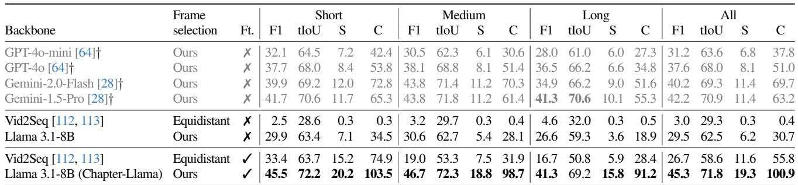
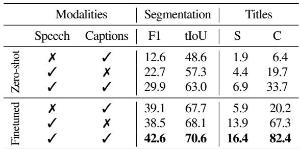
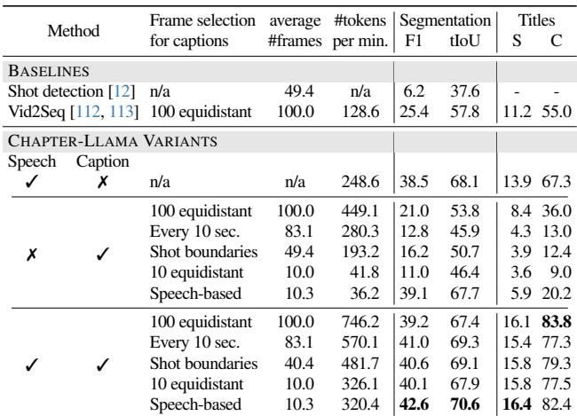
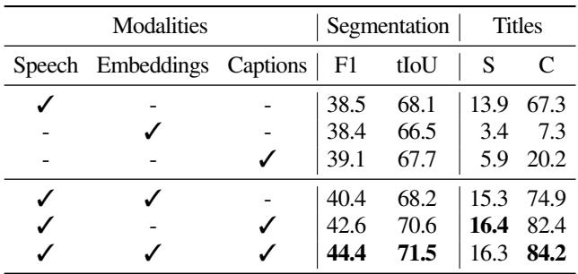
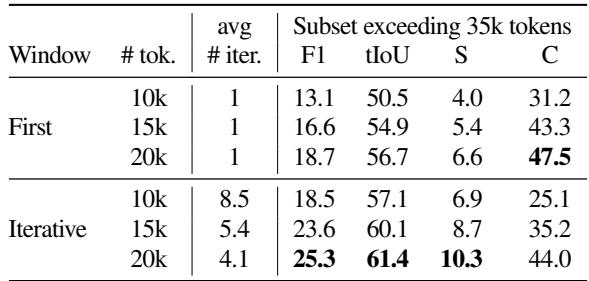

[← 返回 README](../README.md)

# 4. Experiments

## 📌 预览
在 VidChapters-7M 上全面评估：SOTA 对比（大幅超越 Vid2Seq）、消融实验（模态、帧采样、数据量、帧嵌入 vs caption）、迭代预测分析。

---

In this section, we start by describing the data and evaluation metrics used in our experiments (Sec. 4.1). Next, we compare our results with the state of the art (Sec. 4.2), and then provide a series of ablations in our framework (Sec. 4.3). Finally, we investigate the impact of testing with very long videos exceeding our context window limitations (Sec. 4.4).

---

## 4.1. Data and evaluation

**Data.** We train and evaluate on the recently released VidChapters-7M [112] dataset that includes user-annotated chaptered videos sourced from YouTube. Speech transcripts are obtained using Whisper [73] as the ASR method. In the original release, there is a total of 817k videos, spanning 8M chapters, with 2.4 minutes per chapter and 5.4 words per chapter title, totaling to 23 minutes and 8.3 chapters per video on average. Data is split into 801k training, 8.2k validation, and 8.2k test videos. To measure performance at different video lengths, we define three categories depending on video duration: 'short' (0-15min), 'medium' (15-30min), and 'long' (30-60min) videos. In this work, we use a subset of the training data as we observe increasing the training set brings diminishing returns at the cost of extended training times (see Fig. 4). Specifically, we use about 20k training videos (10k short videos used for the speech-based frame selection model and another 10k videos evenly split across short, medium and long durations for the final model). For state-of-the-art comparisons (Sec. 4.2), we employ the full official test set, which also contains videos without any speech (2.5% of the videos), and videos longer than 60 minutes (e.g., there are few videos that last about 12 hours). In ablations (Sec. 4.3), both for faster experimentation, and to limit the use of the test set during experimentation, we train on a randomly sampled subset of 1k videos (evenly split between short, medium, and long) and report results on a randomly sampled subset of 300 validation videos (100 from each duration) that have at least one speech utterance.

> 💡 **数据要点**:
> - VidChapters-7M: 817k 视频, 8M 章节, 平均 23min/视频, 8.3 章节/视频
> - **只用了 2.5% 训练数据（20k 视频）就超越了用全量数据的 Vid2Seq！**
> - 训练数据分配: 10k（speech-only frame selector）+ 10k（final model, 均分 short/medium/long）
> - 消融实验用更小的子集: 1k 训练 + 300 验证

**Evaluation metrics.** We primarily monitor temporal segmentation metrics to evaluate our chapter boundary detections. In particular, we employ tIoU and F1 scores. For tIoU (temporal Intersection over Union), we first compute the optimal matching between predicted and ground truth segments by greedily selecting pairs with highest IoU scores. The tIoU score is then calculated as the mean IoU across all matched pairs, multiplied by 100 to obtain a percentage. For F1 score, we first compute precision and recall at different IoU thresholds (ranging from 0.5 to 0.95 with a step of 0.05). At each threshold, a prediction is considered correct if it has IoU above the threshold with a ground truth segment. The precision is the ratio of correct predictions to total predictions, while recall is the ratio of matched ground truth segments to total ground truth segments. The F1 score is then computed as the harmonic mean of precision and recall. The final F1 metric is the average across all thresholds, multiplied by 100 to obtain a percentage. Note that [112] uses recall and precision metrics in two ways: (1) by considering timestamps within 3 or 5 second thresholds as matches, and (2) by considering segments with IoU above 0.5 or 0.7 as matches. While these metrics provide point estimates at specific thresholds, we find that tIoU and F1 scores offer several advantages: they evaluate performance continuously across multiple thresholds, are more interpretable, and provide a more comprehensive evaluation of the model. For completeness, we also report the metrics used in [112] in Appendix C.

For chapter title evaluation, we follow [112] and report SODA (S) [26] and CIDEr (C) [97], which measure the quality of the titles for the predicted segments that match to the ground segments (see [112] for details).

> 💡 **评估指标**:
> - **分段质量**: tIoU（时间 IoU 均值）、F1（多阈值 0.5-0.95 的平均）
> - **标题质量**: SODA (S)、CIDEr (C)
> - 比 [112] 的单阈值 P/R 更全面

---

## 4.2. Comparison with the state of the art

*Table 1. Comparison to the state of the art on VidChapters-7M test set: Chapter-Llama significantly outperforms Vid2Seq (45.3 vs 26.7 F1). Our method also achieves strong performance in zero-shot mode (29.5 F1). Proprietary models (Gemini-1.5-Pro: 42.2 F1) are also inferior to Chapter-Llama.*

> 💡 **Table 1 批读**:
> - **Chapter-Llama vs Vid2Seq**: F1 45.3 vs 26.7 (+70%), SODA 19.3 vs 11.6 (+66%)
> - **Zero-shot 也很强**: 29.5 F1（vs Vid2Seq 在 HowTo100M 预训练的 3.0 F1）
> - **超越所有闭源模型**: Gemini-1.5-Pro 42.2, GPT-4o 37.6
> - **中长视频提升更大**: Long 视频 41.3 vs 16.7 F1（+147%）
> - **数据效率极高**: 只用 20k 视频（2.5%训练集）就超越了用全量数据的 Vid2Seq

In Tab. 1, we report the performance of our model on the full VidChapters-7M test set [112] ('All' columns), and compare to the state of the art reported in [112], which uses Vid2Seq [113]. Moreover, we evaluate four proprietary models using our speech-based frame selection and captioning in a zero-shot manner.

We observe that our finetuned Chapter-Llama achieves substantial performance improvements across all metrics and video duration categories. (e.g., 45.3 vs 26.7 F1 and 19.3 vs 11.6 SODA compared to Vid2Seq). Notably, our improvement over Vid2Seq is more important for medium and long videos compared to short videos. Note that our final approach was trained using the subset of data detailed in the previous section, specifically 20k videos, which constitutes only 2.5% of the total available training data. In contrast, the baseline Vid2Seq model [113] was trained on a considerably larger dataset, utilizing both HowTo100M [59] and the entire VidChapters-7M training set.

Additionally, we report performances of our model without training on any chapter annotations (i.e., both the speech-based frame selector and the LLM are not finetuned, and run with the same prompt as in the finetuned setting). We see that our zero-shot method also achieves competitive performance (e.g., 29.5 F1), whereas Vid2Seq only trained on HowTo100M does not generalize (3.0 F1).

Finally, when zero-shot evaluating the proprietary models, GPT4-o [64] and Gemini variants [28], with our speech-based frame selection and captioning inputs, we observe competitive performances (e.g., 42.2 F1 with Gemini-1.5-Pro); however, our Chapter-Llama still surpasses on all metrics. Note that, due to API costs of the proprietary models, we performed their evaluation on a random 10% subset of the test set; however, we verified that the scores are similar between 10% and 100% of the test set when evaluating with Chapter-Llama.

---

**Qualitative comparison.** In Fig. 3, we provide qualitative examples comparing our method against Vid2Seq [112, 113] and our zero-shot baseline. Our predictions align well with the ground truth chapters, accurately capturing both the temporal boundaries and generating relevant titles. In contrast, Vid2Seq segments tend to be less accurate, and we also observe that it often produces repetitive titles (bottom example). The zero-shot Chapter-Llama baseline tends to generate relatively longer and verbose chapter titles and often generates chapters that appear to be continuations of previous chapters rather than distinct segments, while also exhibiting over-segmentation issues. We provide more examples in Appendix D.

*Figure 3. Qualitative results: We display two examples and compare our Chapter-Llama results against the ground truth (GT), as well as the zero-shot (ZS) and Vid2Seq (VS) baselines.*

> 💡 **Figure 3 批读**:
> - Chapter-Llama 的边界和标题都很准确
> - Vid2Seq 的主要问题: **重复标题**（同样标题出现多次）
> - Zero-shot 的问题: **过度分段** + 标题冗长

---

## 4.3. Ablation studies

In the following, we experiment with (i) the contribution of speech and caption modalities, along with the effect of LLM finetuning, (ii) the effect of our frame selection method for captioning, (iii) the amount of training data, and (iv) the use of frame embeddings instead of captions. As mentioned above, we use 1k training and 300 validation videos for these ablations.

### Modalities and LLM finetuning

*Table 2. Contribution of different modalities and finetuning: Finetuning the LLM with 1k videos largely improves chaptering performance. Combining both modalities (speech + captions) performs best.*

> 💡 **Table 2 批读**:
> - **Finetuning 效果巨大**: Speech+Caption 从 29.9→42.6 F1（+42%）
> - **Zero-shot 中 Speech >> Caption**: 22.7 vs 12.6 F1（语音对 chaptering 更重要）
> - **Finetuning 后两模态更互补**: 单 Speech 38.5, 单 Caption 39.1, 合并 42.6
> - **关键发现**: Finetuning 帮助 LLM 从冗长输入中提取有用信息

### Speech-based frame selection

*Table 3. Frame selection strategies for captioning: Our speech-based selection achieves the best overall performance (F1: 42.6, tIoU: 70.6) while requiring significantly fewer frames (10.3) compared to other sampling approaches.*

> 💡 **Table 3 批读**（核心消融）:
> - **Speech-based selection 用最少帧获得最好效果**:
>   - 10.3 帧 → 42.6 F1（Speech+Caption）
>   - vs 100 帧等间距 → 39.2 F1
>   - vs 每 10 秒 → 41.0 F1（83.1 帧）
>   - vs Shot boundaries → 40.6 F1（49.4 帧）
> - 帧数越多不一定越好！因为更多帧 → 更多 token → 信噪比下降
> - Caption-only 设置下差异更明显（39.1 vs 21.0 F1）
> - **Token 效率**: Speech-based 只需 320 tokens/min vs 746 tokens/min（100 equidistant + speech）

### Amount of training data

*Figure 4. Amount of training data: Substantial improvement from zero-shot to 1k videos; diminishing returns beyond 1k.*

> 💡 **Figure 4 批读**:
> - 0→1k 视频: 巨大提升（零样本到有监督的跃迁）
> - 1k→10k: 稳步提升但边际递减
> - **10k 视频就够了**——极高的数据效率

### Frame embeddings vs captions

*Table 4. Frame embeddings vs captions: Speech+Captions (42.6 F1) outperforms Speech+Embeddings (40.4 F1).*

> 💡 **Table 4 批读**:
> - Caption > Embedding: 42.6 vs 40.4 F1
> - 原因: Caption 用多 token 描述一帧，信息更丰富；Embedding 只是单个 CLS token
> - 三模态合并最好（44.4 F1），但 Embedding 增加 2.5x 处理时间 + 3000x 存储
> - **实际选择**: 不用 Embedding，只用 Speech + Caption

---

## 4.4. Iterative prediction on longer videos

*Table 5. Iterative prediction: Iterative prediction improves results on videos exceeding 35k tokens compared to using only the first window.*

> 💡 **Table 5 批读**:
> - 在 110 个超长视频（>35k tokens）上测试
> - Iterative vs First-window: 20k tokens 窗口下 25.3 vs 18.7 F1（+35%）
> - 窗口越大越好: 10k→15k→20k, F1 从 18.5→23.6→25.3
> - 平均迭代次数: 20k 窗口只需 4.1 次

---

## 🔖 Section 总结

### 关键数字速查
| 指标 | Chapter-Llama | Vid2Seq | 提升 |
|------|:---:|:---:|:---:|
| F1 (All) | 45.3 | 26.7 | +70% |
| tIoU (All) | 71.8 | 58.6 | +23% |
| SODA (All) | 19.3 | 11.6 | +66% |
| CIDEr (All) | 100.9 | 55.8 | +81% |
| 训练数据 | 20k (2.5%) | 全量 | - |

### 核心洞察
1. Finetuning 是关键：将 F1 从 29.9 提升到 42.6
2. Speech-based frame selection：用 10 帧胜过 100 帧——**less is more**
3. ASR + Caption 多模态互补，缺一不可
4. 极高数据效率：2.5% 训练数据碾压全量训练的 SOTA
5. Iterative prediction 有效处理超长视频
