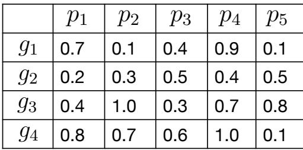
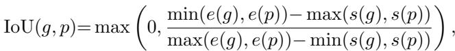
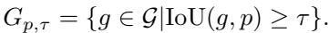
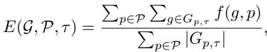

[← 返回 README](../README.md)

# 3 Current Evaluation Framework

## 📌 预览
详细介绍 ActivityNet Captions 的现有评估框架：基于 IoU 阈值的松散匹配 + METEOR 平均。通过 Figure 1 的具体例子展示匹配过程。这里定义的三个公式是后续分析和改进的基础。

---

The automatic evaluation framework proposed for ActivityNet Captions [6] has been widely utilized for the DVC task. Let $\mathcal{G}$ be a set of manually-generated reference captions for a video and $\mathcal{P}$ be a set of captions generated by a system. We denote $g$ as a reference caption and $p$ as a caption generated by the system.

> 💡 **符号约定**: $\mathcal{G}$ = 参考字幕集（人写的），$\mathcal{P}$ = 系统生成字幕集。

Fig. 1. An example of IoUs between generated and reference captions.

*Fig. 1. IoU matrix between generated captions (p1-p5) and reference captions (g1-g4).*

> 💡 **Fig. 1 批读**: 这个 IoU 矩阵是贯穿全文的核心例子。注意有些 IoU 很高（如 g3-p2=1.0, g4-p4=1.0），有些很低。后面会用这个例子展示现有框架和 SODA 的不同匹配结果。

Each caption has a proposal that indicates a time span of an event that appears in a video. Here, the IoU between $g$ and $p$ is defined as follows:

where functions $s(\cdot)$ and $e(\cdot)$ return the start and end time of the proposal, respectively.

> 💡 **IoU 定义**: 标准的交并比，衡量两个时间段的重叠程度。分子是交集长度，分母是并集长度。

Here, a set of reference captions whose IoU exceeds a specific threshold, $\tau$, for $p$ is defined as follows:

When $G_{p,\tau} = \phi$, i.e., $p$ does not have any $g$ that exceeds a specific threshold, we add a random string to $G_{p,\tau}$ as a member instead of the caption as a penalty.

> 💡 **松散匹配**: $G_{p,\tau}$ 是所有与 $p$ 的 IoU 超过阈值 $\tau$ 的参考字幕集合。注意这是**一对多**的——一个生成字幕可以匹配到多个参考字幕，反之亦然。这就是"松散匹配"的根源。

Finally, a set of generated captions, $\mathcal{P}$, is evaluated on the basis of a set of reference captions, $\mathcal{G}$, by the following equation:

where function $f(\cdot, \cdot)$ denotes an evaluation metric such as METEOR [2], BLEU [11], or CIDEr [15]. In this paper, we use METEOR as $f(\cdot, \cdot)$ since ActivityNet Challenge use it as its official metric. In most cases, the final evaluation score was computed as the average for $\tau = 0.9, 0.7, 0.5, 0.3$.

> 💡 **评分公式解读**: 分子是所有匹配对的 METEOR 分数之和，分母是匹配对的总数。关键问题：
> - 分母是**匹配对数**（不是 |P| 或 |G|）→ 生成越多字幕，匹配对越多，但平均分不会下降
> - 不考虑顺序 → 只要 IoU 超阈值就配对

Consider, for example, that IoUs between $\mathcal{G}$ and $\mathcal{P}$ are given as in Figure 1. When we set $\tau$ to 0.5, we obtain the following: $G_{p_1, 0.5} = \{g_1, g_4\}$, $G_{p_2, 0.5} = \{g_3, g_4\}$, $G_{p_3, 0.5} = \{g_2, g_4\}$, $G_{p_4, 0.5} = \{g_1, g_3, g_4\}$, $G_{p_5, 0.5} = \{g_2, g_3\}$. Then, we compute METEOR scores for the eleven matched pairs between $g$ and $p$, $(p_1, g_1)$, $(p_1, g_4)$, $(p_2, g_3)$, $(p_2, g_4)$, $(p_3, g_2)$, $(p_3, g_4)$, $(p_4, g_1)$, $(p_4, g_3)$, $(p_4, g_4)$, $(p_5, g_2)$, and $(p_5, g_3)$, and average the scores.

> 💡 **具体例子**: 5 个生成字幕 × 4 个参考字幕，阈值 0.5 下产生了 **11 个匹配对**。注意 g4 被匹配了 3 次（p1, p2, p3 都和它配对），p4 匹配了 3 个参考——这就是"松散匹配"，完全没有一对一的约束。

---

## 🔖 Section 总结

### 关键公式速查
| 公式 | 含义 |
|------|------|
| Eq. 1 (IoU) | 时间段交并比 |
| Eq. 2 ($G_{p,\tau}$) | 与 p 匹配的参考字幕集（IoU > τ） |
| Eq. 3 ($E$) | 评估分数 = METEOR 总和 / 匹配对数 |

### 核心洞察
1. 现有框架是**一对多松散匹配**，不是一对一
2. 分母是匹配对数 → 冗余字幕不会被惩罚
3. 完全不考虑字幕的时序顺序
