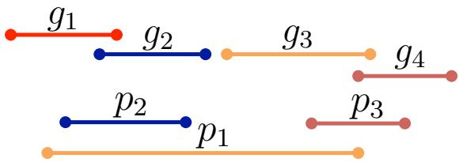
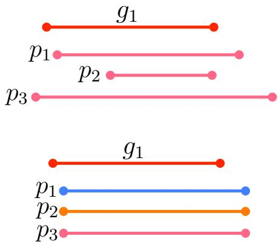

[← 返回 README](../README.md)

# 4 Problems of Current Framework

## 📌 预览
两个核心问题的详细分析：(1) 松散匹配导致顺序混乱和过高估计，(2) 平均 METEOR 分数不考虑字幕数量，无法区分好坏字幕。

---

## 4.1 Loose Matching

> 💡 **4.1 要点预览**: 松散匹配导致三个问题：顺序混乱、低置信度 proposal 得高分、冗余字幕得高分。

As we explained in the previous section, the current evaluation framework determines the correspondence between $g$ and $p$ only with the IoU threshold, $\tau$. Thus, it causes loose matching; a generated caption is matched with many reference captions or a reference caption is matched with many generated captions. The order of generated captions produced by the matching does not correspond to the order of reference captions, i.e., the loose matching disregards the story of the video. For example, when reference and generated captions are given as shown in Figure 2, the current evaluation framework produces the following matches, $(g_1, p_1)$, $(g_1, p_2)$, $(g_2, p_1)$, $(g_2, p_2)$, $(g_3, p_1)$, $(g_3, p_3)$, and $(g_4, p_3)$ for small $\tau$. Thus, the order of the generated captions corresponding to the reference captions is $p_1, p_2, p_1, p_2, p_1, p_3, p_3$, which is invalid because it contains many duplicates, i.e., the captions do not represent the story of the video. The best order of the generated captions that represents the story can be $p_2, p_1, p_3$.

*Fig. 2. Example of system and reference proposals that produce loose matching.*

> 💡 **Figure 2 批读**: 时间轴上，3 个生成 proposal 和 4 个参考 proposal 有大量重叠。松散匹配产生 7 个配对，对应的字幕序列是 p1,p2,p1,p2,p1,p3,p3 — 完全混乱，没有故事性。合理的匹配应该是一对一的 p2→g1, p1→g2, p3→g3/g4。

*Fig. 3. Examples of system and reference proposals that produce redundant captions.*

Furthermore, loose matching produces overestimations of METEOR scores. When we have the same sentences with different length proposals, any of them would match with a reference caption for any $\tau$, even though the redundant captions make no sense. Consider IoUs and METEOR scores are given as follows: $\text{IoU}(g_1, p_1) = 0.9$, $\text{IoU}(g_1, p_2) = 0.4$, $\text{IoU}(g_1, p_3) = 0.6$, and METEOR$(g_1, p_*) = 0.6$, as shown in the top of Figure 3. When we set $\tau$ to 0.9, only $g_1$ matches to $p_1$, and the average METEOR score is 0.2, while $p_2$ and $p_3$ are eliminated in the matching. However, when we have only $p_2$, $g_1$ is not matched, and the average METEOR score is 0.0. It indicates that the current evaluation sometimes gives higher scores for low-confidence proposals than a single high-confidence proposal. Thus, redundant caption sentences, such as identical sentences with proposals of different lengths, may obtain good METEOR scores.

> 💡 **反直觉结果**: 同一句话配不同长度的 proposal，三个一起提交反而比单独提交最好的那个得分更高。原因：多个冗余 proposal "兜底"了，即使单个匹配失败也有其他的补上。

Another problematic case is when we generate multiple different sentences for a proposal, the average METEOR score tends to be good. Consider, for example, METEOR scores are given as follows: METEOR$(g_1, p_1) = 0$, METEOR$(g_1, p_2) = 0.3$, and METEOR$(g_1, p_3) = 0.6$, as shown in the bottom of Figure 3. In this example, the average METEOR score is 0.3, while it is 0 when generating only $p_1$. Thus, generating multiple different caption sentences for a proposal tends to prevent a zero Meteor score.

> 💡 **Figure 3 批读**: 两种"作弊"方式：
> - **上半部分**: 同一句话 + 不同 proposal 长度 → 冗余兜底
> - **下半部分**: 同一 proposal + 不同句子 → 平均分被拉高
>
> 本质原因都是松散匹配 + 平均计算方式的组合漏洞。

---

## 4.2 Averaging METEOR Scores

> 💡 **4.2 要点预览**: 分母用匹配对数 → 不管生成多少字幕，平均分都差不多 → 无法区分好坏。

As shown in Equation (3), the sum of METEOR scores is averaged based on the number of matched pairs between $g$ and $p$. That is, the number of captions generated by a system, $|\mathcal{P}|$, and the number of reference captions, $|\mathcal{G}|$, are disregarded in calculating the evaluation metric. Thus, it cannot take into account the coverage of generated captions (recall) and the accuracy of the captions (precision) either.

As we mentioned above, a better score is obtained by generating more different sentences for a proposal and more identical sentences for different proposals. Most of current DVC systems generate many and redundant caption sentences for a video. The average number of generated caption sentences is around several hundred. Thus, the current evaluation framework is inadequate since we cannot read several hundred sentences in a short time, while, of course, it may be reasonable to assess DVC systems in terms of video indexing, which does not require human reading. This is a critical problem of the current evaluation framework for video story description systems.

> 💡 **核心矛盾**: 现有系统生成**几百条**字幕，参考只有 **3-4 条**，但评估分数基本不变。作为"视频故事描述"的评估，这完全不合理。（不过作者也承认，如果目标是视频检索/索引，多字幕可能反而有用。）

Furthermore, too few caption sentences are also inappropriate because such captions cannot represent the whole story of a video. To penalize such inappropriate captions, we can derive precision and recall by replacing the denominator of Equation (3) with $|\mathcal{P}|$ and $|\mathcal{G}|$, respectively. However, they are invalid since the scores might exceed 1.0.

> 💡 **简单修复行不通**: 直接把分母换成 |P| 或 |G| 会导致分数超过 1.0（因为松散匹配下一个参考可能被多次匹配）。所以需要先解决匹配问题（一对一），然后再用 F-measure。

---

## 🔖 Section 总结

### 核心洞察
1. **松散匹配**：一对多配对 → 顺序混乱 + 冗余字幕得高分 + 低置信度反而有利
2. **平均方式**：分母是匹配对数而非字幕数 → 无法区分 3 条字幕和 300 条字幕
3. 两个问题相互加强：松散匹配产生更多配对 → 平均分更不受字幕数量影响
4. 简单修补（换分母）行不通 → 需要从匹配方式根本上改变
