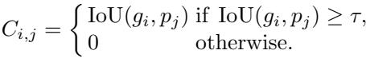
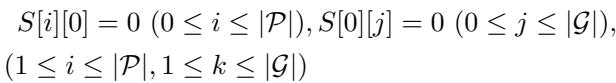
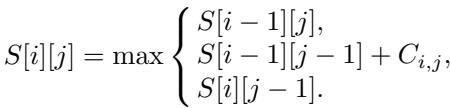
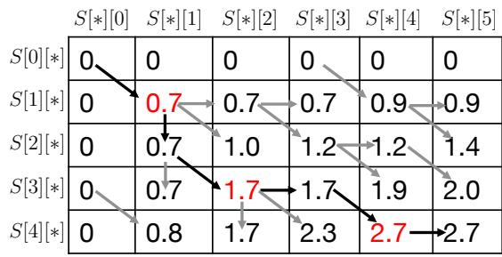
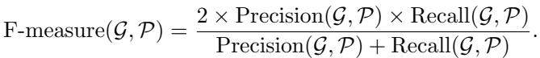
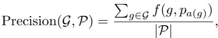
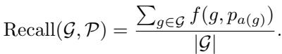
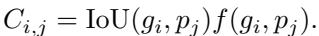

[← 返回 README](../README.md)

# 5 Story Oriented Dense video cAptioning evaluation framework (SODA)

## 📌 预览
SODA 的三个核心组件：(1) 动态规划求时序最优一对一匹配，(2) F-measure 惩罚冗余/不足，(3) IoU 加权使评分直接依赖时间定位质量。

---

## 5.1 Optimal Matching Using Dynamic Programming

> 💡 **5.1 要点预览**: 把匹配问题转化为**组合优化问题**：在保持时序的约束下，找一对一匹配使 IoU 总和最大。用动态规划求解。

To determine the matching between generated and reference captions, we regard the matching as a combinatorial optimization problem: finding one-to-one matching between the captions that maximizes the sum of the IoU by considering temporal ordering. Following the current evaluation framework, we also use the threshold $\tau$ for the matching; we define cost $C_{i,j}$ between a reference caption $g_i$ and a generated caption $p_j$ based on the IoU as follows:

> 💡 **Cost 定义**: IoU 超过阈值 τ 则 cost = IoU，否则为 0。和现有框架一样用阈值，但后续匹配方式完全不同。

Then, we sort the captions based on temporal ordering, that is, in the order of the beginning time of their proposals, by utilizing function $s(\cdot)$, and define $S[i][j]$, which stores the maximum score of optimal matching between 1st to $i$-th generated captions and the 1st to $j$-th reference truth captions, as follows:

– Initialization

– Recurrence

> 💡 **DP 递推解读**: $S[i][j]$ 的三种转移：
> - $S[i-1][j]$: 跳过第 $i$ 个生成字幕（不匹配）
> - $S[i-1][j-1] + C_{i,j}$: 把 $p_i$ 和 $g_j$ 匹配
> - $S[i][j-1]$: 跳过第 $j$ 个参考字幕（不匹配）
>
> 这就是经典的**最长公共子序列 (LCS)** 的变体！区别在于 LCS 的匹配值是 0/1，这里是 IoU 值。时间复杂度 $O(|\mathcal{P}| \times |\mathcal{G}|)$。

*Fig. 4. Illustration of a dynamic programming table.*

> 💡 **Figure 4 批读**: 用 Fig. 1 的 IoU 矩阵（τ=0）演示 DP 过程。最终 S[4][5] = 2.7，回溯路径得到最优匹配：
> - $(g_1, p_1)$: IoU = 0.7
> - $(g_3, p_2)$: IoU = 1.0
> - $(g_4, p_4)$: IoU = 1.0
>
> 对比现有框架的 11 个松散配对，SODA 只找到 3 个**一对一、时序一致**的匹配。g2 没有被匹配（被跳过了）。

Figure 4 shows an example process to obtain the optimal matching for the example given in Figure 1, with $\tau = 0$. After filling out table $S$ by dynamic programming, $S[4][5]$ stores the optimal matching score, 2.7. Thus, we can obtain the optimal matching between $g_k$ and $p_\ell$ by tracing the path, from [4,5] to [0,0]. In the example, the optimal matching is $(g_1, p_1)$, $(g_3, p_2)$, $(g_4, p_4)$. The pseudo code of the algorithm is shown in the supplementary material.

---

## 5.2 F-measure for Evaluating Video Story Description

> 💡 **5.2 要点预览**: 有了一对一匹配后，用 Precision（除以 |P|）和 Recall（除以 |G|）来惩罚冗余和不足，最终取 F-measure。

To give a low score for too many or too few captions, the sum of METEOR scores should be normalized by considering the number of generated and reference captions. Thus, we propose an evaluation metric based on F-measure as follows:

Here, Precision$(\mathcal{G}, \mathcal{P})$ and Recall$(\mathcal{G}, \mathcal{P})$ are defined on the basis of the optimal matching as follows:

> 💡 **Precision vs Recall**:
> - **Precision** = METEOR 总和 / |P| → 生成太多字幕时，分母大，precision 低
> - **Recall** = METEOR 总和 / |G| → 生成太少字幕时，匹配数少，recall 低
> - **F-measure** 综合两者 → 只有当 |P| ≈ |G| 且匹配质量高时才能拿高分
>
> 注意因为是一对一匹配，分子不会超过 min(|P|, |G|) 个 METEOR 分数，所以 Precision 和 Recall 不会超过 1.0。

When systems generate too many captions, Precision scores tend to be low, while Recall scores tend to be high. Thus, the systems cannot obtain good F-measure scores. When systems generate too few captions, they also cannot obtain good F-measure scores since they tend to receive good Precision scores but poor Recall scores.

---

## 5.3 Evaluation Scores Directly Dependent on IoU

> 💡 **5.3 要点预览**: 进一步改进——让 IoU 直接参与评分（不只是用于匹配），使时间定位质量和字幕质量同时影响最终分数。

In evaluating video story descriptions, the IoU plays an important role. Even if METEOR scores between generated and reference captions are perfect, they make no sense if the IoU between the captions is zero. However, in the current evaluation framework, the IoU is utilized only for determining the matching between the captions. Thus, the IoU does not directly affect the sum of METEOR scores. In fact, METEOR scores with larger IoUs and those with smaller ones cannot be distinguished when computing them. To reflect the IoU more directly to evaluation scores, we propose an alternative of the cost in Equation (4), which is utilized to solve dynamic programming as follows:

> 💡 **IoU 加权**: 原来 cost = IoU（只用于匹配），现在 cost = IoU × METEOR（用于匹配和评分）。效果：即使 METEOR 高，IoU 低也会拉低分数。这就是 SODA (c) 变体，后面实验证明它最好。

By utilizing this cost, even if the METEOR score is high, the evaluation score can be lowered when the IoU score is low.

---

## 🔖 Section 总结

### SODA 三个变体
| 变体 | 匹配方式 | 评分 | 特点 |
|------|----------|------|------|
| SODA (a) | DP + τ=0.9,0.7,0.5,0.3 取平均 | F-measure | 保守，波动小 |
| SODA (b) | DP + τ=0 | F-measure | 敏感，波动大 |
| SODA (c) | DP + τ=0 + IoU×METEOR | F-measure | 最敏感，最推荐 |

### 核心洞察
1. DP 匹配本质是 **LCS 变体**，保证一对一 + 时序一致
2. F-measure 同时惩罚冗余（precision↓）和不足（recall↓）
3. IoU 加权（SODA(c)）让时间定位质量直接影响评分，是最完整的版本
