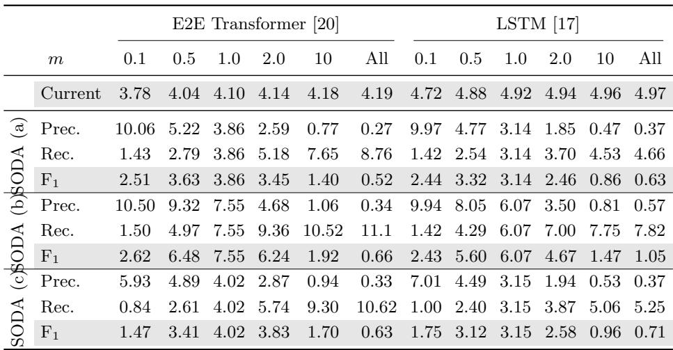
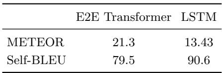
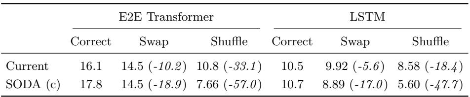

[← 返回 README](../README.md)

# 6 Experiments

## 📌 预览
三组实验验证 SODA 的有效性：(1) 变化字幕数量，检测不合适的字幕数，(2) 打乱字幕顺序，检测错误排序，(3) 人工评估验证 SODA 与人类判断的一致性。

---

## 6.1 Experimental Settings

We used the ActivityNet Captions dataset [6], which contains 20k YouTube videos. The dataset consists of 10,024, 4,915 and 5,044 videos for training, validation and test data, respectively. We evaluated our evaluation framework only on the validation data because the test data is not publicly available. Each video in the validation data has on average 3.52 human-written captions with start/end time annotations. The average number of words in a caption is 13.54.

> 💡 **数据集**: ActivityNet Captions，验证集 4,915 个视频，平均 3.52 条参考字幕，平均 13.54 词/字幕。

Because it is known that METEOR has sufficient correlation against human evaluation, we did not evaluate our framework by calculating the correlation against manual evaluation. To demonstrate the effectiveness of the optimal proposal detection and F-measure, we simply examined whether our framework could give low scores for inadequate captions and high scores for adequate captions in terms of video story description. Thus, we evaluated the following two state-of-the-art DVC systems with two settings below:

– **End-to-end transformer-based system [20]**: The end-to-end transformer-based models could detect events by considering the whole video information and generate consistent captions for the events simultaneously. The number of output captions per video is **228.21** on average.
– **LSTM-based system [17]**: The bidirectional LSTM-based encoder-decoder models with a context gating mechanism. The context gating mechanism makes it possible to generate captions by filtering both past and future contexts. The number of output captions per video is **97.10** on average.

> 💡 **两个系统对比**:
> | 系统 | 架构 | 平均字幕数 |
> |------|------|-----------|
> | E2E Transformer [20] | Self-attention 端到端 | 228.21 |
> | LSTM [17] | BiLSTM + context gating | 97.10 |
>
> 注意两个系统都生成**远超参考数量**（3-4条）的字幕。

Note that we obtained captions generated by the end-to-end transformer-based model by running their code, available at the github repository, and those by the LSTM-based model were provided by the authors of the paper.

**Detecting inappropriate captions**: To demonstrate whether SODA gives low scores to inadequate captions, we first performed experiments by varying the number of captions. Since both systems generate around hundred or more captions for each video, we randomly selected $\text{int}(m \times |\mathcal{G}|)$ captions without duplication and evaluated the captions by the current evaluation framework, and the following metrics in our framework:

– **SODA (a)**: averaging F-measure scores with $\tau = 0.9, 0.7, 0.5, 0.3$
– **SODA (b)**: F-measure, where $\tau$ is set to $0$,
– **SODA (c)**: F-measure, utilizing the cost in Equation (11).

We examined $m = 0.1, 0.5, 1.0, 2.0, 10$, and "all," where $m = 1.0$ indicates a case of outputting the same number of captions as a reference. We report the average scores with five times of the randomized procedure.

> 💡 **实验设计**: 用乘数 $m$ 控制字幕数量。$m=1.0$ 表示和参考一样多（~3.5条），$m=10$ 表示 10 倍（~35条），"all" 表示全部（100-228条）。核心假设：$m=1.0$ 应该得分最高。

**Detecting incorrect ordering**: To demonstrate whether SODA gives low scores to captions with incorrect ordering, we evaluated original captions with correct ordering and two types of captions with incorrect ordering: (a) **Swap**, swapping the order of two adjacent captions for a randomly selected pair in the original, and (b) **Shuffle**, randomly shuffling the order of captions in the original. Since systems generate a huge number of captions, we cannot evaluate them as they are, and we need to perform the experiments with a reasonable number of captions. Therefore, we assessed the systems by their potential, the upper bound performances; we examined captions that were the closest to the corresponding references. That is, we used oracle captions as the original captions with correct ordering. Here, an oracle caption indicates a caption of the same length as a reference caption that receives the maximum METEOR score. We created the oracles by selecting those generated captions that receive the maximum METEOR score for each reference caption. Then, we created the Swap and Shuffle captions from the oracle captions by randomly varying their proposals so that keeping IoUs exceed 0.7.

> 💡 **顺序实验设计**: 用 oracle 字幕（每个参考对应的最佳生成字幕）作为基准，然后：
> - **Swap**: 随机交换两个相邻字幕的时间段
> - **Shuffle**: 完全打乱所有字幕的时间段
>
> 预期：Correct > Swap > Shuffle。

---

## 6.2 Results

**Detecting inappropriate captions**:

*Table 1. Changes of scores (%) obtained from the current evaluation framework and SODA when varying the number of captions.*

> 💡 **Table 1 批读 — 核心发现**:
> 1. **Current 框架**: 分数几乎不随 $m$ 变化（E2E: 3.78→4.19，LSTM: 4.72→4.97）→ 无法区分字幕数量
> 2. **SODA (a/b/c)**: F-measure 在 $m=1.0$ 时最高，$m$ 过大或过小都下降 → 能检测不合适的字幕数
> 3. **SODA (b/c)** 比 (a) 更敏感，波动更大 → 更适合评估视频故事描述
> 4. **E2E Transformer 在 SODA 下优于 LSTM**，但在 Current 下反而更低 → Current 框架给出了误导性结论

From the results, the scores of the current evaluation framework do not change significantly even when the number of captions changes. We observe a similar tendency in both results obtained from the two different systems. In particular, there is only a slight difference between $m = 1$, the appropriate number of captions, and "all," the inappropriate number of captions for humans to read. As long as DVC systems are evaluated with the current evaluation framework, they would continue to generate many and redundant captions. As we mentioned before, the results are caused by (1) loose matching between generated and reference captions, and (2) averaging METEOR scores by the number of the matched pairs. The results reveal that the framework has a critical problem, i.e., it cannot distinguish good captions from bad captions in terms of video story description. In contrast, SODA gave low scores for too many and too few captions. When we utilized a small $m$, precision became high, while recall became low. Precision became low and recall became high when we utilized a large $m$. Thus, SODA can penalize inadequate captions.

Before we compare the performance of the two systems, we need to address the question: "Which is better: E2E Transformer or LSTM in terms of video story description?". Therefore, we compared their oracle performances and their diversities. We created the oracles as above and averaged their METEOR scores. Then, we computed Self-BLEU [21] as a measure to assess the quality of oracle captions in terms of diversity.

*Table 2. Average METEOR and Self-BLEU scores (%) for oracle captions.*

> 💡 **Table 2 批读**: E2E Transformer 的 oracle METEOR (21.3) 远高于 LSTM (13.43)，Self-BLEU 更低 (79.5 vs 90.6，越低越多样)。说明 E2E Transformer 的**潜力**更强。SODA 的排名和 oracle 一致，Current 的排名相反 → SODA 更准确。

The results shown in Table 2 demonstrate that E2E Transformer outperformed LSTM in terms of both METEOR and Self-BLEU scores with significant differences. Thus, we can conclude that the potential of E2E Transformer to describe the video story is superior to that of LSTM. Although LSTM outperformed E2E Transformer with the current evaluation framework in Table 1, the result does not agree with Table 2. However, the evaluation results with SODAs in Table 1 can agree with Table 2 in that E2E Transformer outperformed LTSM.

Comparing the variants of SODA, the fluctuation of SODA (a) is smaller than that of the other metrics since it received low scores when utilizing a big $\tau$. On the other hand, the scores of SODA (b) and (c) sensitively change with $m$, and the fluctuation is large. To assess the performance of video story description, the metric should be sensitive to the number of captions to be evaluated. Thus, SODA (b) and (c) are more appropriate for measuring the performance of video story description systems. Since SODA (c) involves the IoU in the evaluation score, that is, the score depends both on METEOR and IoU, we believe that SODA (c) is the most appropriate.

**Detecting incorrect ordering**:

*Table 3. Evaluation scores (%) for captions with correct and incorrect order.*

> 💡 **Table 3 批读**: 
> - **Shuffle 的下降幅度**: SODA(c) 为 47-57%，Current 仅 18-33% → SODA 对顺序错误**惩罚力度是现有框架的 2 倍**
> - **Swap 也类似**: SODA(c) 下降 17-19%，Current 仅 6-10%
> - 结论：SODA 对字幕顺序更加敏感，更适合评估视频故事描述

Table 3 shows the scores obtained with the current evaluation framework and SODA (c) (F-measure) for correctly- and incorrectly-ordered captions. With both metrics, the scores for captions with incorrect ordering degraded properly. The percentage decreases for Shuffle are larger than those for Swap because Shuffle tends to be worse in the ordering. In comparing SODA with the current evaluation framework, the percentage decreases for Shuffle with SODA (c) are in range of $47-57\%$, while those with Current are in range of $18-33\%$. Therefore, SODA (c) can evaluate the incorrectly-ordered captions more severely than the current framework. While the percentage decreases for Swap are smaller than those for Shuffle, we can find a similar tendency as Shuffle that SODA (c) can evaluate the incorrectly ordered captions more severely. These results indicate that SODA is more sensitive to the incorrect ordering of captions than Current, i.e., SODA is more suitable to evaluate the story of a video than the current evaluation framework.

In summary, our experiments revealed that SODA finds inappropriate captions in terms of video story description. That is, SODA gives low scores to too many or too few captions and incorrectly ordered captions. These are significant advantages of SODA against the current evaluation framework.

---

## 6.3 Manual Evaluation

To investigate whether SODA agrees with human judgment, we computed the accuracies of SODA (c) and the current evaluation framework against the results obtained from human judgment, (1) that compared E2E Transformer with LSTM oracles, and (2) that compared Shuffle with Swap for gold standard captions. We randomly selected 50 videos with less than 6 captions, whose length is from 90 to 180 seconds, from the validation data. Then, we showed the video and the two captions to 12 crowdsourced workers and asked them to compare the captions A and B and to select an integer score from -2 to 2, where the score -2 indicates A is better and the score 2 indicates B is better. We asked them to judge whether the captions correctly describe the entire video, and the events are described in the correct order. We employed only faithful workers who correctly answered test questions, which cannot be answered without watching the video.

In the former human judgment, E2E Transformer obtained better results for $80\%$ of the 50 videos. Thus, the results demonstrate that the potential of E2E Transformer is superior to LSTM. The results agree with those in Table 2. The accuracies of SODA and the current evaluation framework against the human judgment are **0.76** and **0.66**, respectively. The results imply that SODA is superior to the current evaluation framework.

In the latter human judgment, Swap obtained better results for $94\%$ of the 50 videos. The results are reasonable and agree with our intuition since Swap keeps better temporal ordering than Shuffle. The results indicate that humans give higher scores when captions meet correct ordering. The accuracies of SODA and the current evaluation framework are **0.94** and **0.72**, respectively. The results also show that SODA is superior to the current evaluation framework.

> 💡 **人工评估总结**:
> | 比较任务 | SODA 准确率 | Current 准确率 |
> |----------|------------|---------------|
> | E2E vs LSTM | 0.76 | 0.66 |
> | Swap vs Shuffle | 0.94 | 0.72 |
>
> SODA 在两个任务上都显著优于 Current，尤其在顺序判断上（0.94 vs 0.72）。

---

## 🔖 Section 总结

### 关键数字速查
| 指标 | 数值 |
|------|------|
| 数据集 | ActivityNet Captions, 4,915 验证视频 |
| 平均参考字幕数 | 3.52 |
| E2E 平均生成数 | 228.21 |
| LSTM 平均生成数 | 97.10 |
| SODA vs Current (顺序判断准确率) | 0.94 vs 0.72 |
| SODA vs Current (系统比较准确率) | 0.76 vs 0.66 |

### 核心洞察
1. 现有框架对字幕数量**几乎不敏感**（3.78→4.19），SODA 呈明显倒 U 形
2. SODA(c) 是最佳变体：同时考虑 IoU 和 METEOR，对数量和顺序都最敏感
3. 人工评估确认 SODA 与人类判断一致性更高
4. Current 框架甚至给出了错误的系统排名（LSTM > E2E），SODA 纠正了这一点
