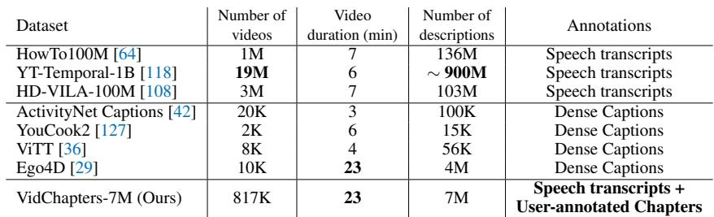

[← 返回 README](../README.md)

# 1 Introduction

## 📌 预览
Introduction 阐述了长视频导航的需求、现有数据集的不足、VidChapters-7M 的解决方案，以及三个任务定义和迁移学习发现。

---

As online media consumption grows, the volume of video content available is increasing rapidly. While searching for specific videos is already a challenging problem, searching within a long video is an even less explored task. Manual navigation can often be time consuming, particularly for long videos. A compelling solution for organizing content online is to segment long videos into chapters (see Figure 1). Chapters are contiguous, non-overlapping segments, completely partitioning a video. Each chapter is also labeled with a short description of the chapter content, enabling users to quickly navigate to areas of interest and easily replay different parts of a video. Chapters also give structure to a video, which is useful for long videos that contain inherently listed content, such as listicles [96], instructional videos [64], music compilations and so on.

> 💡 **动机**: 视频搜索已经很难了，在长视频**内部**搜索更难。章节（chapters）是一种自然的解决方案——把视频分成连续的、不重叠的片段，每段有标题。

*Figure 2: Illustration of the three tasks defined for VidChapters-7M.*

> 💡 **Figure 2 批读**:
> - 清晰展示了三个任务的输入输出关系
> - **Chapter Generation**: 输入视频 → 输出时间分割 + 标题
> - **Chapter Generation (GT boundaries)**: 输入视频 + 边界 → 输出标题
> - **Chapter Grounding**: 输入视频 + 标题 → 输出时间位置

Given the plethora of content already online, our goal is to explore automatic solutions related to video chaptering - generating chapters automatically, and grounding chapter titles temporally in long videos. While the benefits of automatically chaptering videos are obvious, data for this task is scarce. Video captioning datasets (such as WebVid-10M [5] and VideoCC [66]) consist of short videos (10s in length), and hence are unsuitable. Web datasets consisting of longer videos (HowTo100M [64], YT-Temporal-1B [118]) come with aligned speech transcripts (ASR), which are only weakly related to visual content, and if used as chapter titles would tend to over-segment videos. Moment retrieval [24, 33] or dense video captioning [42, 127] datasets are perhaps the most useful, but do not focus on creating explicit structure, and instead describe low-level actions comprehensively. Such datasets are also manually annotated, and hence not scalable and small in size (see Table 1).

> 💡 **现有数据集的问题**:
> - **短视频数据集**（WebVid-10M, VideoCC）：只有 10 秒，不适合章节任务
> - **长视频 ASR 数据集**（HowTo100M, YT-Temporal-1B）：ASR 与视觉内容弱相关，会过度分割
> - **Dense captioning 数据集**（ActivityNet Captions）：人工标注，规模小，描述低层动作而非结构化章节

*Table 1: Comparison of VidChapters-7M with existing datasets. VidChapters-7M is much larger than current dense video captioning datasets. Compared to datasets with ASR (top 3 rows), it is smaller in the total number of videos but contains longer videos with richer annotations (chapters).*

> 💡 **Table 1 批读**:
> - VidChapters-7M 有 817K 视频、7M 描述，视频平均 23 分钟
> - 对比 ASR 数据集：视频更少但更长、标注更有意义
> - 对比 Dense Caption 数据集（ActivityNet 20K, YouCook2 2K）：大了两个数量级
> - 关键优势：同时有 ASR + 用户标注的章节

To remedy this, we curate VidChapters-7M, a large-scale dataset of user-annotated video chapters automatically scraped from the Web. Our dataset consists of 7M chapters for over 817K videos. Compared to existing datasets, videos in VidChapters-7M are long (23 minutes on average) and contain rich chapter annotations consisting of a starting timestamp and a title per chapter. Our dataset is also diverse, with 12 different video categories having at least 20K videos each, which itself is the size of existing dense video captioning datasets [29, 36, 42, 127]. On top of this dataset we also define 3 video tasks (see Figure 2): (i) video chapter generation which requires temporally segmenting the video and generating a chapter title for each segment; (ii) video chapter generation given ground-truth boundaries, which requires generating a chapter title given an annotated video segment; and (iii) video chapter grounding, which requires temporally localizing a chapter given the chapter title. All three tasks involve parsing and understanding long videos, and multi-modal reasoning (video and text), and hence are valuable steps towards story understanding.

> 💡 **数据集亮点**:
> - 23 分钟平均时长 — 真正的长视频
> - 12 个分类各有 ≥20K 视频 — 多样性强
> - 每个 20K 子集就已经是现有 dense captioning 数据集的体量了

For all three tasks, we implement simple baselines as well as recent, state-of-the-art video-text methods [45, 101, 114]. We find that the tasks are far from being solved, demonstrating the value of this problem. Interestingly, we also show that our video chapter generation models trained on VidChapters-7M transfer well to dense video captioning tasks in both zero-shot and finetuning settings, largely improving the state of the art on the YouCook2 [127] and ViTT benchmarks [36]. Moreover, we show that pretraining using both speech transcripts and chapter annotations significantly outperforms the widely used pretraining method based only on speech transcripts [65, 114, 118]. This demonstrates the additional value of our dataset as a generic video-language pretraining set. Interestingly, we also find that the transfer performance scales with the size of the chapter dataset.

> 💡 **核心发现**:
> - 任务远未被解决 → 研究价值大
> - 迁移到 dense captioning 效果显著，尤其是 YouCook2 和 ViTT
> - ASR + 章节标注的组合预训练 >> 仅用 ASR 预训练
> - 性能随数据集规模增长 → scaling law 在这里也成立

In summary, our contributions are:

(i) We present VidChapters-7M, a large-scale dataset of user-annotated video chapters obtained from the Web consisting of 817K videos and 7M chapters;
(ii) Based on this dataset, we evaluate a range of simple baselines and state-of-the-art videolanguage models on the tasks of video chapter generation with and without ground-truth boundaries, and video chapter grounding;
(iii) We show that video chapter generation models trained on VidChapters-7M transfer well to dense video captioning tasks in both zero-shot and finetuning settings, largely improving the state of the art on the YouCook2 [127] and ViTT benchmarks [36], outperforming prior pretraining methods based on narrated videos [114], and showing promising scaling behavior.

Our dataset, code and models are publicly available on our website [1].

> 💡 **贡献总结**:
> 1. 数据集（817K 视频 / 7M 章节）
> 2. Benchmark（三个任务 + 多种 baseline）
> 3. 迁移学习（预训练价值 + scaling 特性）

---

*Figure 1: A video with user-annotated chapters in VidChapters-7M: the video is temporally segmented into chapters, which are annotated with a chapter title in free-form natural language.*

## 🔖 Section 总结

### 核心洞察
1. 长视频章节化是重要但数据匮乏的问题
2. 利用用户自发标注避免了昂贵的人工标注
3. 三个任务覆盖了生成和定位两个方向
4. 数据集不仅是 benchmark，更是强力的预训练资源
