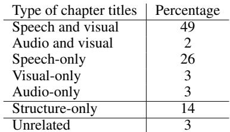

[← 返回 README](../README.md)

# 3 VidChapters-7M: a large-scale dataset of user-chaptered videos

## 📌 预览
这个 Section 详述数据集的构建过程：如何从 YouTube 爬取章节信息（3.1），如何处理数据提取 ASR 和视觉特征（3.2），以及数据集的统计分析（3.3）。

---

Our goal is to build a large and diverse set of videos annotated with temporarily localized chapter information, consisting of chapter titles and chapter start times. In detail, chapters are contiguous, non-overlapping segments, completely partitioning a video. However manual annotation of chapters is time consuming and expensive and therefore hard to scale. Hence we automatically scrape chapter information from videos available online, as explained in Section 3.1. Then, we perform several processing steps on this data, e.g., to extract speech transcripts, as described in Section 3.2. The outcome is VidChapters-7M, a dataset of 817K videos with 7M chapter annotations provided by real users online. Finally, we analyze VidChapters-7M in Section 3.3. Details are given next.

> 💡 **Section 概览**: 数据集构建的三步走：收集（3.1）→ 处理（3.2）→ 分析（3.3）。核心思路是利用 YouTube 用户自愿添加的章节信息，零额外标注成本。

---

### 3.1 Data collection

> 💡 **3.1 要点预览**: 从 9200 万 YouTube 视频 ID 中筛选出有用户章节的视频，最终得到 817K 个。

Since early 2020, YouTube users can create chapters for uploaded videos by annotating them in the YouTube description. The YouTube API, however, currently does not enable explicit search for user-chaptered videos. Hence, our data collection procedure consists of: (i) Collecting a large and diverse set of video candidates (characterized by their 11-character YouTube video ID), which do not necessarily contain user-annotated chapters; (ii) For all video candidates, downloading the video description, automatically selecting videos with user-annotated chapters, extracting video chapters and downloading corresponding videos. We next describe the individual steps in more detail.

> 💡 **关键挑战**: YouTube API 不支持直接搜索有章节的视频！所以只能先收集大量候选视频，再筛选。

**Video candidates.** We start from a large pool of video candidates built from the YT-Temporal-180M dataset [117], which was constructed to be more diverse than prior large video datasets such as HowTo100M [64]. Note that while the released YT-Temporal-180M dataset consists of only 5M videos, the authors collected a larger set of candidates by using YouTube's recommendation algorithm to suggest related videos. We obtained this extended list of 92 million video IDs directly from the authors.

> 💡 **数据来源**: 从 YT-Temporal-180M 的扩展候选列表获得 9200 万视频 ID。这些 ID 通过 YouTube 推荐算法滚雪球式扩展，保证了多样性。

**Extracting chapters from descriptions.** In the description, chapters typically constitute a block with consecutive lines following the format "\<Timestamp\>: \<Chapter Title\>" or "\<Chapter Title\>: \<Timestamp\>", where the chapter title is written in free-form natural language and its corresponding start timestamp is written in MM:SS format. The video should contain at least two timestamps listed in ascending order. Hence we download the descriptions for all video candidates and use standard regular expression operations to verify whether a given description contains user-annotated chapters and extract them if so. Note that some videos contain chapters that are automatically generated by YouTube algorithms, however, these generated chapters do not appear in the descriptions and, hence, are excluded by our procedure for data collection. Also note that the video content is only downloaded for user-chaptered videos, which is convenient for both the downloading speed and storage constraints. Finally, we obtain 817K user-chaptered videos, making up $0.9\%$ of all video candidates.

> 💡 **章节提取方法**:
> - 用正则表达式匹配描述中的 `时间戳: 标题` 格式
> - 要求至少两个升序时间戳
> - 自动排除 YouTube 算法生成的章节（它们不出现在描述中）
> - 只下载有章节的视频内容 → 节省带宽和存储
> - **最终命中率**: 0.9%（92M → 817K）

> 💡 **3.1 小结**:
> - 起点：9200 万视频 ID
> - 方法：正则匹配描述中的章节
> - 结果：817K 有章节的视频
> - 关键数字：0.9% 的命中率

---

### 3.2 Data processing

> 💡 **3.2 要点预览**: 对收集到的视频进行两项处理——ASR 语音转录和视觉特征提取。

We describe below how we process the previously obtained user-chaptered videos to facilitate building efficient video chapter generation models. For reproducibility, we publicly release the resulting speech transcripts and the code for extracting visual features.

**ASR extraction.** We observed that most user-chaptered videos contain speech. Hence, for all videos, we extract speech transcripts aligned in time with the video content (ASR) by applying the Whisper-Large-V2 model [73] on the audio track, using faster-whisper [40] backend for computational efficiency. We found that the Whisper model provides higher-quality ASR compared to the YouTube API ASR service on several data samples from VidChapters-7M. We further use WhisperX [6] to derive accurate word-level timestamps which we use to segment the speech transcript into sentences. For example, the Whisper-Large-V2 model extracts speech segments like "Right, we're gonna do the Synthetics Dirty Race. No we're not. [...] So we're gonna put two t-shirts and two pairs of jeans in the" with timestamps 20.478s and 50.465s, and the corresponding first sentence output by WhisperX is "Right, we're gonna do the Synthetics Dirty Race." with timestamps 20.538s and 29.26s.

> 💡 **ASR 处理流程**:
> 1. **Whisper-Large-V2** 提取语音片段（用 faster-whisper 加速）
> 2. **WhisperX** 获得词级时间戳，再分割成句子
> 3. 比 YouTube API 的 ASR 质量更高

**Visual feature extraction.** Training end-to-end deep learning models from RGB inputs on minuteslong videos is computationally expensive. Hence we extract visual features with CLIP ViT-L/14 backbone [20, 72] at resolution $224 \times 224$ pixels and 1 FPS. This model has been trained to map images to text descriptions with a contrastive loss on 400M Web-scraped image-text pairs.

> 💡 **视觉特征**: CLIP ViT-L/14，1 FPS 采样。对于 23 分钟的视频，大约提取 1380 帧的特征。预提取特征是训练长视频模型的标准做法。

> 💡 **3.2 小结**:
> - ASR: Whisper-Large-V2 + WhisperX → 句级语音转录
> - Visual: CLIP ViT-L/14 @ 1FPS → 预提取视觉特征
> - 两种特征都公开发布，保证可复现性

---

### 3.3 Data analysis

> 💡 **3.3 要点预览**: 数据集的统计特性、ASR 与章节的差异、偏差分析和伦理考量。

The result of the previously described pipeline is VidChapters-7M, a dataset of 817,076 user-chaptered videos containing 6,813,732 chapters in total. We randomly split VidChapters-7M in training, validation, and testing splits with 801K, 8.2K, and 8.2K videos, respectively. We analyze VidChapters-7M below and give examples of annotated videos, more statistics, as well as a datasheet in Appendix Sections A, C, and F, respectively.

*Figure 3: Statistics of the VidChapters-7M dataset.*

> 💡 **Figure 3 批读**:
> - 展示了四个分布：每视频章节数、章节时长、标题词数、视频类别
> - 章节数分布右偏，多数视频有 3-10 个章节
> - HowTo & Style 是最大类别（17%），说明教程类视频用户最爱加章节
> - 标题普遍很短（5.4 词），和 dense caption 的完整句子形成对比

**Statistics.** VidChapters-7M is highly diverse and contains 4,894,855 distinct chapter titles. On average, a video contains 8.3 chapters, start times of adjacent chapters are separated by 142.0s seconds, a chapter title contains 5.4 words and a video lasts 1354 seconds. The most represented video category (in YouTube's glossary) is HowTo & Style, making up $17.0\%$ of total videos. The distributions for the number of chapters per video, the video chapter duration, the length of the chapter title, and the video category are illustrated in Figure 3, and further show the diversity of VidChapters7M, e.g., there are 12 different video categories with at least 20K videos in VidChapters-7M.

> 💡 **关键数字速查**:
> - 817K 视频，6.8M 章节，4.9M 不同标题
> - 平均 8.3 章节/视频，142 秒/章节，5.4 词/标题，1354 秒/视频
> - 12 个类别各有 ≥20K 视频

**ASR vs Chapters.** $97.3\%$ of videos in VidChapters-7M contain speech transcripts (ASR). However, user-annotated chapters significantly differ from speech transcripts: on average, a video with ASR contains 269.8 speech sentences (vs 8.3 chapter titles), a speech sentence lasts 3.9 seconds (vs 142.0 seconds for chapters) in the video and contains 11.5 words (vs 5.4 words for chapters).

> 💡 **ASR vs 章节的差异**: 这组对比非常重要！
> - ASR: 269.8 句 × 3.9 秒 × 11.5 词 → 细粒度、冗长
> - 章节: 8.3 条 × 142 秒 × 5.4 词 → 粗粒度、精炼
> - 说明直接把 ASR 当作章节标注是不行的，二者有本质区别

**Biases.** Using the langdetect [17] language detection tool, we find that $92.9\%/93.9\%$ of total videos in VidChapters-7M have their chapter titles/ASR in English. However, as shown in Figure 3 (bottom right), the distribution of chapter languages includes a long tail of languages, e.g., 13 languages appear in more than 1K videos of VidChapters-7M. We also use GenBit [79] to measure gender bias in the chapters and ASR. We observe that the percentage of female/male/non-binary gendered words is $19.7\%/39.7\%/40.7\%$ for the chapters, and $11.6\%/35.6\%/52.8\%$ for the ASR.

> 💡 **偏差分析**:
> - 语言偏差：~93% 英语，但有 13 种语言 >1K 视频
> - 性别偏差：章节标题中男性词汇（39.7%）多于女性（19.7%）

**Ethical considerations.** We employ several techniques to identify harmful visual or language content. We use a classifier [78] built on top of the previously extracted CLIP features to detect not-safe-for-work (NSFW) visual content (such as pornographic and sexualized content). Moreover, we use a language model [31] to detect toxic content in chapter titles and speech transcripts. These processes flag 5,716 $(0.70\%)$ visually NSFW videos, 355 $(0.04\%)$ videos with toxic chapter titles and 1,368 $(0.17\%)$ videos with toxic ASR. We assume the relatively low number of flagged videos is due to the regulations performed by the Web platform used to collect our dataset. Following [78], we refrain from removing these samples to encourage research in fields such as dataset curation and tag them instead. Note that these automated filtering techniques are not perfect and that harmful content may pass.

> 💡 **伦理处理**: 标记但不删除有害内容（NSFW 0.7%，有毒标题 0.04%，有毒 ASR 0.17%）。比例很低，归因于 YouTube 自身的内容审核。

*Table 2: Manual assessment of the informativeness of chapter titles in the VidChapters-7M dataset over a random sample of 100 videos.*

> 💡 **Table 2 批读**:
> - 人工检查了 100 个视频的章节质量
> - 83% 的视频章节与某种模态相关（语音+视觉 49%，纯语音 26%）
> - 14% 只是结构性标注（"step 1"、"step 2"）
> - 3% 与视频内容无关
> - **关键洞察**: 49% 需要语音+视觉才能理解 → 验证了多模态方法的必要性

**Manual assessment of the quality of annotations.** While chapter titles are manually written and uploaded by real users, sometimes chapter titles are not informative about the content of the video at the corresponding timestamps. To assess the quality of chapter title annotations in our dataset, we inspected a random sample of 100 videos in VidChapters-7M. For each video, we checked if the titles are related to the content of the video chapter and if so which video modalities (ASR, visual or raw audio) they are related to, or if they only refer to the structure of the video (e.g. chapter titles like "step 1", "step $2"$ etc). Results are presented in Table 2, and show that $83\%$ of videos have chapters related to one or multiple modalities of the video, $14\%$ of videos have chapters only referring to the structure of the video, and $3\%$ of videos have chapters unrelated to the video content.

---

## 🔖 Section 总结

### 关键数字速查
| 指标 | 数值 |
|------|------|
| 总视频数 | 817,076 |
| 总章节数 | 6,813,732 |
| 不同标题数 | 4,894,855 |
| 平均章节数/视频 | 8.3 |
| 平均章节时长 | 142.0s |
| 平均标题词数 | 5.4 |
| 平均视频时长 | 1354s (≈23min) |
| 含 ASR 视频比例 | 97.3% |
| 英语视频比例 | 92.9% |
| 候选视频命中率 | 0.9% |
| Train/Val/Test | 801K / 8.2K / 8.2K |

### 核心洞察
1. 数据收集管道高效：92M 候选 → 正则筛选 → 817K 有章节视频
2. ASR 和章节标注本质不同：粒度差 30 倍，词数差 2 倍
3. 83% 的章节标注与视频内容相关，质量可靠
4. 49% 的章节需要多模态理解 → 验证了多模态方法的必要性
