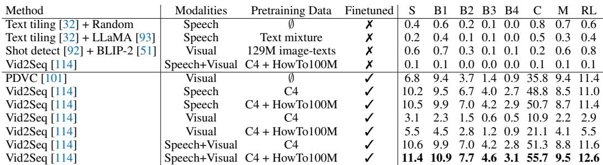
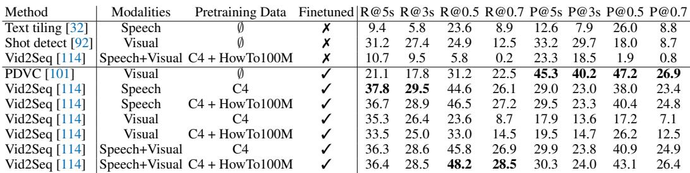
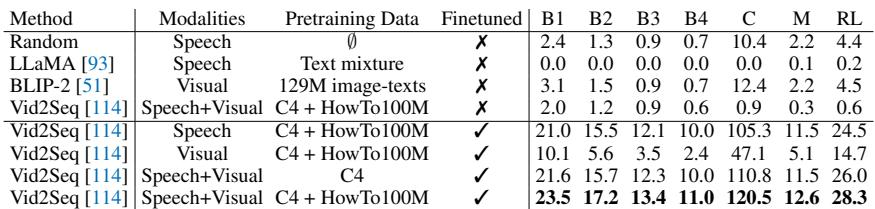
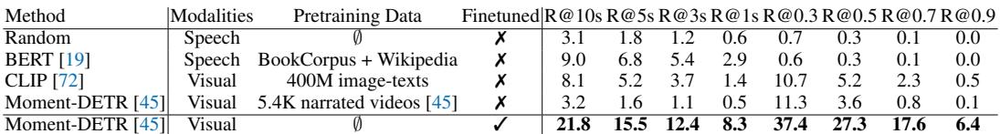
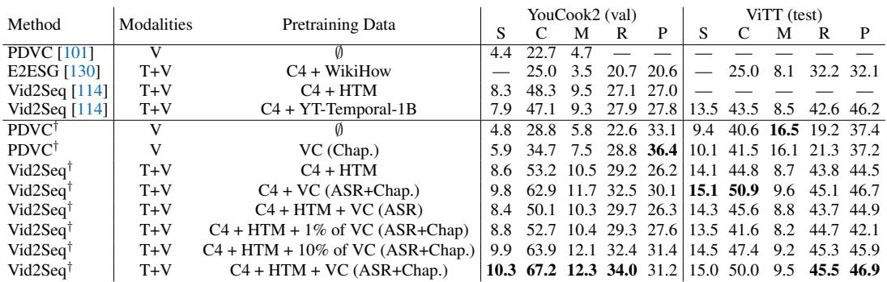
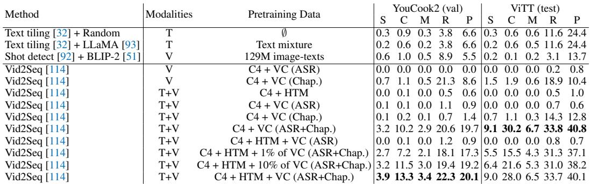

[← 返回 README](../README.md)

# 4 Experiments

## 📌 预览
实验部分包含四个子任务：完整的 chapter generation（4.1）、给定边界的 chapter generation（4.2）、chapter grounding（4.3）和迁移到 dense video captioning（4.4）。核心结论：训练在 VidChapters-7M 上效果显著，多模态输入优于单模态，预训练可迁移且 scaling 有效。

---

In this Section, we present the results of models on VidChapters-7M for the full video chapter generation task in Section 4.1, the task of video chapter generation given ground-truth boundaries in Section 4.2 and the video chapter grounding task in Section 4.3. Finally, we study transfer learning from video chapter generation to dense video captioning tasks in Section 4.4.

**Evaluation metrics.** To evaluate the quality of the generated chapter titles (without their positions), we use standard metrics used for visual captioning: BLEU [70] (B), CIDEr [95] (C), METEOR [7] (M) and ROUGE-L [56] (RL). To evaluate video chapter generation as a whole, including the locations of the generated chapters, we follow standard protocols used for dense video captioning, given the similar nature of the two tasks. We use the standard evaluation tool [42] which calculates matched pairs between generated events and the ground truth across IoU thresholds of {0.3, 0.5, 0.7, 0.9}, and compute captioning metrics over the matched pairs. However, these metrics do not take into account the story of the video and give high scores to methods generating many redundant chapters. Hence for an overall evaluation, we also use SODA_c [22] (S) which first tries to find a temporally optimal matching between generated and reference chapters to capture the story of a video, then computes METEOR scores for the matching and derives F-measure scores from the METEOR scores to penalize redundant chapters. To separately evaluate chapter localization, we report the recall $(R@Ks, R@K)$ and the precision $(P@Ks, P@K)$ across various thresholds in terms of the distance to the ground-truth start time or IoU with the ground-truth start-end window. We also report the average recall (R) and average precision (P) across IoU thresholds of {0.3, 0.5, 0.7, 0.9}.

> 💡 **评价指标解读**:
> - **文本质量**: BLEU, CIDEr, METEOR, ROUGE-L — 标准 captioning 指标
> - **整体评估**: SODA_c (S) — 考虑故事连贯性，惩罚冗余章节，是最核心的指标
> - **定位质量**: R@Ks/P@Ks（基于时间距离）和 R@K/P@K（基于 IoU）
> - SODA_c 是这篇文章最重要的指标，因为它同时评估定位和描述

**Implementation details.** Unless stated otherwise, for all models, we use the speech transcripts (ASR) and visual features extracted as explained in Section 3.2. By default, each model is taken from the corresponding official implementation, and all model hyper-parameters are set according to the original papers. We use the Adam optimizer [39] for training and select the final model based on the best validation performance. Our experiments are run on 8 NVIDIA A100 80GB GPUs. More details are included in Appendix Section D.

---

### 4.1 Video chapter generation

> 💡 **4.1 要点预览**: 完整的 chapter generation 任务——需要同时分割视频和生成标题。

In this Section, we study the task of video chapter generation that requires temporally segmenting the video and generating a chapter title for each segment.

**Models.** For the video chapter segmentation subtask, we evaluate two zero-shot approaches (i.e., that are not trained on VidChapters-7M): speech text tiling [32], which detects subtopic shifts based on the analysis of lexical co-occurrence patterns, and a visual scene change detection algorithm [92] based on the sum of absolute differences. To derive zero-shot baselines for the full video chapter generation task, we combine text tiling and shot detection with various alternatives that can generate text given text or visual input: a random baseline that predicts a random speech sentence spoken inside the predicted boundaries, LLaMA-7B [93] (prompted to summarize the speech transcript spoken inside the predicted boundaries) and BLIP-2 [51] (prompted to describe the middle video frame of the predicted segment). Finally, we also train and evaluate two state-of-the-art end-to-end dense video captioning models on VidChapters-7M: PDVC [101] which consists of a visual-only DETR-style [11] architecture and Vid2Seq [114] which is a multi-modal sequence-to-sequence model pretrained on the C4 text corpus [74] and on narrated videos with ASR (e.g., YT-Temporal-1B [118]). For Vid2Seq, we also report zero-shot results after pretraining on narrated videos without finetuning on VidChapters-7M.

> 💡 **模型分类**:
> - **Zero-shot 分割**: Text tiling（语音）、Shot detection（视觉）
> - **Zero-shot 生成**: Random、LLaMA-7B、BLIP-2
> - **端到端训练**: PDVC（视觉 DETR 架构）、Vid2Seq（多模态 seq2seq）
> - Vid2Seq 是主角，支持 Speech/Visual/Speech+Visual 三种模式

**Implementation details.** We use the text tiling implementation from the NLTK library [9] which tokenizes the text into pseudosentences of size 50. We use the shot detection software from the FFMPEG library [92] with a confidence threshold of 0.7. For BLIP-2, we use the 3.4B-parameter variant with FLAN-T5-XL [106] and CLIP ViT-L/14 [20, 72]. We reimplement Vid2Seq [114] (originally released in Jax) in PyTorch, use T5-Base pretrained on C4 [74] for initialization and pretrain Vid2Seq on HowTo100M [64]. More details are included in Appendix Section D.

**Results.** We report the results for video chapter generation using global metrics and localization-only metrics in Tables 3 and 4, respectively.

*Table 3: Video chapter generation (global metrics) on VidChapters-7M test set. Here, finetuned refers to finetuning on the VidChapters-7M train set, and speech refers to transcribed speech (ASR).*

> 💡 **Table 3 批读**:
> - Zero-shot baseline 效果极差（SODA_c < 1）→ 任务很难
> - PDVC (visual-only, finetuned): S=6.8, C=35.8
> - Vid2Seq (Speech+Visual, C4+HowTo100M, finetuned): **S=11.4, C=55.7** — 最佳
> - **Speech >> Visual**: Vid2Seq speech-only (S=10.5) vs visual-only (S=5.5)
> - 多模态 > 单模态: Speech+Visual (S=11.4) > Speech-only (S=10.5)
> - HowTo100M 预训练对 visual 模型帮助更大（3.1→5.5）

*Table 4: Video chapter generation (segmentation metrics) on VidChapters-7M test set.*

> 💡 **Table 4 批读**:
> - 分割指标上，PDVC 精度最高（P@0.5=47.2），但召回较低
> - Vid2Seq 在召回上更好（R@0.5=48.2）
> - Shot detection 的 zero-shot 表现不错（R@5s=31.2），说明视觉场景变化是有用的信号
> - Vid2Seq Speech+Visual+HowTo100M 综合最佳

We observe that models trained on VidChapters-7M outperform zero-shot baselines, demonstrating the effectiveness of training on VidChapters-7M. In particular, PDVC [101] has the best precision and Vid2Seq [114] achieves the best results in terms of overall generation and recall. We also find that Vid2Seq's speech-only mode outperforms its visual-only mode and that using both speech and visual inputs leads to the best performance. This demonstrates that video chapter generation is a multi-modal task. Finally, we observe that pretraining using ASR in narrated videos from HowTo100M [64] improves the video chapter generation performance of the Vid2Seq model. Specifically, pretraining on HowTo100M is more beneficial for vision-aware models than for the speech-only model.

> 💡 **4.1 核心结论**:
> 1. 训练 vs Zero-shot: 训练效果远优于 zero-shot
> 2. 语音 > 视觉: 章节标题主要与语音相关（回想 Table 2: 49%+26%=75% 与语音相关）
> 3. 多模态最佳: Speech+Visual 始终优于单模态
> 4. 预训练有效: HowTo100M 预训练提升性能，尤其对视觉模型

---

### 4.2 Video chapter generation given ground-truth boundaries

> 💡 **4.2 要点预览**: 给定正确的时间边界，只需生成章节标题。简化版任务，用于验证标题生成能力。

In this Section, we study the task of generating chapter titles provided correct temporal boundaries of video chapters. This task is a simplification of the previously studied task where we assume perfect temporal segmentation. We adopt the same models and implementation details as previously introduced in Section 4.1.

*Table 5: Chapter title generation given ground-truth boundaries on VidChapters-7M test set.*

> 💡 **Table 5 批读**:
> - LLaMA-7B zero-shot **比 random 还差**（全 0）→ LLM 直接做摘要效果不好
> - BLIP-2 和 random 差不多 → 纯视觉信息不足以生成章节标题
> - Vid2Seq (Speech+Visual, C4+HowTo100M, finetuned): **C=120.5, M=12.6** — 最佳
> - 去掉分割压力后，CIDEr 从 55.7 飙升到 120.5 → 分割本身是很大的瓶颈

**Results.** We report results for video chapter generation given ground-truth boundaries in Table 5. Similar to the full video chapter generation task, we observe that solving the task without training on VidChapters-7M is hard. Indeed, LLaMA [93] struggles to summarize the speech content into a chapter title and underperforms the random baseline. Furthermore, BLIP-2 [51] slightly improves over the random baseline. In addition, Vid2Seq [114] in zero-shot mode underperforms the random baseline due to the large domain gap between ASR and chapter titles (see Section 3.3). In comparison, the performance of models trained on VidChapters-7M is significantly higher. Moreover, Vid2Seq's speech-only mode outperforms its visual-only mode, and using both speech and visual inputs is beneficial, confirming the benefit of multi-modal reasoning for the task of generating chapter titles. Finally, pretraining on narrated videos from HowTo100M [64] improves the performance of the Vid2Seq model on VidChapters-7M.

> 💡 **4.2 小结**:
> - 所有 zero-shot 方法都很差，说明 ASR→章节标题的 domain gap 很大
> - 多模态 + HowTo100M 预训练 + VidChapters-7M 微调 = 最佳组合
> - 分割质量是完整任务的主要瓶颈（CIDEr: 120.5 vs 55.7）

---

### 4.3 Video chapter grounding

> 💡 **4.3 要点预览**: 给定章节标题，定位其在视频中的时间位置。评估了 ASR 匹配、CLIP 匹配和 Moment-DETR。

In this Section, we study the task of video chapter grounding that requires a model to temporally localize a chapter start time (or start-end window) given an annotated chapter title (query). Hence, compared to the video chapter generation task, we here assume chapter titles to be given and focus on the temporal chapter localization only.

**Models.** We evaluate three zero-shot alternatives: a random baseline that randomly picks the timestamps of a speech sentence in the video, a BERT [19] baseline that picks the timestamps of the speech sentence that has the closest text embedding with the queried chapter title, and a CLIP [72] baseline picking the frames where the query-frame similarity score drops from the highest scoring frame by a certain threshold $\epsilon$. We also train and evaluate on VidChapters-7M a state-of-the-art end-to-end video grounding model: Moment-DETR [45] which is designed for moment retrieval based on visual inputs. Furthermore, we report zero-shot performance of Moment-DETR obtained with the model checkpoint from Lei et al. [45] pretrained on 5.4K narrated videos with ASR from the QVHighlights dataset [45].

**Implementation details.** We use the [CLS] token sequence embedding for the BERT baseline and a threshold of $\epsilon = 0.05$ for the CLIP baseline. More details are provided in Appendix Section D.

*Table 6: Video chapter grounding on VidChapters-7M test set.*

> 💡 **Table 6 批读**:
> - BERT (ASR 匹配) 在起始时间上还行（R@10s=9.0），但 IoU 指标很差
> - CLIP 在 IoU 指标上更好（R@0.3=10.7）→ 视觉信息对定位边界有用
> - Moment-DETR (finetuned): **R@0.5=27.3** — 远超 zero-shot 方法
> - 但总体数字不高 → grounding 任务很难，尤其对长视频
> - Moment-DETR 只用视觉，未来加入语音信息可能更好

**Results.** We report results for the video chapter grounding task in Table 6. We first observe that the simple zero-shot baselines based on ASR can decently find start times, but struggle to predict start-end windows due to the important domain gap between ASR and video chapters (see Section 3.3). The CLIP [72] baseline slightly underperforms the BERT baseline [19] at retrieving start times, but is much better at finding start-end windows. Furthermore, the Moment-DETR model [45] trained on VidChapters-7M outperform the zero-shot baselines for both localization of start times and start-end windows, which further demonstrates the effectiveness of training on VidChapters-7M. Finally, we note that Moment-DETR cannot handle speech inputs, but hope that our results showing the benefit of this modality on other tasks in VidChapters-7M will foster research in the localization of language queries in untrimmed videos using multi-modal inputs (vision and speech transcripts).

**Qualitative examples.** See Appendix Section B.

> 💡 **4.3 小结**:
> - ASR 匹配找起始点还行，找边界不行（ASR 和章节粒度差太多）
> - 视觉信息对定位边界更有用
> - Moment-DETR 只用了视觉，缺少语音输入是个明显的局限

---

### 4.4 Transfer learning on dense video captioning

> 💡 **4.4 要点预览**: 这是本文最重要的实验！验证 VidChapters-7M 作为预训练数据的价值，包括 finetuning 和 zero-shot 两种迁移设置。

In this Section, we investigate the pretraining of video-language models on our new VidChapters-7M. To this end, we adopt video chapter generation models trained on VidChapters-7M (see Section 4.1) to the tasks of dense video captioning with or without finetuning.

**Datasets.** We use two dense video captioning datasets. YouCook2 [127] has 2K untrimmed videos of cooking procedures. On average, each video lasts 320s and is annotated with 7.7 temporally-localized sentences. ViTT [36] was created to better reflect the distribution of instructional videos in the wild compared to YouCook2, and consists of 8K untrimmed instructional videos. On average, each video lasts 250s and is annotated with 7.1 temporally-localized short tags. For both datasets, we extract speech transcripts and visual features as described in Section 3.2, and follow the standard splits for training, validation and testing. Note that we only use videos available on YouTube at the time of the work, resulting in 10 to $20\%$ less videos than in the original datasets.

**Implementation details.** See Section 4.1 and Appendix Section D.

*Table 7: Comparison with the state of the art on the YouCook2 and ViTT dense video captioning benchmarks. T: Transcribed speech, V: Visual, HTM: HowTo100M, VC: VidChapters-7M, Chap.: Chapters. † denote results of our experiments.*

> 💡 **Table 7 批读（Finetuning 结果）**:
> - **YouCook2**: Vid2Seq (C4+HTM+VC) CIDEr=**67.2** vs 之前 SOTA 48.3 → **+18.9 提升！**
> - **ViTT**: Vid2Seq (C4+HTM+VC) CIDEr=**50.0** vs 之前 SOTA 43.5 → **+6.5 提升**
> - PDVC 加 VC 预训练也有提升（CIDEr 28.8→34.7 on YouCook2）
> - **Scaling**: 1% VC → 10% VC → 100% VC 性能持续提升
>   - YouCook2 CIDEr: 52.7 → 63.9 → 67.2
>   - 说明数据量确实是关键因素
> - 章节标注比 ASR 有用：C4+VC(ASR+Chap.) > C4+HTM+VC(ASR) 

**Results after finetuning.** In Table 7, we show that pretraining for video chapter generation on VidChapters-7M greatly improves the downstream dense video captioning performance compared to training from scratch or pretraining only with ASR data as done in previous work [114]. We also find that pretraining both on HowTo100M [64] and VidChapters-7M results in the best overall performance. In particular, the Vid2Seq model pretrained on both HowTo100M and VidChapters-7M largely improves the state of the art on both the YouCook2 and ViTT benchmarks. In detail, on the YouCook2 benchmark, in the setting with $\mathrm{C4} + \mathrm{HowTo100M}$ pretraining, we observe that a boost of about 4.9 points in CIDEr is obtained with our reimplementation of Vid2Seq, and that 14.0 additional points in CIDEr are obtained by pretraining on VidChapters-7M. Finally, we report the results of the Vid2Seq model after pretraining on different fractions of VidChapters-7M for a fixed number of iterations. We construct these subsets such that larger subsets include the smaller ones. These results suggest that the scale of the chapter dataset is an important factor in the downstream dense video captioning performance. We conclude that VidChapters-7M opens a promising avenue for multi-modal pretraining. We further show qualitative examples of dense video captioning in Appendix Section B.

> 💡 **Scaling 分析**:
> - 1% VidChapters (≈8K 视频): 性能略优于 HowTo100M-only
> - 10% VidChapters (≈80K 视频): 接近 100% 的性能
> - 100% VidChapters (817K 视频): 最佳性能
> - 这个 scaling curve 说明更多章节数据 → 更好的预训练效果

*Table 8: Zero-shot dense video captioning on the YouCook2 and ViTT benchmarks. T: Transcribed speech, V: Visual, HTM: HowTo100M, VC: VidChapters-7M, Chap.: Chapters.*

> 💡 **Table 8 批读（Zero-shot 结果）**:
> - 这是**首次**探索 zero-shot dense video captioning（不用目标数据集的标注训练）
> - 只用 ASR 训练的 Vid2Seq 在 zero-shot 下完全不行（接近 0）
> - 只用章节标注、visual-only 模式有一定效果
> - **ASR + 章节标注的组合效果最好**: YouCook2 S=3.9, ViTT S=9.0
> - Scaling 同样有效：1% → 10% → 100% VC 持续提升
> - 关键：训练时需要同时用 ASR 和章节，这样模型才能学会利用语音输入

**Zero-shot dense video captioning.** In Table 8, we report results obtained by directly applying video chapter generation models trained on VidChapters-7M for dense video captioning without finetuning for this task. As far as we know, our work is the first to explore this challenging zero-shot setting where no manual annotation of dense video captions is used for training. The Vid2Seq model trained only using ASR data underperforms the random baseline, due to the large domain difference between speech transcripts and dense captions [114]. In the visual-only setting, the variant trained on chapter annotations is better than the variant trained on ASR annotations. In the visual+speech settings, only using chapter annotations does not perform well, as training only on chapters (i.e., without speech) does not enable the model to learn how to use the input speech modality at inference. However, using both ASR and chapter annotations results in a largely better zero-shot dense video captioning performance and outperforms all baselines not trained on VidChapters-7M, demonstrating the complementary nature of the ASR and chapters annotations. Finally, we also observe the benefits of increasing the size of the pretraining dataset of chapters in this setting.

---

## 🔖 Section 总结

### 关键数字速查
| 指标 | 数值 |
|------|------|
| Vid2Seq 最佳 SODA_c (chapter gen) | 11.4 |
| Vid2Seq 最佳 CIDEr (chapter gen) | 55.7 |
| Vid2Seq 最佳 CIDEr (GT boundaries) | 120.5 |
| Moment-DETR R@0.5 (grounding) | 27.3 |
| YouCook2 CIDEr SOTA (finetuned) | 67.2 (+18.9) |
| ViTT CIDEr SOTA (finetuned) | 50.0 (+6.5) |

### 核心洞察
1. **多模态是关键**: Speech+Visual 始终优于单模态，语音信息尤其重要
2. **训练必不可少**: Zero-shot 方法在所有任务上都远不如训练后的模型
3. **预训练价值巨大**: VidChapters-7M 作为预训练数据大幅提升 dense captioning SOTA
4. **Scaling 有效**: 更多数据 → 更好的下游性能，从 1% 到 100% 持续提升
5. **ASR + 章节互补**: 两种标注各有优势，组合使用效果最佳
