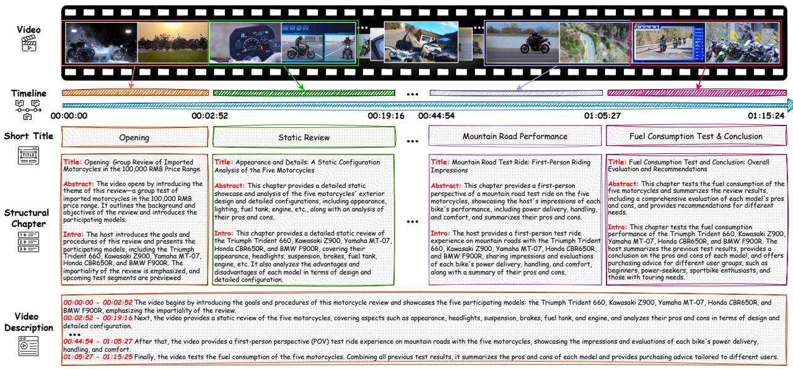

# 1. Introduction

> 来源: ARC-Chapter (arXiv 2025)

---

## 📄 原文

The exponential proliferation of long-form video content, including educational lectures, vlogs, live streams, and meeting recordings—poses significant challenges for automatic content understanding. Video chaptering [35; 44] has emerged as a promising solution, segmenting videos into navigable and semantically coherent chapters. This enables efficient content retrieval, summarization, and enhanced user interaction, which are critical for managing and consuming large-scale video data.

> 💡 **Video Chaptering 任务定义**: 将长视频自动切分为语义连贯的"章节"，每个章节有时间边界和文本描述。应用场景包括内容检索、视频摘要、用户导航等。

Despite notable advances in segmenting short videos (usually within five minutes) for tasks such as action segmentation [8; 22; 27; 32; 39], temporal event localization [16; 54], and dense video captioning [19; 38; 46], the structuring of hour-long videos remains a formidable challenge. First, modeling sophisticated semantics across multimodal inputs, including visual and audio streams—over extended temporal horizons requires robust and scalable architectures. Second, the scarcity of large-scale datasets with fine-grained annotations hinders the development and evaluation of effective chaptering models. Third, existing evaluation metrics [10; 19] often fail to capture the semantic granularity of chapter boundaries, leading to suboptimal matching and similarity scoring between predicted and ground-truth segments [10].

> 💡 **三大挑战**:
> 1. **建模难度**: 小时级多模态（视觉+音频）语义理解需要可扩展的架构
> 2. **数据匮乏**: 缺少大规模细粒度标注数据集
> 3. **评估不足**: 现有指标（如 SODA）无法准确反映章节边界的语义粒度
>
> 这三个挑战分别对应了论文的三大贡献：大规模数据集、层级标注、GRACE 指标。

In this technical report, we introduce ARC-Chapter, a comprehensive framework designed to address the unique challenges of long-form video structuring. As illustrated in Fig. 1, ARC-Chapter enables the segmentation of lengthy videos into navigable chapters and generates hierarchical summaries that capture both coarse and fine-grained content structure. Our work makes three primary contributions. First, we advance the scalability of video chaptering by developing the first large-scale model trained on one million long videos, totaling 400,000 hours of content. This dataset is fifty times larger than those used in previous studies [35], allowing our model to generalize across diverse video domains and formats. Second, we propose a semi-automatic annotation pipeline for hierarchical summaries, which leverages easily accessible human-annotated coarse labels. This pipeline integrates automatic speech recognition (ASR) derived transcripts with timestamped visual

> 💡 **三大贡献对应**:
> | 挑战 | 贡献 |
> |------|------|
> | 数据匮乏 | 百万级视频（400K 小时），50× 于前作 |
> | 标注粗糙 | 半自动层级标注流水线（利用人工粗标注 + LLM 细化） |
> | 评估不足 | GRACE 指标（下文详述） |


Figure 1 模型能力展示。给定视频，模型生成三级结构化输出：1) Short Title — 简洁章节标签；2) Structural Chapter — 包含重写标题、摘要和介绍的详细标注；3) Timestamp-Aligned Video Description — 与精确时间边界对齐的细粒度描述。

> 💡 **三级输出结构**:
> ```
> Level 1: Short Title        → "Intro", "US Debt Problem"（简洁标签）
> Level 2: Structural Chapter  → Title + Abstract + Introduction（结构化详细标注）
> Level 3: Video Description   → 每段时间对应的细粒度叙述描述
> ```
> 这种层级设计满足不同粒度的用户需求：快速浏览用 Level 1，深度理解用 Level 2/3。

elements, enabling a holistic and multimodal understanding of video content. Third, we introduce GRACE, a novel granularity-robust evaluation metric designed to address the semantic misalignment issues prevalent in existing chaptering benchmarks. GRACE provides a more accurate assessment of chapter boundary quality by accounting for varying levels of semantic granularity.

Our extensive experiments demonstrate the effectiveness of ARC-Chapter, which establishes a new stateof-the-art on both Chinese and English long-form video chaptering benchmarks. Specifically, ARC-Chapter substantially outperforms previous methods on the VidChapters-7M test sets (e.g., CIDEr: 100.9→186.6; F1: 45.3→59.3; SODA: 19.3→30.6). We validate the importance of multimodality, showing that our full model surpasses video-only and audio-only variants by 7.7 and 5.3 points on SODA, respectively. Furthermore, pretraining on our large-scale dataset significantly enhances transferability, evidenced by notable performance gains on downstream tasks like YouCook2 and ActivityNet Captions. Crucially, our work is the first to identify a clear scaling law in video chaptering: model performance consistently improves with increased training data and label density. This finding refutes previous observations that performance saturates on smaller datasets ( $\sim$ 20k samples) [35] and suggests a promising direction for future research.

> 💡 **关键实验结果汇总**:
> - **VidChapters-7M**: CIDEr 100.9→186.6 (+85%), F1 45.3→59.3, SODA 19.3→30.6
> - **多模态优势**: Video+ASR 比 Video-only 高 7.7 SODA，比 ASR-only 高 5.3 SODA
> - **Scaling Law**: 性能随数据量持续提升，打破前作"20K 样本即饱和"的结论
> - **迁移性**: YouCook2、ActivityNet Captions 也获得显著提升

The remainder of this report is structured as follows: Section 2 reviews related works; Section 3 describes the dataset and annotation pipeline; Section 4 details our methodology and model architecture; Section 5 presents experimental results and analysis; Section 6 concludes.

---

## 💡 Section 总结

Introduction 清晰地建立了"问题→挑战→方案→贡献"的叙事逻辑：

1. **问题定义**: 长视频内容爆炸 → 需要自动章节化
2. **三个挑战**: 建模难、数据少、评估差
3. **三个贡献**: 大数据集 VidAtlas、层级标注流水线、GRACE 指标
4. **亮点发现**: 首次证明 video chaptering 存在 scaling law（数据越多性能越好），这对该领域的后续研究方向有重要指导意义
5. **多模态很重要**: Video+ASR >> 单模态，说明视觉和语音信息是互补的
