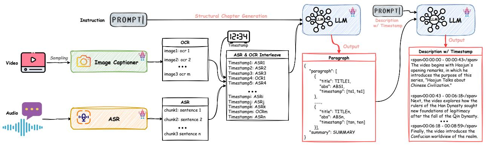

# 2. Related Works

> 来源: ARC-Chapter (arXiv 2025)

---

## 📄 原文

Global Video Understanding. Early video understanding [1; 7; 13; 23; 26; 33; 37; 41; 42; 49; 52; 53; 57] research primarily targeted global comprehension tasks, such as video question answering, video captioning, and video classification. These methods treat entire videos as holistic units, extracting global representations to predict semantic labels or generate summaries. While effective for short videos, they often fail to capture complex temporal dynamics and hierarchical structures of long-form content [24; 30].

> 💡 **全局视频理解的局限**:
> - 将视频视为整体单元，提取全局表示
> - 适用于短视频（VideoQA、Video Captioning、分类）
> - **问题**: 无法捕捉长视频的复杂时间动态和层级结构


Figure 2 自动视频标注流水线概览。从视频帧中提取视觉描述（含 OCR），从音频中提取 ASR 文本，按时间戳对齐交错为统一的多模态文本，再由 LLM 生成结构化章节和时间对齐的视频描述。

> 💡 **注意**: Figure 2 在论文 PDF 中出现在 Related Works 页面，但内容属于 Section 3（数据标注流水线）。这里保留原始位置。

Temporal Segmentation for Short Videos. To address the limitations of global approaches, recent works [14; 15; 17; 28; 30; 40; 47; 50; 56] have shifted towards modeling the temporal structure of videos. Datasets like ActivityNet Captions [19], Charades-STA [11], YouCook2 [55] and Breakfast [21] provide timestamped event annotations, enabling tasks such as temporal event localization, action segmentation, and dense video captioning. These approaches move beyond global representations to identify and describe fine-grained events and local temporal dependencies. However, most temporally-structured datasets [25; 48] are limited to short clips, typically under several minutes, and thus do not capture the challenges of ultra-long videos found in lectures, podcasts, or livestreams. The lack of large-scale, long-duration datasets with fine-grained temporal annotations remains a major bottleneck.

> 💡 **短视频时序分割发展脉络**:
> | 数据集 | 任务 | 视频时长 | 局限 |
> |--------|------|----------|------|
> | ActivityNet Captions | Dense Video Captioning | 数分钟 | 短 |
> | Charades-STA | Temporal Grounding | ~30秒 | 短 |
> | YouCook2 | Dense Captioning | ~5分钟 | 短 |
> | Breakfast | Action Segmentation | ~2分钟 | 短 |
>
> **核心矛盾**: 这些数据集都在几分钟以内，无法涵盖讲座、播客等小时级视频的挑战。

Long-Form Video Structuring. A few efforts [35; 45] have explored the structuring of hour-long videos. The VidChapters-7M dataset [45] provides a large-scale benchmark for video chaptering, with millions of videos and annotated chapter boundaries, better reflecting real-world scenarios such as vlogs, podcasts, and meetings where long-term temporal reasoning is essential.

> 💡 **长视频结构化的前作**:
> - **VidChapters-7M** (NeurIPS 2023): 首个大规模章节化基准，817K 视频
> - **Chapter-LLaMA** (CVPR 2025): 基于 LLaMA 的章节化模型，在 VidChapters-7M 上训练

Despite these advances, significant challenges remain. Existing chaptering models often rely on limited modalities, such as automatic speech recognition, are trained on small-scale datasets, and produce coarse, uninformative descriptions, which limits their scalability across diverse video domains. To address these issues, we propose a scalable, multimodal framework for long-form video chaptering, supported by a large-scale dataset with detailed chapter descriptions.

> 💡 **现有方法的三大不足（ARC-Chapter 要解决的）**:
> 1. **模态受限**: 大多只用 ASR（纯文本），忽略视觉信息
> 2. **训练规模小**: 导致泛化能力差
> 3. **描述粗糙**: 只有简短标题，缺乏详细内容描述

---

## 💡 Section 总结

Related Works 梳理了视频理解的三个发展阶段：

```
全局理解 (Global)     →    短视频时序分割     →    长视频结构化
├── VideoQA              ├── Action Seg.          ├── VidChapters-7M
├── Video Captioning     ├── Temporal Grounding   ├── Chapter-LLaMA
└── Video Classification └── Dense Captioning     └── ARC-Chapter (本文)
```

**核心定位**: ARC-Chapter 填补了长视频结构化中"多模态 + 大规模 + 细粒度标注"的空白。现有方法要么只用 ASR，要么训练数据太少，要么输出太粗糙。
