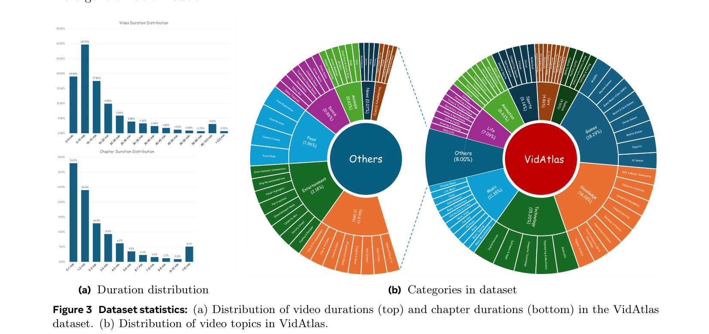

[← 返回 README](../README.md)

# 3 Data Collection and Annotation

## 📌 预览
介绍 VidAtlas 数据集：41 万+视频，11.5 万小时，平均 5.5 个 chapter/视频。标注管线：用户 chapter markers → 多模态信息提取（Whisper + Qwen2.5-VL）→ LLM 推理生成层级标注。

---

A significant challenge in developing strong video chaptering models is the scarcity of publicly available datasets with detailed, multi-level annotations. Existing datasets typically provide only sparse labels, such as video-level categories for video classification or coarse temporal segments with brief titles such as VidChapters-7M. To address this limitation and to facilitate research on hierarchical video chaptering and summarization, we introduce a new, richly annotated video chaptering dataset. This section details our data curation and annotation pipeline.

> 💡 **Section 概览**: 现有数据集标注太粗（只有短标题），本节介绍如何构建 VidAtlas——一个有层级标注的大规模 chaptering 数据集。

---

## 3.1 Data Curation

*Figure 2: 自动视频标注管线概览。从视频帧提取 visual captions (含 OCR)，从音频提取 ASR 转录，按时间对齐后合并为多模态转录文本。结合原始 chapter markers，由 LLM 生成结构化 chapter 和时间对齐的视频描述。*

> 💡 **3.1 要点预览**: 数据从哪来？如何筛选？关键是利用视频平台上用户已有的 chapter markers。

One of the key contributions of our work is the introduction of a new large-scale dataset, named VidAtlas, which is designed for the task of hierarchical video chaptering and summarization. Our primary goal is to construct a dataset that not only provides accurate chapter boundaries but also offers dense, multi-granularity textual descriptions for both individual chapters and the entire video.

**Data Sourcing.** We begin by sourcing videos from the video platform. The primary selection criterion is the presence of author-provided chapter markers. These markers, which include the start/end timestamps and a short title for each chapter, are manually defined by the video uploader. This approach provides us with a highly accurate human-verified ground truth for the temporal segmentation of videos, which is a significant foundation for our subsequent annotation efforts. The collected videos, which are long, well-structured, and information-dense, are ideal candidates for video chaptering.

> 💡 **数据来源的巧妙之处**:
> - 利用视频平台上 uploader 自己标注的 chapter markers（类似 YouTube 的章节功能）
> - 这些 markers 是 human-verified 的，质量高且免费
> - 这是一种"低成本获取高质量种子标注"的策略

---

**Filtering and Refinement.** Starting with this initial collection, we apply several filtering criteria to guarantee the quality and diversity of our dataset for video understanding and chaptering. First, we retain videos whose durations lie between 2 minutes and 3 hours. This range excludes trivial short clips, which are unnecessary for chaptering, as well as overly long videos, which are often unstructured (e.g., live streams) and difficult to process due to the context-length limitations of our model. Second, we curate videos across a wide range of domains, including educational lectures, DIY tutorials, reviews & unboxings, interviews & podcasts, webinars & presentations, gaming & music albums, fitness & cooking and documentaries. This wide distribution of domains ensures that the dataset is not biased towards any specific genre and supports the development of more generalizable models.

> 💡 **筛选标准**:
> - 时长 2min - 3h（太短不需要 chaptering，太长不好处理）
> - 跨域覆盖：教育、DIY、评测、播客、游戏、健身等 16 大类 100+ 子类
> - 设计原则：避免 genre bias，提升泛化性

---

## 3.2 Hierarchical Annotation

> 💡 **3.2 要点预览**: 标注管线的核心是"先提取多模态信息，再用 LLM 推理"——比直接用 MLLM 处理视频便宜得多。

To generate high-quality video chaptering annotations, we design an automated annotation pipeline that leverages both multimodal content extraction and large language model (LLM)-based reasoning based on the videos with user-provided chapter makers, i.e. timestamps and brief title of each chapter. The illustration of our annotation pipeline is shown in Fig. 2.

**Multimodal Information Extraction.** Considering efficiency and cost, we avoid directly using multimodal large language models (MLLMs) for video annotation. Instead, we first extract multimodal information from video frames and audio, integrate this content, and then feed the result into text-only LLM for reasoning and annotation. Specifically, we use Whisper-v3 [29] to transcribe speech into text, segmented into sentences with the corresponding timestamps. In parallel, we uniformly sample video frames with a fixed sampling frame rate and employ Qwen2.5-VL-7B [4] to extract visual captions and on-screen text (OCR) for better understanding of the video content. Subsequently, the visual captions and ASR transcripts are temporally aligned based on their respective timestamps. This process allows us to interleave the textual content from both modalities into a unified chronologically ordered sequence. This multimodal transcript, together with

> 💡 **信息提取工具链**:
> - **音频**: Whisper-v3 → 带时间戳的 ASR 转录
> - **视觉**: Qwen2.5-VL-7B → visual captions + OCR
> - **融合**: 按时间戳交错排列，形成统一的多模态转录文本
> - 这种"先用小模型提取，再用 LLM 推理"的范式在大规模标注中很常见

the original user-provided chapter timestamps and short titles, is fed into LLM for reasoning and structural segmentation.

---

**LLM Reasoning and Chaptering.** The LLM is prompted to analyze the transcript and reorganize the content into a structured set of chapters, each containing a comprehensive title, an abstract, an introduction, and precise temporal boundaries. Following this, we perform a verification step on the LLM's output to ensure that the generated chapter boundaries strictly adhere to the original timestamps. Building upon the verified structured chapter information, we further prompt the LLM to produce a comprehensive, timestamped narrative description for the entire video. Through this annotation pipeline, we can efficiently obtain accurate, multi-level video chapter segmentation and descriptive annotations. The resulting annotations form a dense, hierarchically organized representation of long-form videos, supporting a wide range of research tasks in video understanding, temporal reasoning, chaptering, and summarization.

> 💡 **LLM 标注两步走**:
> 1. **结构化 chaptering**: 输入多模态转录 + 原始 markers → 输出每个 chapter 的 title、abstract、introduction
> 2. **时间对齐描述**: 基于上一步结果 → 输出整个视频的 timestamped description
> - 关键约束：LLM 生成的边界必须与原始时间戳一致（verification step）

---

## 3.3 Dataset Statistics

We summarize the key statistics of our VidAtlas dataset and highlight the properties that make it suited for research on video chaptering and summarization. The dataset comprises 410k+ videos with an average duration of 16.8 minutes, amounting to more than 115k hours of diverse content. On average, each video is segmented into 5.5 chapters, with an average chapter duration of 182 seconds (approximately 3 minutes). Fig. 3a provides a detailed statistic of the duration distributions for both videos and chapters. Our dataset contains a wide spectrum of video and chapter lengths to ensure models are trained on a diverse temporal structures. This comprehensive video/chapter length distribution makes the models exposed to a variety of content length, from concise segments to hour-long narratives, forcing models to resolve both rapid topic shifts and sustained thematic segments. To mitigate genre bias, VidAtlas covers a wide array of topics, including 16 primary categories with over 100 subcategories, as shown in Fig. 3b. The categories of VidAtlas include Games, Knowledge, Technology, Music, Life, Animation, and Sports, together with other variety that captures long-tail topics. Videos in these categories are typically well-structured and information-dense, making them ideal for chaptering.

> 💡 **VidAtlas 关键数字**:
> - 41 万+ 视频，11.5 万小时
> - 平均时长 16.8 min，平均 5.5 chapters/video，平均 chapter 时长 3 min
> - 16 大类，100+ 子类
> - 对比 VidChapters-7M：VidAtlas 虽然视频数更少（41 万 vs 700 万），但标注质量高得多（层级 vs 仅短标题）

---

*Figure 3: 数据集统计：(a) VidAtlas 中视频时长（上）和 chapter 时长（下）的分布。(b) VidAtlas 的视频主题分布。*

> 💡 **Figure 3 批读**:
> - 视频时长分布：大部分在 5-30 min，但也有超过 1 小时的
> - Chapter 时长分布：大部分在 1-5 min，短 chapter 和长 chapter 都有覆盖
> - 主题分布：Games 和 Knowledge 占比最大，Sports、Music 等也有不少

---

## 🔖 Section 总结

### 关键数字速查
| 指标 | 数值 |
|------|------|
| 视频数 | 410k+ |
| 总时长 | 115k+ 小时 |
| 平均视频时长 | 16.8 min |
| 平均 chapter 数 | 5.5 / video |
| 平均 chapter 时长 | 182s (~3 min) |
| 主题类别 | 16 大类, 100+ 子类 |

### 核心洞察
1. 数据来源的关键 insight：利用视频平台用户自己标注的 chapter markers 作为免费的高质量种子标注
2. 标注管线的 trade-off：用 Whisper + Qwen2.5-VL 提取信息 → text-only LLM 推理，比直接用 MLLM 便宜
3. 层级标注设计（Short Title → Structural Chapter → Description）为模型提供了多粒度的训练信号
