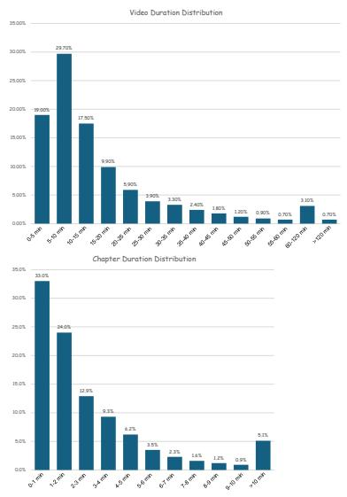
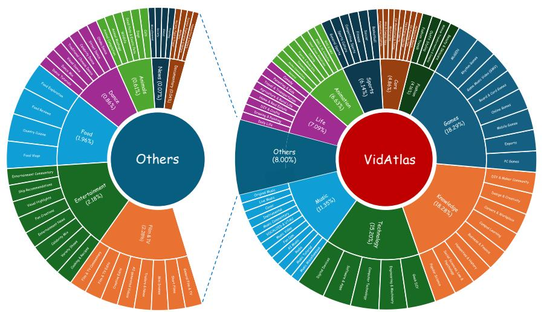

# 3. Data Collection and Annotation

> 来源: ARC-Chapter (arXiv 2025)

---

## 📄 原文

A significant challenge in developing strong video chaptering models is the scarcity of publicly available datasets with detailed, multi-level annotations. Existing datasets typically provide only sparse labels, such as video-level categories for video classification or coarse temporal segments with brief titles such as VidChapters-7M.

> 💡 **问题**: 现有数据集标注太粗
> - VidChapters-7M: 只有短标题 (如 "Introduction")
> - 缺乏多层级详细标注

To address this limitation and to facilitate research on hierarchical video chaptering and summarization, we introduce a new, richly annotated video chaptering dataset.

> 💡 **解决**: 引入新数据集 **VidAtlas**，带有丰富的层级标注

---

### 3.1 Data Curation

> 💡 **3.1 要点预览**: 数据从哪来？怎么筛选？

One of the key contributions of our work is the introduction of a new large-scale dataset, named **VidAtlas**, which is designed for the task of hierarchical video chaptering and summarization.

We begin by sourcing videos from the video platform. The primary selection criterion is the presence of **author-provided chapter markers**. These markers, which include the start/end timestamps and a short title for each chapter, are manually defined by the video uploader.

> 💡 **数据来源**: 
> - 和 VidChapters-7M 类似，利用**用户自己标注的章节**
> - 包含时间戳 + 短标题
> - 人工验证的 ground truth，质量高

We retain videos whose durations lie between **2 minutes and 3 hours**. This range excludes trivial short clips (unnecessary for chaptering) as well as overly long videos (often unstructured like live streams).

> 💡 **时长筛选**:
> ```
> 2 分钟 ≤ 视频时长 ≤ 3 小时
> 
> 排除:
> - 太短的 (<2min): 不需要章节化
> - 太长的 (>3h): 通常是直播，结构混乱
> ```

We curate videos across a wide range of domains, including: Educational lectures, DIY tutorials, Reviews & unboxings, Interviews & podcasts, Webinars & presentations, Gaming & music albums, Fitness & cooking, Documentaries...

> 💡 **领域多样性**: 16 大类，100+ 子类
> - Games, Knowledge, Technology, Music, Life, Animation, Sports...
> - 避免领域偏差

---

### 3.2 Hierarchical Annotation

> 💡 **3.2 要点预览**: 如何从粗标注生成细粒度层级标注？关键是多模态提取 + LLM 推理


*Figure 2: 自动标注流水线总览。从视频帧提取视觉描述（含 OCR），从音频提取 ASR 转录，时间对齐后交错成统一的多模态文本，再由 LLM 生成结构化章节和时间戳对齐的描述。*

To generate high-quality video chaptering annotations, we design an automated annotation pipeline that leverages both multimodal content extraction and large language model (LLM)-based reasoning. Considering efficiency and cost, we avoid directly using multimodal large language models (MLLMs) for video annotation.

> 💡 **设计思路**: 
> - 不直接用 MLLM 处理视频（太贵）
> - 而是先提取多模态信息，再用 LLM 推理

**Step 1: ASR 提取**
We use **Whisper-v3** to transcribe speech into text, segmented into sentences with the corresponding timestamps.

**Step 2: 视觉提取**
We uniformly sample video frames with a fixed sampling frame rate and employ **Qwen2.5-VL-7B** to extract visual captions and on-screen text (OCR).

**Step 3: 时间对齐**
The visual captions and ASR transcripts are temporally aligned based on their respective timestamps. This process allows us to interleave the textual content from both modalities into a unified chronologically ordered sequence.

> 💡 **标注流程图**:
> ```
> ┌─────────────────────────────────────────────────────────┐
> │  原始视频                                               │
> │     ↓                                                   │
> │  ┌──────────────┐    ┌──────────────┐                  │
> │  │ Whisper-v3   │    │ Qwen2.5-VL   │                  │
> │  │ (ASR 转录)   │    │ (视觉描述+OCR)│                  │
> │  └──────┬───────┘    └──────┬───────┘                  │
> │         ↓                   ↓                          │
> │     [句子+时间戳]      [描述+时间戳]                    │
> │         └───────┬───────────┘                          │
> │                 ↓                                       │
> │       按时间戳对齐，交错融合                            │
> │         [ASR1, Visual-A, ASR2, Visual-B, ...]          │
> │                 ↓                                       │
> │            LLM 推理                                    │
> │                 ↓                                       │
> │  ┌─────────────────────────────────────┐               │
> │  │ 输出: 层级标注                       │               │
> │  │ ├── Short Title: "Cooking Eggs"     │               │
> │  │ ├── Abstract: "本章介绍..."          │               │
> │  │ ├── Introduction: "详细说明..."      │               │
> │  │ └── Timestamps: 0:00-2:30           │               │
> │  └─────────────────────────────────────┘               │
> └─────────────────────────────────────────────────────────┘
> ```

The LLM is prompted to analyze the transcript and reorganize the content into a structured set of chapters. Following this, we perform a **verification step** on the LLM's output to ensure that the generated chapter boundaries strictly adhere to the original timestamps.

> 💡 **验证步骤**: LLM 可能产生幻觉，所以要验证生成的边界是否与原始时间戳一致

Building upon the verified structured chapter information, we further prompt the LLM to produce a comprehensive, timestamped narrative description for the entire video.

> 💡 **最终输出层级**:
> | 层级 | 内容 | 粒度 |
> |------|------|------|
> | Short Title | "Cooking Eggs" | 粗 |
> | Structural Chapter | "0:00-2:30 \| Preparing..." | 中 |
> | Video Description | "In this video, the chef..." | 细 |

---

### 3.3 Dataset Statistics

> 💡 **3.3 要点预览**: VidAtlas 数据集的规模和分布



*Figure 3: VidAtlas 数据集统计。(a) 视频时长（上）和章节时长（下）分布；(b) 视频主题分布。*

| 统计项 | 数值 |
|--------|------|
| 视频数量 | **410K+** |
| 总时长 | **115K 小时** |
| 平均视频长度 | 16.8 分钟 |
| 平均章节数 | 5.5 个/视频 |
| 平均章节时长 | 182 秒 (~3分钟) |
| 语言 | 中英双语 |
| 领域 | 16 大类，100+ 子类 |

> 💡 **vs VidChapters-7M 对比**:
> | 维度 | VidChapters-7M | VidAtlas |
> |------|---------------|----------|
> | 视频数 | 817K | 410K |
> | 标注层级 | 单层 (短标题) | **多层** (标题→章节→摘要) |
> | 语言 | 93% 英语 | **中英双语** |
> | 章节时长 | 142 秒 | 182 秒 |
>
> VidAtlas 视频数少一半，但标注**丰富很多**

---

## 💡 Section 3 总结

### 数据构建核心思路

```
用户粗标注 (短标题+时间戳)
         ↓
+ Whisper-v3 (ASR)
+ Qwen2.5-VL (视觉+OCR)
         ↓
时间对齐融合
         ↓
LLM 推理 + 验证
         ↓
层级标注 (短标题 → 结构化章节 → 详细描述)
```

### 关键设计决策

1. **利用用户标注作为 GT** — 高质量时间边界
2. **多模态融合** — ASR + 视觉描述 + OCR
3. **LLM 增强** — 从粗到细，生成层级标注
4. **验证机制** — 防止 LLM 幻觉
