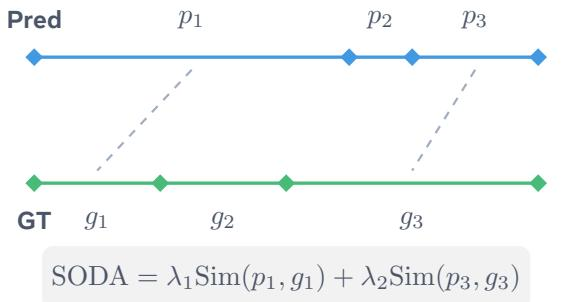
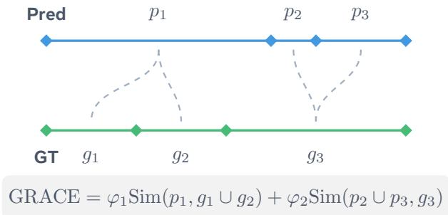

# 4. ARC-Chapter Method

> 来源: ARC-Chapter (arXiv 2025)

---

## 📄 原文

### 4.1 Overall Framework

> 💡 **4.1 要点预览**: ARC-Chapter 的模型架构是什么？怎么处理视频和ASR输入？


*Figure 4: 模型架构总览。输入包括任务 Prompt、采样视频帧和带时间戳的 ASR 转录。视频帧经 frozen vision encoder 编码，与 Prompt 和 ASR 文本一起送入可训练的 MLLM，生成多种格式的章节输出。*

We leverage **Qwen2.5-VL-7B** as our base model, enhancing its capabilities to process and structure video content into chapters.

> 💡 **Base Model**: Qwen2.5-VL-7B
> - Qwen 是阿里的开源多模态大模型
> - 7B 参数量，能处理视觉+文本

The model unifies three inputs:
1. An **instruction prompt** that specifies the task of input modalities and output schema
2. A sequence of **sampled video frames** that provide appearance, layout and on-screen text (including subtitles)
3. A **timestamp-aligned ASR transcript** from audio

> 💡 **三种输入**:
> ```
> ┌─────────────────────────────────────────┐
> │  Instruction Prompt                     │
> │  "Generate chapters for this video..."  │
> ├─────────────────────────────────────────┤
> │  Video Frames (可选)                    │
> │  [帧1] [帧2] [帧3] ... [帧N]            │
> ├─────────────────────────────────────────┤
> │  ASR Transcript (可选)                  │
> │  "00:00:00: Hello everyone..."          │
> │  "00:00:05: Today we will..."           │
> └─────────────────────────────────────────┘
> ```
> Video 和 ASR 至少要有一个

Frames are embedded with **Qwen2.5-VL vision encoder** and translated into visual tokens, while ASR transcript is tokenized as plain text with explicit timestamps. The **vision encoder is kept frozen** and the language model is instruction tuned on VidAtlas to specialize in video chaptering.

> 💡 **编码方式**:
> | 输入 | 编码方式 | 训练时 |
> |------|----------|--------|
> | Video Frames | Vision Encoder → Visual Tokens | **冻结** |
> | ASR Text | Tokenizer → Text Tokens | 随 LLM 训练 |
> | LLM | Qwen2.5-7B | **全参数微调** |

---

**Prompt Design**

To handle the diverse requirements of different inputs and outputs of the model, we design a set of **18 distinct prompt templates**.

> 💡 **18 种 Prompt 模板** (3×3×2):
> | 维度 | 选项 |
> |------|------|
> | 语言 | English / Chinese |
> | 输入模态 | ASR-only / Video-only / ASR+Video |
> | 输出格式 | Short Titles / Structural Chapters / Video Descriptions |
>
> 这样设计可以：
> - 做 ablation 研究
> - 适应某个模态缺失的场景

---

**Video Input 处理**

To balance temporal coverage and context budget, we follow the setup of Qwen2.5-VL and **cap the visual stream at 768 frames** sampled at up to 1 fps.

> 💡 **视频采样策略**:
> ```
> 视频时长 < 12.8 分钟:
>     采样率 = 1 fps
>     
> 视频时长 ≥ 12.8 分钟:
>     均匀降采样到 768 帧
>     例如: 60分钟视频 → 768帧 ≈ 0.21 fps
> ```
>
> 目的：保留粗粒度全局覆盖，捕捉高层语义转换

Since the model context length is shared across modalities, we **dynamically adjust the per-frame token allowance** according to the input of ASR transcript.

> 💡 **动态分辨率调整**:
> | 输入模式 | 帧分辨率 | 原因 |
> |----------|----------|------|
> | Video-only | 高分辨率 | 需要 OCR、字幕等细节 |
> | Video+ASR | 低分辨率 | 给 ASR 留 context 空间 |

To enhance temporal awareness, we randomly **overlay timestamps onto the video frames**, making the model more sensitive to the video timeline.

> 💡 **时间戳增强**: 随机在帧上叠加时间戳
> - 让模型学会关注"视频进度"
> - 增强时间感知能力

---

**ASR Input 处理**

Although integrating raw audio features or learned audio embeddings from pretrained ASR models (e.g. Whisper) is attractive, it presents severe scalability challenges for long-form video.

Whisper-style audio encoder produces **50 audio tokens per second**, a 60-minute audio therefore produces **180k tokens**, far exceeding feasible LLM context budgets.

> 💡 **为什么用 ASR 文本而非原始音频？**
> ```
> 原始音频问题:
> - Whisper 输出 50 tokens/秒
> - 60 分钟 = 180K tokens
> - 远超 LLM context 限制 (通常 32K-128K)
> 
> ASR 文本优势:
> - 信息密度高
> - Token 数少很多
> - 容易与视频帧对齐
> ```

We use **Whisper-large-v3** to generate timestamped ASR transcripts. The model provides sentence-level segments with corresponding start timestamps.

> 💡 **ASR 格式**: `时间戳: 文本`
> ```
> 00:00:00: Hello everyone, welcome to my channel.
> 00:00:05: Today we will learn how to cook eggs.
> 00:00:12: First, let's prepare the ingredients.
> ```

---

### 4.2 Training Strategy

> 💡 **4.2 要点预览**: 怎么训练模型？有什么特殊技巧？

We perform **supervised instruction tuning** on VidAtlas and VidChapter-7M using all prompt templates. The training objective is the standard **autoregressive next-token prediction loss** over the target sequence.

> 💡 **训练设置**:
> - **数据**: VidAtlas + VidChapters-7M
> - **方法**: Supervised Fine-Tuning (SFT)
> - **损失函数**: 标准 autoregressive next-token loss
> - **Vision Encoder**: 冻结
> - **LLM**: 全参数优化

---

**Adaptive Modality Dropping**

To enable a single model to perform well under various deployment conditions, we adopt an **adaptive modality dropping strategy** during training.

> 💡 **模态丢弃策略**:
> ```
> 训练时随机选择三种配置之一:
> 
> 配置1: Video + ASR (完整多模态)
> 配置2: Video-only  (模拟没有语音的场景)
> 配置3: ASR-only    (模拟没有视频的场景)
> ```
>
> **好处**:
> - 单一模型适应多种推理场景
> - 避免模型过度依赖某一模态
> - 提高鲁棒性

---

### 4.3 Evaluation Metrics

> 💡 **4.3 要点预览**: 为什么需要新指标 GRACE？SODA 有什么问题？



*Figure 5: SODA (one-to-one) vs GRACE (many-to-one) 匹配策略对比。One-to-one 会遗漏 p₂ 和 g₂ 等重要事件，many-to-one 则能全面考虑所有预测和 GT 事件。*

We observe that the primary metrics such as **SODA**, originally developed for dense video captioning, are **not well-suited** for the video chaptering task.

> 💡 **SODA 的问题**:
>
> **问题1: 一对一匹配太严格**
> ```
> SODA 要求: 1个预测 ↔ 1个GT
> 
> 但章节任务中:
> - 模型可能把1个GT章节细分成2个 (更细的粒度)
> - 这不一定是"错误"，而是"粒度不同"
> 
> SODA 会把这算作错误，不合理!
> ```
>
> **问题2: 粒度歧义**
> ```
> 同一个旅行视频:
> 
> 标注者A (粗粒度):     标注者B (细粒度):
> ├── Day 1             ├── Day 1 Morning
> ├── Day 2             ├── Day 1 Afternoon
> └── Day 3             ├── Day 1 Evening
>                       ├── Day 2 Morning
>                       └── ...
>                       
> 两种都是"正确的"！
> ```

---

**GRACE 指标**

We propose **GRACE**, a metric tailored for video chaptering. It introduces a **many-to-one (set-to-one) matching paradigm**.

> 💡 **GRACE 核心思想: Many-to-One 匹配**
> ```
> SODA (one-to-one):
>   预测1 ←→ GT1
>   预测2 ←→ GT2
>   预测3 ←→ ???  ← 算错误
>   
> GRACE (many-to-one):
>   {预测1, 预测2} ←→ GT1  ← 允许多个预测对应1个GT
>   预测3 ←→ GT2
>   
>   如果预测1+预测2的时间范围 ≈ GT1的范围
>   → 认为是"更细粒度的划分"，不算错误
> ```

Each ground-truth (predicted) chapter can be matched with **a set of** predicted (ground-truth) chapters.

We adopt the **dynamic time warping algorithm (DTW)** to achieve the optimal matching.

> 💡 **GRACE 计算步骤**:
> 1. 用 DTW 找最优的 many-to-one 匹配
> 2. 对每对匹配计算 IoU (时间重叠度)
> 3. 对每对匹配计算 BERTScore (语义相似度)
> 4. 加权求和得到最终分数
>
> **GRACE = Σ IoU × BERTScore**

> 💡 **GRACE vs SODA 对比**:
> | 维度 | SODA | GRACE |
> |------|------|-------|
> | 匹配方式 | one-to-one | **many-to-one** |
> | 粒度容忍 | 不容忍 | **容忍粒度差异** |
> | 语义评估 | METEOR | **BERTScore** |
> | 适用场景 | Dense captioning | **Video chaptering** |

---

### 4.4 Reinforcement Learning with GRPO

> 💡 **4.4 要点预览**: 除了 SFT，还用了强化学习进一步提升

We further improve our model via reinforcement learning (RL). Unlike standard RLHF pipelines which require a separately trained reward model, we adopt **GRPO (Group Relative Policy Optimization)**.

> 💡 **GRPO 是什么？**
> - 一种强化学习方法
> - 不需要单独训练 reward model
> - 直接用评价指标 (F1, SODA) 作为 reward

The reward function is designed to encourage both **high segmentation quality (F1)** and **high captioning quality (SODA)**.

> 💡 **Reward 函数**:
> ```
> Reward = F1 + SODA
> 
> F1: 评估时间分割质量 (边界准不准)
> SODA: 评估标题生成质量 (标题好不好)
> ```

---

## 💡 Section 4 总结

### ARC-Chapter 模型架构

```
┌─────────────────────────────────────────────────────────┐
│  输入                                                   │
│  ├── Prompt: "Generate chapters..."                    │
│  ├── Video: [帧1, 帧2, ..., 帧768] (≤1fps)             │
│  └── ASR: "00:00:00: Hello..." (Whisper-v3)           │
│                    ↓                                    │
│  ┌─────────────────────────────────────────────────┐   │
│  │  Qwen2.5-VL-7B                                   │   │
│  │  ├── Vision Encoder (冻结)                       │   │
│  │  └── LLM (全参数微调)                            │   │
│  └─────────────────────────────────────────────────┘   │
│                    ↓                                    │
│  输出: "<0:00> Introduction <2:30> Setup <5:00>..."    │
└─────────────────────────────────────────────────────────┘
```

### 关键设计决策

| 决策 | 原因 |
|------|------|
| 用 ASR 文本而非原始音频 | Token 数少，可扩展 |
| 冻结 Vision Encoder | 保留更长 context |
| Modality Dropping | 单模型适应多场景 |
| GRACE 指标 | 容忍粒度差异 |
| GRPO 强化学习 | 进一步提升 |
