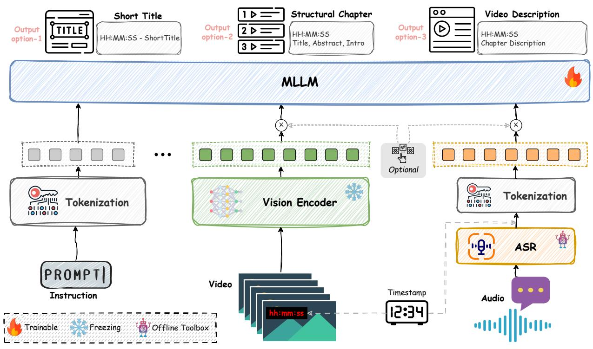
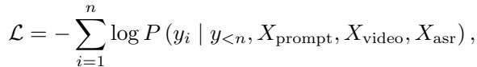
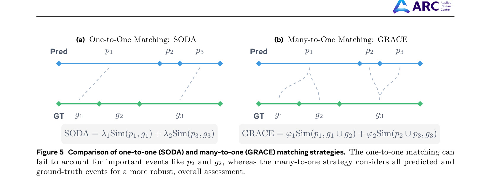
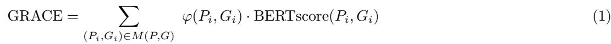
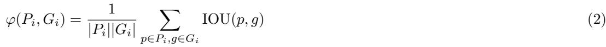
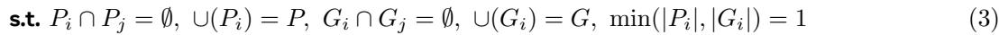
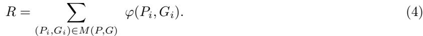

# 4. ARC-Chapter Method

> 来源: ARC-Chapter (arXiv 2025)

---

## 📄 原文

## 4.1 Overall Framework

We leverage Qwen2.5-VL-7B [5] as our base model, enhancing its capabilities to process and structure video content into chapters. The architecture of our model is illustrated in Fig. 4. The model unifies three inputs: 1) an instruction prompt that specifies the task of input modalities and output schema. 2) a sequence of sampled video frames that provide appearance, layout and on-screen text (including subtitles which often align with the ASR transcript), and 3) a timestamp-aligned ASR transcript from audio. While both the video and ASR transcript inputs are optional, the model requires at least one modality to be provided. Frames are embedded with Qwen2.5-VL vision encoder and translated into visual tokens, while ASR transcript is tokenized as plain text with explicit timestamps. The vision encoder is kept frozen and the language model is instruction tuned on VidAtlas to specialize in video chaptering.

> 💡 **模型架构要点**:
> - **Base Model**: Qwen2.5-VL-7B（冻结 Vision Encoder，微调 LLM）
> - **三路输入**: Instruction Prompt + Video Frames + ASR Text
> - **灵活性**: Video 和 ASR 都是可选的，至少提供一个模态即可
> - **设计选择**: 冻结 Vision Encoder 可以支持更长的上下文长度

Prompt Design. The model's behavior is guided by carefully designed prompts that specify the desired task and output format. To handle the diverse requirements of different inputs and outputs of the model, we design a set of 18 distinct prompt templates. These prompts are constructed based on three axes: language in source video, input modality, and desired output format.

• Language: We support English and Chinese to match the language of the source video.
• Input Modality: The prompt specifies whether the model should rely on ASR-only, video-only, or both video and ASR inputs. This allows for ablation studies and adaptation to scenarios where one modality may be absent or noisy.

> 💡 **18 个 Prompt 模板的组合**:
> ```
> 语言 (2) × 模态 (3) × 输出格式 (3) = 18 种模板
>   ├── EN / ZH
>   ├── ASR-only / Video-only / Video+ASR
>   └── Short Title / Structural Chapter / Video Description
> ```


Figure 4 视频章节化模型架构概览。输入包括任务 prompt、采样视频帧和带时间戳的 ASR 文本。视频帧通过冻结的 Vision Encoder 处理，视觉特征与 tokenized prompt 和 ASR 文本一起输入可训练的 MLLM，生成不同格式的章节输出。

• Output Format: We define three distinct output structures: (a) Short Titles for concise chapter markers, (b) Structured Chapters that include a title, abstract, and introduction for each chapter, and (c) Video Descriptions that provide a dense, timestamp-aligned summary of the entire video.

Video Input. To balance temporal coverage and context budget, we follow the setup of Qwen2.5-VL and cap the visual stream at 768 frames sampled at up to 1 fps. That is to say, videos shorter than 12.8 minutes are sampled with 1 fps, while longer videos are uniformly down-sampled to 768 frames with a lower fps. The sampling strategy retains coarse global coverage for hour-long content, ensuring sufficient representation to capture the high-level semantic shifts necessary for the chaptering task. Since the model context length is shared across modalities, we dynamically adjust the per-frame token allowance according to the input of ASR transcript. For video-only inputs we use a higher frame resolution (higher token budget per frame) so that small text (OCR and subtitles) and fine-grained visual cues are preserved. When ASR is provided alongside video, we reduce frame resolution (thus reducing the number of visual tokens) so that the combined input of visual tokens and ASR text fits the maximum context length of MLLM. This dynamic allocation is implemented by adjusting image scaling and patch-tokenization parameters at preprocessing time. Moreover, to enhance temporal awareness, we randomly overlay timestamps onto the video frames, making the model more sensitive to the video timeline.

> 💡 **视频输入的关键设计**:
> 1. **最多 768 帧**，≤12.8min 视频用 1fps，更长视频降帧
> 2. **动态 token 分配**:
>    - Video-only → 高分辨率帧（保留 OCR/字幕细节）
>    - Video+ASR → 低分辨率帧（给 ASR 文本留 token 空间）
> 3. **时间戳叠加**: 随机在帧上叠加时间戳水印，增强模型时间感知
>
> **设计理念**: 上下文长度是共享资源，在视觉和文本间动态分配。

ASR Input. Although integrating raw audio features or learned audio embeddings from pretrained ASR models (e.g.Whisper [29]) is attractive, it presents severe scalability challenges for long-form video. For example, while Whisper-style audio encoder produces 50 audio tokens per second, a 60-minute audio therefore produces 180k tokens, far exceeding feasible LLM context budgets without aggressive compression or specialized audio-to-token aggregation. Furthermore, synchronizing fixed-rate audio features with dynamically sampled video frames poses an additional alignment problem. To address these practical constraints, we opt to use ASR transcripts as a highly effective proxy for the audio modality. Text is significantly more information-dense. Therefore,

the ASR transcript of a long audio segment occupies far fewer tokens than its raw feature representation. This makes processing hour-long videos computationally feasible for both training and inference. Although such a paradigm introduces an extra step for offline ASR transcription, we believe that trading a modest amount of offline processing time for the ability to handle long-form audio under strict context-length budgets is worthwhile. In our implementation, we use Whisper-large-v3 [29] to generate timestamped ASR transcripts. The model provides sentence-level segments with corresponding start timestamps. We formulate the ASR text and timestamp of each segment as start time (hh:mm:ss): <ASR text>. The normalized ASR transcript is then passed to the model either alone (ASR-only) or together with visual tokens (ASR+Video), providing dense semantic information that is particularly useful for temporal boundary detection and chaptering.

> 💡 **为什么用 ASR 文本而不是音频特征？**
> | 方案 | 60 分钟视频的 token 数 | 可行性 |
> |------|----------------------|--------|
> | Whisper 音频特征 | ~180K tokens | ❌ 远超上下文预算 |
> | ASR 文本 | 数千 tokens | ✅ 高效可行 |
>
> 文本是高度信息压缩的表示，用 ASR 文本代替原始音频特征是处理长视频的务实选择。
> 格式: `hh:mm:ss: <ASR text>`，每个句子带时间戳。

## 4.2 Training Strategy

Training Objective. We perform supervised instruction tuning on VidAtlas and VidChapter-7M using all prompt templates. The training objective is the standard autoregressive next-token prediction loss over the target sequence. Given a multimodal input sequence consisting of a prompt $X _ { \mathrm { p r o m p t } }$ , video frames $X _ { \mathrm { v i d e o } }$ , and an ASR transcript $X _ { \mathrm { a s r } }$ (video stream $X _ { \mathrm { v i d e o } }$ and ASR streams $X _ { \mathrm { a s r } }$ are optional), the model is trained to maximize the log-likelihood of the target output sequence $Y = ( y _ { 1 } , y _ { 2 } , . . . , y _ { n } )$ (e.g., a list of chapter titles, a structured chapter object, or a timestamped description):



where $y _ { < i }$ represents the preceding ground-truth tokens. During training, the vision encoder is frozen to enable a larger context length, while all parameters of the large language model are optimized with the training objective.

> 💡 **训练目标**: 标准的自回归 next-token prediction loss，在所有 18 种 prompt 模板上联合训练。Vision Encoder 冻结，只训练 LLM 参数。

Adaptive Modality Dropping. To enable a single model to perform well under various deployment conditions, we adopt an adaptive modality dropping strategy during training. For each training sample, we randomly configure the input with a certain probability to be one of three types: 1) Video + ASR: Both modalities are provided to the model. 2) Video-only: The ASR transcript is omitted, forcing the model to rely solely on visual information. and 3) ASR-only: The video frames are omitted, requiring the model to understand the content based on the transcript alone. This strategy prevents the model from becoming overly reliant on a single modality and ensures it develops a comprehensive understanding from all available input modalities. Consequently, a single trained model can be deployed to handle videos under various conditions during inference (whether only a video is available, only transcript is provided, or both are present), without requiring specialized models for each scenario.

> 💡 **自适应模态 Dropping**:
> 训练时随机选择输入配置：Video+ASR / Video-only / ASR-only。
> - **好处**: 一个模型适应所有部署场景（有些视频没 ASR，有些没视频）
> - **类似于**: Dropout 的思想，防止模型过度依赖单一模态
> - **效果**: 即使推理时只提供一个模态，模型也能正常工作

## 4.3 Evaluation Metrics

Evaluation metrics can be divided into two aspects: (1) the accuracy of segmentation (e.g., Precision, Recall, and tIOU [20]), and (2) joint metrics that assess both segmentation and chapter captioning (e.g., CIDEr [20], SODA [10]). However, we observe that the primary metrics such as SODA, originally developed for dense video captioning, are not well-suited for the video chaptering task. While SODA enforces a one-to-one matching between predicted and ground-truth events to suppress redundancy in overlapping event detection, video chaptering requires segmenting videos into sequential, non-overlapping chapters. Furthermore, chaptering annotations often exhibit granularity ambiguity: different annotators may segment the same video at varying levels of detail—some may annotate coarse-grained chapters (e.g., by day in a travel vlog), while others may provide fine-grained chapters (e.g., by each visited site within a day). This results in multiple valid annotation granularities for the same content.

> 💡 **SODA 指标的问题**:
> - SODA 强制 one-to-one 匹配，但章节化天然存在**粒度歧义**
> - 例如旅行 vlog：有人按"天"分章节，有人按"每个景点"分
> - 两种分法都合理，但 one-to-one 匹配无法处理这种粒度差异

To address these challenges, we propose GRACE, a metric tailored for video chaptering. It introduces a many-to-one (set-to-one) matching paradigm, allowing each ground-truth (predicted) chapter to be matched with a set of predicted (ground-truth) chapters. As illustrated in Fig. 5, for each ground-truth chapter, GRACE evaluates the temporal overlap and semantic similarity between the chapter and its matched prediction set, using established language similarity metrics (e.g., BERTscore [51]) for textual comparison. Specifically, we aim to find a best many-to-one mapping $M$ which splits both ground-truth set $G$ and prediction set $P$ into several pairs of groups $\{ ( P _ { i } , G _ { i } ) \} _ { i = 1 } ^ { K }$ , followed by group-based similarity calculation:


*Figure 5: SODA (one-to-one) 与 GRACE (many-to-one) 匹配策略对比。One-to-one 匹配可能遗漏重要事件（如 $p_2$ 和 $g_2$），而 many-to-one 策略考虑所有预测和 GT 事件，评估更鲁棒。*







> 💡 **GRACE 指标详解**:
> - **公式 (1)**: GRACE = Σ (时间重叠分数 × 语义相似度)
> - **公式 (2)**: 时间重叠 φ = 组内所有预测-GT 对的平均 IOU
> - **公式 (3)**: 约束条件 — 分组互斥、覆盖完整、每组至少有一侧是单元素（many-to-**one**）
> - **求解算法**: DTW（动态时间规整）找最优匹配 M(P,G)
> - **BERTScore**: 组内所有 caption 拼接后计算

where $P _ { i }$ and $G _ { i }$ epresent groups of chapters. When calculating the BERTScore between two groups, we first concatenate all captions within each group into a single sentence, then compute the BERTScore between the two merged sentences. We adopt the dynamic time warping algorithm (DTW) [6; 31] to achieve the optimal matching $M ( P , G )$ , with IOU between two chapters being used as the matching criteria.

GRACE provides a more accurate and human-aligned assessment of chaptering models. This design confers several advantages: (1) robustness to annotation granularity, enabling fair evaluation across diverse annotation styles; (2) improved semantic fidelity, rewarding models that capture the full scope of ground-truth chapters; and (3) closer alignment with human judgment of chapter boundaries and content.

> 💡 **GRACE 的三个优势**:
> 1. **粒度鲁棒**: 不同标注粒度也能公平评估
> 2. **语义保真**: 奖励覆盖所有 GT 章节内容的模型
> 3. **人类对齐**: 更接近人类对章节边界的判断

## 4.4 Reinforcement Learning with GRPO

While supervised fine-tuning (SFT) achieves strong performance, the standard cross-entropy loss does not directly optimize for the primary objective of video chaptering: temporal accuracy. To further enhance the model's temporal localization capabilities, we introduce a subsequent reinforcement learning phase using the GRPO algorithm [12].

> 💡 **为什么需要 RL？** SFT 的 cross-entropy loss 优化的是 token 级别的预测准确率，而不是直接优化章节化的核心目标——时间定位精度。GRPO 通过定制奖励函数直接优化时间对齐。

The core of this phase is a reward function designed to directly incentivize precise chapter boundary prediction. We leverage our proposed GRACE metric, which holistically evaluates both temporal alignment and semantic content. However, to specifically sharpen the model's ability to predict accurate timestamps of segmented chapters, we formulate a simplified, temporal-only reward by omitting the semantic BERTscore component from Equation (1). For a given ground-truth chapter set $G$ and a model-generated set $P$ , the reward $R$ is calculated by summing the temporal alignment scores $\varphi$ over the optimal matching $M ( P , G )$ found via DTW:



> 💡 **GRPO 奖励函数**:
> - 基于 GRACE 的简化版：去掉 BERTScore（语义），只保留 φ（时间重叠）
> - **R = Σ φ(P_i, G_i)** — 直接衡量时间分割质量
> - 这样 RL 专注于时间精度优化，语义质量由 SFT 阶段保障

This reward directly reflects the quality of the temporal segmentation, providing a clear and targeted optimization objective.

Due to the significant context length required for multimodal inputs, and to specifically bolster the model's ability to reason from visual cues, we conduct this RL training phase using only the video modality. We select a diverse subset of 90k videos from both Chinese and English SFT data, ensuring that training samples cover all three output formats: short titles, structural chapters, and timestamped video description. We initialize the model with the weights from our best-performing SFT model and further optimize it using GRPO. The KL divergence coefficient is set to 0.01 to ensure that the policy does not stray far from the robust language generation capabilities learned during SFT, thereby balancing temporal refinement with descriptive quality.

> 💡 **GRPO 训练细节**:
> - **只用 Video 模态**（上下文长度考量 + 强化视觉推理能力）
> - **90K 视频子集**，覆盖中英双语 + 三种输出格式
> - **初始化**: 最佳 SFT 模型的权重
> - **KL 系数 = 0.01**: 防止 RL 偏离 SFT 学到的语言生成能力
> - **跨模态迁移**: 虽然只在 Video 上做 RL，但 ASR 和 Video+ASR 的时间精度也提升了（见实验部分）

---

## 💡 Section 总结

### 方法论全景

```
训练流程:
  SFT 阶段: Qwen2.5-VL-7B + VidAtlas/VidChapters-7M → 18 种 prompt 联合训练
                                                          ↓
  GRPO 阶段: 90K 视频子集 + 时间对齐奖励 → 进一步强化时间定位精度
```

### 核心设计决策

| 设计 | 选择 | 理由 |
|------|------|------|
| Base Model | Qwen2.5-VL-7B | 强大的视觉-语言理解能力 |
| Vision Encoder | 冻结 | 支持更长上下文 |
| 音频输入 | ASR 文本（非音频特征） | 60min 音频特征 = 180K tokens，不可行 |
| 帧数上限 | 768 帧 @ ≤1fps | 平衡覆盖率和计算开销 |
| 模态 Dropping | 随机 Drop | 一个模型适应所有场景 |
| RL 奖励 | 纯时间重叠（去 BERTScore） | 专注时间精度，语义靠 SFT |
| 评估指标 | GRACE（新提出） | Many-to-one 匹配，粒度鲁棒 |

### 与 Chapter-LLaMA 的方法对比

| 维度 | Chapter-LLaMA | ARC-Chapter |
|------|---------------|-------------|
| Base Model | LLaMA 3.1-8B | Qwen2.5-VL-7B |
| 视觉输入 | CLIP 嵌入 / 图像描述 | 原始帧（Vision Encoder） |
| 音频输入 | ASR 文本 | ASR 文本 |
| 训练数据 | ~20K 样本 | 百万级 |
| 输出格式 | 单层标题 | 三层层级 |
| RL | 无 | GRPO |
| 评估 | SODA | GRACE（新） |
