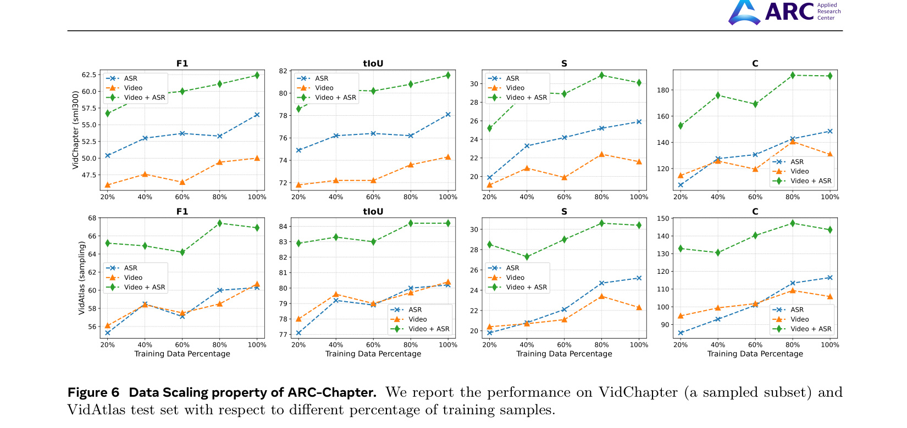
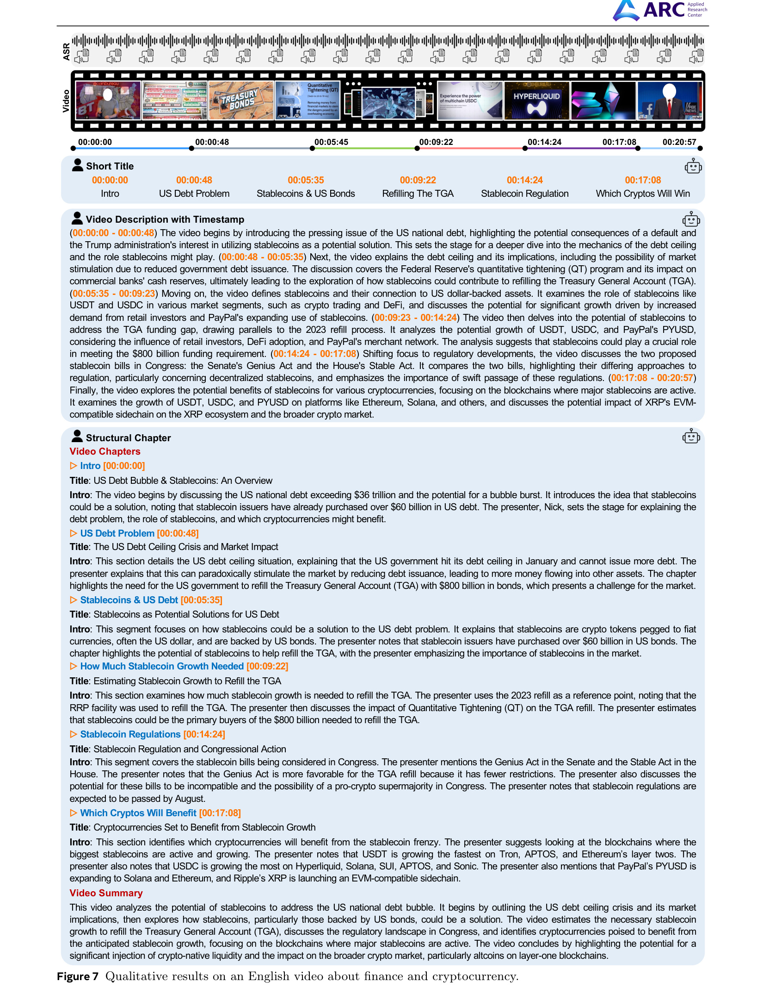
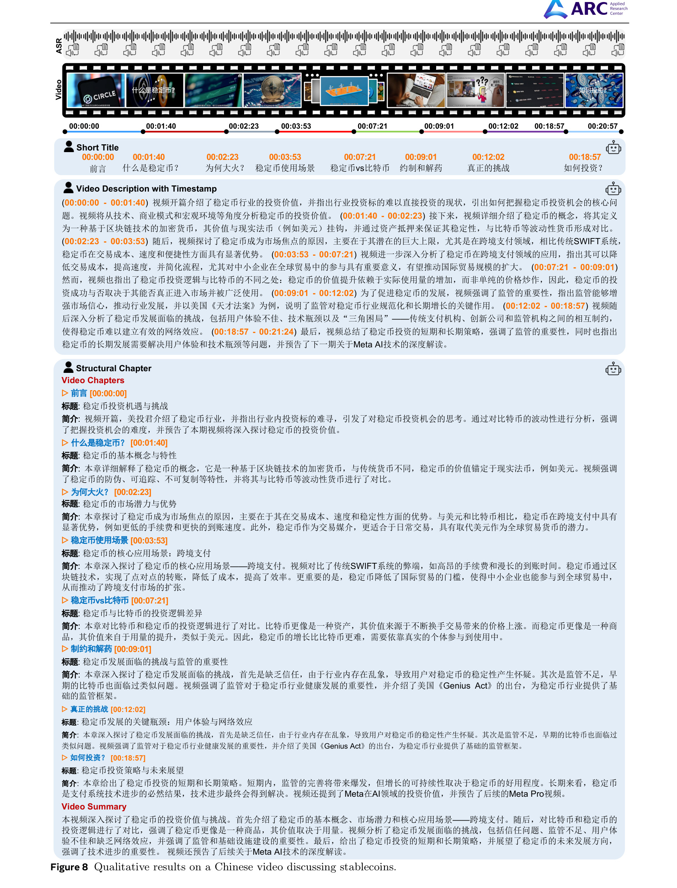

[← 返回 README](../README.md)

# 5 Experiments

## 📌 预览
在 VidChapters-7M、VidAtlas 上全面 SOTA。关键消融：data scaling 有明显正相关、层级标注不损害基础 chaptering 能力、GRPO 提升时间精度且跨模态迁移。下游任务（YouCook2、ActivityNet）也创 SOTA。

---

## 5.1 Evaluation Benchmark

To comprehensively assess our model's capabilities in video chaptering, we evaluate it on three distinct benchmarks covering different languages, scales, and data modalities. The evaluation targets two key criteria: the precision of temporal boundary localization and semantic relevance of the generated chapter titles/descriptions. VidChapters7M is a large-scale English chaptering dataset. We use two of its standard splits for evaluation, i.e., VidChapters7M-test and VidChapters7M-sml300val. VidChapters7M-test is a large-scale test set comprising 8.2k samples. For this split, the compared methods are only based on ASR

> 💡 **三个评测基准**:
> 1. **VidChapters7M-test** (8.2k 样本, 英文, ASR-only 比较)
> 2. **VidChapters7M-sml300val** (300 样本, 英文, 含视频+ASR, 用于模态消融)
> 3. **VidAtlas-test** (1.5k+ 样本, 中文, 含视频+ASR)

transcripts, while ARC-Chapter is evaluated with different input modalities. VidChapters7M-sml300val is a smaller validation set of 300 samples, which includes both the original videos and their corresponding ASR transcripts. This subset is ideal for fast evaluation and conducting modality ablation studies. To assess generalization beyond English, we additionally report experimental results on VidAtlas-test, a Chinese test set with more than 1.5k videos together with ASR transcripts and original videos.

---

## 5.2 Comparison with the State of the Art

**Performance on VidChapters7M.** As shown in Tab. 1, our ARC-Chapter significantly outperforms all existing methods on VidChapters7M-test benchmark. Our model achieves a new state-of-the-art result in the ASR-only regime, with an overall F1 score of 54.5, tIoU of 76.7, SODA of 23.5, and a CIDEr of 144.0. This represents a substantial improvement over the previous SOTA model, Chapter-Llama, with absolute gains of +9.2 in F1, +4.9 in tIoU, and +6.0 in the SODA score. Notably, the performance gain enlarges as video duration increases. For long videos (30-60 min), the evaluation metrics of SODA and CIDEr for ARC-Chapter are remarkably higher than which in Chapter-LLama, demonstrating the superior capability of our model in processing long videos. Even when compared against powerful general models like GPT-4o and Gemini-1.5-Pro, which are not finetuned on this task, ARC-Chapter perform much better. The experiments conducted on VidChapter7M-sml300 show more comparisons for different input modalities, shown in Tab. 2.

> 💡 **VidChapters7M 结果亮点**:
> - ASR-only 就已经碾压：F1 54.5 vs Chapter-Llama 45.3 (+9.2)
> - Video+ASR 更强：F1 59.3, SODA 30.6, CIDEr 186.6
> - 长视频优势更明显：30-60min 视频上 SODA 和 CIDEr 提升巨大
> - 甚至比 GPT-4o、Gemini-1.5-Pro 这些通用大模型都好

---

*Table 1: VidChapters7M-test 上的 SOTA 对比。ARC-Chapter 在所有指标和视频时长上都达到最佳性能。*

> 💡 **Table 1 批读**:
> - 对比方法分两类：(1) API 模型（GPT-4o, Gemini）不微调；(2) 专用模型（Vid2Seq, Chapter-Llama）微调
> - ARC-Chapter-asr 仅用 ASR 就全面超过 Chapter-Llama
> - ARC-Chapter-vidasr 多模态版本进一步拉大差距
> - 注意 Long 列：Chapter-Llama 在长视频上性能下降明显，ARC-Chapter 则保持稳定

---

*Table 2: VidChapter7M-sml300 上不同输入模态的对比。ARC-Chapter 通过有效整合语音和视频信息展现出卓越性能。*

> 💡 **Table 2 批读**:
> - Chapter-LLaMA 用了三种视觉信息（Embed、Caption、两者都有），最高 F1=44.4
> - ARC-Chapter Speech+Video：F1=62.4，SODA=30.1，CIDEr=190.7 → 碾压式领先
> - 单模态 ARC-Chapter-asr (F1=56.5) 就已经超过 Chapter-LLaMA 最佳组合

---

**Performance on VidAtlas.** As detailed in Tab. 3, we evaluate our model on the VidAtlas benchmark under three settings: ASR-only, video-only, and ASR+video. ARC-Chapter consistently establish a new state-of-the-art across all settings. Our full multimodal model, ARCChapter-vidasr, which leverages both ASR and video inputs, achieves an overall F1 score of 66.2, tIoU of 84.0, SODA of 30.2, CIDEr of 141.5, and GRACE of 34.1. This marks a significant leap over the strongest LLM, Gemini-2.5-Pro, with an absolute improvement of +17.5 in F1 score and more than doubling the SODA score (+16.7). Furthermore, our single-modality versions also demonstrate superior performance. The ASR-only model, ARCChapter-asr, achieves an F1 of 58.8, and the video-only model, ARCChapter-vid, scores an F1 of 57.6. From shot-to-long videos, our model consistently outperforms other models, demonstrating its robustness in handling extended content.

> 💡 **VidAtlas（中文）结果**:
> - ARCChapter-vidasr：F1=66.2, GRACE=34.1 → 远超 Gemini-2.5-Pro (F1=48.7, GRACE=19.8)
> - 有趣的是 DeepSeek-R1 在 Long 视频+多模态上 F1=62.2，接近 ARC-Chapter
> - 但总体上 ARC-Chapter 全面领先，特别是 GRACE 指标（34.1 vs 19.8）

---

*Table 3: VidAtlas-test 上的 SOTA 对比。ARC-Chapter 在所有设置下一致达到新 SOTA。*

> 💡 **Table 3 批读**:
> - 对比了 6 个 API 模型 × 2 种模态设置，ARC-Chapter 全面领先
> - Gemini-2.5-Pro 是最强对手，但 F1 差了 17.5 个点
> - 中文基准上 ARC-Chapter 的优势更大，说明大规模双语训练很有效

---

## 5.3 Transferability

To evaluate transferability, we pre-trained ARC-Chapter on our dataset before fine-tuning and testing it on the dense video captioning benchmarks, i.e., Youcook2 and ActivityNet Captions. As shown in Table 4, our model establishes a new state-of-the-art, significantly outperforming all prior MLLM-based methods.

Notably, for event segmentation ability, ARC-Chapter achieves an F1/SODA Score of 37.9/12.5 on YouCook2, a substantial improvement over the previous best of 33.5/7.9. This demonstrates that the knowledge acquired during pre-training effectively transfers and enhances performance on downstream tasks.

> 💡 **迁移性结果**:
> - YouCook2：F1 33.5→37.9 (+4.4), SODA 7.9→12.5 (+4.6), CIDEr 39.0→69.4 (+30.4)
> - 说明在 VidAtlas 上学到的 chaptering 能力可以迁移到 dense video captioning

---

*Table 4: YouCook2 和 ActivityNet Captions 上的迁移性能。ARC-Chapter 在两个数据集上都创新 SOTA。*

> 💡 **Table 4 批读**:
> - ARC-Chapter 在 YouCook2 上 Rank=1.0（所有指标都是第一）
> - ActivityNet 上 Rank=2.0，仅次于某些单项但综合最好
> - 之前的方法中 Vid2Seq 是 dense captioning 的老牌强模型，现在被大幅超越

---

## 5.4 Ablation Studies

### 5.4.1 Scaling Property

We analyze how ARC-Chapter scales with the amount of training data. Concretely, we subsample the training set at 20%, 40%, 60%, 80%, and 100% and keep the model architecture and prompt templates fixed. We evaluate three inference modalities, i.e.ASR-only, Video-only, and ASR+Video, on two benchmarks: VidChapters-7M (sml300val) and a sampled subset of the VidAtlas-testset for efficiency. As illustrated in Fig. 6, the performance across all metrics (F1, tIOU, SODA, and CIDEr) and input modalities (ASR-only, Video-only, Video+ASR) demonstrates a clear positive correlation with the amount of training data. Specifically, the full multimodal model (Video+ASR) consistently achieves the best performance. ARC-Chapter is highly data-efficient, achieving strong performance with as little as 20% of the training data. Furthermore, it is data-scalable, continuing to benefit from larger corpora for even better results.

> 💡 **Scaling Law 发现**:
> - 20%→100% 数据，所有指标持续上升，没有饱和
> - 这推翻了 Chapter-Llama 在 ~20k 样本就饱和的结论
> - 说明 video chaptering 是 data-hungry 的任务，之前只是数据不够

---

*Figure 6: ARC-Chapter 的数据 Scaling 特性。不同训练数据比例下，在 VidChapter 和 VidAtlas 测试集上的性能。*

> 💡 **Figure 6 批读**:
> - 8 个子图：2 个数据集 × 4 个指标
> - 趋势一致：都是单调递增，曲线还没有明显平台期
> - Video+ASR（蓝色）始终最高，ASR-only 次之，Video-only 最低
> - 暗示：如果有更多数据，性能还能继续提升

---

### 5.4.2 Hierarchical Annotations

A core contribution of our work is the VidAtlas dataset, which features rich, hierarchical annotations. To validate the effectiveness of this data structure, we evaluate our model's capability to generate outputs of varying complexity, from simple Short Title to detailed Structural Info which comprising a title, abstract and introduction for each chapter. The results are presented in Table 5. From the experimental results, our model successfully learns to generate these complex, structured outputs, achieving strong performance across all generated components (title, abstract, introduction) on both VidChapter-sml300 and VidAtlas-testset benchmarks, particularly when using both video and ASR inputs. This demonstrates a high degree of semantic understanding.

More importantly, the capability for detailed generation does not come at the cost of performance on the fundamental chaptering task. When comparing the segmentation metrics (temporal evaluation score F1 and tIoU) for the Short Title task versus the more demanding Structural Info task, we observe only a negligible difference. For example, on VidChapter-sml300, the multimodal model achieved an F1 score of 62.4 and a tIoU of 81.6 for Short Title generation, compared to slightly lower scores of 61.4 and 80.6 for Structural Info generation. Notably, this small margin represents the largest performance gap observed across all modality inputs on both benchmarks, indicating that the model can perform complex, multi-part generation in a single forward pass without compromising its core ability to accurately segment the video. This result strongly validates our hierarchical annotation strategy, demonstrating that training on such rich data endows the model with advanced structural reasoning capabilities.

> 💡 **层级标注消融**:
> - 生成 Structural Info（title+abstract+intro）不会损害基础的 segmentation 能力
> - F1 差异仅 ~1 个点（62.4 vs 61.4）
> - 说明模型能在 single forward pass 中同时做好 segmentation 和 detailed generation

---

*Table 5: 层级标注能力消融。Short Title vs Structural Info 的性能对比。生成复杂结构化输出几乎不影响分割精度。*

> 💡 **Table 5 批读**:
> - Short Title 列和 Structural Info 列的 F1/tIoU 几乎一样
> - Structural Info 还能输出 title、abstract、intro 三个层级的 SODA/CIDEr/GRACE
> - 在中文基准上，abstract 和 intro 的 GRACE 分数甚至比 short title 更高

---

### 5.4.3 Performance with GRPO

To validate the effectiveness of our GRPO-based reinforcement learning stage, we compare the performance of our models before (SFT-base) and after (+RL) this optimization. The results, detailed in Table 6, confirm that GRPO serves as a powerful fine-tuning method for enhancing temporal precision in video chaptering. From the experimental results, we draw three key conclusions.

First, GRPO directly and consistently improves metrics correlated with temporal segmentation accuracy. As hypothesized, by optimizing with a reward focused on temporal alignment, we observe a clear performance boost in F1 and tIoU scores across all configurations. For instance, on the VidAtlas-test set, the GRPO model with video input achieves a notable gain of +0.8 in F1 and +0.7 in tIoU over its SFT baseline. This empirically validates that GRPO effectively sharpens the model's ability to predict precise chapter boundaries.

Second, we observe a significant degree of cross-modal transferability from the RL training. Notably, despite the GRPO training being conducted exclusively on the video modality, the temporal localization performance of the ASR and Video+ASR inputs also improves. The GRPO model with Video+ASR input, for example, achieves a +1.5 F1 and +1.1 tIoU gain on VidChapter7M-test. This suggests that the optimization is not merely learning a superficial visual-to-temporal mapping but is refining a more abstract, modality-agnostic representation of temporal structure within the language model's parameters.

Finally, these enhancements in temporal precision are achieved without sacrificing semantic quality. Crucially, although our reward function is agnostic to content, semantic metric such as CIDEr remain highly comparable to the SFT baseline, and in some cases even improve (e.g., +1.1 CIDEr for video input on VidChapters7M-test.). Composite metrics like SODA and GRACE, which balance segmentation and description, also maintain their performance or exhibit slight gains. This indicates that the KL-regularized optimization successfully avoids policy degradation, suggesting a positive effect where more accurate segmentation enables the model to generate more focused and relevant content. In summary, GRPO acts as a critical fine-tuning step, effectively sharpening the model's temporal acuity while preserving its descriptive capabilities.

> 💡 **GRPO 三个关键发现**:
> 1. **时间精度提升**：F1 和 tIoU 一致提升（vidasr 在 VidChapters7M 上 +1.5 F1, +1.1 tIoU）
> 2. **跨模态迁移**：只用 video 训练 RL，ASR-only 和 Video+ASR 也提升了 → RL 优化的是模态无关的时间推理能力
> 3. **不损害语义**：CIDEr 持平或略升，KL 正则化有效防止 policy degradation

---

*Table 6: GRPO 强化学习的效果。SFT vs +RL 对比。GRPO 一致提升时间分割指标（F1, tIoU），同时保持语义质量。*

> 💡 **Table 6 批读**:
> - vidasr 组提升最大：VidChapters7M 上 F1 59.3→60.8, CIDEr 186.6→190.7
> - asr 组提升较小但一致：说明 RL 从 video 迁移到了 ASR
> - SODA 偶有微降（asr 组 -1.0），但 GRACE 基本不变

---

## 5.5 Qualitative Visualization

To provide a more intuitive understanding of our model's capabilities beyond quantitative metrics, we present qualitative examples on both English and Chinese videos. These visualizations showcase ARC-Chapter's ability to generate accurate, coherent, and hierarchically structured outputs in multiple formats and languages.

Fig. 7 illustrates the model's performance on a challenging English video discussing US debt and the role of stablecoins. The topic is dense with financial terminology and complex arguments. Our model successfully navigates this complexity across all output formats. The Short Title accurately segments the video into logical thematic units, such as "Intro", "Stablecoin Regulation". The Video Description with Timestamp summarizes the video content for each chapter. More impressively, the Structural Chapters demonstrates the model's advanced capability for hierarchical chaptering. The generated title, abstract, and introduction for each chapter are distinct yet complementary, providing a rich, layered understanding of the content that mirrors human-authored summaries.

To showcase the multilingual performance of our model, Fig. 8 presents the results for a Chinese video on a similar topic. The model exhibits a comparable level of understanding and generation quality in Chinese. The generated Short Titles are precise. The detailed Description and Structural Chapters are fluent and contextually appropriate. This strong cross-lingual performance underscores the model's ability to generalize the learned chaptering and summarization skills, rather than merely memorizing patterns in a single language.

> 💡 **定性结果**:
> - 英文视频（金融话题）：Short Title 准确，Structural Chapter 层次分明
> - 中文视频（稳定币话题）：同样高质量，跨语言泛化好

---

*Figure 7: 英文视频定性结果——关于金融和加密货币的视频。展示 Short Title、Video Description with Timestamp、Structural Chapter 三种输出格式。*

> 💡 **Figure 7 批读**:
> - 20 分钟的金融视频被分为 6 个 chapter，每个都有精准的时间戳
> - Structural Chapter 中每个 chapter 都有独立的 Title + Intro，层次清晰
> - Video Description 提供了连续的时间对齐叙述，适合快速浏览

---

*Figure 8: 中文视频定性结果——关于稳定币的视频。展示中文 Structural Chapter 和 Video Summary 输出。*

> 💡 **Figure 8 批读**:
> - 中文视频被分为 8 个 chapter，标题简洁准确（"什么是稳定币？"、"为何大火？"等）
> - 每个 chapter 的标题和简介都是流畅的中文，不是翻译腔
> - Video Summary 最后还有全局总结，便于快速了解整个视频

---

## 🔖 Section 总结

### 关键数字速查
| 基准 | 指标 | 之前 SOTA | ARC-Chapter | 提升 |
|------|------|-----------|-------------|------|
| VidChapters7M | F1 | 45.3 | 59.3 | +14.0 |
| VidChapters7M | SODA | 19.3 | 30.6 | +11.3 |
| VidChapters7M | CIDEr | 100.9 | 186.6 | +85.7 |
| VidAtlas | F1 | 48.7 | 66.2 | +17.5 |
| VidAtlas | GRACE | 19.8 | 34.1 | +14.3 |
| YouCook2 | F1 | 33.5 | 37.9 | +4.4 |
| YouCook2 | SODA | 7.9 | 12.5 | +4.6 |

### 核心洞察
1. **多模态有效**：Video+ASR 比任何单模态都好，说明视觉和语音是互补的
2. **Scaling Law 成立**：数据越多性能越好，没有饱和
3. **层级标注不冲突**：生成复杂结构化输出不影响 segmentation 精度
4. **GRPO 跨模态迁移**：只用 video 训练 RL，所有模态都受益
5. **迁移性强**：VidAtlas 预训练 → YouCook2/ActivityNet fine-tune 创新 SOTA
