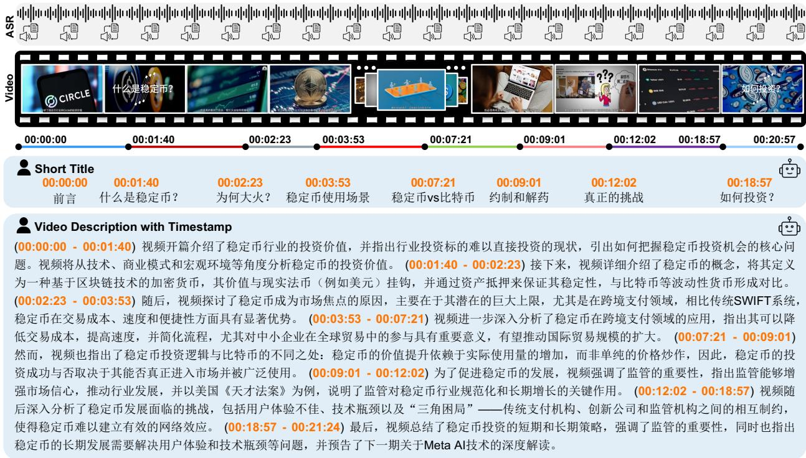

# 5. Experiments

> 来源: ARC-Chapter (arXiv 2025)

---

## 📄 原文

In this section, we conduct a series of experiments to thoroughly evaluate our video chaptering model. We first introduce the evaluation benchmarks, then present the main results and detailed ablation studies.

## 5.1 Evaluation Benchmark

To comprehensively assess our model's capabilities in video chaptering, we evaluate it on three distinct benchmarks covering different languages, scales, and data modalities. The evaluation targets two key criteria: the precision of temporal boundary localization and semantic relevance of the generated chapter titles/descriptions. VidChapters7M is a large-scale English chaptering dataset. We use two of its standard splits for evaluation, i.e., VidChapters7M-test and VidChapters7M-sml300val. VidChapters7M-test is a large-scale test set comprising 8.2k samples. For this split, the compared methods are only based on ASR

> 💡 **三个评测基准**:
> | 基准 | 语言 | 规模 | 特点 |
> |------|------|------|------|
> | VidChapters7M-test | 英文 | 8.2K | 大规模，对比方法只用 ASR |
> | VidChapters7M-sml300val | 英文 | 300 | 含原始视频+ASR，适合模态消融 |
> | VidAtlas-test | 中文 | 1.5K+ | 评估跨语言泛化能力 |

transcripts, while ARC-Chapter is evaluated with different input modalities. VidChapters7M-sml300val is a smaller validation set of 300 samples, which includes both the original videos and their corresponding ASR transcripts. This subset is ideal for fast evaluation and conducting modality ablation studies. To assess generalization beyond English, we additionally report experimental results on VidAtlas-test, a Chinese test set with more than 1.5k videos together with ASR transcripts and original videos.

## 5.2 Comparison with the State of the Art

Performance on VidChapters7M. As shown in Tab. 1, our ARC-Chapter significantly outperforms all existing methods on VidChapters7M-test benchmark. Our model achieves a new state-of-the-art result in the ASR-only regime, with an overall F1 score of 54.5, tIoU of 76.7, SODA of 23.5, and a CIDEr of 144.0. This represents a substantial improvement over the previous SOTA model, Chapter-Llama, with absolute gains of +9.2 in F1, $+ 4 . 9$ in tIoU, and $+ 6 . 0$ in the SODA score. Notably, the performance gain enlarges as video duration increases. For long videos (30-60 min), the evaluation metrics of SODA and CIDEr for ARC-Chapter are remarkably higher than which in Chapter-LLama, demonstrating the superior capability of our model in processing long videos. Even when compared against powerful general models like GPT-4o and Gemini-1.5-Pro, which are not finetuned on this task, ARC-Chapter perform much better. The experiments conducted on VidChapter7M-sml300 show more comparisons for different input modalities, shown in Tab. 2.


*Table 1: VidChapters7M-test 上的 SOTA 对比。对比方法在 ASR-only 设定下评估，ARC-Chapter 额外评估了不同模态组合（-vid, -asr, -vidasr）。*

> 💡 **Table 1 关键发现**:
> 1. **ASR-only 对比**: ARC-Chapter-asr (F1=54.5) vs Chapter-LLaMA (F1=45.3)，绝对提升 +9.2
> 2. **多模态加成**: ARC-Chapter-vidasr (F1=59.3) 是最强配置，比 ASR-only 再高 +4.8
> 3. **长视频优势**: 长视频（30-60min）上 ARC-Chapter 的优势更明显（SODA: 24.8 vs 15.8）
> 4. **vs 通用 LLM**: 即使 Gemini-1.5-Pro (F1=42.2) 和 GPT-4o (F1=37.6) 也远不及 ARC-Chapter
> 5. **视频模态价值**: ARC-Chapter-vid (F1=50.2) 单独用视频也很强，说明视觉信息很重要


*Table 2: VidChapter7M-sml300 上不同模态的对比。Chapter-LLaMA 的 "Embed" 和 "Caption" 对应 ARC-Chapter 的 "Video"。*

> 💡 **Table 2 关键发现**:
> - ARC-Chapter 用 Speech+Video (F1=62.4, SODA=30.1) 远超 Chapter-LLaMA 最强配置 (F1=44.4, SODA=16.3)
> - 即使 ARC-Chapter 只用 Video (F1=50.0)，也超过 Chapter-LLaMA 的全模态 (F1=44.4)
> - Chapter-LLaMA 需要 Speech+Embed+Caption 三种输入才能达到最佳，ARC-Chapter 只需 Speech+Video

Performance on VidAtlas. As detailed in Tab. 3, we evaluate our model on the VidAtlas benchmark under three settings: ASR-only, video-only, and ASR+video. ARC-Chapter consistently establish a new state-of-the-art across all settings. Our full multimodal model, ARCChapter-vidasr, which leverages both ASR and video inputs, achieves an overall F1 score of 66.2, tIoU of 84.0, SODA of 30.2, CIDEr of 141.5, and GRACE of 34.1. This marks a significant leap over the strongest LLM, Gemini-2.5-Pro, with an absolute improvement of $+ 1 7 . 5$ in F1 score and more than doubling the SODA score (+16.7). Furthermore, our single-modality versions also demonstrate superior performance. The ASR-only model, ARCChapter-asr, achieves an F1 of 58.8, and the video-only model, ARCChapter-vid, scores an F1 of 57.6. From shot-to-long videos, our model consistently outperforms other models, demonstrating its robustness in handling extended content.


*Table 3: VidAtlas-test（中文）上的 SOTA 对比。†表示 LLM-API 结果。API 模型将视频转为文本描述后输入 LLM。*

> 💡 **Table 3 关键发现**:
> 1. **中文基准同样碾压**: ARCChapter-vidasr (F1=66.2) vs Gemini-2.5-Pro (F1=48.7)，+17.5
> 2. **SODA 翻倍**: 30.2 vs Gemini-2.5-Pro 的 13.5
> 3. **GRACE 指标**: ARC-Chapter 达到 34.1，最强 API 模型 Gemini-2.5-Pro 只有 19.8
> 4. **长视频突出**: 在 Long 类别上，DeepSeek-R1 的 F1=62.2 较高（用了 ASR+Video），但 ARC-Chapter 仍以 69.6 领先
> 5. **单模态也强**: ASR-only (F1=58.8) 和 Video-only (F1=57.6) 都超过所有 API 模型

## 5.3 Transferability

To evaluate transferability, we pre-trained ARC-Chapter on our dataset before fine-tuning and testing it on the dense video captioning benchmarks, i.e., Youcook2 and ActivityNet Captions. As shown in Table 4, our model establishes a new state-of-the-art, significantly outperforming all prior MLLM-based methods.

Notably, for event segmentation ability, ARC-Chapter achieves an F1/SODA Score of 37.9/12.5 on YouCook2, a substantial improvement over the previous best of 33.5/7.9. This demonstrates that the knowledge acquired during pre-training effectively transfers and enhances performance on downstream tasks.


*Table 4: YouCook2 和 ActivityNet Captions 上的迁移性能。所有方法只用视觉模态。Rank(↓) 为各指标排名的平均值。*

> 💡 **Table 4 关键发现**:
> - **YouCook2**: ARC-Chapter 全面 Rank 1，F1=37.9（前 SOTA TimeExpert=33.5），SODA=12.5（前 SOTA Vid2Seq=7.9，+58%）
> - **ActivityNet Captions**: Rank 2（仅次于 GIT 和 Vid2Seq 的个别指标），但 CIDEr=35.4 和 F1=55.9 均为最佳
> - **意义**: Video chaptering 预训练可以有效迁移到 dense video captioning 任务，说明 VidAtlas 学到了通用的时间分割和描述能力

## 5.4 Ablation Studies

### 5.4.1 Scaling Property

We analyze how ARC-Chapter scales with the amount of training data. Concretely, we subsample the training set at $2 0 \%$ , $4 0 \%$ , $6 0 \%$ , $8 0 \%$ , and 100% and keep the model architecture and prompt templates fixed. We evaluate three inference modalities, i.e.ASR-only, Video-only, and ASR+Video, on two benchmarks: VidChapters-7M (sml300val) and a sampled subset of the VidAtlas-testset for efficiency. As illustrated in Fig. 6, the performance across all metrics (F1, tIOU, SODA, and CIDEr) and input modalities (ASR-only, Video-only, Video+ASR) demonstrates a clear positive correlation with the amount of training data. Specifically, the full multimodal model (Video+ASR) consistently achieves the best performance. ARC-Chapter is highly data-efficient, achieving strong performance with as little as $2 0 \%$ of the training data. Furthermore, it is data-scalable, continuing to benefit from larger corpora for even better results.


*Figure 6: ARC-Chapter 的数据缩放特性。在 VidChapter（采样子集）和 VidAtlas 测试集上，不同训练数据比例下的性能。*

> 💡 **Scaling Law 关键发现**:
> 1. **性能持续提升**: 从 20% 到 100% 数据，所有指标（F1、tIOU、SODA、CIDEr）和所有模态都单调递增
> 2. **无饱和迹象**: 曲线在 100% 时仍有上升趋势，暗示更多数据可能带来更大提升
> 3. **打破前作结论**: Chapter-LLaMA 认为 ~20K 样本后性能饱和，ARC-Chapter 证明这是因为数据规模和标注质量不够
> 4. **数据高效**: 仅 20% 数据就已经很强，说明模型架构和标注质量本身也很重要
> 5. **多模态始终最优**: Video+ASR 在所有数据比例下都是最佳配置

### 5.4.2 Hierarchical Annotations

A core contribution of our work is the VidAtlas dataset, which features rich, hierarchical annotations. To validate the effectiveness of this data structure, we evaluate our model's capability to generate outputs of varying complexity, from simple Short Title to detailed Structural Info which comprising a title, abstract and introduction for each chapter. The results are presented in Table 5. From the experimental results, our model successfully learns to generate these complex, structured outputs, achieving strong performance across all generated components (title, abstract, introduction) on both VidChapter-sml300 and VidAtlas-testset benchmarks, particularly when using both video and ASR inputs. This demonstrates a high degree of semantic understanding.

More importantly, the capability for detailed generation does not come at the cost of performance on the fundamental chaptering task. When comparing the segmentation metrics (temporal evaluation score F1 and tIoU) for the Short Title task versus the more demanding Structural Info task, we observe only a negligible difference. For example, on VidChapter-sml300, the multimodal model achieved an F1 score of 62.4 and a tIoU of 81.6 for Short Title generation, compared to slightly lower scores of 61.4 and 80.6 for Structural Info generation. Notably, this small margin represents the largest performance gap observed across all modality inputs on both benchmarks, indicating that the model can perform complex, multi-part generation in a single forward pass without compromising its core ability to accurately segment the video. This result strongly validates our hierarchical annotation strategy, demonstrating that training on such rich data endows the model with advanced structural reasoning capabilities.


*Table 5: 层级标注消融。比较 Short Title 和 Structural Info（含 title、abstract、introduction）在不同模态和基准上的表现。*

> 💡 **Table 5 关键发现**:
> 1. **层级输出不损害分割精度**: Short Title (F1=62.4) vs Structural Info (F1=61.4)，差距仅 1.0
> 2. **模型能生成复杂结构化输出**: title、abstract、introduction 都有不错的 SODA/CIDEr/GRACE 分数
> 3. **中文比英文更受益于层级标注**: VidAtlas 上 Structural Info 的 GRACE 普遍高于 Short Title
> 4. **结论**: 层级标注策略是"免费午餐"——获得更丰富输出的同时几乎不牺牲核心分割性能

### 5.4.3 Performance with GRPO

To validate the effectiveness of our GRPO-based reinforcement learning stage, we compare the performance of our models before (SFT-base) and after ( $^ +$ RL) this optimization. The results, detailed in Table 6, confirm that GRPO serves as a powerful fine-tuning method for enhancing temporal precision in video chaptering. From the experimental results, we draw three key conclusions.

First, GRPO directly and consistently improves metrics correlated with temporal segmentation accuracy. As hypothesized, by optimizing with a reward focused on temporal alignment, we observe a clear performance boost in F1 and tIoU scores across all configurations. For instance, on the VidAtlas-test set, the GRPO model with video input achieves a notable gain of +0.8 in F1 and +0.7 in tIoU over its SFT baseline. This empirically validates that GRPO effectively sharpens the model's ability to predict precise chapter boundaries.

Second, we observe a significant degree of cross-modal transferability from the RL training. Notably, despite the GRPO training being conducted exclusively on the video modality, the temporal localization performance of the ASR and Video+ASR inputs also improves. The GRPO model with Video+ASR input, for example, achieves a +1.5 F1 and +1.1 tIoU gain on VidChapter7M-test. This suggests that the optimization is not merely learning a superficial visual-to-temporal mapping but is refining a more abstract, modality-agnostic representation of temporal structure within the language model's parameters.

Finally, these enhancements in temporal precision are achieved without sacrificing semantic quality. Crucially, although our reward function is agnostic to content, semantic metric such as CIDEr remain highly comparable to the SFT baseline, and in some cases even improve (e.g., +1.1 CIDEr for video input on VidChapters7M-

> 💡 **GRPO 三个关键结论**（在看 Table 6 前先理解）:
> 1. **F1/tIoU 一致提升**: 时间精度直接受益于 RL
> 2. **跨模态迁移**: 只在 Video 上做 RL，但 ASR-only 和 Video+ASR 的时间精度也提升了！说明 RL 优化的是模型内部的时间表示，不局限于视觉模态
> 3. **语义不损失**: CIDEr 基本持平甚至微升，GRPO 没有"以牺牲语义换时间精度"


*Table 6: GRPO 强化学习效果。对比 SFT 基线和 +RL 后的性能。GRPO 一致提升时间分割指标（F1, tIoU），同时保持语义质量。*

> 💡 **Table 6 数据解读**:
> - **最大提升**: vidasr 在 VidChapters7M-test 上 F1 +1.5, tIoU +1.1, CIDEr +4.1
> - **ASR-only 也提升**: 即使 RL 没见过 ASR 输入，F1 仍 +0.3~0.8
> - **KL 正则化有效**: 语义指标（SODA, CIDEr）基本不降，说明 KL=0.01 的约束合适

test.). Composite metrics like SODA and GRACE, which balance segmentation and description, also maintain their performance or exhibit slight gains. This indicates that the KL-regularized optimization successfully avoids policy degradation, suggesting a positive effect where more accurate segmentation enables the model to generate more focused and relevant content. In summary, GRPO acts as a critical fine-tuning step, effectively sharpening the model's temporal acuity while preserving its descriptive capabilities.

## 5.5 Qualitative Visualization

To provide a more intuitive understanding of our model's capabilities beyond quantitative metrics, we present qualitative examples on both English and Chinese videos. These visualizations showcase ARC-Chapter's ability to generate accurate, coherent, and hierarchically structured outputs in multiple formats and languages.

Fig. 7 illustrates the model's performance on a challenging English video discussing US debt and the role of stablecoins. The topic is dense with financial terminology and complex arguments. Our model successfully navigates this complexity across all output formats. The Short Title accurately segments the video into logical thematic units, such as "Intro", "Stablecoin Regulation". The Video Description with Timestamp summarizes the video content for each chapter. More impressively, the Structural Chapters demonstrates the model's advanced capability for hierarchical chaptering. The generated title, abstract, and introduction for each chapter are distinct yet complementary, providing a rich, layered understanding of the content that mirrors human-authored summaries.

To showcase the multilingual performance of our model, Fig. 8 presents the results for a Chinese video on a similar topic. The model exhibits a comparable level of understanding and generation quality in Chinese. The generated Short Titles are precise. The detailed Description and Structural Chapters are fluent and contextually appropriate. This strong cross-lingual performance underscores the model's ability to generalize the learned chaptering and summarization skills, rather than merely memorizing patterns in a single language.

Together, these qualitative examples confirm that ARC-Chapter is not only a powerful chaptering tool but also a versatile video understanding model capable of producing rich, structured, and multilingual summaries that are both accurate and useful for end-users.

> 💡 **定性结果展示**（Figure 7 & 8）:
> - **英文视频**（金融/加密货币）: 准确切分为 Intro → US Debt Problem → Stablecoins & US Bonds → ... → Which Cryptos Will Win
> - **中文视频**（稳定币投资）: 同样准确，三级输出（标题/描述/结构化章节）流畅且语义丰富
> - **亮点**: Structural Chapter 的 title、abstract、introduction 各有侧重，不是简单重复


*Figure 7: 英文视频定性结果（金融/加密货币主题），展示 Short Title、Video Description with Timestamp、Structural Chapter 三种输出格式。*



*Figure 8: 中文视频定性结果（稳定币投资主题），展示模型的中文章节化和摘要生成能力。*

---

## 💡 Section 总结

### 实验全景

```
评测基准:
  ├── VidChapters7M-test (EN, 8.2K)     → SOTA, F1=59.3 (+14.0)
  ├── VidChapters7M-sml300 (EN, 300)    → 模态消融, F1=62.4
  ├── VidAtlas-test (ZH, 1.5K+)         → 中文 SOTA, F1=66.2
  ├── YouCook2 (迁移)                   → Rank 1, SODA=12.5 (+58%)
  └── ActivityNet Captions (迁移)        → Rank 2, CIDEr=35.4
```

### 核心结论

1. **大幅 SOTA**: 在所有基准上全面领先，长视频优势尤为明显
2. **多模态互补**: Video+ASR >> 单模态，两种模态提供互补信息
3. **Scaling Law 成立**: 数据越多性能越好，未饱和
4. **层级标注是免费午餐**: 获得更丰富输出，几乎不损失分割精度
5. **GRPO 精准提升时间定位**: +1.5 F1，且跨模态迁移，不损语义
6. **迁移性强**: Video chaptering 预训练有效提升 dense captioning 下游任务
