# 5 Experiments

In this section, we conduct a series of experiments to thoroughly evaluate our video chaptering model. We first introduce the evaluation benchmarks, then present the main results and detailed ablation studies.

> 💡 实验部分结构清晰：benchmark 介绍 → SOTA 对比 → 迁移性 → 消融实验 → 定性可视化，五个子节层层递进。

## 5.1 Evaluation Benchmark

To comprehensively assess our model's capabilities in video chaptering, we evaluate it on three distinct benchmarks covering different languages, scales, and data modalities. The evaluation targets two key criteria: the precision of temporal boundary localization and semantic relevance of the generated chapter titles/descriptions. VidChapters7M is a large-scale English chaptering dataset. We use two of its standard splits for evaluation, i.e., VidChapters7M-test and VidChapters7M-sml300val. VidChapters7M-test is a large-scale test set comprising 8.2k samples. For this split, the compared methods are only based on ASR transcripts, while ARC-Chapter is evaluated with different input modalities. VidChapters7M-sml300val is a smaller validation set of 300 samples, which includes both the original videos and their corresponding ASR transcripts. This subset is ideal for fast evaluation and conducting modality ablation studies. To assess generalization beyond English, we additionally report experimental results on VidAtlas-test, a Chinese test set with more than 1.5k videos together with ASR transcripts and original videos.

> 💡 三个 benchmark 设计很有层次：VidChapters7M-test (大规模英文 ASR-only)、VidChapters7M-sml300val (小规模多模态快速验证)、VidAtlas-test (中文跨语言泛化)。覆盖了规模、模态、语言三个维度的评估需求。

## 5.2 Comparison with the State of the Art

**Performance on VidChapters7M.** As shown in Tab. 1, our ARC-Chapter significantly outperforms all existing methods on VidChapters7M-test benchmark. Our model achieves a new state-of-the-art result in the ASR-only regime, with an overall F1 score of 54.5, tIoU of 76.7, SODA of 23.5, and a CIDEr of 144.0. This represents a substantial improvement over the previous SOTA model, Chapter-Llama, with absolute gains of +9.2 in F1, $+ 4 . 9$ in tIoU, and $+ 6 . 0$ in the SODA score. Notably, the performance gain enlarges as video duration increases. For long videos (30-60 min), the evaluation metrics of SODA and CIDEr for ARC-Chapter are remarkably higher than which in Chapter-LLama, demonstrating the superior capability of our model in processing long videos. Even when compared against powerful general models like GPT-4o and Gemini-1.5-Pro, which are not finetuned on this task, ARC-Chapter perform much better. The experiments conducted on VidChapter7M-sml300 show more comparisons for different input modalities, shown in Tab. 2.

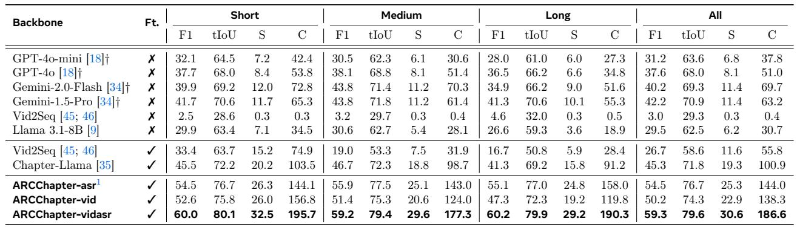

> 💡 **Table 1 要点**: ARC-Chapter 在 VidChapters7M-test 上全面 SOTA。F1 +9.2、tIoU +4.9、SODA +6.0 的提升非常显著。尤其在长视频 (30-60min) 上优势更大，说明大规模数据训练确实提升了长视频理解能力。相比 GPT-4o、Gemini-1.5-Pro 等通用 LLM API 也大幅领先，凸显了 task-specific fine-tuning 的价值。

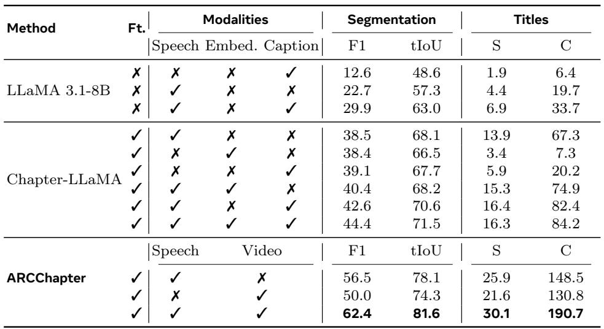

> 💡 **Table 2 要点**: sml300 上的多模态对比。ASR+Video 双模态输入效果最佳，说明 ASR 和视觉信息互补。值得注意的是 ARC-Chapter 即使只用 ASR 也已超越之前用 ASR+视觉的方法。

**Performance on VidAtlas.** As detailed in Tab. 3, we evaluate our model on the VidAtlas benchmark under three settings: ASR-only, video-only, and ASR+video. ARC-Chapter consistently establish a new state-of-the-art across all settings. Our full multimodal model, ARCChapter-vidasr, which leverages both ASR and video inputs, achieves an overall F1 score of 66.2, tIoU of 84.0, SODA of 30.2, CIDEr of 141.5, and GRACE of 34.1. This marks a significant leap over the strongest LLM, Gemini-2.5-Pro, with an absolute improvement of $+ 1 7 . 5$ in F1 score and more than doubling the SODA score (+16.7). Furthermore, our single-modality versions also demonstrate superior performance. The ASR-only model, ARCChapter-asr, achieves an F1 of 58.8, and the video-only model, ARCChapter-vid, scores an F1 of 57.6. From shot-to-long videos, our model consistently outperforms other models, demonstrating its robustness in handling extended content.

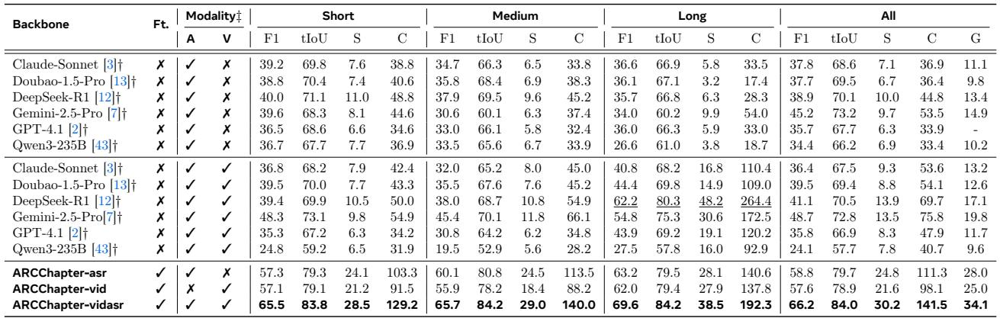

> 💡 **Table 3 要点**: 中文 VidAtlas 上的结果更惊艳。ARCChapter-vidasr F1=66.2 vs Gemini-2.5-Pro 48.7，SODA 翻倍。有趣的是 DeepSeek-R1 在 Long 视频上 F1 高达 62.2，但 SODA 仅 48.2——说明它能找到大致位置但描述质量不稳定。ARC-Chapter 在短中长视频上都保持稳定优势。

## 5.3 Transferability

To evaluate transferability, we pre-trained ARC-Chapter on our dataset before fine-tuning and testing it on the dense video captioning benchmarks, i.e., Youcook2 and ActivityNet Captions. As shown in Table 4, our model establishes a new state-of-the-art, significantly outperforming all prior MLLM-based methods.

Notably, for event segmentation ability, ARC-Chapter achieves an F1/SODA Score of 37.9/12.5 on YouCook2, a substantial improvement over the previous best of 33.5/7.9. This demonstrates that the knowledge acquired during pre-training effectively transfers and enhances performance on downstream tasks.

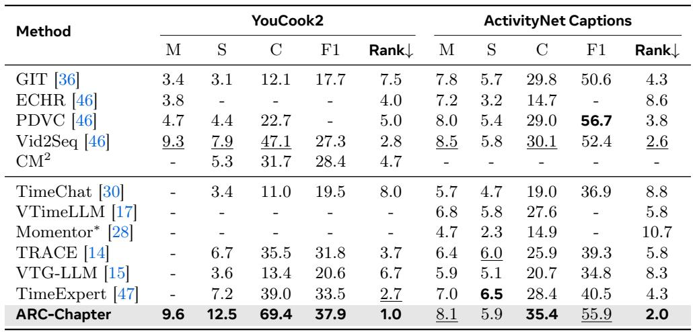

> 💡 **Table 4 要点**: 迁移到 dense video captioning 任务依然 SOTA，Rank 均为第一。YouCook2 上 CIDEr 从 47.1 (Vid2Seq) 跃升到 69.4，SODA 从 7.9 到 12.5。这验证了 video chaptering 预训练学到的时间分割能力具有良好的迁移性——章节切分和 dense captioning 的事件分割本质上共享相似的时间推理能力。

## 5.4 Ablation Studies

### 5.4.1 Scaling Property

We analyze how ARC-Chapter scales with the amount of training data. Concretely, we subsample the training set at $2 0 \%$ , $4 0 \%$ , $6 0 \%$ , $8 0 \%$ , and 100% and keep the model architecture and prompt templates fixed. We evaluate three inference modalities, i.e.ASR-only, Video-only, and ASR+Video, on two benchmarks: VidChapters-7M (sml300val) and a sampled subset of the VidAtlas-testset for efficiency. As illustrated in Fig. 6, the performance across all metrics (F1, tIOU, SODA, and CIDEr) and input modalities (ASR-only, Video-only, Video+ASR) demonstrates a clear positive correlation with the amount of training data. Specifically, the full multimodal model (Video+ASR) consistently achieves the best performance. ARC-Chapter is highly data-efficient, achieving strong performance with as little as $2 0 \%$ of the training data. Furthermore, it is data-scalable, continuing to benefit from larger corpora for even better results.

<table>
<tr><td colspan="4" align="center"><b>VidChapters-7M (sml300val)</b></td></tr>
<tr>
<td>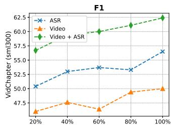</td>
<td>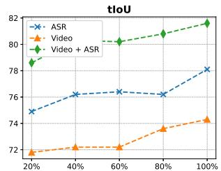</td>
<td>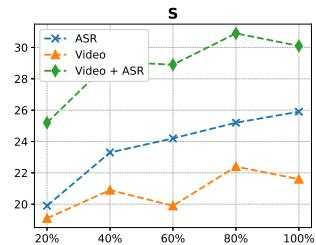</td>
<td>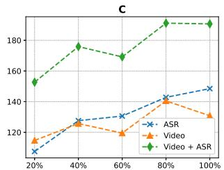</td>
</tr>
<tr><td align="center">F1</td><td align="center">tIoU</td><td align="center">SODA</td><td align="center">CIDEr</td></tr>
<tr><td colspan="4" align="center"><b>VidAtlas-test</b></td></tr>
<tr>
<td>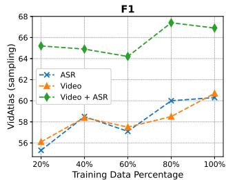</td>
<td>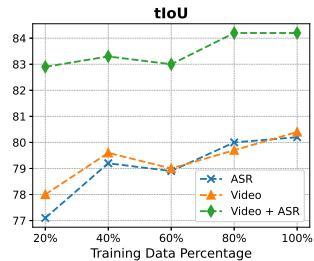</td>
<td>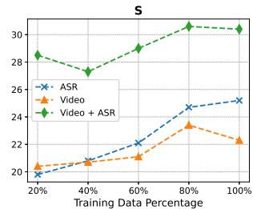</td>
<td>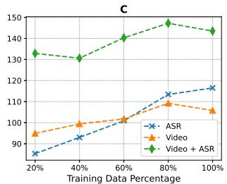</td>
</tr>
<tr><td align="center">F1</td><td align="center">tIoU</td><td align="center">SODA</td><td align="center">CIDEr</td></tr>
</table>

*Figure 6: ARC-Chapter 的数据 Scaling 特性。上排: VidChapters-7M (sml300val)，下排: VidAtlas-test。随训练数据比例增加，各指标持续提升。*

> 💡 **Figure 6 要点**: 经典的 data scaling 曲线。几个观察：(1) 20% 数据就能达到不错的性能，说明模型 data-efficient；(2) 性能随数据量持续增长且未见饱和，暗示更多数据还能带来进一步提升；(3) Video+ASR 在所有数据量下都优于单模态，双模态融合的增益稳定。这为未来扩大数据规模提供了信心。

### 5.4.2 Hierarchical Annotations

A core contribution of our work is the VidAtlas dataset, which features rich, hierarchical annotations. To validate the effectiveness of this data structure, we evaluate our model's capability to generate outputs of varying complexity, from simple Short Title to detailed Structural Info which comprising a title, abstract and introduction for each chapter. The results are presented in Table 5. From the experimental results, our model successfully learns to generate these complex, structured outputs, achieving strong performance across all generated components (title, abstract, introduction) on both VidChapter-sml300 and VidAtlas-testset benchmarks, particularly when using both video and ASR inputs. This demonstrates a high degree of semantic understanding.

More importantly, the capability for detailed generation does not come at the cost of performance on the fundamental chaptering task. When comparing the segmentation metrics (temporal evaluation score F1 and tIoU) for the Short Title task versus the more demanding Structural Info task, we observe only a negligible difference. For example, on VidChapter-sml300, the multimodal model achieved an F1 score of 62.4 and a tIoU of 81.6 for Short Title generation, compared to slightly lower scores of 61.4 and 80.6 for Structural Info generation. Notably, this small margin represents the largest performance gap observed across all modality inputs on both benchmarks, indicating that the model can perform complex, multi-part generation in a single forward pass without compromising its core ability to accurately segment the video. This result strongly validates our hierarchical annotation strategy, demonstrating that training on such rich data endows the model with advanced structural reasoning capabilities.

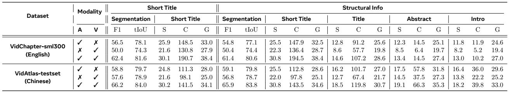

> 💡 **Table 5 要点**: 非常有说服力的消融。生成 Structural Info (title+abstract+intro) vs Short Title，分割指标几乎无损（F1 差距 <1），但额外获得了丰富的层级摘要。这说明：(1) 模型的时间分割和内容生成能力是解耦的；(2) 层级标注训练没有引入 trade-off，反而可能通过更丰富的监督信号提升了模型的语义理解。这是 VidAtlas 数据集设计的核心验证。

### 5.4.3 Performance with GRPO

To validate the effectiveness of our GRPO-based reinforcement learning stage, we compare the performance of our models before (SFT-base) and after ( $^ +$ RL) this optimization. The results, detailed in Table 6, confirm that GRPO serves as a powerful fine-tuning method for enhancing temporal precision in video chaptering. From the experimental results, we draw three key conclusions.

First, GRPO directly and consistently improves metrics correlated with temporal segmentation accuracy. As hypothesized, by optimizing with a reward focused on temporal alignment, we observe a clear performance boost in F1 and tIoU scores across all configurations. For instance, on the VidAtlas-test set, the GRPO model with video input achieves a notable gain of +0.8 in F1 and +0.7 in tIoU over its SFT baseline. This empirically validates that GRPO effectively sharpens the model's ability to predict precise chapter boundaries.

Second, we observe a significant degree of cross-modal transferability from the RL training. Notably, despite the GRPO training being conducted exclusively on the video modality, the temporal localization performance of the ASR and Video+ASR inputs also improves. The GRPO model with Video+ASR input, for example, achieves a +1.5 F1 and +1.1 tIoU gain on VidChapter7M-test. This suggests that the optimization is not merely learning a superficial visual-to-temporal mapping but is refining a more abstract, modality-agnostic representation of temporal structure within the language model's parameters.

Finally, these enhancements in temporal precision are achieved without sacrificing semantic quality. Crucially, although our reward function is agnostic to content, semantic metric such as CIDEr remain highly comparable to the SFT baseline, and in some cases even improve (e.g., +1.1 CIDEr for video input on VidChapters7M-test.). Composite metrics like SODA and GRACE, which balance segmentation and description, also maintain their performance or exhibit slight gains. This indicates that the KL-regularized optimization successfully avoids policy degradation, suggesting a positive effect where more accurate segmentation enables the model to generate more focused and relevant content. In summary, GRPO acts as a critical fine-tuning step, effectively sharpening the model's temporal acuity while preserving its descriptive capabilities.

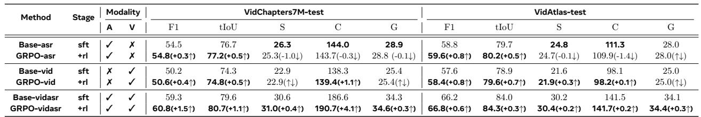

> 💡 **Table 6 要点**: GRPO 强化学习的三个关键发现：
> 1. **时间精度提升**: F1/tIoU 在所有配置上都有提升，验证了 temporal reward 的有效性
> 2. **跨模态迁移**: 仅在 video 模态上做 RL 训练，ASR 和 Video+ASR 的时间指标也提升了——说明 GRPO 优化的是 LLM 内部更抽象的时间推理能力，而非模态特定的映射
> 3. **语义质量无损**: CIDEr 保持甚至略有提升，说明 KL 正则化有效防止了 policy degradation。这是 GRPO 用于 video chaptering 的首次验证，效果令人信服。

## 5.5 Qualitative Visualization

To provide a more intuitive understanding of our model's capabilities beyond quantitative metrics, we present qualitative examples on both English and Chinese videos. These visualizations showcase ARC-Chapter's ability to generate accurate, coherent, and hierarchically structured outputs in multiple formats and languages.

Fig. 7 illustrates the model's performance on a challenging English video discussing US debt and the role of stablecoins. The topic is dense with financial terminology and complex arguments. Our model successfully navigates this complexity across all output formats. The Short Title accurately segments the video into logical thematic units, such as "Intro", "Stablecoin Regulation". The Video Description with Timestamp summarizes the video content for each chapter. More impressively, the Structural Chapters demonstrates the model's advanced capability for hierarchical chaptering. The generated title, abstract, and introduction for each chapter are distinct yet complementary, providing a rich, layered understanding of the content that mirrors human-authored summaries.

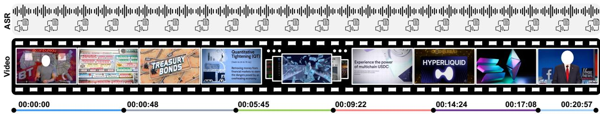

*Figure 7: Qualitative results on an English video about finance and cryptocurrency.*

> 💡 **Figure 7 要点**: 英文金融视频的定性结果。模型能从 Short Title → Description → Structural Chapters 逐层生成，且每层信息互补不冗余。特别是 Structural Chapters 的 title/abstract/introduction 三级结构，模仿了人类撰写摘要的方式，非常适合长视频的内容导航。

To showcase the multilingual performance of our model, Fig. 8 presents the results for a Chinese video on a similar topic. The model exhibits a comparable level of understanding and generation quality in Chinese. The generated Short Titles are precise. The detailed Description and Structural Chapters are fluent and contextually appropriate. This strong cross-lingual performance underscores the model's ability to generalize the learned chaptering and summarization skills, rather than merely memorizing patterns in a single language.

*Figure 8: Qualitative results on a Chinese video discussing stablecoins.*

> 💡 **Figure 8 要点**: 中文视频的定性结果。跨语言能力出色，中文输出流畅自然。与英文视频对比可以看出模型学到的是语言无关的视频结构理解能力，而非依赖特定语言的模式。

Together, these qualitative examples confirm that ARC-Chapter is not only a powerful chaptering tool but also a versatile video understanding model capable of producing rich, structured, and multilingual summaries that are both accurate and useful for end-users.

> 💡 定性结果很好地补充了定量分析，展示了模型在实际场景中的实用价值。

---

## 📝 Section 5 总结

**实验设计**: 三个 benchmark (VidChapters7M-test, sml300val, VidAtlas-test) 覆盖英中双语、不同规模和模态组合，评估维度全面。

**核心结果**:
- **SOTA 性能**: 在所有 benchmark 上全面超越现有方法，包括 GPT-4o、Gemini-2.5-Pro 等强大的通用 LLM
- **长视频优势显著**: 视频越长，相对优势越大，验证了大规模数据训练的价值
- **迁移性强**: 预训练知识有效迁移到 dense video captioning 任务

**消融实验的关键发现**:
1. **Data Scaling**: 20% 数据即有效，100% 数据未饱和，扩展潜力大
2. **层级标注**: Structural Info 生成几乎不影响分割精度，验证了 VidAtlas 数据设计
3. **GRPO**: 提升时间精度且语义无损，跨模态迁移效果意外惊喜

**值得关注的点**:
- GRPO 仅在 video 模态训练却能提升 ASR 模态的时间精度，暗示 LLM 内部存在模态无关的时间推理机制
- 层级标注训练没有 trade-off，这与直觉（更复杂的输出可能分散模型注意力）相反
- 定性结果展示了实际应用价值，特别是 Structural Chapters 的层级输出格式
