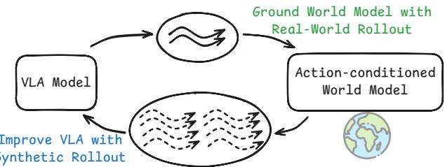

# VLAW 批读笔记 · Introduction

---

## 1. Introduction

Vision-language-action (VLA) models have achieved great success in robot manipulation by training on large-scale demonstration data (Intelligence et al., 2025b; Kim et al., 2024; Shi et al., 2025; Guo et al., 2025b; Zhang et al., 2024; Chen et al., 2025). Recent studies further show that VLA models can benefit substantially from post-training on online interaction rollouts (Intelligence et al., 2025a). However, in real-world robotic settings, collecting online policy rollout trajectories requires significant human labor, such as resetting the environment and monitoring robot execution, which is expensive and time-consuming (Atreya et al., 2025; Jain et al., 2025). As a result, the number of online rollouts available for VLA models is often limited, restricting the effectiveness and scalability of post-training.

> 💡 **背景铺垫**：VLA post-training 的必要性已被验证（π₀.₆* 等），但 real rollout 成本高是当前主要瓶颈。这给了 World Model 合成数据一个明确的 motivation。
>
> 注意引用密度很高，说明这个方向当前非常活跃，论文是在一个竞争激烈的背景下做的。

*Figure 1: 真实机器人 rollout 成本高、难规模化。VLAW 先用少量真实 rollout 学 World Model，再在"想象"中生成大规模合成数据。*

Instead of relying solely on real-world policy rollouts, learning an action-conditioned world model to generate synthetic rollouts in imagination offers a promising alternative (Team et al., 2025; Li et al., 2024; Team, 2025b). However, we find that existing world models lack the physical fidelity required for effective policy improvement. As noted in prior works, these models tend to be overly optimistic about predicted trajectories, as they are trained predominantly on demonstration datasets that lack coverage of diverse physical interactions, especially failure cases (Quevedo et al., 2025). Moreover, they struggle to accurately model small yet critical physical details in contact-rich manipulation and can produce blurry visual predictions (Guo et al., 2025a). Consequently, existing action-conditioned world models have largely focused on relatively simple pick-and-place motions and often fail to generate reliable synthetic data for complex tasks involving frequent collisions or deformable objects.

> 💡 **World Model 的两个已知问题**被前人工作所证实（Quevedo et al. 2025、Guo et al. 2025a），不只是本文的 claim。blurry prediction 在 contact-rich 场景里特别致命——机器人有没有真正抓住物体，这类细节一旦模糊就没法用来训练 policy。
>
> **"pick-and-place 是简单题"**：这一句话隐含了本文的 benchmark 定位——专门挑有 contact 的难任务来验证。

In this paper, we propose a simple yet scalable framework, VLAW, that iteratively improves VLA models via world-model rollouts, as shown in Figure 2. We first learn a physically-grounded world model by finetuning on online rollout data, which includes many failure cases. We find that after training on online rollout data, the world model learns to capture the complex dynamics encountered during policy execution, substantially improving its ability to model both success and failure cases.

> 💡 **核心 insight 再次强调**：让 World Model 同时看到 success 和 failure，它就不再过度乐观了。**训练数据分布的改变**是核心贡献，model architecture 没有任何改动——这让方法极其简洁。

The improved world model is subsequently used to generate large-scale, high-fidelity synthetic trajectories, which are automatically annotated using a vision–language reward model (Lee et al., 2026).

> 💡 **自动标注**：用 VLM（Qwen3-VL-4B）判断合成轨迹成功/失败，免去人工标注。这是整个 pipeline 能 scale 的关键。

During policy optimization, we only use stable supervised learning objectives that can easily scale to large expressive models (e.g., flow-matching policies with intractable action probabilities (Intelligence et al., 2025b)), as opposed to dynamic programming/bootstrapping or policy gradients.

> 💡 **重要设计决策——不用 RL**：π₀.₅ 用 flow-matching，没有显式 log-likelihood，policy gradient 很难用。所以改用 weighted SFT（成功轨迹上做 BC）。牺牲了理论最优性，换来工程可行性和训练稳定性——很务实的工程选择。

*Figure 2: Policy online rollout 数据让 World Model "接地气"（grounded in downstream tasks），之后 World Model 可以生成大量数据用于 policy 训练。*

The core contribution of this paper is a simple and scalable world-model-based reinforcement learning framework for improving state-of-the-art VLA policies in the real world. In our experiments, we use the widely used real-robot platform DROID (Khazatsky et al., 2024). We start from a pretrained VLA policy, π₀.₅ (Intelligence et al., 2025b) and an action-conditioned world model, Ctrl-World (Guo et al., 2025a). We first verify that, using policy online rollout data, we learn a physically grounded generative world model that can accurately model both success and failure trajectories, which is essential for generating useful synthetic data. In addition, to obtain a reward model for robot tasks, we fine-tune Qwen3-VL (Team, 2025a; Lee et al., 2026) on real-robot rollout data. Finally, using the synthetic data generated by the world model, we improve the pretrained π₀.₅ across many downstream contact-rich manipulation tasks that involve deformable objects in a multi-task setup, outperforming baseline with 11.6%.

> 💡 **三个模块的贡献拆解**：
> 1. 物理保真度更高的 World Model（online rollout fine-tune → 消除 over-optimism）
> 2. 针对机器人任务的 VL 奖励模型（Qwen3-VL fine-tune → 自动筛选成功轨迹）
> 3. 迭代的 VLA + World Model 协同改进 pipeline（VLAW 主体）
>
> 三个模块都需要 fine-tune，整体训练开销不小——但论文全文没有报告训练时间，这是一个遗漏。
