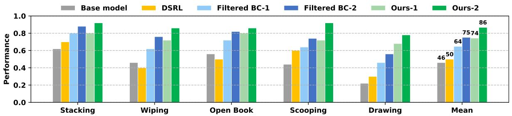

# VLAW 批读笔记 · Experiments

---

## 5. Experiments

Our experiments are designed to answer the following questions:

1. Can we learn a high-fidelity action-conditioned world model for contact-rich and deformable-object tasks that accurately models both successful and failed trajectories?
2. Can the synthetic data generated by the world model improve VLA policy performance?
3. Can the policy and world model be continuously improved through an iterative training process in a multi-task setting?

> 💡 **三个实验问题结构很清晰**：对应方法的三个核心组件（world model 质量 → 合成数据有效性 → 迭代改进效果），层层递进。这是一种好的 experiment design 习惯。

---

### 5.1. Experimental Settings

**Platform & Tasks.** Experiments on the DROID platform: Franka Panda arm + Robotiq gripper, two third-person cameras + one wrist camera. Five contact-rich task categories:

- **Stacking**: "stack block A on block B"（4色积木随机放置）
- **Open Book**: "open the book cover"（4种不同的书）
- **Erase Marks**: "erase all marks using a tissue"（1-3条记号笔线）
- **Scooping**: "transfer some A to the bowl"（花生/糖果/杏仁）
- **Drawing**: "draw a complete circle on a whiteboard"

> 💡 **任务选择的意义**：这 5 个任务都有明确的接触（contact）要求——积木要稳定叠放、书皮要翻开、组织要真的擦掉线、勺子要真的装进食物、笔要在白板上画出闭合圆。这类任务在传统仿真里极难建模（deformable objects、摩擦力依赖），正是 world model 最难处理的场景，也是本文方法最能体现价值的地方。

*Figure 4: DROID 平台上的 5 类实验任务。*

**Base Models.** π₀.₅ as VLA, Ctrl-World as world model, Qwen3-VL-4B-Instruct as reward model. Each task: 25 expert demos → fine-tune π₀.₅ → 作为 base policy。

> 💡 **Base Policy 的起点**：25 条 demo 的 fine-tune policy 是起点，不是直接用 pretrained π₀.₅。这意味着 base policy 已经对任务有基本理解了，VLAW 在此基础上进一步提升。这个设定是公平的，但也意味着"提升空间"是有限的——从 0% 提升到 100% 更难，从 46% 提升到 87% 更容易一些。

**Hyperparameters:** 每次迭代：50 real rollouts/task → world model fine-tune 50K steps → 生成 500 synthetic trajectories/task → reward model fine-tune（第一次迭代）→ policy fine-tune 2K steps（batch size 256）。共 2 次迭代。

---

### 5.2. Can we learn an accurate action-conditioned world model for contact-rich tasks?

**Action replay inside the world model.** We randomly select a starting frame from a real-world trajectory and auto-regressively feed a 5-second sequence of recorded action chunks to the world model, starting from the same frame.

> 💡 **Replay vs. Rollout 的区别**：这里用的是 action replay（固定动作，看 world model 能不能正确预测图像），而不是 policy-in-the-loop rollout（policy 自行决策）。Replay 更简单，因为动作序列是确定的，误差只来自视频预测，不含 policy 错误。

**Metrics:**
- (1) Video Quality: PSNR、SSIM、LPIPS、FID、FVD
- (2) Interaction Event Confusion Matrix: TP / FN / TN / FP（对 50 个包含物理接触的片段进行交互结果预测）

> 💡 **Confusion Matrix 这个 metric 非常有价值**：纯视频质量指标（PSNR 等）说明不了 world model 有没有理解物理交互结果。一个模型可能 PSNR 很高（背景预测准确），但对"积木有没有叠起来"这类关键事件完全预测错误。这个额外的 confusion matrix 是一个更面向任务的评估。

**Table 1 Results:**

| Method | PSNR↑ | SSIM↑ | LPIPS↓ | FID↓ | FVD↓ | TP↑ | FN↓ | TN↑ | FP↓ |
|--------|-------|-------|--------|------|------|-----|-----|-----|-----|
| Pretrained Ctrl-World | 16.32 | 0.634 | 0.347 | 41.03 | 225.13 | - | - | - | - |
| + Expert Rollout | 19.87 | 0.748 | 0.189 | 12.76 | 99.98 | 28 | 2 | 9 | 11 |
| + Expert + **Online Rollout** | **21.77** | **0.784** | **0.136** | **9.58** | **64.12** | 26 | 4 | **19** | **1** |

> 💡 **关键发现**：
> - **Online rollout 的价值在于消除过度乐观（FP: 11→1）**：只用 expert rollout 时，world model 把很多失败交互预测成成功（FP=11）；加入 online rollout（含 failure）后，FP 降到 1。
> - **代价**：TP 从 28 降到 26，FN 从 2 升到 4——即 world model 变得更"保守"了（有些成功的交互被预测为失败）。对于 policy 训练来说，保守型 world model 比乐观型要好——false positive 合成数据会污染 policy，而 false negative 只是损失了一些训练数据。
> - **视频质量全面提升**：FVD 从 225 降到 64，提升幅度巨大，说明 online rollout 覆盖了更广的状态空间。

*Figure 6: 相同初始帧 + 相同动作序列，三种 world model 的预测对比。只用 expert demo 训练的 world model 过于乐观（把失败预测为成功）；加入 online rollout 后准确捕捉物理动力学。*

**Policy-in-the-loop rollout.** Post-trained world model maintains high visual fidelity and physical plausibility for long-horizon rollouts up to 20 seconds.

*Figure 5: 政策在 world model 内的 closed-loop rollout（20 秒，20 步）。上：铲花生入碗；下：用纸巾擦白板。Post-trained world model 能准确捕捉接触动力学。*

> 💡 **20秒 long-horizon 稳定性**：这是一个比较令人印象深刻的结果。Diffusion world model 在 closed-loop 下容易累积误差（每一帧的误差会传播到下一帧）。能稳定 20 秒说明模型的物理预测相当可靠，或者至少视觉上连贯。后续工作可以探索更长视野或更精细的任务。

---

### 5.3. Can world model generated data improve VLA policy performance?

**Baselines:**
1. **Filtered BC**: 只用真实 rollout 中成功轨迹做 supervised fine-tuning（50 rollouts/task，与 VLAW 相同）
2. **DSRL** (Wagenmaker et al. 2025): 在 π₀.₅ 的 noise space 做 online RL 优化（10 rollouts 评估，因为太耗时）

> 💡 **Baseline 选择的合理性**：
> - Filtered BC 是最直接的 baseline，控制了 real rollout 数量，差异只在于有没有用 world model 合成数据
> - DSRL 是最近的竞争方法，代表了不用 world model 的 RL 路线
> - **注意**：DSRL 只评估了 10 次，而 VLAW 评估了 50 次。样本量不同导致方差大，DSRL 的结果参考价值有限

**Large-scale rollout visualizations:**

*Figure 8: 从同一真实初始帧出发，world model 想象出 15 条不同轨迹。真实 rollout 里 robot 失败了（左：没抓到勺子；右：圆没画完），world model 能搜索到成功轨迹作为 policy 训练的监督信号。*

> 💡 **这个图揭示了 VLAW 的核心价值**：当 policy 在现实中失败时，world model 提供了一个"如果做对了应该是怎样"的模拟。这相当于给 policy 展示了正确示范，帮助它从失败中学习——类似 hindsight experience replay（HER），但通过生成模型而不是轨迹重标签实现。

**Results (Table 2 detailed success rates):**

| Method | Stacking | Wiping | Open Book | Scooping | Drawing | Mean |
|--------|----------|--------|-----------|----------|---------|------|
| Base model | 0.62 | 0.46 | 0.56 | 0.44 | 0.22 | 0.460 |
| DSRL | 0.70 | 0.40 | 0.50 | 0.60 | 0.30 | 0.500 |
| Filtered BC-1 | 0.80 | 0.62 | 0.72 | 0.64 | 0.46 | 0.648 |
| Filtered BC-2 | 0.88 | 0.76 | 0.82 | 0.74 | 0.56 | 0.752 |
| **Ours-1** | 0.80 | 0.72 | 0.80 | 0.72 | **0.68** | 0.744 |
| **Ours-2** | **0.92** | **0.86** | **0.86** | **0.92** | **0.78** | **0.868** |

*Figure 7: VLAW vs. Filtered BC vs. DSRL 的成功率对比（两轮迭代）。VLAW 在所有任务上均优于基线。*

> 💡 **结果解读**：
> - **DSRL 表现不佳**（均值 0.50 vs. Base 0.46）：作者解释是多任务 RL 优化困难 + 只在 noise space 更新限制了表达能力。但 DSRL 只有 10 次评估，结果不够可信。
> - **Filtered BC 两轮后达到 0.752**：仅靠 real rollout 的 success 案例，两轮迭代后也有不小提升，说明 online rollout 本身就很有价值。
> - **VLAW-2 达到 0.868**，比 Filtered BC-2 高 **11.6%**：这 11.6% 完全来自 world model 合成数据的贡献。
> - **Drawing 任务最难**（base 0.22），VLAW-2 提升到 0.78，提升幅度最大（+56%）。这说明 world model 在帮助 policy 学习精细运动控制方面很有效。
> - **Ours-1 ≈ Filtered BC-2**（0.744 vs. 0.752）：一轮 VLAW 约等于两轮 Filtered BC 的效果，说明合成数据可以替代一轮 real rollout——数据效率优势显著。

**Ablations:**

*Figure 9: Drawing 任务上的消融：减少合成数据量（500→250）或去掉真实 rollout 数据，性能均下降。*

> 💡 **消融结论**：
> 1. **合成数据量很重要**：500→250 条就有明显下降，说明 world model 的数据量还有提升空间（论文为什么不生成 1000 条？可能受限于计算或 world model 质量）
> 2. **Real rollout 不可或缺**：去掉 real success 轨迹后性能也下降——合成数据不能完全替代真实数据，两者互补。
> 3. **缺少的消融**：没有测试去掉 world model fine-tune（直接用 pretrained Ctrl-World 生成数据）的效果，这个消融本可以更直接地证明"online rollout 改进 world model"这一步的必要性。
