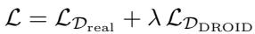
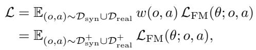

# Method: Co-Improvement of VLA and World Model

---

## 3. Preliminaries

**Problem Setting.** We study a multi-task robotic manipulation problem, where each task is specified by a language instruction $I$ and is modeled as a Markov decision process (MDP) $\mathcal{M}_I = (\mathcal{S}, \mathcal{A}, P, R_I, \gamma)$. Here, $s$ denotes the state space, $\mathcal{A}$ the action space, $P(s_{t+1} \mid s_t, a_t)$ the transition dynamics, $R_I$ the task-dependent reward function, and $\gamma$ the discount factor. At the beginning of training, we are given a pretrained vision–language–action (VLA) policy $\pi_\theta$ and an action-conditioned world model $M_\phi$. The policy maps the current state and instruction to an action distribution, $a_t \sim \pi_\theta(\cdot \mid s_t, I)$, while the world model predicts the next state conditioned on the current state and action, $\hat{s}_{t+1} \sim M_\phi(\cdot \mid s_t, a_t)$, where $\hat{s}_{t+1}$ denotes the predicted next state.

The policy is allowed to collect online roll-outs in the real environment, resulting in trajectories $\tau_\mathrm{real}^i = \{s_0, a_0, \dots, a_{T-1}, s_T\}$. Each trajectory is labeled with a task-level reward $r_i$ indicating success or failure. Our goal is to leverage online interaction to iteratively improve the policy so that it performs well across all tasks.

> 💡 **Setup 很标准**：MDP 框架，VLA 是 policy，世界模型是 forward dynamics model。关键在于 state 这里实际上是图像观测（多相机），不是低维状态——这使得传统 model-based RL 方法不适用，需要视频生成模型。

**World Model Generated Trajectories.** In addition to real-world interaction, we can roll out the policy inside the world model. Starting from an initial state $s_0$ sampled from a real trajectory, the policy and world model interact in a closed loop via $a_t \sim \pi_\theta(\cdot \mid \hat{s}_t, I)$ and $\hat{s}_{t+1} \sim M_\phi(\cdot \mid \hat{s}_t, a_t)$. By iterating this process, we auto-regressively generate a complete imagined trajectory $\tau_\mathrm{syn}^j = \{s_0, a_0, \hat{s}_1, a_1, \dots, a_{T-1}, \hat{s}_T\}$.

> 💡 **Closed-loop rollout 是难点**：自回归生成视频时，误差会累积（compounding error）。好的世界模型需要在长序列里保持物理一致性——这在 Figure 5 里验证了 20 秒长期 rollout 的稳定性，是本文的亮点之一。
>
> 💡 **初始帧来自真实轨迹**：$s_0$ 不是凭空生成的，而是从 real trajectory 采样。这避免了 out-of-distribution 的初始状态问题，是个务实的工程选择。

---

## 4. Co-Improvement of VLA and World Model

The overall pipeline consists of the following steps:

1. **World model post-training (Sec. 4.1)**: Finetune world model $M$ using real-world rollout data $\mathcal{D}_\mathrm{real}$, jointly training with the original DROID dataset $\mathcal{D}_\mathrm{DROID}$ to maintain broad coverage. Also finetune the vision-language reward model $R$ on $\mathcal{D}_\mathrm{real}$.
2. **VLA policy post-training (Sec. 4.2)**: Using the updated world model, generate synthetic dataset $\mathcal{D}_\mathrm{syn}$ and apply the reward model $R$ to identify successful trajectories, yielding filtered dataset $\mathcal{D}_\mathrm{syn}^+$. This dataset is then used to finetune the VLA policy.
3. Alternate between Steps 1 and 2, iteratively improving both the world model and the policy.

> 💡 **两个模型互相促进**：世界模型提升 → 更好的合成数据 → VLA 更强 → 更好的真实 rollout → 进一步提升世界模型。这是真正的 co-improvement，不只是单向数据增强。
>
> 💡 **Figure 3 是整个论文的 overview**：4步流程清晰，是讲 paper 时的核心图。

---

## 4.1. World Model Learning with Real Roll-outs

**Real World Policy Roll-outs.** Previous work has identified two major challenges in learning effective world models: (1) over-optimism, as training data is dominated by successful demonstrations; and (2) limited physical fidelity, particularly when modeling complex dynamics involving frequent contacts or deformable objects.

To address these issues, we get $K$ trajectories by rolling out the policy in the real world, forming a dataset $\mathcal{D}_\mathrm{real} = \{\tau_\mathrm{real}^1, ..., \tau_\mathrm{real}^K\}$, we also assign a sparse reward $r_\tau \in \{0, 1\}$ to each trajectory to indicate success or not every time we reset robot.

> 💡 **为什么必须包含失败案例**：接触丰富任务的物理后果高度非线性——成功抓取和失败抓取的视觉结果可能差异巨大。只在成功演示上训练，世界模型永远学不会"失败长什么样"，然后会把所有轨迹都预测成成功（过度乐观偏差）。这个问题在 Table 1 的 confusion matrix 里被定量验证了。

**Training Objective.** We initialize from the pretrained Ctrl-World model (Guo et al., 2025a), finetuning on the online rollout dataset $\mathcal{D}_\mathrm{real}$ following the original diffusion objective:

where the prediction target $x_0 = o_{t+1:t+H}$ is sampled from $\mathcal{D}_\mathrm{real}$, $x_{t'} = \sqrt{\bar{\alpha}_{t'}} x_0 + \sqrt{1-\bar{\alpha}_{t'}} \epsilon_{t'}$ denotes the noised future at diffusion step $t' \in [0, T']$ under the noise schedule $\bar{\alpha}_{t'}$, and $c$ represents all conditioning inputs, including the action chunk $a_{t:t+H}$ and the current observation $o_t$.

> 💡 **训练目标**：标准的 diffusion denoising loss，没有什么特别的 trick——就是把 Ctrl-World 在 real rollout 上做 SFT。简单，有效。

**Progressively Growing Dataset and Co-training.** During successive iterations, we continuously append newly collected real-world trajectories into the dataset: $\mathcal{D}_\mathrm{real} = \mathcal{D}_\mathrm{real} \cup \tau_\mathrm{real}^i$. To prevent overfitting to the limited online rollout data, we also co-train with the original DROID dataset $\mathcal{D}_\mathrm{DROID}$ for regularization. The final training objective is:

where $\lambda$ controls the strength of the regularization.

> 💡 **防止遗忘的设计**：只在 real rollout 上微调会导致灾难性遗忘——世界模型丢失在 DROID 上学到的通用知识。Co-training 是经典解法，但 $\lambda$ 的设置需要调参，论文里没给出具体值（略粗糙）。

**Finetuning Reward Model.** We leverage Qwen3-VL-4B-Instruct (Team, 2025a; Lee et al., 2026) to assess whether a trajectory succeeds or not. However, we find that the zero-shot VLM is not accurate enough, so in the first iteration, we fine-tune the VLM with the success labels $r_\tau$ in $\mathcal{D}_\mathrm{real}$.

The reward model takes as input a trajectory video $\tau_\mathrm{real}^i$ together with a query asking whether the task instruction $I^i$ is successfully completed. We classify a trajectory as successful if the probability assigned to the 'yes' token exceeds a threshold $\alpha$:

> 💡 **奖励模型的设计细节**：
> - 输入：把轨迹视频下采样为 16 帧，整体输入 VLM 
> - 不用二元 Yes/No 输出，而是用 P(yes) > 0.8 的概率阈值——更保守，大幅降低假阳性（Table 3 验证：FP 从 8→2）
> - 只在第一次迭代微调一次，后续迭代沿用
>
> 💡 **这是整个 pipeline 的"瓶颈"**：如果奖励模型不准（假阳性太多），会把错误轨迹标记为成功，污染训练数据。0.8 阈值是偏保守的选择，会漏掉一些真阳性（Table 3：FN=12 vs 2），但牺牲召回换精度在这个场景是正确的权衡。

---

## 4.2. Iterative Improvement for VLA Policy

**Scalable Training Pipeline.** Once we have a good learned world model and reward model, we can cheaply generate a large amount of synthetic data. We generate $N$ trajectories by rolling out the policy in imagination: $\mathcal{D}_\mathrm{syn} = \{\tau_{syn}^1, ..., \tau_{syn}^N\}$. We then apply the finetuned reward model to identify successful trajectories and construct a filtered dataset: $\mathcal{D}_\mathrm{syn}^+ = \{\tau_{syn}^{i_1}, ..., \tau_{syn}^{i_n}\}$.

> 💡 **规模化是关键**：每个任务类别生成 500 个合成轨迹，真实 rollout 只有 50 个。10倍的数据量差异，但合成数据的质量需要靠奖励模型过滤来保证。

**Policy Learning Objective.** We update the $\pi_{0.5}$ policy using a weighted flow-matching objective over both real-world rollouts and world-model–generated data. After filtering for successful trajectories, we assign a binary weight $w(o, a) = 1$ to transitions from successful trajectories and $w(o, a) = 0$ to transitions from failed trajectories:

where $\mathcal{L}_\mathrm{FM}(\theta; o, a)$ denotes the flow-matching loss for an observation–action pair $(o, a)$.

> 💡 **目标函数简洁**：本质就是"只在成功轨迹上做 SFT"，用 flow-matching loss 而不是 log-likelihood。这规避了 flow-matching 没有显式 log-prob 的问题。
>
> 💡 **数据混合**：$\mathcal{D}_\mathrm{syn}^+ \cup \mathcal{D}_\mathrm{real}^+$——合成数据和真实成功轨迹都用，Ablation (Figure 9) 验证了两者缺一不可。

---

## 4.3. Relation to Regularized Reinforcement Learning

Under the regularized RL setting, we constrain the learned policy to remain close to a reference policy $\pi_\mathrm{ref}$ while optimizing reward. The optimal improved policy admits a closed-form solution given by:

where $D(\cdot\|\cdot)$ denotes a KL divergence measure and $\beta > 0$ controls the strength of the regularization. The optimal improved policy is:

$$
\pi^\star(a \mid o) \propto w(o, a) \pi_\mathrm{ref}(a \mid o), \quad w(o, a) = \exp\left(\frac{A^{\pi_\mathrm{ref}}(o, a)}{\beta}\right)
$$

We define a surrogate divergence compatible with flow-matching:

$$
D_\mathrm{FM}(\pi^\star(\cdot \mid o), \pi_\theta(\cdot \mid o)) \triangleq \mathbb{E}_{a \sim \pi^\star(\cdot \mid o)} [\mathcal{L}_\mathrm{FM}(\theta; o, a)]
$$

This yields the weighted regression objective used in our policy update (Eq. 4).

> 💡 **理论包装的本质**：这一节在做 AWR (Advantage-Weighted Regression，Peng et al., 2019) 的 flow-matching 版本。二值权重 $w \in \{0, 1\}$ 是对连续 advantage weight $\exp(A/\beta)$ 的简化近似——本质是把 $r=1$ 的轨迹当高 advantage，$r=0$ 的当低 advantage。
>
> 💡 **实用性 vs. 理论严谨性**：二值权重是很粗的近似（真正的 AWR 用连续权重），但在实验中效果很好。说明在 binary reward 设定下，这种简化是合理的。
>
> 💡 **跟 GRPO/PPO 的本质区别**：GRPO 需要 policy 的 log-prob 来计算 ratio；本方法只需要能采样动作（generate actions）和计算 flow-matching loss，不需要 log-prob。这是真正适配 flow-matching 策略的方案。
