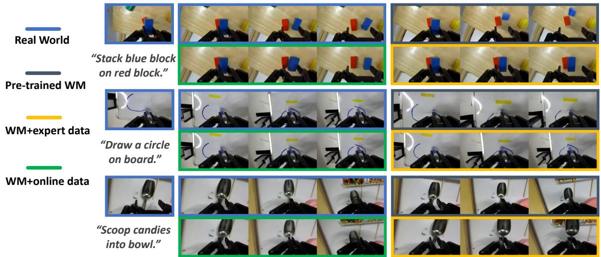

# Section 5: Experiments

---

## 5.1 Experimental Settings

Setups and Tasks. We conduct experiments on the DROID platform (Khazatsky et al., 2024). In the DROID setup, a Franka Panda arm is equipped with a Robotiq gripper. Observations are captured using two third-person cameras and one wrist-mounted camera, as illustrated in Figure 4. We evaluate our method on five categories of contact-rich tasks, described below. More task details can be found in Appendix B.

- **Stacking**: Four colored blocks are randomly placed on the table at the beginning of each episode. The robot receives the instruction: "stack block A on block B," where A, B ∈ {red, green, blue, yellow}.
- **Open Book**: A book is randomly placed on the table at the start of each episode. We evaluate performance across four different books. The robot is instructed to "open the book cover."
- **Erase Marks**: One to three marker drawings are randomly drawn on a whiteboard. The robot receives the instruction: "erase all marks using a tissue."
- **Scooping**: The robot uses a scoop to transfer snacks into a bowl. Both the scoop and the bowl are randomly placed within the workspace. The instruction is: "transfer some A to the bowl," where A ∈ {peanuts, candies, almonds}.
- **Drawing**: The robot is instructed to draw a complete circle on a whiteboard using a marker.

> 💡 **任务选择的合理性**：5 类任务都是「接触丰富型」（contact-rich）——需要精确的力控制和接触动力学建模。这类任务对世界模型要求最高（需要准确预测接触结果），是本文方法最适合发力的场景。作者没测简单抓取任务，是聪明的选择，但也是潜在的局限：泛化到非接触任务是否同样有效？

Base Models and Hyperparameters. We use π₀.₅ (Intelligence et al., 2025b) as the base vision–language–action (VLA) model and Ctrl-World (Guo et al., 2025a) as the base world model. For each task category, we collect **25 expert demonstrations** and finetune π₀.₅ on this data to warm-start the policy, which serves as our base policy. The reward model is initialized from **Qwen3-VL-4B-Instruct** (Team, 2025a).

In each iteration, we roll out **50 trajectories per task category** in the real world. We finetune the world model for **50K training steps** using these rollout trajectories. We then generate **500 synthetic trajectories per task** using the updated world model to form the synthetic dataset. The reward model is additionally finetuned using rollout data from the first iteration to improve reward accuracy. The policy is updated with **2k steps with batch size 256**. We perform a total of **two iterations** of this procedure.

> 💡 **超参数解读**：
> - 真实 rollout 50条 → 合成 500条，**10x 扩增比**是核心设计
> - 只迭代 2 次：成本考量（每次需要真实机器人 rollout），也限制了方法的上限
> - 世界模型微调 50K steps vs 策略只微调 2K steps：世界模型投入更重，说明作者认为世界模型质量是瓶颈
> - **25 条专家演示 + 50 条真实 rollout = 75 条真实数据**，相当低数据量，数据效率是卖点

---

## 5.2 Can We Learn an Accurate World Model for Contact-Rich Tasks?

**Action replay inside the world model.** We evaluate the fidelity of the learned world model and study the contribution of online rollout data by replaying real-world action sequences inside the world model. Specifically, we randomly select a starting frame from a real-world trajectory and auto-regressively feed a 5-second sequence of recorded action chunks to the world model, starting from the same frame. We compare our post-trained world model against two baselines: the original pretrained world model and a model finetuned only on expert demonstration data.

We use two categories of metrics to quantitatively evaluate video prediction quality:

- **(1) Video distance metrics**: PSNR, SSIM, LPIPS, FID, FVD
- **(2) Interaction event confusion matrix**: 正确预测物体交互结果（成功/失败）是 action-conditioned world modeling 最难的部分

**Table 1: Quantitative Results**

| Method | PSNR ↑ | SSIM ↑ | LPIPS ↓ | FID ↓ | FVD ↓ | TP ↑ | FN ↓ | TN ↑ | FP ↓ |
|--------|--------|--------|---------|-------|-------|------|------|------|------|
| Pretrained Ctrl-World | 16.32 | 0.634 | 0.347 | 41.03 | 225.13 | - | - | - | - |
| + Expert Rollout | 19.87 | 0.748 | 0.189 | 12.76 | 99.98 | 28 | 2 | 9 | **11** |
| + Expert + Online Rollout | **21.77** | **0.784** | **0.136** | **9.58** | **64.12** | 26 | 4 | **19** | **1** |

> 💡 **这张表是全文最有说服力的结果**：
> - **FP 从 11 → 1**：加入 online rollout（含失败案例）后，模型几乎不再「幻想成功」。这直接验证了「过度乐观偏差」的诊断和修复方案
> - **代价**：TP 从 28 → 26，FN 从 2 → 4，说明召回率略有下降，但精度大幅提升
> - **视频质量指标全面提升**：FVD 从 225 → 64，非常显著
> - **局限**：Table 1 只报告了一个任务的混合结果（50 clips），各任务的世界模型精度可能差异很大

*Figure 6. 三种世界模型对同一初始帧 + 同一动作序列的预测对比。只专家数据微调的模型过度乐观（总预测成功），加入 online rollout 后准确捕捉失败动态。*

**Policy-in-the-loop rollout.** We further evaluate the world model by rolling out the policy directly inside the learned model. The post-trained world model maintains high visual fidelity and physical plausibility even for long-horizon rollouts of up to **20 seconds**. This long-horizon stability enables effective search for successful trajectories within the world model.

> 💡 **20 秒长序列稳定性**是关键工程指标。自回归视频模型容易累积误差，能维持 20s 的物理合理性说明 Ctrl-World 的架构很稳健。但「物理合理性」是主观判断，没有量化指标来佐证这一点。

---

## 5.3 Can World Model Generated Data Improve VLA Policy Performance?

**Baselines:**

- **(1) Filtered BC**: 从真实 rollout 中过滤成功轨迹做 SFT，真实 rollout 数量与本文相同（每类任务 50 条）
- **(2) DSRL** (Wagenmaker et al., 2025): 通过在线探索优化 π₀.₅ 的噪声空间，在线 rollout 数量相同

> 💡 **对比设计的合理性**：控制真实 rollout 数量公平。但注意：DSRL 是「无世界模型」的 online RL，Filtered BC 是「无世界模型」的 offline 过滤。两者都没有利用世界模型生成合成数据，这正是本文的卖点。缺少一个 baseline：「世界模型生成但不过滤」或「世界模型生成但不微调世界模型」，来单独验证世界模型修正的贡献（虽然 Table 1 间接回答了这个问题）。

**Results:**

| Method | Stacking | Open Book | Erase Marks | Scooping | Drawing | Mean |
|--------|----------|-----------|-------------|----------|---------|------|
| Base model | 0.62 | 0.56 | 0.46 | 0.44 | 0.22 | 0.460 |
| DSRL | 0.70 | 0.50 | 0.40 | 0.60 | 0.30 | 0.500 |
| Filtered BC-2 | 0.88 | 0.82 | 0.76 | 0.74 | 0.56 | 0.752 |
| **Ours-2** | **0.92** | **0.86** | **0.86** | **0.92** | **0.78** | **0.868** |

> 💡 **结果解读**：
> - **VLAW vs Filtered BC**：+11.6%，即世界模型合成数据的额外贡献
> - **VLAW vs Base model**：+39.2%（大幅提升，但 base model 只用了 25 条演示，可能偏弱）
> - **DSRL 表现差**（0.500 vs 0.460）：作者解释是多任务设置下 RL 优化困难，且 DSRL 只优化噪声空间、不更新参数，表达能力受限。这个解释合理
> - **Drawing 任务提升最大**（0.22 → 0.78）：画圆需要精确力控制，是最难的任务，也是世界模型合成数据最能补充多样性的场景

*Figure 7. 两轮迭代训练的成功率对比，Ours-1/2 均优于两个 baseline。*

**Ablations:**

消融研究在最难的 Drawing 任务上进行：
1. 合成轨迹数量：500 → 250，性能下降
2. 是否加入真实 rollout 数据：去掉后性能进一步下降

> 💡 **消融说明两点**：(1) 数据量仍然重要，500 条合成数据没到饱和；(2) 真实数据和合成数据互补，不能完全替代。但消融只在一个任务上做，可信度打折扣。

**Large-scale rollout visualization:**

*Figure 8. 从同一真实初始帧出发，世界模型生成 14 条多样化轨迹。GT（真实）是失败的，世界模型能搜索到成功轨迹用于策略学习。*

> 💡 **这张图是直觉动机最强的可视化**：真实机器人抓勺子失败了，但世界模型能「想象」成功的方式并提供监督信号。这是世界模型相比纯 offline 方法的核心优势。
